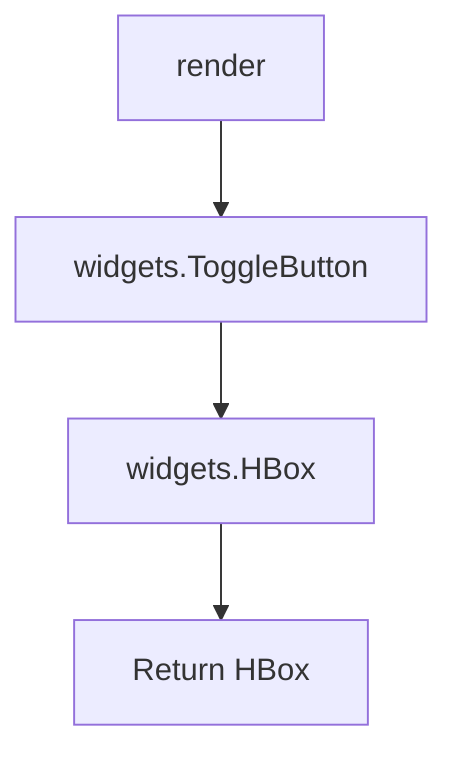

# `toggle_button.py`

## `src.ydata_profiling.report.presentation.flavours.widget.toggle_button.WidgetToggleButton` · *class*

## Summary:
WidgetToggleButton renders a toggle button UI element using ipywidgets, inheriting from the core ToggleButton presentation component.

## Description:
This class provides a widget-based implementation of a toggle button for use in Jupyter notebook interfaces. It extends the abstract ToggleButton class from the core presentation layer and implements the render method to create a visual toggle button using ipywidgets. The widget is designed to display text content and is styled with specific flexbox layout properties to align properly within its container.

## State:
- content: dict containing the "text" key that specifies the button label
- The class inherits all state from ToggleButton parent class including the type identifier and content dictionary
- The text content is accessed via self.content["text"] in the render method

## Lifecycle:
- Creation: Instantiated with a text parameter that becomes the button's description
- Usage: Called by the presentation layer when rendering UI components, specifically through the render() method
- Destruction: Managed by ipywidgets lifecycle; no explicit cleanup required

## Method Map:


## Raises:
- None explicitly raised by __init__ (inherits from ToggleButton which handles initialization)
- The render method may raise exceptions from ipywidgets if invalid layout properties are set

## Example:
```python
# Create a toggle button with text content
toggle_btn = WidgetToggleButton("Click Me")

# Render the widget for display in Jupyter
widget = toggle_btn.render()
display(widget)
```

### `src.ydata_profiling.report.presentation.flavours.widget.toggle_button.WidgetToggleButton.render` · *method*

## Summary:
Creates and configures a styled toggle button widget wrapped in a horizontal box container.

## Description:
This method generates a Jupyter widget toggle button with specific styling and layout properties. It constructs a ToggleButton using text content from the component's configuration and wraps it in an HBox container with flexbox layout properties to ensure proper alignment and sizing.

## Args:
    None

## Returns:
    widgets.HBox: A horizontal box container holding a styled toggle button widget.

## Raises:
    None explicitly raised

## State Changes:
    Attributes READ: self.content
    Attributes WRITTEN: None

## Constraints:
    Preconditions: 
    - self.content must be a dictionary containing a "text" key with string value
    - The ipywidgets library must be available and properly initialized
    
    Postconditions:
    - Returns a properly configured widgets.HBox instance
    - The returned HBox contains exactly one ToggleButton child widget

## Side Effects:
    None

