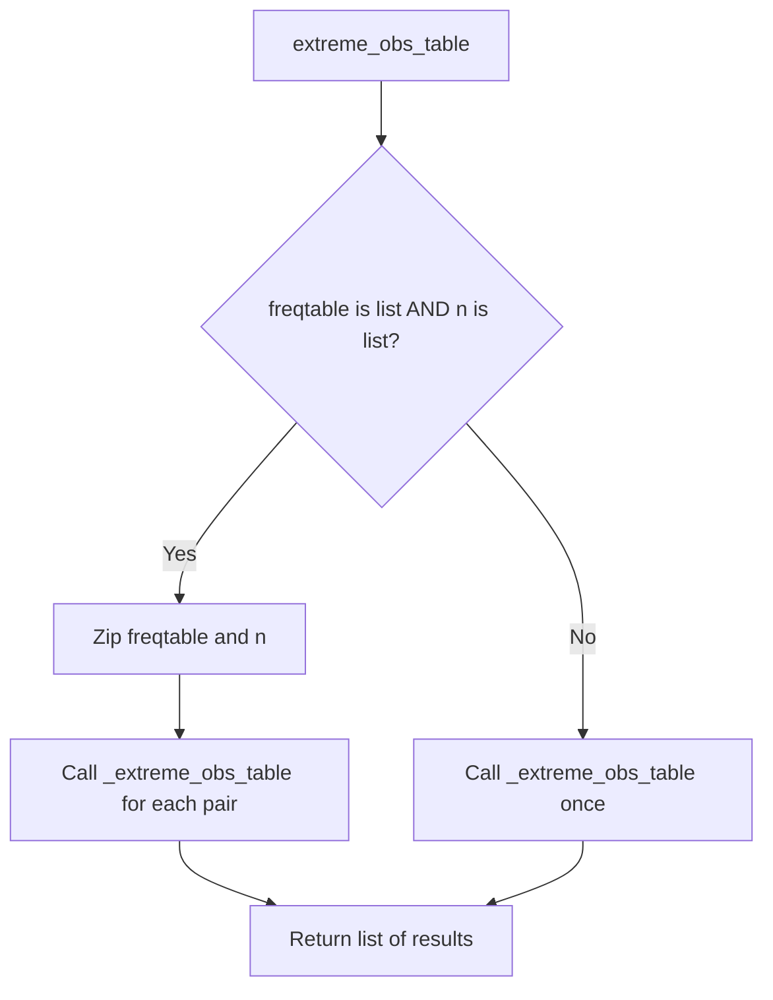

# `frequency_table_utils.py`

## `src.ydata_profiling.report.presentation.frequency_table_utils._frequency_table` · *function*

## Summary:
Formats frequency table data for presentation in data profiling reports by normalizing counts and organizing values into displayable rows.

## Description:
Processes frequency distribution data to prepare it for visualization in profiling reports. This function handles the aggregation of rare values into "Other" categories and accounts for missing data, while normalizing frequencies for proportional display.

## Args:
    freqtable (pd.Series): Frequency distribution data where index represents labels and values represent counts
    n (int): Total number of observations in the dataset
    max_number_to_print (int): Maximum number of top frequent values to display before grouping others into "Other" category

## Returns:
    List[Dict[str, Any]]: List of dictionaries containing formatted row data for display, each with keys:
        - label: Display label for the value
        - width: Normalized width for visualization (relative to maximum frequency)
        - count: Raw frequency count
        - percentage: Percentage of total observations
        - n: Total number of observations
        - extra_class: CSS class identifier for styling ("other" or "missing")

## Raises:
    None explicitly raised - handles edge cases internally

## Constraints:
    Preconditions:
        - freqtable should be a pandas Series with numeric values
        - n should be a non-negative integer representing total observations
        - max_number_to_print should be a non-negative integer
    
    Postconditions:
        - Returns empty list when no meaningful data exists (empty freqtable or all zero frequencies)
        - All returned percentages are capped at 1.0 (100%)
        - Width values are normalized relative to maximum frequency

## Side Effects:
    None

## Control Flow:
```mermaid
flowchart TD
    A[Start _frequency_table] --> B{max_number_to_print > n?}
    B -- Yes --> C[max_number_to_print = n]
    B -- No --> C
    C --> D{max_number_to_print < len(freqtable)?}
    D -- Yes --> E[freq_other = sum(freqtable[max_number_to_print:])]
    D -- No --> F[freq_other = 0]
    E --> G[min_freq = freqtable.values[max_number_to_print]]
    F --> G
    G --> H[freq_missing = n - sum(freqtable)]
    H --> I{len(freqtable) == 0?}
    I -- Yes --> J[Return empty list]
    I -- No --> K[max_freq = max(freqtable[0], freq_other, freq_missing)]
    K --> L{max_freq == 0?}
    L -- Yes --> M[Return empty list]
    L -- No --> N[Process top values]
    N --> O[Add top values to rows]
    O --> P{freq_other > min_freq?}
    P -- Yes --> Q[Add "Other values" row]
    P -- No --> R
    Q --> R
    R --> S{freq_missing > min_freq?}
    S -- Yes --> T[Add "Missing" row]
    S -- No --> U
    T --> U
    U --> V[Return rows]
```

## Examples:
    # Basic usage with frequency data
    freq_data = pd.Series([100, 50, 25, 10], index=['A', 'B', 'C', 'D'])
    result = _frequency_table(freq_data, 200, 3)
    # Returns list of dictionaries with normalized widths and percentages
    
    # Edge case with empty frequency table
    empty_result = _frequency_table(pd.Series([], dtype='float64'), 100, 5)
    # Returns empty list []
    
    # Edge case with zero frequencies
    zero_result = _frequency_table(pd.Series([0, 0, 0]), 100, 2)
    # Returns empty list []
```

## `src.ydata_profiling.report.presentation.frequency_table_utils.freq_table` · *function*

## Summary:
Creates formatted frequency table entries for visualization, handling both single and multiple frequency distributions.

## Description:
Processes frequency distribution data into a standardized dictionary format suitable for presentation layers. This function acts as a dispatcher that handles both single frequency series and lists of frequency series, delegating the actual formatting to the internal `_frequency_table` function.

## Args:
    freqtable (Union[pd.Series, List[pd.Series]]): Single frequency Series or list of frequency Series to process
    n (Union[int, List[int]]): Total count or list of total counts corresponding to each frequency table
    max_number_to_print (int): Maximum number of top frequency items to include in the result

## Returns:
    Union[List[Dict[str, Any]], List[List[Dict[str, Any]]]]: List of dictionaries containing formatted frequency data for visualization, or list of such lists when processing multiple frequency tables

## Raises:
    None explicitly raised - relies on underlying `_frequency_table` function for any exceptions

## Constraints:
    Preconditions:
    - When freqtable is a list, n must also be a list of equal length
    - max_number_to_print should be a positive integer
    - freqtable values should be numeric frequencies
    
    Postconditions:
    - Returns empty list when no valid frequency data exists
    - All returned dictionaries contain the same set of keys: 'label', 'width', 'count', 'percentage', 'n', 'extra_class'

## Side Effects:
    None

## Control Flow:
```mermaid
flowchart TD
    A[Start freq_table] --> B{isinstance(freqtable, list) AND isinstance(n, list)?}
    B -- Yes --> C[Zip freqtable and n]
    C --> D[Call _frequency_table for each pair]
    D --> E[Return list of results]
    B -- No --> F[Call _frequency_table with single values]
    F --> E
```

## Examples:
```python
# Single frequency table case
freq_series = pd.Series([10, 5, 3, 2])
result = freq_table(freq_series, 20, 3)
# Returns list of dictionaries with top 3 frequency items

# Multiple frequency tables case  
freq_series_list = [pd.Series([10, 5]), pd.Series([8, 4])]
n_list = [20, 15]
result = freq_table(freq_series_list, n_list, 2)
# Returns list of lists, each containing formatted frequency data
```

## `src.ydata_profiling.report.presentation.frequency_table_utils._extreme_obs_table` · *function*

## Summary:
Formats the most frequent observations from a frequency table for display in a structured tabular format.

## Description:
Processes a frequency table series to extract the top observations and compute normalized widths, counts, and percentages for visualization purposes. This utility function prepares frequency data for presentation in reports or dashboards.

## Args:
    freqtable (pd.Series): A pandas Series containing frequency counts for various categories/labels
    number_to_print (int): Number of top frequency observations to include in the result
    n (int): Total count of observations used to calculate percentages

## Returns:
    List[Dict[str, Any]]: A list of dictionaries, each representing a row in the formatted table with keys:
        - "label": Category/label name
        - "width": Normalized width (frequency/max_frequency) for bar chart visualization
        - "count": Raw frequency count
        - "percentage": Percentage of total observations (frequency/n)
        - "extra_class": Empty string placeholder for CSS classes
        - "n": Total observation count

## Raises:
    None explicitly raised

## Constraints:
    Preconditions:
        - freqtable must be a valid pandas Series
        - number_to_print must be a non-negative integer
        - n must be a positive integer
    Postconditions:
        - Returns exactly number_to_print entries (or fewer if freqtable has fewer items)
        - All returned dictionaries contain the same set of keys
        - Width values are between 0 and 1

## Side Effects:
    None

## Control Flow:
```mermaid
flowchart TD
    A[Start _extreme_obs_table] --> B{freqtable.iloc[:number_to_print]}
    B --> C[obs_to_print = Top number_to_print items]
    C --> D[max_freq = obs_to_print.max()]
    D --> E{max_freq != 0}
    E -->|True| F[width = freq / max_freq]
    E -->|False| G[width = 0]
    F --> H[Create row dict]
    G --> H
    H --> I[Add to rows list]
    I --> J[Return rows list]
```

## Examples:
    # Basic usage
    freq_table = pd.Series([10, 5, 3, 2], index=['A', 'B', 'C', 'D'])
    result = _extreme_obs_table(freq_table, 3, 20)
    # Returns [{'label': 'A', 'width': 1.0, 'count': 10, 'percentage': 0.5, 'extra_class': '', 'n': 20},
    #          {'label': 'B', 'width': 0.5, 'count': 5, 'percentage': 0.25, 'extra_class': '', 'n': 20},
    #          {'label': 'C', 'width': 0.3, 'count': 3, 'percentage': 0.15, 'extra_class': '', 'n': 20}]

## `src.ydata_profiling.report.presentation.frequency_table_utils.extreme_obs_table` · *function*

## Summary:
Creates formatted tables of extreme observations from frequency data, handling both single and multiple frequency tables.

## Description:
Processes frequency table data to generate structured representations of the most frequent observations. This function serves as a wrapper that handles both single frequency tables and lists of frequency tables, delegating the actual formatting to the internal `_extreme_obs_table` function. It's commonly used in data profiling reports to display the most frequent values in categorical columns.

## Args:
    freqtable (Union[pd.Series, List[pd.Series]]): A pandas Series containing frequency counts or a list of such Series objects representing frequency distributions.
    number_to_print (int): The maximum number of top observations to include in the output table.
    n (Union[int, List[int]]): Total count of observations or list of total counts corresponding to each frequency table.

## Returns:
    List[List[Dict[str, Any]]]: A nested list structure where each inner list contains dictionaries representing rows of the extreme observations table. Each dictionary includes keys: 'label', 'width', 'count', 'percentage', 'extra_class', and 'n'.

## Raises:
    None explicitly raised in the function body, though underlying operations may raise pandas/numpy exceptions.

## Constraints:
    Preconditions:
    - freqtable must be either a pandas Series or a list of pandas Series
    - number_to_print must be a non-negative integer
    - n must be either an integer or a list of integers with matching length to freqtable when it's a list
    
    Postconditions:
    - Returns a list of lists containing formatted observation data
    - Each returned dictionary contains all expected keys ('label', 'width', 'count', 'percentage', 'extra_class', 'n')

## Side Effects:
    None - This function is pure and doesn't modify external state or perform I/O operations.

## Control Flow:


## Examples:
```python
# Single frequency table case
freq_series = pd.Series([10, 5, 3, 2], index=['A', 'B', 'C', 'D'])
result = extreme_obs_table(freq_series, 2, 20)
# Returns: [[{'label': 'A', 'width': 1.0, 'count': 10, 'percentage': 0.5, 'extra_class': '', 'n': 20}, 
#            {'label': 'B', 'width': 0.5, 'count': 5, 'percentage': 0.25, 'extra_class': '', 'n': 20}]]

# Multiple frequency tables case  
freq_series_list = [pd.Series([10, 5], index=['A', 'B']), pd.Series([8, 4], index=['X', 'Y'])]
n_list = [20, 12]
result = extreme_obs_table(freq_series_list, 1, n_list)
# Returns: [[{'label': 'A', 'width': 1.0, 'count': 10, 'percentage': 0.5, 'extra_class': '', 'n': 20}], 
#           [{'label': 'X', 'width': 1.0, 'count': 8, 'percentage': 0.666..., 'extra_class': '', 'n': 12}]]
```

