# `src.ydata_profiling.report.structure`

## Tree:
    structure/
    ├── variables/
    ├── correlations.py
    ├── overview.py
    └── report.py

## Role:
    Generates the hierarchical structure and organization of profiling reports

## Description:
    This module is responsible for constructing the logical and visual structure of data profiling reports. It organizes various data analysis components into a coherent report structure that can be rendered to HTML or other formats. The module handles different sections of the report including dataset overview, variable analysis, correlations, missing values patterns, and interactive elements.

    Primary consumers of this module include the main report generation pipeline and the HTML renderer. This module is part of the core reporting infrastructure that transforms statistical summaries into structured, navigable reports.

## Components:
    * get_correlation_items - Creates correlation visualization containers
    * get_dataset_alerts - Processes and displays dataset-level alerts
    * get_dataset_column_definitions - Formats column definition tables
    * get_dataset_items - Assembles all dataset overview components
    * get_dataset_overview - Creates basic dataset statistics overview
    * get_dataset_reproduction - Displays analysis reproduction information
    * get_dataset_schema - Formats dataset metadata schema
    * get_timeseries_items - Handles time series specific overview items
    * get_definition_items - Creates duplicate definition containers
    * get_duplicates_items - Processes duplicate row detection results
    * get_interactions - Generates interaction plots between variables
    * get_missing_items - Creates missing value visualization containers
    * get_report_structure - Main function that orchestrates entire report structure
    * get_sample_items - Formats sample data containers
    * render_variables_section - Renders variable analysis sections from summary data
    * render_boolean - Specialized rendering for boolean variables
    * render_categorical - Specialized rendering for categorical variables
    * render_common - Common rendering utilities for variables
    * render_complex - Specialized rendering for complex number variables
    * render_count - Specialized rendering for count variables
    * render_date - Specialized rendering for date variables
    * render_file - Specialized rendering for file path variables
    * render_generic - Generic fallback rendering for unsupported variable types
    * render_image - Specialized rendering for image path variables
    * render_path - Specialized rendering for path variables
    * render_real - Specialized rendering for real number variables
    * render_text - Specialized rendering for text variables
    * render_timeseries - Specialized rendering for time series variables
    * render_url - Specialized rendering for URL variables

```mermaid
graph TD
    A[get_report_structure] --> B[get_dataset_items]
    A --> C[render_variables_section]
    A --> D[get_interactions]
    A --> E[get_correlation_items]
    A --> F[get_missing_items]
    A --> G[get_sample_items]
    A --> H[get_duplicates_items]
    B --> I[get_dataset_overview]
    B --> J[get_dataset_schema]
    B --> K[get_dataset_column_definitions]
    B --> L[get_timeseries_items]
    B --> M[get_dataset_alerts]
    B --> N[get_dataset_reproduction]
    C --> O[render_common]
    C --> P[render_boolean]
    C --> Q[render_categorical]
    C --> R[render_complex]
    C --> S[render_count]
    C --> T[render_date]
    C --> U[render_file]
    C --> V[render_generic]
    C --> W[render_image]
    C --> X[render_path]
    C --> Y[render_real]
    C --> Z[render_text]
    C --> AA[render_timeseries]
    C --> AB[render_url]
    Q --> AC[render_categorical_frequency]
    Q --> AD[render_categorical_length]
    Q --> AE[render_categorical_unicode]
    Z --> AF[_get_n]
    AA --> AG[_render_gap_tab]
    P --> AH[render_common]
    R --> AH
    S --> AH
    T --> AH
    U --> AH
    V --> AH
    W --> AH
    X --> AH
    Y --> AH
    Z --> AH
    AB --> AH
```

## Public API:
    * get_report_structure(config: Settings, summary: BaseDescription) -> Root
        Creates the complete report structure from configuration and summary data
    * get_dataset_items(config: Settings, summary: BaseDescription, alerts: list) -> list
        Assembles all dataset overview components into a list
    * render_variables_section(config: Settings, dataframe_summary: BaseDescription) -> list
        Renders variable analysis sections from summary data

## Dependencies:
    * Internal imports: 
        - src.ydata_profiling.report.structure.correlations
        - src.ydata_profiling.report.structure.overview  
        - src.ydata_profiling.report.structure.report
        - src.ydata_profiling.report.structure.variables
    * External imports: 
        - pandas (for DataFrame handling)
        - tqdm (for progress bar)
        - Various plotting libraries for visualization

## Constraints:
    * All functions expect properly formatted input data structures from the analysis phase
    * The module assumes that configuration settings are validated before processing
    * Thread safety is not guaranteed; functions should be called sequentially
    * Input data must conform to expected schema defined by the summary objects

---

## Files

- [`correlations.py`](structure/correlations.md)
- [`overview.py`](structure/overview.md)
- [`report.py`](structure/report.md)

