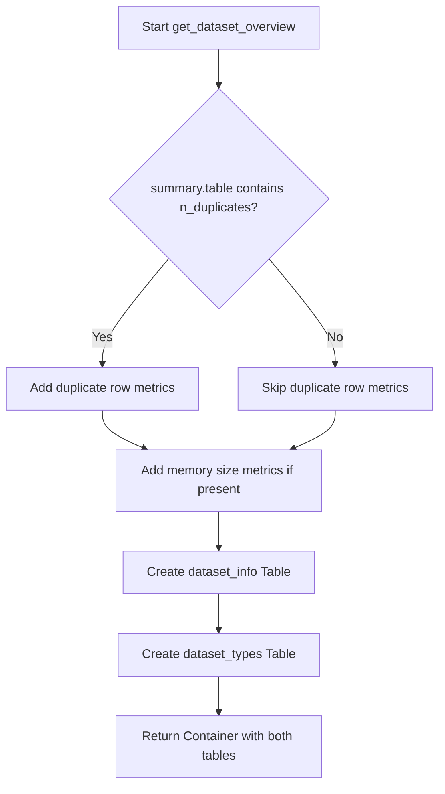
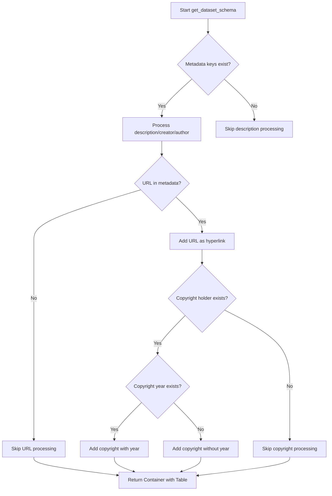
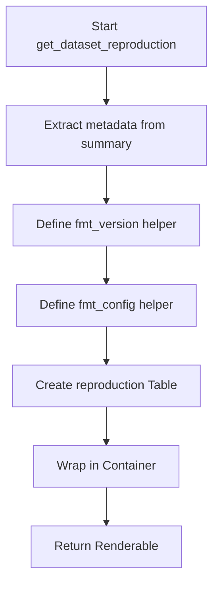
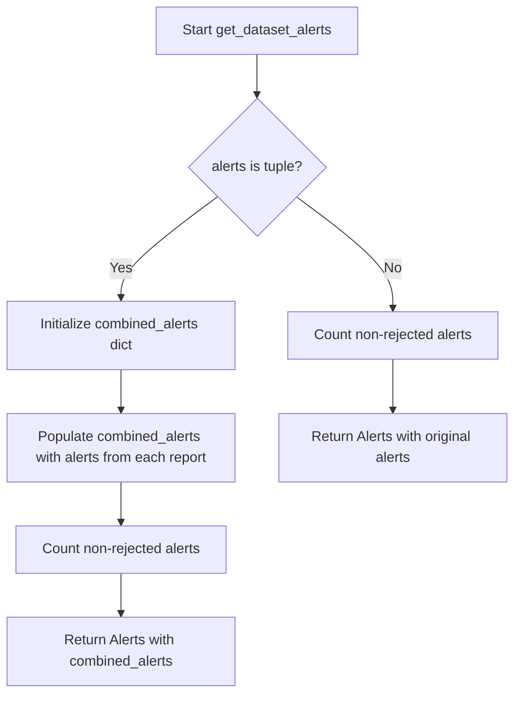
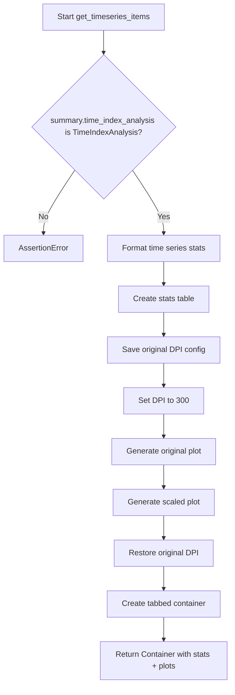

# `overview.py`

## `src.ydata_profiling.report.structure.overview.get_dataset_overview` · *function*

## Summary:
Generates a structured overview of dataset characteristics including basic statistics, variable types, and optional memory/duplicate information.

## Description:
Creates a formatted report section containing key dataset metadata such as variable counts, observation counts, missing data statistics, and variable type distributions. This function serves as a standardized view of fundamental dataset properties that helps users quickly understand the data structure and quality.

The function is extracted into its own component to separate the logic for generating dataset overview information from the broader report generation process, allowing for reuse and easier testing of this specific reporting section.

## Args:
    config (Settings): Configuration settings that control formatting and styling options for the report
    summary (BaseDescription): Dataset summary object containing statistical information about the data

## Returns:
    Renderable: A container object containing two tables - dataset statistics and variable types - arranged in a grid layout

## Raises:
    None explicitly raised

## Constraints:
    Preconditions:
    - config must be a valid Settings object with html and report configurations
    - summary must be a BaseDescription object with a table attribute containing required keys
    - summary.table must contain at least "n_var", "n", "n_cells_missing", and "p_cells_missing" keys
    
    Postconditions:
    - Returns a Container object with exactly two Table objects inside
    - The returned Container has anchor_id="dataset_overview" and name="Overview"
    - All table values are properly formatted according to the configuration

## Side Effects:
    None

## Control Flow:


## Examples:
```python
# Basic usage with minimal summary data
config = Settings()
summary = BaseDescription()
summary.table = {
    "n_var": 10,
    "n": 1000,
    "n_cells_missing": 50,
    "p_cells_missing": 0.05,
    "types": {"int": 3, "float": 4, "str": 3}
}
overview_section = get_dataset_overview(config, summary)

# Usage with full summary including duplicates and memory info
summary.table.update({
    "n_duplicates": 10,
    "p_duplicates": 0.01,
    "memory_size": 1024000,
    "record_size": 1024
})
overview_section = get_dataset_overview(config, summary)
```

## `src.ydata_profiling.report.structure.overview.get_dataset_schema` · *function*

## Summary:
Formats and structures dataset metadata into a standardized table view for reporting.

## Description:
Extracts and formats key dataset metadata fields (description, creator, author, URL, copyright) into a structured table presentation element. This function isolates the logic for metadata formatting to ensure consistent presentation across different report sections while maintaining clean separation of concerns.

## Args:
    config (Settings): Configuration object containing HTML styling preferences
    metadata (dict): Dictionary containing dataset metadata fields such as description, creator, author, url, copyright_holder, and copyright_year

## Returns:
    Container: A presentation container element containing a formatted Table with dataset metadata information

## Raises:
    None explicitly raised

## Constraints:
    Preconditions:
    - config parameter must be a valid Settings object
    - metadata parameter must be a dictionary-like object
    
    Postconditions:
    - Returns a Container object with proper structure
    - Table within Container contains properly formatted metadata entries
    - Empty metadata values are filtered out

## Side Effects:
    None

## Control Flow:


## Examples:
```python
# Basic usage with minimal metadata
config = Settings()
metadata = {
    "description": "Sales data for Q1 2023",
    "creator": "Data Team"
}
result = get_dataset_schema(config, metadata)
# Returns Container with Table containing description and creator

# Usage with full metadata
metadata = {
    "description": "Customer demographics",
    "creator": "Analytics Department",
    "author": "John Smith",
    "url": "https://example.com/dataset",
    "copyright_holder": "Company Inc.",
    "copyright_year": "2023"
}
result = get_dataset_schema(config, metadata)
# Returns Container with Table containing all metadata fields
```

## `src.ydata_profiling.report.structure.overview.get_dataset_reproduction` · *function*

## Summary:
Generates a reproducibility section for dataset analysis reports containing timing information, software version, and configuration download links.

## Description:
Creates a structured table displaying key metadata about the dataset analysis process, including start/end timestamps, duration, software version, and downloadable configuration file. This information enables users to reproduce the exact analysis conditions later.

The function extracts information from the summary object's package and analysis sections, formats it appropriately, and presents it in a standardized HTML table structure suitable for report generation.

## Args:
    config (Settings): Configuration settings object containing HTML styling preferences
    summary (BaseDescription): Analysis summary object containing package metadata and analysis timing information

## Returns:
    Renderable: A Container object containing a Table with reproduction metadata including:
        - Analysis start timestamp
        - Analysis end timestamp  
        - Duration of analysis
        - Software version with GitHub link
        - Downloadable configuration file link

## Raises:
    KeyError: When summary.package does not contain 'ydata_profiling_version' or 'ydata_profiling_config'
    AttributeError: When summary.analysis does not contain 'date_start', 'date_end', or 'duration'

## Constraints:
    Preconditions:
        - summary.package must contain 'ydata_profiling_version' and 'ydata_profiling_config' keys
        - summary.analysis must contain 'date_start', 'date_end', and 'duration' attributes
        - config must be a valid Settings object with html.style attribute
    
    Postconditions:
        - Returns a properly formatted Renderable container with reproduction table
        - All timestamp values are formatted using the appropriate formatter functions
        - Version string is wrapped in a GitHub hyperlink
        - Config file is encoded as a downloadable data URI

## Side Effects:
    None

## Control Flow:


## Examples:
```python
# Typical usage in report generation
config = Settings()
summary = BaseDescription()
reproduction_section = get_dataset_reproduction(config, summary)
# Returns a Renderable container for inclusion in HTML reports
```

## `src.ydata_profiling.report.structure.overview.get_dataset_column_definitions` · *function*

## Summary:
Creates a formatted table presentation of dataset column definitions for reporting purposes.

## Description:
Generates a structured table displaying variable/column definitions with properly formatted values. This function extracts column metadata into a standardized report format, separating the presentation logic from the data processing logic. The resulting container can be integrated into larger report structures.

## Args:
    config (Settings): Configuration object containing HTML styling preferences and report settings
    definitions (dict): Dictionary mapping column names to their descriptive values

## Returns:
    Container: A container object holding the formatted table of variable definitions, ready for report rendering

## Raises:
    None explicitly raised - the function relies on underlying components that may raise exceptions

## Constraints:
    Preconditions:
    - config parameter must be a valid Settings object with html.style attribute
    - definitions parameter must be a dictionary-like object with string keys
    
    Postconditions:
    - Returns a Container object with proper structure for report generation
    - All values in definitions are properly formatted using the fmt() function

## Side Effects:
    None - This function is pure and doesn't perform any I/O operations or state mutations

## Control Flow:
```mermaid
flowchart TD
    A[get_dataset_column_definitions] --> B[Create Table]
    B --> C[Format each definition with fmt()]
    C --> D[Wrap in Container]
    D --> E[Return Container]
```

## Examples:
```python
# Basic usage
config = Settings()
definitions = {
    "age": "Age of customer in years",
    "income": "Annual household income in USD"
}
container = get_dataset_column_definitions(config, definitions)
```

## `src.ydata_profiling.report.structure.overview.get_dataset_alerts` · *function*

## Summary:
Creates an Alerts presentation object from a collection of alert objects, handling both single and multiple report scenarios.

## Description:
Processes alert data from either a single report or multiple reports and formats it into an Alerts presentation component. This function separates the logic of alert aggregation and formatting from the main reporting pipeline, allowing for consistent alert display regardless of data source complexity. The function distinguishes between single report alerts and multi-report alerts, aggregating them appropriately for unified presentation.

## Args:
    config (Settings): Configuration settings for HTML report styling
    alerts (list | tuple): Collection of alert objects, either as a single list or tuple of lists from multiple reports. Each alert object must have alert_type and column_name attributes.

## Returns:
    Alerts: A formatted Alerts presentation component containing the processed alerts

## Raises:
    None explicitly raised

## Constraints:
    Preconditions:
    - config parameter must be a valid Settings object
    - alerts parameter must be either a list or tuple of alert objects
    - Alert objects must have alert_type and column_name attributes
    
    Postconditions:
    - Returns an Alerts object with properly formatted alert data
    - The returned Alerts object maintains the correct count of non-rejected alerts

## Side Effects:
    None

## Control Flow:


## Examples:
    # Single report alerts
    alerts = [alert1, alert2, alert3]
    result = get_dataset_alerts(config, alerts)
    
    # Multiple report alerts  
    alerts = ([alert1, alert2], [alert3, alert4])
    result = get_dataset_alerts(config, alerts)
```

## `src.ydata_profiling.report.structure.overview.get_timeseries_items` · *function*

## Summary:
Generates a structured presentation container containing time series statistics and visualization plots for data profiling reports.

## Description:
Creates a comprehensive view of time series data characteristics including statistical summaries and visual representations. This function extracts key time series metadata such as number of series, length, temporal bounds, and period, then formats these into a readable table while generating both original and scaled time series plots for visual analysis.

The function is designed to be extracted from inline usage to provide a clean separation of concerns between data processing and presentation layer, allowing for reuse in different report contexts while maintaining consistent formatting and visualization standards.

## Args:
    config (Settings): Configuration object containing report settings including plotting parameters and HTML styling options
    summary (BaseDescription): Data summary object containing time index analysis and variable information

## Returns:
    Container: A presentation container with two main sections:
        - Timeseries statistics table showing key metrics (number of series, length, start/end points, period)
        - Tabbed visualization section with original and scaled time series plots

## Raises:
    AssertionError: When summary.time_index_analysis is not an instance of TimeIndexAnalysis

## Constraints:
    Preconditions:
        - summary must contain a valid time_index_analysis attribute of type TimeIndexAnalysis
        - config must be a valid Settings object with proper plot configuration
        - summary.variables must contain valid time series data for plotting
    
    Postconditions:
        - The returned Container maintains proper hierarchical structure with appropriate anchor IDs
        - Plot DPI configuration is restored to its original value after processing
        - All time series data is properly formatted according to the configured formatters

## Side Effects:
    - Temporarily modifies config.plot.dpi setting during plot generation
    - Creates matplotlib figures for time series visualization
    - May perform file I/O operations during image rendering (dependent on backend)

## Control Flow:


## Examples:
```python
# Typical usage in report generation
config = Settings()
summary = BaseDescription()
container = get_timeseries_items(config, summary)
# Result is a Container ready for report rendering
```

## `src.ydata_profiling.report.structure.overview.get_dataset_items` · *function*

*No documentation generated.*

