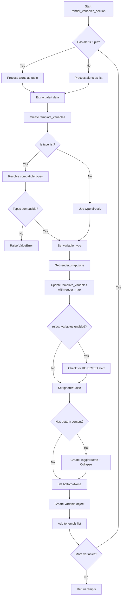
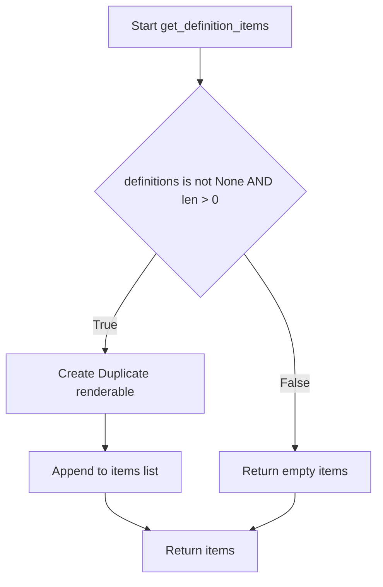
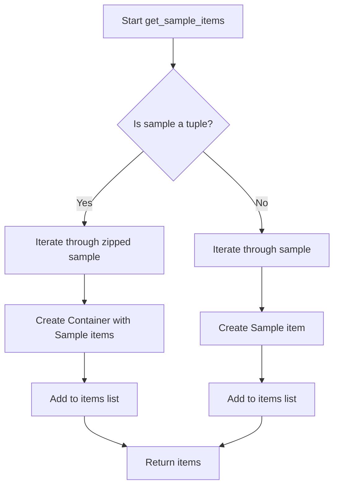
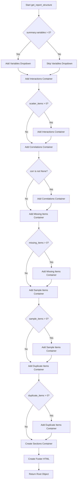

# `report.py`

## `src.ydata_profiling.report.structure.report.get_missing_items` · *function*

## Summary
Generates presentation layer renderable objects for missing data visualizations from dataset summary information.

## Description
Processes missing data patterns from a dataset summary and converts them into presentation layer objects suitable for report rendering. This function encapsulates the logic for creating missing data visualization items, separating data processing from presentation concerns. It handles both single missing data patterns (where item["name"] is a string) and multiple patterns (where item["name"] is a sequence) by creating appropriate presentation widgets.

## Args
    config (Settings): Configuration settings controlling visualization parameters such as image format
    summary (BaseDescription): Dataset summary containing missing data information in the `missing` attribute

## Returns
    list: A list of presentation layer renderable objects representing missing data visualizations

## Raises
    None explicitly raised

## Constraints
    Preconditions:
    - config must be a valid Settings object with plot.image_format configured
    - summary must be a valid BaseDescription object with a missing attribute containing dictionary data
    - summary.missing must contain items with keys and dictionaries having "matrix", "name", and "caption" fields
    - item["name"] must be either a string or a sequence of strings
    
    Postconditions:
    - Returns a list of presentation layer renderable objects compatible with the report rendering system

## Side Effects
    None

## Control Flow
```mermaid
flowchart TD
    A[Start get_missing_items] --> B{item["name"] is str?}
    B -- Yes --> C[Create Image-like widget]
    B -- No --> D[Create Container]
    D --> E[Create multiple Image-like widgets]
    C --> F[Return items list]
    E --> F
```

## Examples
```python
# Basic usage
config = Settings()
summary = BaseDescription()
missing_items = get_missing_items(config, summary)
# Returns list of renderable objects for missing data visualization
```

## `src.ydata_profiling.report.structure.report.render_variables_section` · *function*

## Summary:
Converts raw variable summary statistics into structured presentation components for report generation.

## Description:
Processes each variable in a dataframe summary to create Variable presentation objects that encapsulate the variable's metadata, alerts, and visual representation. This function orchestrates the conversion of raw statistical summaries into structured report elements, handling type detection, alert processing, and conditional rendering logic.

The function is called during report generation to build the variables section of the profiling report, where each variable gets its own detailed view with potential alerts, descriptions, and expandable details. It handles complex type resolution, alert categorization, and conditional UI elements like collapsible sections.

## Args:
    config (Settings): Configuration object containing report settings such as variable descriptions, alert filtering, and rejection policies
    dataframe_summary (BaseDescription): Summary statistics and metadata for all variables in the dataset

## Returns:
    list[Variable]: A list of Variable presentation components ready for report rendering, one for each variable in the input summary

## Raises:
    ValueError: When a variable has incompatible data types that cannot be resolved to a single type (e.g., types like {"Numeric", "Categorical"} that aren't recognized as compatible combinations)

## Constraints:
    Preconditions:
    - config must be a valid Settings object with properly initialized attributes
    - dataframe_summary must contain valid variable summaries with required fields
    - Each variable summary must have a 'type' field that can be either a string or list of strings
    - Alerts in dataframe_summary must be properly structured (either list or tuple of alert objects)
    
    Postconditions:
    - All returned Variable objects will have properly formatted alerts
    - Variable objects will be correctly categorized by type using the render map
    - Variables marked for rejection will have their ignore flag set appropriately
    - All Variable objects will have consistent structure with required fields

## Side Effects:
    None

## Control Flow:


## Examples:
```python
# Basic usage for generating variable sections in reports
from ydata_profiling.config import Settings
from ydata_profiling.model import BaseDescription

config = Settings()
summary = BaseDescription()
variables_section = render_variables_section(config, summary)
# Returns list of Variable objects for rendering in HTML report

# Usage with variable rejection enabled
config.reject_variables = True
config.variables.descriptions = {"column1": "Description for column 1"}
config.show_variable_description = True

variables_section = render_variables_section(config, summary)
# Variables with REJECTED alerts will have ignore=True
# Variables will include descriptions when show_variable_description is True
```

## `src.ydata_profiling.report.structure.report.get_duplicates_items` · *function*

## Summary:
Creates renderable duplicate items for data profiling reports from duplicate dataframes.

## Description:
Processes duplicate data and generates appropriate renderable objects for inclusion in HTML reports. This function extracts duplicate data from the analysis results and formats it into Duplicate renderable components that can be displayed in the report interface. The function handles both single duplicate dataframes and collections of duplicate dataframes, creating appropriate UI elements for each case.

## Args:
    config (Settings): Configuration settings for report generation, including HTML styling options and labels
    duplicates (pd.DataFrame | list[pd.DataFrame] | None): Duplicate data to be rendered, either as a single dataframe, list of dataframes, or None

## Returns:
    list[Renderable]: List of Duplicate renderable objects that can be included in the HTML report structure, or empty list if no duplicates exist or if list contains None values

## Raises:
    None explicitly raised

## Constraints:
    Preconditions:
    - config parameter must be a valid Settings object with html.style._labels attribute
    - duplicates parameter can be None, empty, or contain valid pandas DataFrames
    
    Postconditions:
    - Returns an empty list when duplicates is None, empty, or when a list contains None values
    - Returns properly formatted Duplicate renderable objects when duplicates exist
    - All returned Duplicate objects have proper anchor_id set to "duplicates"

## Side Effects:
    None

## Control Flow:
```mermaid
flowchart TD
    A[Start get_duplicates_items] --> B{duplicates is not None AND len > 0?}
    B -- No --> C[Return empty items list]
    B -- Yes --> D{isinstance(duplicates, list)?}
    D -- Yes --> E[Check for None values in list]
    E -- Found None --> F[Return empty items list]
    E -- No None --> G[Iterate through list items]
    G --> H[Create Duplicate renderable for each item using config.html.style._labels[idx]]
    D -- No --> I[Create single Duplicate renderable with name "Most frequently occurring"]
    H --> J[Return items list]
    I --> J
```

## Examples:
```python
# Single duplicate dataframe
config = Settings()
duplicates_df = pd.DataFrame({'col1': [1, 1], 'col2': [2, 2]})
items = get_duplicates_items(config, duplicates_df)

# Multiple duplicate dataframes
config = Settings()
duplicates_list = [pd.DataFrame({'col1': [1, 1]}), pd.DataFrame({'col2': [2, 2]})]
items = get_duplicates_items(config, duplicates_list)

# Empty duplicates
items = get_duplicates_items(config, None)
# Returns: []

# List with None values
items = get_duplicates_items(config, [None, pd.DataFrame({'col1': [1, 1]})])
# Returns: []
```

## `src.ydata_profiling.report.structure.report.get_definition_items` · *function*

## Summary:
Creates a renderable item displaying column definitions when available.

## Description:
Generates a Duplicate renderable component that presents column definitions in a report. This function is used to conditionally include a "Columns" section in the report output when definition data is present.

## Args:
    definitions (pd.DataFrame): A pandas DataFrame containing column definitions to display. May be None or empty.

## Returns:
    Sequence[Renderable]: A sequence containing a Duplicate renderable if definitions exist, otherwise an empty sequence.

## Raises:
    None explicitly raised.

## Constraints:
    Preconditions:
    - The definitions parameter should be a pandas DataFrame or None
    - The function handles None and empty DataFrame cases gracefully
    
    Postconditions:
    - Returns a Sequence[Renderable] with either 0 or 1 Duplicate items
    - Does not modify the input definitions DataFrame

## Side Effects:
    None.

## Control Flow:


## Examples:
```python
# Example with definitions DataFrame
definitions_df = pd.DataFrame({'column': ['A', 'B'], 'description': ['First', 'Second']})
items = get_definition_items(definitions_df)
# Returns a list with one Duplicate renderable

# Example with empty DataFrame
empty_df = pd.DataFrame()
items = get_definition_items(empty_df)
# Returns an empty list

# Example with None
items = get_definition_items(None)
# Returns an empty list
```

## `src.ydata_profiling.report.structure.report.get_sample_items` · *function*

## Summary
Creates presentation renderables for sample data items in a profiling report, handling both single and multiple sample configurations.

## Description
This function transforms raw sample data into presentation-ready renderable objects for inclusion in HTML reports. It handles two distinct data formats: when samples are provided as a tuple of multiple sample collections (creating batch grids) and when samples are provided as a single collection (creating individual samples). The function is part of the report structure generation pipeline and ensures proper formatting of sample data for visualization in the final report.

The function extracts sample data processing logic to maintain clean separation between data processing and presentation layer concerns. It allows the report generation system to handle both single sample displays and batch sample displays uniformly while maintaining proper HTML structure and navigation anchors.

## Args
- config (Settings): Configuration object containing report settings and styling options, specifically accessing `config.html.style._labels` for naming samples
- sample (dict): Either a tuple of sample collections or a single collection of sample objects. When a tuple, each element should be a sequence of sample objects with compatible indices; when a single collection, each element should be a sample object with data, name, id, and caption attributes

## Returns
- List[Renderable]: A list of presentation renderable objects representing the sample data. Each item is either a Sample object or a Container containing multiple Sample objects arranged in a batch grid layout.

## Raises
- None explicitly raised

## Constraints
- Precondition: The sample parameter must be either a tuple or an iterable of objects with data, name, id, and caption attributes
- Precondition: If sample is a tuple, all elements must have compatible lengths (same number of items)
- Postcondition: All returned items are valid Renderable objects suitable for report rendering
- The function assumes that sample objects have the required attributes: data, name, id, caption

## Side Effects
- None

## Control Flow


## Examples
```python
# Single sample case - creating individual sample renderables
# Used when displaying one sample per variable
sample = [SampleObject(data=df1, name="Sample1", id="s1", caption="First sample")]
items = get_sample_items(config, sample)

# Multiple samples case (tuple) - creating batch grid containers  
# Used when displaying multiple samples side-by-side for comparison
sample_tuple = ([SampleObject1, SampleObject2], [SampleObject3, SampleObject4])
items = get_sample_items(config, sample_tuple)
# Creates a Container with two Sample items arranged in a batch grid
# Useful for showing before/after comparisons or multiple views of the same data
```

## `src.ydata_profiling.report.structure.report.get_interactions` · *function*

## Summary:
Converts interaction plot data into renderable components for report presentation.

## Description:
Processes interaction plots from a nested dictionary structure and transforms them into appropriate renderable components (ImageWidget or Container) for inclusion in HTML reports. This function handles both single interaction plots and multiple interaction plots (batch grids) for different variable combinations. It's typically called during report generation to structure interaction visualizations in a user-friendly tabbed interface.

The function extracts interaction plotting logic into its own component to maintain clean separation of concerns between data processing and presentation layer, making the report generation modular and easier to maintain.

## Args:
    config (Settings): Configuration object containing report settings including image format and styling options
    interactions (dict): Nested dictionary mapping x-columns to y-columns to interaction plot data (either single plot or list of plots)

## Returns:
    list[Renderable]: List of Container components representing interaction plots organized by x-variable with appropriate tab/select navigation

## Raises:
    None explicitly raised in the function body

## Constraints:
    Preconditions:
    - config must be a valid Settings object with plot.image_format and html.style._labels attributes
    - interactions must be a dictionary with proper nesting structure (x_col -> y_col -> plot_data)
    
    Postconditions:
    - Returns a list of Renderable objects suitable for report rendering
    - All returned components have proper anchor IDs and names for navigation

## Side Effects:
    None directly observable from this function

## Control Flow:
```mermaid
flowchart TD
    A[Start get_interactions] --> B{interactions.items()}
    B --> C[x_col, y_cols = item]
    C --> D{y_cols.items()}
    D --> E[y_col, splot = item]
    E --> F{isinstance(splot, list)}
    F -->|False| G[Create ImageWidget]
    F -->|True| H[Create Container with batch_grid]
    G --> I[Add to items]
    H --> I
    I --> J{len(items) <= 10}
    J -->|True| K[sequence_type="tabs"]
    J -->|False| L[sequence_type="select"]
    K --> M[Create Container with tabs]
    L --> M
    M --> N[Add to titems]
    N --> O{More x_cols?}
    O -->|Yes| B
    O -->|No| P[Return titems]
```

## Examples:
```python
# Basic usage with single interaction plots
config = Settings()
interactions = {
    "column_a": {
        "column_b": "plot_data_1",
        "column_c": "plot_data_2"
    }
}
renderables = get_interactions(config, interactions)
# Returns list of Container objects for each x-column with tabbed interface

# Usage with batch interaction plots (multiple sub-plots per combination)
interactions = {
    "column_a": {
        "column_b": ["plot_data_1", "plot_data_2", "plot_data_3"]
    }
}
renderables = get_interactions(config, interactions)
# Creates batch grid layout for multiple interaction plots

# Typical usage in report generation pipeline
def generate_report(config, data):
    # ... data processing ...
    interactions = compute_interactions(data)  # Returns dict structure
    interaction_components = get_interactions(config, interactions)
    # Add to report items...
```

## `src.ydata_profiling.report.structure.report.get_report_structure` · *function*

## Summary:
Constructs a hierarchical report structure containing all analysis sections for a dataset profiling report.

## Description:
Generates a complete report structure by organizing dataset analysis results into logical sections including overview, variable details, interactions, correlations, missing values, samples, and duplicate rows. This function serves as the central orchestrator that combines various report components into a cohesive presentation structure.

The function is extracted into its own component to separate the logic of report structure composition from the individual section generation logic, enabling cleaner code organization and easier maintenance of report sections.

## Args:
    config (Settings): Configuration settings that control report appearance and behavior
    summary (BaseDescription): Dataset summary containing all analysis results and metadata

## Returns:
    Root: A Root renderable object representing the complete report structure with all sections organized hierarchically

## Raises:
    None explicitly raised - relies on underlying functions to handle their own exceptions

## Constraints:
    Preconditions:
    - config must be a valid Settings instance with proper configuration
    - summary must be a valid BaseDescription instance containing all required analysis data
    - All referenced helper functions must be properly implemented
    
    Postconditions:
    - Returns a properly initialized Root object with all sections configured
    - Progress bar is updated exactly once during execution

## Side Effects:
    - Creates a progress bar display during execution
    - Constructs various Renderable objects including Containers, Dropdowns, and Variables
    - Builds a hierarchical structure of report components

## Control Flow:


## Examples:
```python
# Basic usage
config = Settings()
summary = BaseDescription()
report_structure = get_report_structure(config, summary)

# Usage in report generation pipeline
from ydata_profiling.config import Settings
from ydata_profiling.model import BaseDescription

config = Settings()
summary = BaseDescription()
root = get_report_structure(config, summary)
# root can now be rendered to generate the final report
```

