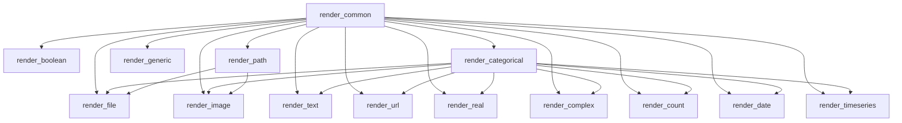

# `src.ydata_profiling.report.structure.variables`

## Tree:
variables/
├── render_boolean.py
├── render_categorical.py
├── render_common.py
├── render_complex.py
├── render_count.py
├── render_date.py
├── render_file.py
├── render_generic.py
├── render_image.py
├── render_path.py
├── render_real.py
├── render_text.py
├── render_timeseries.py
└── render_url.py

## Role:
Provides specialized rendering functions for different variable types in data profiling reports

## Description:
This module serves as the primary interface for rendering variable-specific content in profiling reports. It contains individual rendering functions for different data types (boolean, categorical, real numbers, dates, etc.) that transform variable summary data into structured template variables for HTML presentation.

The module is organized around the concept of variable type-specific rendering, where each renderer handles the presentation logic for a particular data type while sharing common utilities and components.

Primary consumers of this module include:
- Report generation pipeline components
- HTML template rendering systems
- Data profiling visualization modules

The cohesion principle is based on shared responsibility for rendering different variable types in a consistent manner, ensuring that each variable type gets appropriate presentation treatment while maintaining a unified interface.

## Components:
- render_boolean: Renders boolean variable information
- render_categorical: Renders categorical variable information with frequency tables and statistics
- render_common: Prepares common template variables used by other renderers (frequency tables, extreme observations)
- render_complex: Renders complex number variable information
- render_count: Renders count (non-negative integer) variable information
- render_date: Renders date/time variable information
- render_file: Renders file path variable information
- render_generic: Renders unsupported/unknown variable types
- render_image: Renders image file variable information
- render_path: Renders filesystem path variable information
- render_real: Renders real number variable information with comprehensive statistics
- render_text: Renders text/string variable information with word statistics
- render_timeseries: Renders time series numeric variable information
- render_url: Renders URL variable information with component breakdown

## Public API:
- render_boolean(config: Settings, summary: dict) -> dict: Renders boolean variable data
- render_categorical(config: Settings, summary: dict) -> dict: Renders categorical variable data
- render_common(config: Settings, summary: dict) -> dict: Prepares common template variables (frequency tables, extreme observations)
- render_complex(config: Settings, summary: dict) -> dict: Renders complex number variable data
- render_count(config: Settings, summary: dict) -> dict: Renders count variable data
- render_date(config: Settings, summary: dict) -> dict: Renders date variable data
- render_file(config: Settings, summary: dict) -> dict: Renders file path variable data
- render_generic(config: Settings, summary: dict) -> dict: Renders generic/unsupported variable data
- render_image(config: Settings, summary: dict) -> dict: Renders image file variable data
- render_path(config: Settings, summary: dict) -> dict: Renders path variable data
- render_real(config: Settings, summary: dict) -> dict: Renders real number variable data
- render_text(config: Settings, summary: dict) -> dict: Renders text variable data
- render_timeseries(config: Settings, summary: dict) -> dict: Renders time series variable data
- render_url(config: Settings, summary: dict) -> dict: Renders URL variable data

## Dependencies:
Internal:
- src.ydata_profiling.report.presentation.core.variable_info.VariableInfo: For creating variable metadata containers
- src.ydata_profiling.report.presentation.core.table.Table: For creating statistical tables
- src.ydata_profiling.report.presentation.core.frequency_table.FrequencyTable: For creating frequency tables
- src.ydata_profiling.report.presentation.core.frequency_table_small.FrequencyTableSmall: For small frequency tables
- src.ydata_profiling.report.presentation.core.container.Container: For organizing renderable components
- src.ydata_profiling.report.presentation.core.image.Image: For embedding images in reports
- src.ydata_profiling.report.presentation.core.html.HTML: For embedding raw HTML content
- src.ydata_profiling.report.presentation.frequency_table_utils.freq_table: For preparing frequency table data
- src.ydata_profiling.report.presentation.frequency_table_utils.extreme_obs_table: For preparing extreme observations data
- src.ydata_profiling.visualisation.plot: Various plotting functions for generating visualizations
- src.ydata_profiling.report.formatters: Formatting utilities for displaying numerical and textual data

External:
- pandas: For data manipulation and analysis
- numpy: For numerical operations
- matplotlib: For generating plots and charts
- seaborn: For statistical visualizations
- imghdr: For image type detection

## Constraints:
- All rendering functions must accept a Settings configuration object and a summary dictionary
- Template variables returned must be compatible with the HTML template system
- Rendering functions should handle missing or invalid data gracefully
- All functions must be thread-safe and not rely on global state
- Variable type determination should happen before calling specific renderers
- Memory usage should be managed carefully for large datasets

---

## Files

- [`render_boolean.py`](variables/render_boolean.md)
- [`render_categorical.py`](variables/render_categorical.md)
- [`render_common.py`](variables/render_common.md)
- [`render_complex.py`](variables/render_complex.md)
- [`render_count.py`](variables/render_count.md)
- [`render_date.py`](variables/render_date.md)
- [`render_file.py`](variables/render_file.md)
- [`render_generic.py`](variables/render_generic.md)
- [`render_image.py`](variables/render_image.md)
- [`render_path.py`](variables/render_path.md)
- [`render_real.py`](variables/render_real.md)
- [`render_text.py`](variables/render_text.md)
- [`render_timeseries.py`](variables/render_timeseries.md)
- [`render_url.py`](variables/render_url.md)

