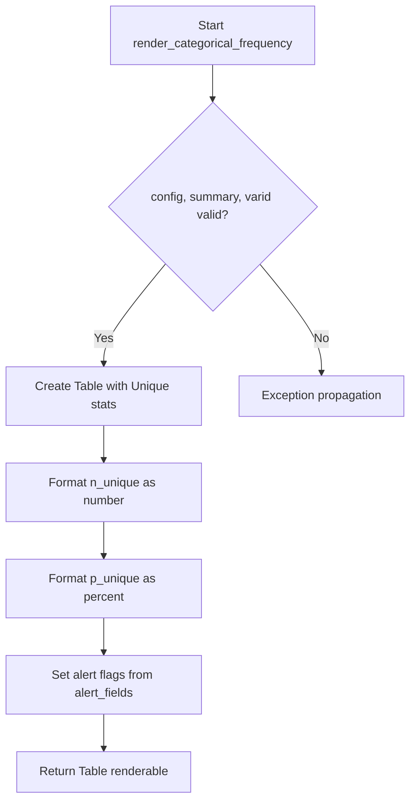
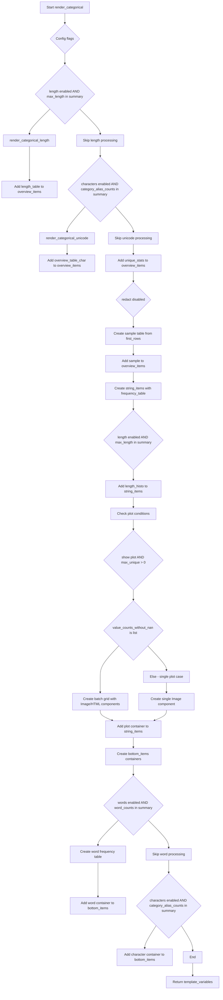

# `render_categorical.py`

## `src.ydata_profiling.report.structure.variables.render_categorical.render_categorical_frequency` · *function*

## Summary:
Creates a frequency table displaying unique value statistics for categorical variables.

## Description:
Generates a formatted table showing the count and percentage of unique values in a categorical variable. This function is part of the categorical variable reporting system and provides key statistical insights about the uniqueness of values in categorical data.

## Args:
    config (Settings): Configuration settings object containing HTML styling options
    summary (dict): Dictionary containing statistical summary data including 'n_unique', 'p_unique', and 'alert_fields'
    varid (str): Unique identifier string for the variable being rendered

## Returns:
    Renderable: A Table object containing two rows showing unique count and unique percentage statistics with appropriate formatting and styling

## Raises:
    None explicitly raised - relies on underlying Table constructor and formatting functions

## Constraints:
    Preconditions:
    - summary dictionary must contain 'n_unique' and 'p_unique' keys
    - summary dictionary must contain 'alert_fields' key
    - config must be a valid Settings object with html.style attribute
    - varid must be a string

    Postconditions:
    - Returns a properly formatted Table renderable object
    - Table contains exactly two rows with correct labels and values
    - Alert flags are properly set based on presence in alert_fields

## Side Effects:
    None - Pure function with no external state mutation or I/O operations

## Control Flow:


## Examples:
```python
# Typical usage in categorical variable reporting
config = Settings()
summary = {
    "n_unique": 42,
    "p_unique": 0.85,
    "alert_fields": ["n_unique"]
}
varid = "category_var_1"

table = render_categorical_frequency(config, summary, varid)
# Returns a Table renderable with:
# - Row 1: "Unique" with value "42"
# - Row 2: "Unique (%)" with value "85%"
# - Alert flag set on first row
```

## `src.ydata_profiling.report.structure.variables.render_categorical.render_categorical_length` · *function*

## Summary:
Generates a statistical table and histogram visualization for categorical variable string lengths.

## Description:
Creates two presentation components showing descriptive statistics and distribution of string lengths within categorical variables. This function extracts the length analysis logic to separate the statistical computation from the visualization rendering, allowing for cleaner modularization of the reporting pipeline.

## Args:
    config (Settings): Configuration object containing report and plot settings
    summary (dict): Dictionary containing length statistics including max_length, median_length, mean_length, min_length, and histogram_length
    varid (str): Unique identifier for the variable being analyzed, used for creating unique HTML anchors

## Returns:
    Tuple[Renderable, Renderable]: A tuple containing (1) a Table with length statistics and (2) an Image with length histogram visualization

## Raises:
    None explicitly raised

## Constraints:
    Preconditions:
    - summary dictionary must contain keys: "max_length", "median_length", "mean_length", "min_length", "histogram_length"
    - config must be a valid Settings object with html.style and plot.image_format attributes
    - varid must be a non-empty string for proper anchor ID generation
    
    Postconditions:
    - Returns exactly two Renderable objects in tuple format
    - Table and Image components are properly initialized with appropriate styling and identifiers

## Side Effects:
    None

## Control Flow:
```mermaid
flowchart TD
    A[Start render_categorical_length] --> B{histogram_length type}
    B -->|list| C[Extract x values]
    B -->|other| D[Unpack histogram_length]
    C --> E[Call histogram()]
    D --> E
    E --> F[Create Image component]
    F --> G[Create Table component]
    G --> H[Return (Table, Image)]
```

## Examples:
```python
# Typical usage in a reporting pipeline
config = Settings()
summary = {
    "max_length": 15,
    "median_length": 8,
    "mean_length": 9.2,
    "min_length": 2,
    "histogram_length": [[2, 3], [3, 5], [4, 7], [5, 4]]
}
varid = "category_var_1"

table, histogram_img = render_categorical_length(config, summary, varid)
```

## `src.ydata_profiling.report.structure.variables.render_categorical._get_n` · *function*

## Summary:
Computes sum values from either a list of pandas objects or a single pandas DataFrame/Series.

## Description:
This utility function calculates the sum of values from either a list of pandas objects (like Series or DataFrames) or a single pandas object. It handles both cases by checking the input type and applying the appropriate summation operation. This function is likely used internally to extract count or frequency information from categorical variable analysis results.

## Args:
    value (Union[list, pd.DataFrame]): Input that can be either:
        - A list of pandas objects (Series/DataFrame) to compute individual sums for each element
        - A single pandas object (DataFrame/Series) to compute a single sum

## Returns:
    Union[int, List[int]]: Either a single integer representing the sum of the input object, or a list of integers representing the sums of each element in the input list.

## Raises:
    AttributeError: If the input value doesn't have a `.sum()` method (though this would be rare given the type hints).

## Constraints:
    Preconditions:
        - Input must be either a list of pandas objects or a single pandas object
        - Each pandas object in the list must support the `.sum()` method
        - The input should be compatible with pandas sum operations
    
    Postconditions:
        - Returns an integer when input is a single pandas object
        - Returns a list of integers when input is a list of pandas objects

## Side Effects:
    None

## Control Flow:
```mermaid
flowchart TD
    A[Input value] --> B{Is instance list?}
    B -- Yes --> C[For each item in list: compute .sum()]
    B -- No --> D[Compute .sum() on value]
    C --> E[Return list of sums]
    D --> E
    E --> F[Return result]
```

## Examples:
    # Single DataFrame/Series sum
    df = pd.DataFrame({'A': [1, 2, 3]})
    result = _get_n(df)  # Returns 6
    
    # List of DataFrames/Series sums
    series_list = [pd.Series([1, 2]), pd.Series([3, 4])]
    result = _get_n(series_list)  # Returns [3, 7]
    
    # With categorical data (typical usage)
    cat_series = pd.Series(['A', 'B', 'A', 'C'])
    result = _get_n(cat_series.value_counts())  # Returns counts as integers

## `src.ydata_profiling.report.structure.variables.render_categorical.render_categorical_unicode` · *function*

## Summary:
Generates a structured representation of Unicode character properties for categorical variables, including categories, scripts, blocks, and character frequencies.

## Description:
Processes Unicode-related statistics from categorical variable summaries to create frequency tables and organizational containers for reporting. This function specifically handles Unicode character classification data including general categories, scripts, blocks, and individual character frequencies. It returns a tuple containing an overview table with Unicode statistics and a tabbed container displaying detailed breakdowns by category, script, block, and character.

The function extracts Unicode metadata from the summary dictionary and organizes it into a hierarchical presentation structure using FrequencyTable and Container components. It leverages the `freq_table` utility to format frequency data appropriately and applies proper formatting using the configured formatters.

This logic is extracted into its own function rather than being inlined because it encapsulates the complex Unicode-specific rendering logic, separating it from general categorical rendering concerns handled by `render_common`. This provides a clean boundary between generic categorical processing and Unicode-specific analysis.

## Args:
    config (Settings): Configuration object containing report settings including frequency table limits and redaction preferences
    summary (dict): Dictionary containing Unicode statistics from categorical variable analysis, including counts for categories, scripts, blocks, and characters
    varid (str): Unique identifier for the variable being processed, used for generating consistent anchor IDs

## Returns:
    Tuple[Renderable, Renderable]: A tuple containing:
        - overview_table (Table): A table summarizing key Unicode statistics (total characters, distinct categories/scripts/blocks)
        - Container: A tabbed container with sections for Characters, Categories, Scripts, and Blocks, each containing appropriate frequency tables

## Raises:
    None explicitly raised - relies on underlying utilities that may raise exceptions for invalid inputs

## Constraints:
    Preconditions:
        - summary dictionary must contain keys: "category_alias_counts", "category_alias_char_counts", "script_counts", "script_char_counts", "block_alias_counts", "block_alias_char_counts", "character_counts", "n_characters", "n_characters_distinct", "n_category", "n_scripts", "n_block_alias"
        - config must be a valid Settings object with appropriate attributes
        - varid must be a string for anchor ID generation

    Postconditions:
        - Returns exactly two Renderable objects in a tuple
        - All returned containers have properly formatted anchor IDs
        - Frequency tables are correctly ordered by occurrence count where applicable

## Side Effects:
    None - This function is purely functional and does not perform I/O operations or mutate external state

## Control Flow:
```mermaid
flowchart TD
    A[Start render_categorical_unicode] --> B{Process categories}
    B --> C[Create category_overview FrequencyTable]
    C --> D[Iterate category_alias_char_counts]
    D --> E[Sort by character count descending]
    E --> F[Create FrequencyTables for each category]
    F --> G[Create category_items Container]
    G --> H{Process scripts}
    H --> I[Create script_overview FrequencyTable]
    I --> J[Iterate script_char_counts]
    J --> K[Sort by character count descending]
    K --> L[Create FrequencyTables for each script]
    L --> M[Create script_items Container]
    M --> N{Process blocks}
    N --> O[Create block_overview FrequencyTable]
    O --> P[Iterate block_alias_char_counts]
    P --> Q[Create FrequencyTables for each block]
    Q --> R[Create block_items Container]
    R --> S{Create overview table}
    S --> T[Create overview_table Table]
    T --> U{Create main container}
    U --> V[Create citems with Characters, Categories, Scripts, Blocks]
    V --> W[Return (overview_table, Container(citems))]
```

## Examples:
```python
# Typical usage in a profiling context
config = Settings()
summary = {
    "category_alias_counts": ..., 
    "category_alias_char_counts": ...,
    "script_counts": ...,
    "script_char_counts": ...,
    "block_alias_counts": ...,
    "block_alias_char_counts": ...,
    "character_counts": ...,
    "n_characters": 1000,
    "n_characters_distinct": 500,
    "n_category": 10,
    "n_scripts": 5,
    "n_block_alias": 20
}
varid = "var_123"

overview_table, unicode_container = render_categorical_unicode(config, summary, varid)
```

## `src.ydata_profiling.report.structure.variables.render_categorical.render_categorical` · *function*

## Summary:
Generates HTML template variables for rendering categorical variable reports with comprehensive statistics and visualizations.

## Description:
This function processes categorical variable summary data and configuration settings to construct a complete set of template variables needed for generating HTML reports. It organizes categorical data statistics into structured components including variable information, frequency tables, overview statistics, and optional visualizations for length, words, and Unicode characteristics.

The function is designed to be called as part of the report generation pipeline for categorical variables, extracting and formatting all relevant statistical information into a standardized template structure that can be rendered by the presentation layer.

## Args:
    config (Settings): Configuration object containing report settings such as display preferences, plot configurations, and categorical variable options.
    summary (dict): Dictionary containing categorical variable summary statistics including counts, frequencies, and metadata.

## Returns:
    dict: Template variables dictionary containing structured components for HTML report generation, including:
        - "top": Container with variable info, basic statistics table, and frequency table small
        - "bottom": Container with tabs containing overview and categories sections
        - "freq_table_rows": Frequency table data for common values
        - "firstn_expanded": Expanded view of first extreme observations
        - "lastn_expanded": Expanded view of last extreme observations

## Raises:
    None explicitly raised - relies on underlying functions for error handling

## Constraints:
    Preconditions:
        - config must be a valid Settings object with properly initialized categorical and plotting configurations
        - summary must contain required keys: "varid", "varname", "type", "alerts", "description", "n_distinct", "p_distinct", "n_missing", "p_missing", "memory_size", "value_counts_without_nan", "count", "first_rows"
        - When optional features are enabled (length, words, characters), summary must contain corresponding keys
    
    Postconditions:
        - Returns a dictionary with "top" and "bottom" keys containing properly formatted renderable components
        - All returned components are compatible with the HTML presentation layer

## Side Effects:
    None directly - this function is purely data transformation and does not modify external state

## Control Flow:


## Examples:
```python
# Basic usage with minimal configuration
config = Settings()
summary = {
    "varid": "var1",
    "varname": "category_col",
    "type": "Categorical",
    "alerts": [],
    "description": "",
    "n_distinct": 5,
    "p_distinct": 0.2,
    "n_missing": 0,
    "p_missing": 0.0,
    "memory_size": 1024,
    "value_counts_without_nan": {"A": 10, "B": 5, "C": 3},
    "count": 18,
    "first_rows": ["A", "B", "C", "D", "E"]
}

template_vars = render_categorical(config, summary)
# Returns dictionary with "top", "bottom", "freq_table_rows", "firstn_expanded", "lastn_expanded" keys
```

