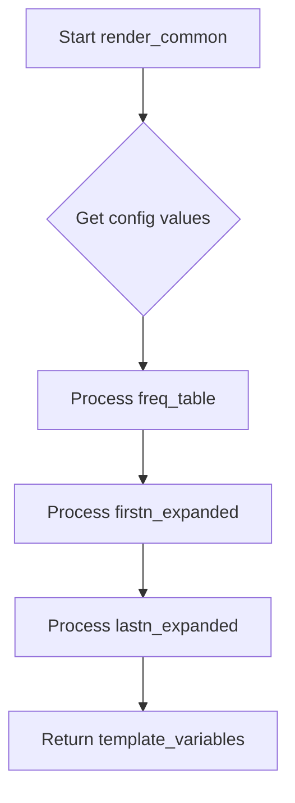

# `render_common.py`

## `src.ydata_profiling.report.structure.variables.render_common.render_common` · *function*

## Summary:
Prepares common frequency table and extreme observations data for report template rendering.

## Description:
This function processes statistical summary data to generate structured data suitable for rendering frequency tables and extreme value observations in HTML reports. It extracts configuration settings and applies utility functions to format the data appropriately for template variables.

The function is designed to be reusable across different variable types in the profiling report generation pipeline, ensuring consistent formatting of frequency distributions and extreme value displays.

## Args:
    config (Settings): Configuration object containing display settings such as maximum number of extreme observations and frequency table entries to show.
    summary (dict): Dictionary containing statistical summary data including value counts and total counts for the variable being analyzed.

## Returns:
    dict: Template variables dictionary containing:
        - "freq_table_rows": Formatted frequency table rows for the main value distribution
        - "firstn_expanded": Extreme observations table for the smallest values
        - "lastn_expanded": Extreme observations table for the largest values

## Raises:
    None explicitly raised - relies on underlying utility functions for error handling

## Constraints:
    Preconditions:
        - config must be a Settings object with n_extreme_obs and n_freq_table_max attributes
        - summary must be a dictionary containing "value_counts_without_nan", "value_counts_index_sorted", and "n" keys
        - All referenced keys in summary must contain appropriate data types (Series for value counts, int for n)

    Postconditions:
        - Returns a dictionary with exactly three keys: "freq_table_rows", "firstn_expanded", "lastn_expanded"
        - All returned values are properly formatted for template rendering

## Side Effects:
    None - Pure function with no external state mutation or I/O operations

## Control Flow:


## Examples:
```python
# Typical usage in report generation
config = Settings()
summary = {
    "value_counts_without_nan": pd.Series([10, 5, 3, 2]),
    "value_counts_index_sorted": pd.Series([1, 2, 3, 4]),
    "n": 20
}
template_vars = render_common(config, summary)
# Returns dict with freq_table_rows, firstn_expanded, lastn_expanded
```

