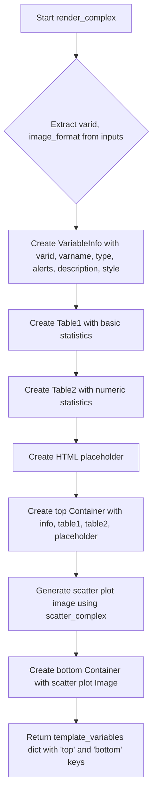

# `render_complex.py`

## `src.ydata_profiling.report.structure.variables.render_complex.render_complex` · *function*

## Summary
Renders a comprehensive report section for complex number variables including metadata, statistics, and visualization.

## Description
This function generates a structured report for complex number variables by creating metadata information, statistical tables, and a scatter plot visualization in the complex plane. It serves as a specialized renderer for complex number data types within the profiling system's reporting framework.

The function is designed to be called by the main reporting pipeline when processing complex number variables, separating the concerns of data presentation from data analysis. It organizes the information into two main sections: top (metadata and statistics) and bottom (visualization).

## Args
- config (Settings): Configuration object containing display settings and formatting preferences including html.style and plot.image_format
- summary (dict): Dictionary containing statistical summary data for the complex number variable with the following required keys:
  - varid (str): Unique identifier for the variable
  - varname (str): Name of the variable
  - alerts (list): List of alert objects for the variable
  - description (str): Description of the variable
  - n_distinct (int): Number of distinct values
  - p_distinct (float): Percentage of distinct values
  - n_missing (int): Number of missing values
  - p_missing (float): Percentage of missing values
  - memory_size (int): Memory size in bytes
  - mean (complex): Mean value of the complex numbers
  - min (complex): Minimum value of the complex numbers
  - max (complex): Maximum value of the complex numbers
  - n_zeros (int): Number of zero values
  - p_zeros (float): Percentage of zero values
  - scatter_data (pd.Series): Series containing complex numbers for scatter plot generation

## Returns
- dict: Template variables dictionary containing two keys:
  - 'top': Container object with VariableInfo, two Table objects (basic statistics and numeric statistics), and an HTML placeholder
  - 'bottom': Container object with a single Image object representing the scatter plot visualization

## Raises
- None explicitly raised in the function body

## Constraints
- Preconditions: 
  - The summary dictionary must contain all required keys as specified in the Args section
  - Config must have valid plot.image_format and html.style attributes
- Postconditions:
  - Returns a dictionary with exactly two keys: 'top' and 'bottom'
  - The 'top' key contains a Container with variable info, two tables, and a placeholder
  - The 'bottom' key contains a Container with a scatter plot image

## Side Effects
- Calls scatter_complex function which likely generates matplotlib plots
- Uses configuration settings to determine formatting and styling
- May involve file I/O operations when generating visualizations

## Control Flow


## Examples
```python
# Typical usage in reporting pipeline
config = Settings()
summary = {
    "varid": "complex_var_1",
    "varname": "my_complex_variable",
    "alerts": [],
    "description": "A complex number variable",
    "n_distinct": 100,
    "p_distinct": 0.5,
    "n_missing": 5,
    "p_missing": 0.02,
    "memory_size": 1024,
    "mean": 1+2j,
    "min": 0+0j,
    "max": 5+5j,
    "n_zeros": 2,
    "p_zeros": 0.01,
    "scatter_data": complex_series
}

result = render_complex(config, summary)
# result['top'] contains metadata and statistics
# result['bottom'] contains scatter plot visualization
```

