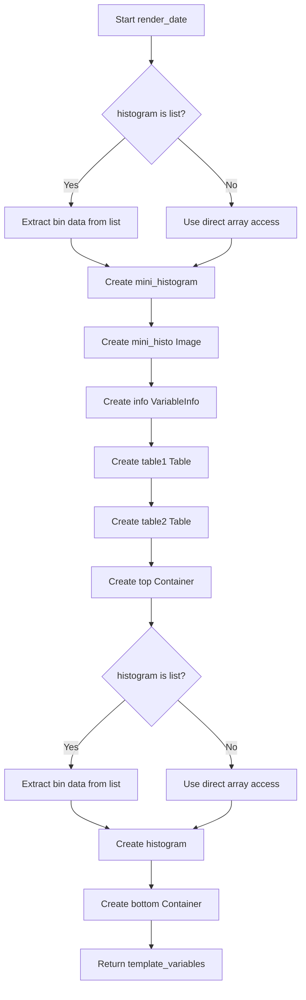

# `render_date.py`

## `src.ydata_profiling.report.structure.variables.render_date.render_date` · *function*

## Summary
Generates HTML template variables for displaying date variable statistics and visualizations in profiling reports.

## Description
Creates a structured set of presentation components (tables, images, containers) that represent statistical summaries and visualizations for date-type variables in data profiling reports. This function encapsulates the rendering logic for date variables, separating presentation concerns from data processing.

The function is designed to be called by the report generation pipeline when processing date variables, creating standardized UI elements that display key statistics like distinct counts, missing values, min/max dates, and histogram visualizations.

## Args
- config (Settings): Configuration object containing report settings including HTML styling and plot image format
- summary (Dict[str, Any]): Dictionary containing statistical summary data for the date variable including:
  - varid (str): Variable identifier
  - varname (str): Variable name
  - alerts (List): List of alert objects for the variable
  - description (str): Variable description
  - n_distinct (int): Count of distinct values
  - p_distinct (float): Percentage of distinct values
  - n_missing (int): Count of missing values
  - p_missing (float): Percentage of missing values
  - memory_size (float): Memory usage in bytes
  - min (Any): Minimum date value
  - max (Any): Maximum date value
  - histogram (list or array): Histogram data structure containing bin edges and counts, either as a list of [bin_edges, counts] pairs or as a direct [bin_edges, counts] array

## Returns
- Dict[str, Any]: Template variables dictionary containing:
  - "top" (Container): Top section with variable info, basic stats table, date range table, and mini histogram
  - "bottom" (Container): Bottom section with full-size histogram visualization

## Raises
- None explicitly raised, though underlying functions may raise exceptions

## Constraints
- Preconditions:
  - summary dictionary must contain all required keys (varid, varname, alerts, description, n_distinct, p_distinct, n_missing, p_missing, memory_size, min, max, histogram)
  - config must be a valid Settings object with proper plot.image_format and html.style attributes
- Postconditions:
  - Returned dictionary always contains "top" and "bottom" keys
  - Both returned containers are properly initialized with appropriate content

## Side Effects
- Creates matplotlib plots for histograms (both mini and full-size)
- Generates HTML image representations from matplotlib figures
- Uses configured image format for output (PNG, SVG, etc.)

## Control Flow


## Examples
```python
# Basic usage in report generation
config = Settings()
summary = {
    "varid": "date_var_1",
    "varname": "order_date",
    "alerts": [],
    "description": "Order creation dates",
    "n_distinct": 365,
    "p_distinct": 1.0,
    "n_missing": 0,
    "p_missing": 0.0,
    "memory_size": 2048,
    "min": "2020-01-01",
    "max": "2020-12-31",
    "histogram": [[1, 2, 3], [10, 20, 30]]
}

template_vars = render_date(config, summary)
# Returns dictionary with "top" and "bottom" Container objects
```

