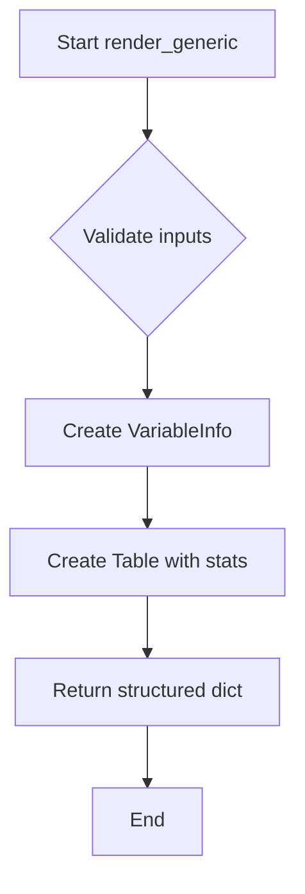

# `render_generic.py`

## `src.ydata_profiling.report.structure.variables.render_generic.render_generic` · *function*

## Summary
Creates a standardized presentation layout for unsupported variable types in data profiling reports.

## Description
Renders a generic variable summary display containing basic metadata and statistics for variables that do not have specialized rendering logic. This function serves as a fallback presentation layer for unsupported data types in the profiling report generation pipeline.

The function is typically invoked when processing variable summaries that don't match specific supported types, ensuring all variables are displayed consistently even when detailed analysis isn't available.

## Args
    config (Settings): Configuration settings controlling report appearance and behavior
    summary (dict): Dictionary containing variable metadata including:
        - varid (str): Unique identifier for the variable
        - alerts (list): List of alert objects associated with the variable
        - varname (str): Name of the variable
        - description (str): Description of the variable
        - n_missing (int): Count of missing values
        - p_missing (float): Percentage of missing values
        - memory_size (float): Memory consumption in bytes
        - alert_fields (list): Fields that triggered alerts

## Returns
    dict: A dictionary containing:
        - "top" (Container): A grid container with VariableInfo, Table, and HTML elements
        - "bottom" (None): Placeholder for additional content (currently unused)

## Raises
    None explicitly raised - however, underlying formatting functions may raise exceptions for invalid input types

## Constraints
    Preconditions:
        - summary dictionary must contain all required keys: varid, alerts, varname, description, n_missing, p_missing, memory_size, alert_fields
        - config must be a valid Settings instance with html.style attribute
    
    Postconditions:
        - Returns a properly formatted dictionary structure compatible with the reporting framework
        - All values are formatted according to the configuration's formatting rules

## Side Effects
    None - This function is purely a presentation layer component that constructs objects without external I/O or state mutation

## Control Flow


## Examples
```python
# Typical usage in report generation
config = Settings()
summary = {
    "varid": "var_123",
    "alerts": [],
    "varname": "column_name",
    "description": "A sample column",
    "n_missing": 5,
    "p_missing": 0.02,
    "memory_size": 1024.0,
    "alert_fields": []
}

result = render_generic(config, summary)
# Returns dict with "top" containing Container and "bottom" as None
```

