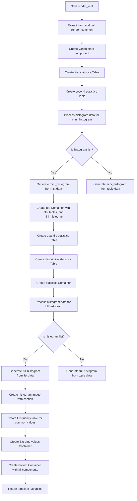

# `render_real.py`

## `src.ydata_profiling.report.structure.variables.render_real.render_real` · *function*

## Summary
Generates HTML report structure for real number variables including statistical summaries, histograms, and frequency tables.

## Description
This function creates the complete HTML presentation structure for real number variables in a data profiling report. It builds upon common variable rendering logic by adding specific statistical information and visualizations unique to real number data types.

The function orchestrates multiple UI components including variable information panels, statistical tables, histograms, and frequency distributions to provide a comprehensive view of real number variable characteristics.

Known callers within the codebase:
- Called by the main report generation pipeline when processing real number variables
- Triggered during HTML report creation for variables identified as real numbers

This logic is extracted into its own function to separate concerns between general variable rendering and real-number-specific presentation logic, ensuring clean modularity and maintainability.

## Args
- config (Settings): Configuration object containing report settings like precision, image formats, and display preferences
- summary (dict): Dictionary containing statistical summary data for the real number variable including counts, measures, histogram data, and alerts

## Returns
- dict: Template variables dictionary containing all UI components organized into 'top' and 'bottom' sections for HTML rendering

## Raises
- None explicitly raised in this function

## Constraints
- Preconditions:
  - The summary dictionary must contain all required keys including varid, varname, alerts, description, n_distinct, p_distinct, n_missing, p_missing, n_infinite, p_infinite, mean, min, max, n_zeros, p_zeros, n_negative, p_negative, memory_size, histogram, and various statistical measures
  - Config must have valid plot.image_format and html.style settings
- Postconditions:
  - Returns a dictionary with properly formatted template variables ready for HTML rendering
  - All statistical values are formatted according to configuration settings
  - Histogram images are generated with appropriate sizing and captions

## Side Effects
- None directly observable from this function
- Indirectly generates image data through histogram plotting functions
- Uses formatters to process numerical values for display

## Control Flow


## Examples
```python
# Typical usage in report generation pipeline
config = Settings()
summary = {
    "varid": "var1",
    "varname": "age",
    "alerts": [],
    "description": "Age of individuals",
    "n_distinct": 50,
    "p_distinct": 0.25,
    "n_missing": 5,
    "p_missing": 0.025,
    "n_infinite": 0,
    "p_infinite": 0.0,
    "mean": 35.2,
    "min": 18.0,
    "max": 85.0,
    "n_zeros": 0,
    "p_zeros": 0.0,
    "n_negative": 0,
    "p_negative": 0.0,
    "memory_size": 1024,
    "histogram": [[1, 2, 3], [10, 20, 30]],
    "5%": 20.5,
    "25%": 25.0,
    "50%": 35.2,
    "75%": 45.0,
    "95%": 70.0,
    "range": 67.0,
    "iqr": 20.0,
    "std": 12.5,
    "cv": 0.355,
    "kurtosis": -0.5,
    "mad": 10.0,
    "skewness": 0.2,
    "sum": 1760.0,
    "variance": 156.25,
    "monotonic": 1,
    "value_counts_without_nan": [{"value": 25, "count": 10}],
    "value_counts_index_sorted": [{"value": 25, "count": 10}],
    "n": 100,
    "alert_fields": []
}

result = render_real(config, summary)
# result contains template_variables ready for HTML rendering
```

