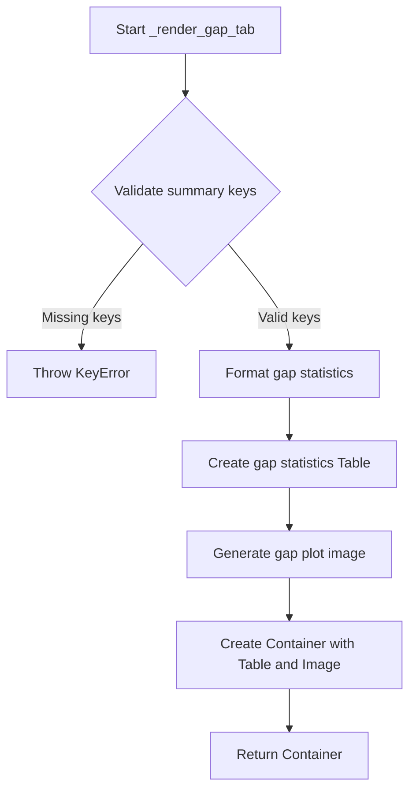

# `render_timeseries.py`

## `src.ydata_profiling.report.structure.variables.render_timeseries._render_gap_tab` · *function*

## Summary:
Creates a gap analysis tab for time series variables containing statistical summaries and visualizations of data gaps.

## Description:
Processes time series gap statistics from the summary dictionary and generates both tabular and visual representations of gap analysis. This function extracts gap information including count, minimum, maximum, mean, and standard deviation of gaps, formats them appropriately, and creates a visualization showing gap locations in the time series data.

## Args:
    config (Settings): Configuration object containing report and plotting settings including precision and image format preferences
    summary (dict): Dictionary containing time series gap statistics under the "gap_stats" key with required sub-keys: "gaps", "min", "max", "mean", "std", "series", and "varid" for anchor ID generation

## Returns:
    Container: A presentation layer container object containing a Table with gap statistics and an Image with gap visualization, arranged in a grid layout with proper anchor IDs

## Raises:
    KeyError: If summary dictionary is missing required keys like "gap_stats", "gaps", "min", "max", "mean", "std", "series", or "varid"
    TypeError: If summary["gap_stats"]["gaps"] is not iterable or if summary["gap_stats"]["series"] is not a valid pandas Series or list of Series

## Constraints:
    Preconditions:
        - config must be a valid Settings object with properly initialized report and plot attributes
        - summary must contain a "gap_stats" key with required sub-keys
        - summary["gap_stats"]["gaps"] must be iterable
        - summary["gap_stats"]["series"] must be a valid pandas Series or list of Series
        - summary must contain "varid" key for anchor ID generation
    Postconditions:
        - Returns a Container object with exactly two children: a Table and an Image
        - The Table contains exactly 5 rows with gap statistics
        - The Image displays a properly formatted gap analysis plot
        - Both elements have appropriate anchor IDs based on varid

## Side Effects:
    - Calls plot_timeseries_gap_analysis which likely generates matplotlib figures
    - Uses configuration settings for formatting and image output specifications
    - Creates presentation layer objects (Table, Image, Container) for report generation

## Control Flow:


## Examples:
```python
# Typical usage within time series variable rendering pipeline
config = Settings()
summary = {
    "gap_stats": {
        "gaps": [pd.Timestamp('2023-01-01'), pd.Timestamp('2023-01-05')],
        "min": pd.Timedelta(days=1),
        "max": pd.Timedelta(days=5),
        "mean": pd.Timedelta(days=3),
        "std": pd.Timedelta(days=1.5),
        "series": pd.Series([1, 2, 3, 4, 5], index=pd.date_range('2023-01-01', periods=5))
    },
    "varid": "test_variable"
}

result_container = _render_gap_tab(config, summary)
```

## `src.ydata_profiling.report.structure.variables.render_timeseries.render_timeseries` · *function*

## Summary
Renders a comprehensive time series variable report with statistical summaries, visualizations, and metadata for profiling numeric time series data.

## Description
This function generates a complete HTML report structure for time series variables by organizing statistical summaries, visualizations, and metadata into structured UI components. It builds upon common rendering logic and adds time series-specific elements such as autocorrelation plots, gap analysis, and specialized statistical tables.

The function is designed to be called as part of a larger reporting pipeline where variable-specific rendering functions are invoked based on variable type. It extracts time series-specific information from the summary dictionary and formats it into presentation components that can be rendered in HTML reports.

## Args
- config (Settings): Configuration object containing report settings, styling options, and visualization parameters
- summary (dict): Dictionary containing time series variable statistics and data including:
  - varid (str): Variable identifier
  - varname (str): Variable name
  - alerts (list): List of alert objects for the variable
  - description (str): Variable description
  - n_distinct (int): Number of distinct values
  - p_distinct (float): Percentage of distinct values
  - n_missing (int): Number of missing values
  - p_missing (float): Percentage of missing values
  - n_infinite (int): Number of infinite values
  - p_infinite (float): Percentage of infinite values
  - mean (float): Mean value
  - min (float): Minimum value
  - max (float): Maximum value
  - n_zeros (int): Number of zero values
  - p_zeros (float): Percentage of zero values
  - memory_size (float): Memory usage in bytes
  - std (float): Standard deviation
  - cv (float): Coefficient of variation
  - kurtosis (float): Kurtosis statistic
  - mad (float): Median absolute deviation
  - skewness (float): Skewness statistic
  - sum (float): Sum of values
  - variance (float): Variance
  - monotonic (int): Monotonicity indicator
  - addfuller (float): Augmented Dickey-Fuller test p-value
  - range (float): Range of values
  - iqr (float): Interquartile range
  - histogram (tuple/list): Histogram data (either tuple of arrays or list of tuples)
  - series (pd.Series): Time series data
  - value_counts_without_nan (pd.Series): Value counts excluding NaN values
  - value_counts_index_sorted (pd.Series): Value counts sorted by index
  - n (int): Total count of values
  - alert_fields (list): Fields that triggered alerts

## Returns
- dict: Template variables dictionary containing structured report components organized under 'top' and 'bottom' keys for HTML rendering. The dictionary includes:
  - 'top': Container with basic info, summary statistics, and mini time series plot
  - 'bottom': Container with detailed statistics, histogram, time series plots, gap analysis, frequency tables, and extreme values

## Raises
- ValueError: When monotonicity value is outside the expected range (-2 to 2) in fmt_monotonic formatter

## Constraints
- Preconditions:
  - The summary dictionary must contain all required keys for time series analysis
  - Config object must have valid plot and html styling configurations
  - Series data must be compatible with plotting functions
- Postconditions:
  - Returns a properly structured template_variables dictionary ready for HTML rendering
  - All UI components are properly formatted with appropriate styling and metadata

## Side Effects
- Calls external visualization functions that may generate temporary plot files
- Uses formatters to convert numerical values to human-readable strings
- May create temporary matplotlib figures for plotting operations

## Control Flow
```mermaid
flowchart TD
    A[Start render_timeseries] --> B[Extract varid and call render_common]
    B --> C[Create VariableInfo component]
    C --> D[Create summary tables (table1, table2)]
    D --> E[Create mini time series plot]
    E --> F[Build top container with info, tables, plot]
    F --> G[Create quantile statistics table]
    G --> H[Create descriptive statistics table]
    H --> I[Create statistics container]
    I --> J[Process histogram data]
    J --> K[Create histogram image]
    K --> L[Create frequency table]
    L --> M[Create extreme values container]
    M --> N[Create ACF/PACF plot]
    N --> O[Create time series plot]
    O --> P[Create gap analysis tab]
    P --> Q[Build bottom container]
    Q --> R[Return template_variables]
```

## Examples
```python
# Typical usage in a profiling pipeline
config = Settings()
summary = {
    "varid": "ts_var_1",
    "varname": "temperature",
    "alerts": [],
    "description": "Temperature readings over time",
    "n_distinct": 1200,
    "p_distinct": 0.85,
    "n_missing": 10,
    "p_missing": 0.005,
    "n_infinite": 0,
    "p_infinite": 0.0,
    "mean": 23.5,
    "min": 15.2,
    "max": 32.1,
    "n_zeros": 0,
    "p_zeros": 0.0,
    "memory_size": 10240,
    "std": 4.2,
    "cv": 0.18,
    "kurtosis": -0.5,
    "mad": 3.8,
    "skewness": 0.2,
    "sum": 28200.0,
    "variance": 17.64,
    "monotonic": 1,
    "addfuller": 0.05,
    "range": 16.9,
    "iqr": 5.2,
    "histogram": ([1, 2, 3], [10, 20, 15]),
    "series": pd.Series([1, 2, 3, 4, 5]),
    "value_counts_without_nan": pd.Series([1, 2, 3]),
    "value_counts_index_sorted": pd.Series([1, 2, 3]),
    "n": 1500,
    "alert_fields": []
}

template_vars = render_timeseries(config, summary)
```

