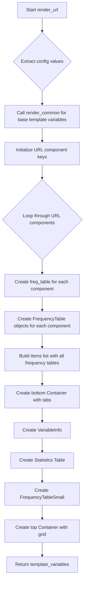

# `render_url.py`

## `src.ydata_profiling.report.structure.variables.render_url.render_url` · *function*

## Summary:
Processes URL variable summary data and generates template variables for rendering URL statistics in reports.

## Description:
This function handles the presentation logic for URL variables by creating frequency tables for different URL components (scheme, netloc, path, query, fragment) and organizing them into tabbed containers. It leverages common rendering logic and constructs UI elements for displaying URL statistics including distinct counts, missing values, and memory usage.

The function extracts URL-specific information from the summary dictionary and formats it into a structure suitable for report generation. It separates the UI components into 'top' and 'bottom' sections for proper layout organization.

This logic is extracted into its own function to separate the presentation concerns from the data processing logic, making it easier to test and modify the URL-specific rendering behavior independently of other variable types.

## Args:
    config (Settings): Configuration settings containing display preferences and limits including:
        - n_freq_table_max: Maximum number of entries to display in frequency tables
        - vars.cat.n_obs: Maximum observations for categorical variables
        - vars.cat.redact: Whether to redact sensitive information
        - html.style: HTML styling configuration
    summary (dict): Dictionary containing URL variable statistics with required keys:
        - varid, varname: Variable identifiers
        - n_distinct, p_distinct: Distinct value counts and percentages
        - n_missing, p_missing: Missing value counts and percentages
        - memory_size: Memory usage in bytes
        - n: Total number of observations
        - value_counts_without_nan: Value frequency counts excluding NaN
        - scheme_counts, netloc_counts, path_counts, query_counts, fragment_counts: Frequency counts for URL components
        - alerts: List of alerts for the variable
        - alert_fields: Fields that triggered alerts
        - description: Variable description text

## Returns:
    dict: Template variables containing UI components for URL variable presentation including:
        - freqtable_scheme, freqtable_netloc, freqtable_path, freqtable_query, freqtable_fragment: Frequency tables for URL components
        - freq_table_rows: Full frequency table rows
        - bottom: Container with tabbed interface for URL statistics
        - top: Container with grid layout for variable info, statistics table, and frequency table small

## Raises:
    KeyError: If required keys are missing from the summary dictionary such as varid, varname, n_distinct, n_missing, etc.

## Constraints:
    Preconditions:
        - summary dictionary must contain all required keys listed in Args section
        - config must be a valid Settings object with appropriate nested configurations
        
    Postconditions:
        - Returns a dictionary with properly formatted template variables for URL presentation
        - All frequency tables are created with appropriate redaction settings
        - UI containers are properly structured with tabs and grid layouts

## Side Effects:
    None

## Control Flow:


## Examples:
```python
# Typical usage in report generation pipeline
config = Settings()
summary = {
    "varid": "url_001",
    "varname": "website_url",
    "n_distinct": 150,
    "p_distinct": 0.75,
    "n_missing": 10,
    "p_missing": 0.05,
    "memory_size": 2048,
    "n": 200,
    "value_counts_without_nan": {"https://example.com": 50, "http://test.org": 30},
    "scheme_counts": {"https": 100, "http": 50},
    "netloc_counts": {"example.com": 100, "test.org": 50},
    "path_counts": {"/page": 75, "/home": 25},
    "query_counts": {"?id=1": 40, "?filter=all": 30},
    "fragment_counts": {"#section1": 60, "#section2": 40},
    "alerts": [],
    "alert_fields": [],
    "description": "URL column for website tracking"
}

template_vars = render_url(config, summary)
# Result contains all UI components ready for HTML rendering
```

