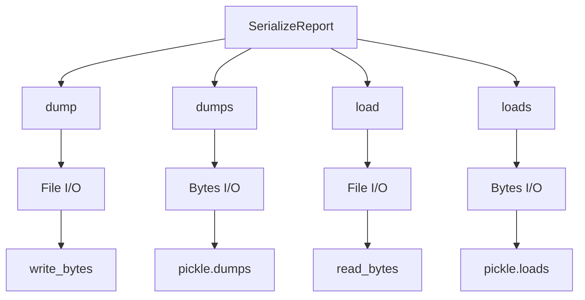

# `serialize_report.py`

## `src.ydata_profiling.serialize_report.SerializeReport` · *class*

## Summary:
Serializes and deserializes profile report data for persistence and transfer.

## Description:
The SerializeReport class provides serialization capabilities for profile reports, enabling users to save and load report data to/from files or byte streams. It serves as a base class that is inherited by ProfileReport, making serialization functionality available throughout the profiling system. The class handles the serialization of key report components including DataFrame hash, configuration settings, description sets, and report structure while performing version compatibility checks.

## State:
- df: DataFrame object being profiled (None by default)
- config: Settings object containing profiling configuration (None by default)  
- _df_hash: String hash of the DataFrame for validation (None by default)
- _report: Root report structure object (None by default)
- _description_set: BaseDescription object containing analysis results (None by default)

## Lifecycle:
Creation: Instantiate directly or inherit from ProfileReport. The class doesn't require specific initialization parameters beyond standard Python object creation.
Usage: Call dump() or dumps() to serialize data, or load() or loads() to deserialize. Typically used in conjunction with ProfileReport instances.
Destruction: No explicit cleanup required; uses standard Python garbage collection.

## Method Map:


## Raises:
- ValueError: When loading data fails due to corruption or version incompatibility, or when DataFrame hash doesn't match during deserialization
- Exception: When pickle operations fail during loading

## Example:
```python
# Create a profile report
from ydata_profiling import ProfileReport
import pandas as pd

df = pd.DataFrame({'A': [1, 2, 3], 'B': [4, 5, 6]})
report = ProfileReport(df)

# Serialize to bytes
serialized_data = report.dumps()

# Deserialize from bytes
new_report = ProfileReport()
new_report.loads(serialized_data)

# Serialize to file
report.dump('my_report.pp')

# Load from file
loaded_report = ProfileReport()
loaded_report.load('my_report.pp')
```

### `src.ydata_profiling.serialize_report.SerializeReport.df_hash` · *method*

## Summary:
Returns the cached DataFrame hash value or None when no hash is available.

## Description:
This property serves as a placeholder for DataFrame hash computation. Currently, it returns None, but in a complete implementation, it would compute and return a SHA-256 hash of the DataFrame for serialization compatibility verification. The hash is used to ensure that the same DataFrame is being used when loading serialized profile reports.

## Args:
    None

## Returns:
    Optional[str]: Always returns None in the current implementation, but would return a DataFrame hash string in a complete implementation.

## Raises:
    None

## State Changes:
    Attributes READ: self._df_hash
    Attributes WRITTEN: None

## Constraints:
    Preconditions: 
    - None required for the current implementation
    
    Postconditions:
    - Always returns None

## Side Effects:
    None

### `src.ydata_profiling.serialize_report.SerializeReport.dumps` · *method*

*No documentation generated.*

### `src.ydata_profiling.serialize_report.SerializeReport.loads` · *method*

## Summary:
Loads serialized profiling data into the current instance, validating data integrity and compatibility with the existing DataFrame.

## Description:
Deserializes profiling data from bytes and loads it into the current instance. This method ensures that the loaded data is compatible with the current DataFrame by checking hash values, and only loads data when appropriate. It handles version mismatches with warnings and prevents overwriting existing data unless explicitly allowed.

## Args:
    data (bytes): Serialized profiling data containing DataFrame hash, configuration, description set, and report structure.

## Returns:
    SerializeReport: Returns self to enable method chaining.

## Raises:
    ValueError: If deserialization fails or if the loaded data is incompatible with the current instance (wrong DataFrame or version mismatch).

## State Changes:
    Attributes READ: self.df_hash, self.df
    Attributes WRITTEN: self._description_set, self._report, self.config, self._df_hash

## Constraints:
    Preconditions: The instance must be initialized and have a valid configuration structure.
    Postconditions: If successful, the instance will contain the loaded profiling data, or warnings will be issued if data wasn't loaded due to existing values.

## Side Effects:
    I/O: Reads from the provided bytes data.
    Warnings: Issues warnings when existing data would be overwritten or when version mismatches occur.

### `src.ydata_profiling.serialize_report.SerializeReport.dump` · *method*

## Summary:
Serializes and saves the current object state to a file with .pp extension.

## Description:
Writes the serialized representation of the object's internal state to the specified output file. This method is part of the serialization mechanism that allows saving and loading ProfileReport or SerializeReport objects. The serialization includes key metadata such as DataFrame hash, configuration settings, description set, and report structure.

## Args:
    output_file (Union[Path, str]): Path to the output file. If a string is provided, it will be converted to a Path object. The file will automatically have the .pp extension added.

## Returns:
    None: This method does not return any value.

## Raises:
    None explicitly raised, but underlying file operations may raise IOError or OSError if file permissions or disk space issues occur.

## State Changes:
    Attributes READ: 
    - self.df_hash
    - self.config  
    - self._description_set
    - self._report
    Attributes WRITTEN: None

## Constraints:
    Preconditions:
    - The object must have valid internal state (df_hash, config, description_set, and report should be accessible)
    - The output_file path must be writable
    
    Postconditions:
    - A file with .pp extension will be created at the specified location
    - The file will contain pickled serialized data of the object's state

## Side Effects:
    - File I/O operation: Creates or overwrites a file at the specified path
    - May raise file system related exceptions (IOError, OSError) during file write operations

### `src.ydata_profiling.serialize_report.SerializeReport.load` · *method*

## Summary:
Loads serialized profiling report data from a file into the current instance, updating its internal state with the deserialized configuration, description set, and report structure.

## Description:
This method reads binary data from a specified file path and deserializes it into the current instance using the underlying `loads` method. It serves as the primary interface for loading previously saved profiling reports from disk. The method ensures compatibility by validating that the loaded data matches the current DataFrame hash when applicable. This method is typically called during the report loading phase of a profiling workflow.

## Args:
    load_file (Union[Path, str]): Path to the serialized file to load. Can be either a pathlib.Path object or a string representing the file path.

## Returns:
    Union["ProfileReport", "SerializeReport"]: Returns self (the current instance) after successfully loading the data, allowing for method chaining. The exact return type depends on the class instance this method is called on - if called on a SerializeReport instance, it returns SerializeReport; if called on a ProfileReport instance, it returns ProfileReport.

## Raises:
    ValueError: Raised when:
        - The file cannot be read or parsed due to corruption or invalid format
        - The loaded data is incompatible with the current instance (DataFrame mismatch)
        - The loaded data contains unexpected types that don't match expected schema

## State Changes:
    Attributes READ: 
        - self.df_hash (via property access in loads method)
        - self.df (via property access in loads method)
        - self._description_set (via property access in loads method)
        - self._report (via property access in loads method)
        - self.config (via property access in loads method)
    
    Attributes WRITTEN:
        - self._description_set (when not already initialized)
        - self._report (when not already initialized)
        - self.config (updated with loaded configuration)
        - self._df_hash (updated with loaded hash value)

## Constraints:
    Preconditions:
        - The load_file parameter must be a valid file path that exists and is readable
        - The file must contain valid serialized data compatible with the current version of ydata-profiling
        - The instance must be properly initialized (has basic attributes like df, config, etc.)

    Postconditions:
        - The instance's internal state is updated with data from the loaded file
        - If the loaded data is compatible, the instance will contain the deserialized configuration, description set, and report structure
        - If the loaded data is incompatible, an exception is raised and no state changes occur

## Side Effects:
    - Reads binary data from the filesystem
    - May issue warnings if loaded data comes from a different version of ydata-profiling
    - May issue warnings if existing description_set or report are being replaced

