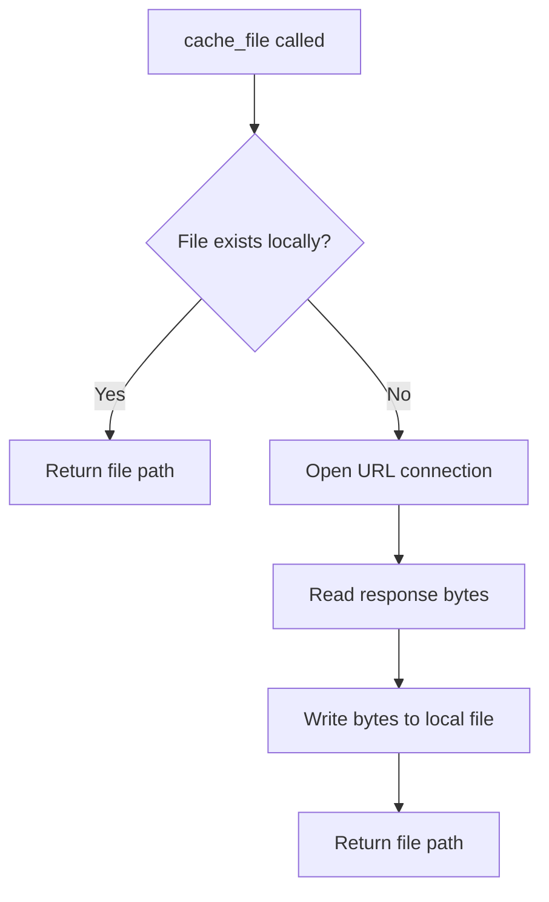

# `cache.py`

## `src.ydata_profiling.utils.cache.cache_file` · *function*

## Summary:
Downloads and caches a file from a remote URL to a local data directory, returning the path to the cached file.

## Description:
This function provides a mechanism to download files from remote URLs and store them locally in a standardized data directory. It ensures the data directory exists and only downloads the file if it doesn't already exist locally, making it efficient for repeated use. The function is designed to be a reusable utility for managing external data dependencies in the profiling system.

## Args:
    file_name (str): The name to give the cached file in the local data directory
    url (str): The remote URL from which to download the file

## Returns:
    Path: A pathlib.Path object pointing to the location of the cached file (either existing or newly downloaded)

## Raises:
    Exception: May raise exceptions from urllib.request.urlopen when accessing the URL
    Exception: May raise exceptions from file system operations when writing the cached file

## Constraints:
    Preconditions:
        - The URL must be accessible and return valid content
        - The local file system must allow creating directories and files in the data path
    Postconditions:
        - The returned Path will point to an existing file
        - The file will be stored in the project's data directory

## Side Effects:
    - Creates the project's data directory if it doesn't exist
    - Downloads content from a remote URL and writes it to local storage
    - May perform network I/O operations

## Control Flow:

## Examples:
    # Cache a sample dataset
    data_path = cache_file("sample.csv", "https://example.com/dataset.csv")
    
    # This will download the file only once, subsequent calls will return the local path
    cached_path = cache_file("model.pkl", "https://storage.example.com/model.pkl")
``

## `src.ydata_profiling.utils.cache.cache_zipped_file` · *function*

*No documentation generated.*

