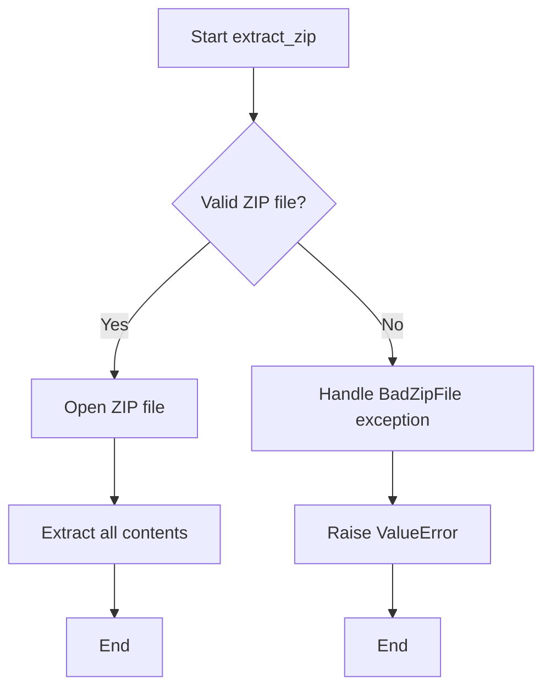

# `common.py`

## `src.ydata_profiling.utils.common.update` · *function*

*No documentation generated.*

## `src.ydata_profiling.utils.common._copy` · *function*

## Summary:
Copies a file from the current path to a specified target destination.

## Description:
This method performs a file copy operation from the current file path to a target location. It ensures the source is a file before attempting the copy operation. This function is typically used within file management operations where a file needs to be duplicated to another location.

## Args:
    target (str or Path): The destination path where the file should be copied to.

## Returns:
    None: This method does not return any value.

## Raises:
    AssertionError: When the current path does not represent a file (i.e., when `self.is_file()` returns False).
    Various exceptions from shutil.copy(): Including but not limited to PermissionError, FileNotFoundError, and OSError if the copy operation fails.

## Constraints:
    Preconditions:
        - The current object (`self`) must represent a file (not a directory)
        - The parent directory of the target path must exist and be writable
    Postconditions:
        - A copy of the file exists at the target location
        - The original file remains unchanged

## Side Effects:
    - File I/O operation: Creates a copy of the file at the target location
    - May raise filesystem-related exceptions if target directory is not writable or if permissions prevent copying

## Control Flow:
```mermaid
flowchart TD
    A[Start _copy method] --> B{self.is_file() == True?}
    B -- No --> C[AssertionError]
    B -- Yes --> D[shutil.copy(str(self), target)]
    D --> E[End]
```

## Examples:
```python
# Assuming MyPath is a class with _copy method
source_file = MyPath("data/input.txt")
source_file._copy("data/output.txt")
# Creates a copy of input.txt as output.txt
```

## `src.ydata_profiling.utils.common.extract_zip` · *function*

## Summary:
Extracts the contents of a ZIP archive to a specified directory.

## Description:
This function takes a ZIP file and extracts all its contents to the target directory. It provides error handling for malformed ZIP files and is designed to be a reusable utility for ZIP extraction operations throughout the codebase.

## Args:
    outfile (str): Path to the ZIP file to be extracted.
    effective_path (str): Directory path where the ZIP contents will be extracted.

## Returns:
    None: This function does not return any value.

## Raises:
    ValueError: Raised when the provided file is not a valid ZIP archive.

## Constraints:
    Preconditions:
        - The `outfile` parameter must point to a valid file that exists on disk.
        - The `effective_path` parameter must be a valid directory path that exists or can be created.
    Postconditions:
        - All contents of the ZIP file are extracted to the specified directory.
        - No files are left in an inconsistent state if extraction fails.

## Side Effects:
    - Creates files and directories on the filesystem at the location specified by `effective_path`.
    - May modify the filesystem by creating new directories and writing files.

## Control Flow:


## Examples:
    # Basic usage
    extract_zip("data.zip", "/tmp/extracted")
    
    # With error handling
    try:
        extract_zip("archive.zip", "/path/to/destination")
    except ValueError as e:
        print(f"Failed to extract ZIP: {e}")
```

## `src.ydata_profiling.utils.common.test_jpeg1` · *function*

## Summary:
Tests if a file header contains the JFIF signature to identify JPEG image files.

## Description:
This function implements a JPEG file type detection algorithm by examining the first 23 bytes of a file's header for the presence of the "JFIF" byte sequence. It's designed to be compatible with Python's standard library `imghdr` module interface, allowing it to be used as a replacement or extension for standard image type detection.

## Args:
    h (bytes): The first 23 bytes of a file header to examine for JPEG signature.
    f (file object or None): A file object or None, typically unused in this implementation but maintained for compatibility with imghdr module function signatures.

## Returns:
    str: Returns "jpeg" if the JFIF signature is detected in the header, otherwise returns None or falls through to other detection methods.

## Raises:
    None: This function does not explicitly raise exceptions, though it may fail silently if the input is malformed.

## Constraints:
    Preconditions:
    - Parameter `h` should contain at least 23 bytes or be a bytes-like object that can be sliced to 23 characters
    - Parameter `f` should be either a file object or None
    
    Postconditions:
    - Function returns "jpeg" string when JFIF signature is found
    - Function returns None or continues execution when signature is not found

## Side Effects:
    None: This function performs no I/O operations or external state mutations.

## Control Flow:
```mermaid
flowchart TD
    A[Start test_jpeg1] --> B{b"JFIF" in h[:23]?}
    B -- Yes --> C[Return "jpeg"]
    B -- No --> D[End/Return None]
```

## Examples:
    # Basic usage with file header bytes
    header = b'\xff\xd8\xff\xe0\x00\x10JFIF\x00\x01\x01\x00\x00\x01\x00\x01\x00\x00'
    result = test_jpeg1(header, None)
    # Returns "jpeg"
    
    # Usage with non-JPEG header
    header = b'\x89PNG\r\n\x1a\n'
    result = test_jpeg1(header, None)
    # Returns None or continues execution

## `src.ydata_profiling.utils.common.test_jpeg2` · *function*

## Summary:
Tests if a byte sequence matches the JPEG file format signature.

## Description:
This function performs a binary signature check to identify JPEG image files. It examines the first 32 bytes of a byte sequence against a predefined JPEG marker pattern to determine if the data represents a valid JPEG file. This function is part of the file type detection utilities in the profiling system.

## Args:
    h (bytes): A byte sequence representing the beginning of a file or data stream to be tested.
    f (file-like object or None): A file handle or similar object, though not actively used in this implementation.

## Returns:
    str or None: Returns "jpeg" if the byte sequence matches the JPEG signature pattern, otherwise returns None.

## Raises:
    None explicitly raised by this function.

## Constraints:
    Preconditions:
    - Parameter `h` must be a bytes-like object with length >= 32
    - Parameter `h` must support indexing operations
    
    Postconditions:
    - Function returns either "jpeg" or None
    - No modifications are made to input parameters

## Side Effects:
    None

## Control Flow:
```mermaid
flowchart TD
    A[Start test_jpeg2] --> B{len(h) >= 32?}
    B -- No --> C[Return None]
    B -- Yes --> D{h[5] == 67?}
    D -- No --> C
    D -- Yes --> E{h[:32] == JPEG_MARK?}
    E -- No --> C
    E -- Yes --> F[Return "jpeg"]
```

## Examples:
    # Valid JPEG signature
    result = test_jpeg2(b'\xff\xd8\xff\xe0\x00\x41JFIF\x00\x01\x01\x01\x00\x00\x00\x00\x00\x00\x00\x00\x00\x00\x00\x00\x00\x00\x00\x00\x00\x00\x00\x00\x00\x00\x00\x00\x00\x00\x00\x00', None)
    # Returns: "jpeg"
    
    # Invalid signature
    result = test_jpeg2(b'invalid_data', None)
    # Returns: None
```

## `src.ydata_profiling.utils.common.test_jpeg3` · *function*

## Summary:
Determines if a file buffer contains a JPEG image by checking for specific byte signatures.

## Description:
This function performs JPEG file format detection by examining the initial bytes of a file buffer. It checks for standard JPEG markers that indicate the file is a JPEG image. This logic is extracted into a separate function to provide a clean interface for file type detection and to enable reuse across different parts of the profiling system.

## Args:
    h (bytes): A bytes object containing the beginning of a file buffer, typically the first few bytes of a file
    f (Any): A file handle or filename parameter, likely unused in this specific implementation but maintained for interface consistency

## Returns:
    str: Returns "jpeg" if the file buffer matches JPEG format signatures, None otherwise

## Raises:
    None explicitly raised

## Constraints:
    Preconditions:
    - Parameter `h` must be a bytes object with sufficient length to access indices 6:10 and 0:2
    - Parameter `f` can be any type but is not used in the current implementation
    
    Postconditions:
    - Function returns "jpeg" string when JPEG signature is detected
    - Function returns None when no JPEG signature is detected

## Side Effects:
    None

## Control Flow:
```mermaid
flowchart TD
    A[Start test_jpeg3] --> B{h[6:10] in (b"JFIF", b"Exif")?}
    B -- Yes --> C[Return "jpeg"]
    B -- No --> D{h[:2] == b"\\xff\\xd8"?}
    D -- Yes --> C
    D -- No --> E[Return None]
```

## Examples:
    # Detect JPEG file
    result = test_jpeg3(b"\x00\x00\x00\x00\x00\x00JFIF\x00\x00\x00\x00", "image.jpg")
    # Returns "jpeg"
    
    # Non-JPEG file
    result = test_jpeg3(b"\x00\x00\x00\x00\x00\x00PNG\x00\x00\x00\x00", "image.png")
    # Returns None

## `src.ydata_profiling.utils.common.convert_timestamp_to_datetime` · *function*

## Summary:
Converts a Unix timestamp to a datetime object, handling both positive and negative timestamp values correctly.

## Description:
This utility function transforms Unix timestamps (seconds since Unix epoch) into datetime objects. It handles both positive timestamps (normal case) and negative timestamps (which represent dates before the Unix epoch) by properly calculating the datetime offset from the Unix epoch (January 1, 1970).

## Args:
    timestamp (int): Unix timestamp in seconds. Can be positive (dates after 1970) or negative (dates before 1970).

## Returns:
    datetime: A datetime object representing the converted timestamp. For negative timestamps, the result is calculated by adding the seconds to January 1, 1970.

## Raises:
    None explicitly raised by this function.

## Constraints:
    Preconditions:
    - Input must be an integer representing seconds since Unix epoch
    - The function assumes standard Unix timestamp conventions
    
    Postconditions:
    - Returns a valid datetime object
    - For non-negative timestamps, the result corresponds to the standard timestamp conversion
    - For negative timestamps, the result represents the correct date/time before 1970

## Side Effects:
    None.

## Control Flow:
```mermaid
flowchart TD
    A[Start:convert_timestamp_to_datetime] --> B{timestamp >= 0?}
    B -- Yes --> C[datetime.fromtimestamp(timestamp)]
    B -- No --> D[datetime(1970,1,1) + timedelta(seconds=int(timestamp))]
    C --> E[Return datetime]
    D --> E
```

## Examples:
    # Convert positive timestamp (after 1970)
    convert_timestamp_to_datetime(1609459200)  # Returns datetime object for 2021-01-01 00:00:00
    
    # Convert negative timestamp (before 1970)
    convert_timestamp_to_datetime(-86400)     # Returns datetime object for 1969-12-31 00:00:00
```

