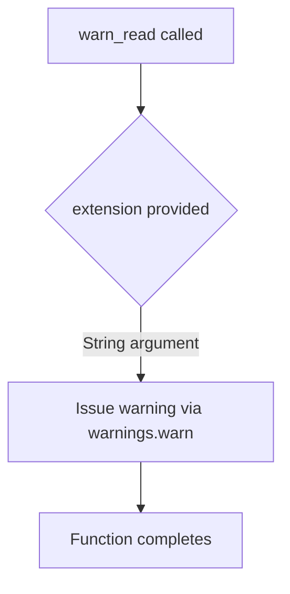
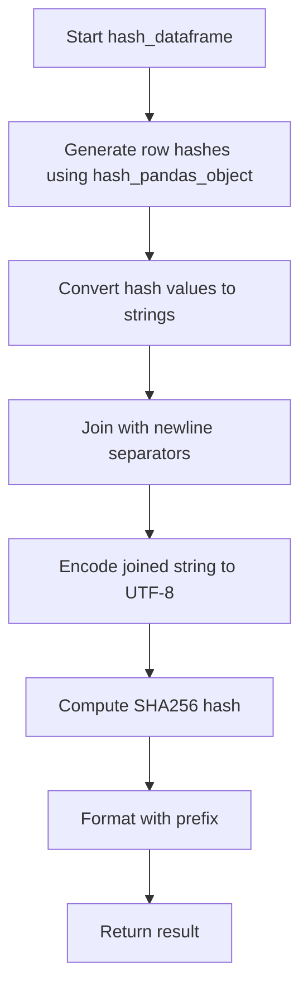
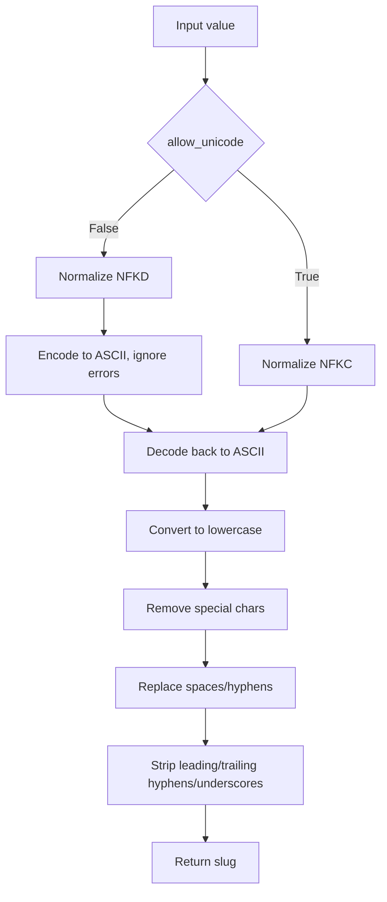

# `dataframe.py`

## `src.ydata_profiling.utils.dataframe.warn_read` · *function*

## Summary:
Issues a warning message when processing files with a specific extension.

## Description:
This utility function issues a warning message through Python's warnings module when encountering files with a particular extension. The function serves as a notification mechanism for file format-related considerations during data processing operations.

## Args:
    extension (str): The file extension (e.g., 'csv', 'xlsx', 'xls') that triggers the warning.

## Returns:
    None: This function does not return any value.

## Raises:
    None: This function does not raise any exceptions.

## Constraints:
    Preconditions:
    - The extension parameter must be a string representing a file extension.
    
    Postconditions:
    - A warning is issued via Python's warnings module.

## Side Effects:
    - Issues a warning message to stderr via Python's warnings module.
    - No external state mutations or I/O operations beyond the warning.

## Control Flow:


## Examples:
```python
# Example usage in data loading context
warn_read("xls")
# Issues a warning about .xls file handling considerations

warn_read("csv")
# Issues a warning about CSV file processing
```

Note: The specific warning message content cannot be determined from the incomplete source code provided.

## `src.ydata_profiling.utils.dataframe.is_supported_compression` · *function*

## Summary:
Determines whether a given file extension corresponds to a supported compression format.

## Description:
Checks if a file extension is one of the recognized compression formats (.bz2, .gz, .xz, .zip) by converting it to lowercase and comparing against a predefined list.

## Args:
    file_extension (str): The file extension to validate, including the leading dot (e.g., ".gz", ".zip").

## Returns:
    bool: True if the file extension is one of the supported compression formats (.bz2, .gz, .xz, .zip), False otherwise.

## Raises:
    None: This function does not raise any exceptions.

## Constraints:
    Preconditions:
        - The input file_extension should be a string
        - The file_extension should include the leading dot (e.g., ".gz" rather than "gz")
    
    Postconditions:
        - Returns a boolean value (True or False)
        - The comparison is case-insensitive due to the .lower() conversion

## Side Effects:
    None: This function has no side effects.

## Control Flow:
```mermaid
flowchart TD
    A[Input file_extension] --> B{file_extension.lower() in list?}
    B -- Yes --> C[Return True]
    B -- No --> D[Return False]
```

## Examples:
    >>> is_supported_compression(".gz")
    True
    >>> is_supported_compression(".ZIP")
    True
    >>> is_supported_compression(".txt")
    False
    >>> is_supported_compression(".bz2")
    True
```

## `src.ydata_profiling.utils.dataframe.remove_suffix` · *function*

## Summary:
Removes a specified suffix from a string if the string ends with that suffix.

## Description:
This utility function safely removes a suffix from a text string only when the text actually ends with that suffix. It prevents errors that could occur with naive string operations and handles edge cases gracefully.

## Args:
    text (str): The input string from which to remove the suffix
    suffix (str): The suffix to remove from the end of the text

## Returns:
    str: The text with the suffix removed if it existed at the end, otherwise returns the original text unchanged

## Raises:
    None: This function does not raise any exceptions

## Constraints:
    Preconditions:
        - Both `text` and `suffix` should be strings
        - The function works correctly with empty strings
    
    Postconditions:
        - If the text ends with the suffix, the returned string will be the text with the suffix removed
        - If the text does not end with the suffix, the returned string will be identical to the input text
        - If the suffix is empty, the returned string will be identical to the input text

## Side Effects:
    None: This function has no side effects and is purely functional

## Control Flow:


## Examples:
    >>> remove_suffix("example.txt", ".txt")
    'example'
    
    >>> remove_suffix("example.txt", ".csv")
    'example.txt'
    
    >>> remove_suffix("example", ".txt")
    'example'
    
    >>> remove_suffix("", ".txt")
    ''
    
    >>> remove_suffix("example.txt", "")
    'example.txt'
```

## `src.ydata_profiling.utils.dataframe.uncompressed_extension` · *function*

## Summary:
Extracts the base file extension by removing compression suffixes from filenames.

## Description:
Returns the actual file extension by stripping common compression suffixes (.gz, .bz2, .xz, .zip) from the filename. This allows identifying the underlying file format regardless of compression status.

## Args:
    file_name (Path): Path object representing the file name to process

## Returns:
    str: The base file extension (without compression suffixes) in lowercase format

## Raises:
    None explicitly raised

## Constraints:
    Preconditions:
        - Input must be a valid Path object
        - Path object should represent an existing or non-existing file
    
    Postconditions:
        - Always returns a string containing the file extension
        - Returns the original extension if no compression suffix is detected

## Side Effects:
    None

## Control Flow:


## Examples:
    >>> from pathlib import Path
    >>> uncompressed_extension(Path("data.csv.gz"))
    '.csv'
    >>> uncompressed_extension(Path("archive.tar.xz"))
    '.tar'
    >>> uncompressed_extension(Path("document.txt"))
    '.txt'
```

## `src.ydata_profiling.utils.dataframe.read_pandas` · *function*

## Summary:
Reads data files of various formats into a pandas DataFrame with automatic format detection and handling.

## Description:
This function provides a unified interface for reading data files in multiple formats (CSV, JSON, Excel, Parquet, etc.) into pandas DataFrames. It automatically detects the file format based on the file extension and uses the appropriate pandas reader function. The function handles compressed files by removing compression suffixes before determining the base format.

## Args:
    file_name (Path): Path object pointing to the data file to be read

## Returns:
    pd.DataFrame: A pandas DataFrame containing the data from the specified file

## Raises:
    ValueError: When attempting to read a .tar file, which is not supported directly by pandas
    Various pandas-specific exceptions: Depending on the file format and content, pandas readers may raise exceptions for invalid files, unsupported formats, or parsing errors

## Constraints:
    Preconditions:
    - The file_path must point to an existing file
    - The file must be readable
    - Supported file extensions include: .csv, .json, .jsonl, .dta, .tsv, .xls, .xlsx, .hdf, .h5, .sas7bdat, .xpt, .parquet, .pkl, .pickle, .bz2, .gz, .xz, .zip
    
    Postconditions:
    - Returns a valid pandas DataFrame object
    - The returned DataFrame contains the data from the input file

## Side Effects:
    - Reads from the filesystem
    - May issue warnings for unsupported file extensions (via warn_read function)
    - May raise pandas-specific exceptions for malformed files

## Control Flow:
```mermaid
flowchart TD
    A[Start read_pandas] --> B{Extension}
    B -->|".json"| C[read_json]
    B -->|".jsonl"| D[read_json(lines=True)]
    B -->|".dta"| E[read_stata]
    B -->|".tsv"| F[read_csv(sep='\t')]
    B -->|".xls or .xlsx"| G[read_excel]
    B -->|".hdf or .h5"| H[read_hdf]
    B -->|".sas7bdat or .xpt"| I[read_sas]
    B -->|".parquet"| J[read_parquet]
    B -->|".pkl or .pickle"| K[read_pickle]
    B -->|".tar"| L[raise ValueError]
    B -->|Other| M[warn_read if not .csv]
    M --> N[read_csv]
    C --> O[Return DataFrame]
    D --> O
    E --> O
    F --> O
    G --> O
    H --> O
    I --> O
    J --> O
    K --> O
    L --> P[End with Error]
    N --> O
```

## Examples:
```python
from pathlib import Path
import pandas as pd

# Reading a CSV file
df = read_pandas(Path("data.csv"))

# Reading a JSON file
df = read_pandas(Path("data.json"))

# Reading an Excel file
df = read_pandas(Path("data.xlsx"))

# Reading a Parquet file
df = read_pandas(Path("data.parquet"))
```

## `src.ydata_profiling.utils.dataframe.rename_index` · *function*

## Summary:
Renames columns and index levels named "index" to "df_index" in a pandas DataFrame.

## Description:
This function standardizes column and index names by replacing any occurrence of "index" with "df_index". This prevents conflicts with the built-in pandas index naming convention and ensures consistent data representation. The function modifies the DataFrame in-place and returns the updated DataFrame.

## Args:
    df (pd.DataFrame): Input pandas DataFrame that may contain columns or index levels named "index"

## Returns:
    pd.DataFrame: The same DataFrame with columns and index levels renamed from "index" to "df_index"

## Raises:
    None explicitly raised

## Constraints:
    Preconditions:
    - Input must be a valid pandas DataFrame
    - The DataFrame should not be None
    
    Postconditions:
    - All columns named "index" are renamed to "df_index"
    - All index levels named "index" are renamed to "df_index"
    - The returned DataFrame is the same object as the input (in-place modification)

## Side Effects:
    - Modifies the input DataFrame in-place by changing column names and index names
    - No external I/O operations or state mutations beyond the DataFrame itself

## Control Flow:
```mermaid
flowchart TD
    A[Start rename_index] --> B{Column named "index"?}
    B -- Yes --> C[Rename column "index" to "df_index"]
    B -- No --> D[Skip column renaming]
    D --> E{Index level named "index"?}
    E -- Yes --> F[Rename index level "index" to "df_index"]
    E -- No --> G[Skip index renaming]
    G --> H[Return DataFrame]
```

## Examples:
```python
import pandas as pd

# Example 1: DataFrame with index column
df = pd.DataFrame({'index': [1, 2, 3], 'value': [4, 5, 6]})
result = rename_index(df)
# result.columns will be ['df_index', 'value']

# Example 2: DataFrame with named index
df = pd.DataFrame({'value': [4, 5, 6]})
df.index.name = 'index'
result = rename_index(df)
# result.index.name will be 'df_index'

# Example 3: DataFrame with both index column and named index
df = pd.DataFrame({'index': [1, 2, 3], 'value': [4, 5, 6]})
df.index.name = 'index'
result = rename_index(df)
# result.columns will be ['df_index', 'value']
# result.index.name will be 'df_index'
```

## `src.ydata_profiling.utils.dataframe.expand_mixed` · *function*

## Summary:
Expands DataFrame columns containing list, dict, or tuple values into separate columns with prefixed names.

## Description:
Processes each column in a DataFrame to identify those containing mixed-type values (specifically list, dict, or tuple) that are not nested. When such columns are detected, they are expanded into multiple separate columns with prefixed names, and the original column is removed from the DataFrame. The expansion process is recursive, allowing for nested structures to be fully flattened. This function is particularly useful for data preprocessing when dealing with heterogeneous data structures in DataFrame columns.

## Args:
    df (pandas.DataFrame): Input DataFrame to process
    types (Any, optional): List of types to consider for expansion. Defaults to [list, dict, tuple].

## Returns:
    pandas.DataFrame: DataFrame with mixed-type columns expanded into separate columns. The original columns containing list, dict, or tuple values are replaced with new columns having the original column name as prefix.

## Raises:
    None explicitly raised

## Constraints:
    Preconditions:
    - Input must be a pandas DataFrame
    - Column values must be hashable for the expansion logic to work properly
    - Values in columns being processed must be iterable when expanded
    
    Postconditions:
    - Columns containing list, dict, or tuple values are replaced with expanded columns
    - Original column names are preserved in the prefix of expanded columns
    - The operation modifies the DataFrame in-place and returns the same object

## Side Effects:
    None

## Control Flow:
```mermaid
flowchart TD
    A[Start expand_mixed] --> B{types is None?}
    B -- Yes --> C[Set types = [list, dict, tuple]]
    B -- No --> C
    C --> D[Iterate through df.columns]
    D --> E{Column has values?}
    E -- No --> F[Continue to next column]
    E -- Yes --> G[Check non_nested_enumeration]
    G --> H{All values satisfy condition?}
    H -- No --> I[Continue to next column]
    H -- Yes --> J[Create expanded DataFrame from column values]
    J --> K[Add prefix to expanded columns]
    K --> L[Recursively call expand_mixed on expanded DataFrame]
    L --> M[Drop original column from original DataFrame]
    M --> N[Concatenate expanded data with original DataFrame]
    N --> O[Return modified DataFrame]
```

## Examples:
    # Basic usage with list values
    import pandas as pd
    df = pd.DataFrame({'mixed_col': [[1, 2], [3, 4], [5, 6]]})
    result = expand_mixed(df)
    # Result will have columns 'mixed_col_0' and 'mixed_col_1'
    
    # Usage with dictionary values
    df2 = pd.DataFrame({'dict_col': [{'a': 1}, {'b': 2}, {'c': 3}]})
    result2 = expand_mixed(df2)
    # Result will have columns like 'dict_col_a', 'dict_col_b', 'dict_col_c'

## `src.ydata_profiling.utils.dataframe.hash_dataframe` · *function*

## Summary:
Generates a SHA256 hash of a pandas DataFrame for identification or caching purposes.

## Description:
Creates a deterministic hash representation of a pandas DataFrame by computing row-wise hashes using pandas' internal hashing mechanism, joining them with newlines, and computing a final SHA256 hash. The result is typically formatted with a prefix (HASH_PREFIX) to create a unique identifier for the DataFrame.

## Args:
    df (pd.DataFrame): Input pandas DataFrame to be hashed

## Returns:
    str: A hexadecimal string representing the hash of the DataFrame, typically with a prefix added

## Raises:
    None explicitly raised in the function body

## Constraints:
    Preconditions:
    - Input must be a valid pandas DataFrame
    - All columns in the DataFrame must be hashable
    
    Postconditions:
    - Output is deterministic for identical DataFrames
    - Output length depends on the hash algorithm and prefix used

## Side Effects:
    None

## Control Flow:


## Examples:
```python
import pandas as pd
from src.ydata_profiling.utils.dataframe import hash_dataframe

# Basic usage
df = pd.DataFrame({'A': [1, 2], 'B': [3, 4]})
hash_result = hash_dataframe(df)
print(hash_result)  # Returns hash string with prefix
```

## `src.ydata_profiling.utils.dataframe.slugify` · *function*

## Summary:
Converts a string into a URL-friendly slug by normalizing unicode characters, removing special characters, and replacing whitespace with hyphens.

## Description:
This function transforms arbitrary strings into valid URL slugs by performing unicode normalization, character filtering, and whitespace replacement. It's designed to create consistent, safe identifiers for web applications and data processing pipelines.

## Args:
    value (str): The input string to convert into a slug
    allow_unicode (bool): When True, preserves unicode characters; when False, strips them (default: False)

## Returns:
    str: A URL-safe slug containing only lowercase letters, numbers, hyphens, and underscores

## Raises:
    None explicitly raised

## Constraints:
    Precondition: Input value must be convertible to string
    Postcondition: Output is always a valid ASCII string with URL-safe characters

## Side Effects:
    None

## Control Flow:


## Examples:
    slugify("Hello World!") returns "hello-world"
    slugify("Café Röst café", allow_unicode=True) returns "café-röst-café"
    slugify("Multiple   spaces   and--hyphens") returns "multiple-spaces-and-hyphens"

## `src.ydata_profiling.utils.dataframe.sort_column_names` · *function*

## Summary:
Sorts dictionary items by their keys in ascending or descending order, case-insensitively.

## Description:
Reorders dictionary entries by their keys while maintaining key-value associations. This utility function is used to standardize column name ordering in data profiling reports, ensuring consistent presentation regardless of original column arrangement.

## Args:
    dct (dict): Dictionary containing column names as keys and their metadata as values
    sort (Optional[str]): Sorting direction - "ascending", "descending", or None. If None, returns dictionary unchanged.

## Returns:
    dict: Dictionary with sorted key-value pairs. Returns original dictionary if sort is None.

## Raises:
    ValueError: When sort parameter is not "ascending", "descending", or None.

## Constraints:
    Precondition: Input must be a dictionary with string keys
    Postcondition: Output dictionary maintains same key-value pairs but with sorted keys

## Side Effects:
    None

## Control Flow:
```mermaid
flowchart TD
    A[sort_column_names] --> B{sort is None?}
    B -- Yes --> C[Return dct]
    B -- No --> D[sort = sort.lower()]
    D --> E{sort starts with "asc"?}
    E -- Yes --> F[Sort dct ascending by keys]
    E -- No --> G{sort starts with "desc"?}
    G -- Yes --> H[Sort dct descending by keys]
    G -- No --> I[raise ValueError]
    F --> J[Return sorted dct]
    H --> J
    I --> J
```

## Examples:
    # Sort columns alphabetically ascending
    data = {"z_col": 1, "a_col": 2, "m_col": 3}
    result = sort_column_names(data, "ascending")
    # Returns: {"a_col": 2, "m_col": 3, "z_col": 1}

    # Sort columns alphabetically descending
    data = {"z_col": 1, "a_col": 2, "m_col": 3}
    result = sort_column_names(data, "descending")
    # Returns: {"z_col": 1, "m_col": 3, "a_col": 2}

    # No sorting applied
    data = {"z_col": 1, "a_col": 2, "m_col": 3}
    result = sort_column_names(data, None)
    # Returns: {"z_col": 1, "a_col": 2, "m_col": 3}

