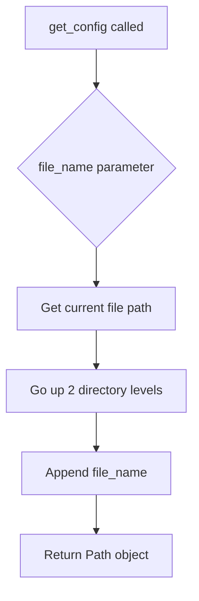
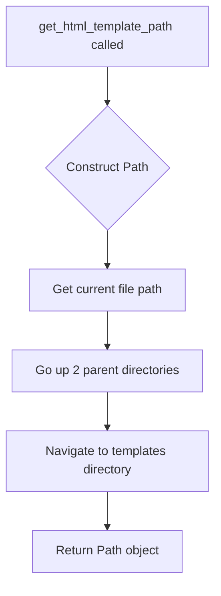

# `paths.py`

## `src.ydata_profiling.utils.paths.get_project_root` · *function*

## Summary:
Returns the absolute path to the project root directory by navigating up four directory levels from the current file location.

## Description:
This utility function determines the project root directory by taking the absolute path of the current file (`__file__`) and traversing up four parent directories. It's designed to provide consistent access to the project's base directory regardless of where in the codebase the function is called from.

The function is extracted into its own utility to centralize project root resolution logic and avoid hardcoding directory paths throughout the application. This ensures that if the project structure changes, only this single function needs to be updated.

## Args:
    None

## Returns:
    Path: An absolute Path object pointing to the project root directory.

## Raises:
    None

## Constraints:
    Preconditions:
    - The function assumes the file structure follows a pattern where `src/ydata_profiling/utils/paths.py` is located at the expected depth
    - The directory structure must have at least 4 parent directories above the paths.py file
    
    Postconditions:
    - The returned Path object will always represent an existing directory
    - The path will be absolute (not relative)

## Side Effects:
    None

## Control Flow:
```mermaid
flowchart TD
    A[get_project_root called] --> B{__file__ path}
    B --> C[Path(__file__)]
    C --> D[Path(__file__).parent]
    D --> E[Path(__file__).parent.parent]
    E --> F[Path(__file__).parent.parent.parent]
    F --> G[Path(__file__).parent.parent.parent.parent]
    G --> H[Return Path object]
```

## Examples:
```python
# Typical usage in a profiling module
from ydata_profiling.utils.paths import get_project_root

root = get_project_root()
config_path = root / "config" / "settings.json"
```

## `src.ydata_profiling.utils.paths.get_config` · *function*

## Summary:
Returns a Path object pointing to a configuration file located two directory levels above the current module's location.

## Description:
This utility function constructs a filesystem path to a configuration file by navigating up two directory levels from the location of the current module file, then appending the specified filename. This pattern is commonly used to locate configuration files relative to the package root rather than the current working directory.

## Args:
    file_name (str): The name of the configuration file to locate, relative to the package root directory.

## Returns:
    Path: A pathlib.Path object representing the absolute path to the requested configuration file.

## Raises:
    None explicitly raised by this function.

## Constraints:
    Preconditions:
    - The file_name parameter must be a valid string
    - The resulting path must exist in the filesystem for the returned Path to be meaningful
    
    Postconditions:
    - The returned Path object will represent a valid filesystem path
    - The path will be constructed relative to the package root directory

## Side Effects:
    None - This function performs no I/O operations or state mutations.

## Control Flow:


## Examples:
```python
# Get path to a config file named "settings.yaml"
config_path = get_config("settings.yaml")

# Get path to a config file in a subdirectory
config_path = get_config("configs/database.yaml")
```

## `src.ydata_profiling.utils.paths.get_data_path` · *function*

## Summary:
Returns the absolute path to the project's data directory.

## Description:
This function provides a standardized way to access the project's data directory by resolving the path relative to the project root. It is designed to centralize path management for data files and resources, ensuring consistent access regardless of the current working directory or execution context.

The function leverages the project root resolution mechanism to locate the data directory at the project's root level.

## Args:
    None

## Returns:
    Path: A pathlib.Path object representing the absolute path to the project's data directory.

## Raises:
    None

## Constraints:
    Preconditions:
    - The project root must be properly defined and accessible
    - The project structure must follow the expected layout where the data directory is located at the root level

    Postconditions:
    - The returned Path object will always point to a directory named "data" under the project root
    - The path will be properly resolved to an absolute path

## Side Effects:
    None

## Control Flow:
```mermaid
flowchart TD
    A[get_data_path()] --> B[get_project_root()]
    B --> C[Project root path]
    C --> D["/data"]
    D --> E[Return Path]
```

## Examples:
```python
# Typical usage
data_path = get_data_path()
print(data_path)  # Outputs: /absolute/path/to/project/data

# Using the path for file operations
config_file = get_data_path() / "config.json"
```

## `src.ydata_profiling.utils.paths.get_html_template_path` · *function*

## Summary:
Returns the absolute path to the HTML template directory used for report generation.

## Description:
This function provides a standardized way to locate the HTML template files needed for generating profiling reports. It constructs the path by navigating from the current module's location up two directory levels and then down to the templates directory.

The function is extracted into its own utility to centralize path resolution logic and avoid hardcoding directory structures throughout the codebase. This makes the code more maintainable and less prone to breakage when the project structure changes.

## Args:
    None

## Returns:
    Path: A pathlib.Path object pointing to the HTML templates directory.

## Raises:
    None

## Constraints:
    Preconditions:
    - The function assumes the standard project structure where the current file is located within a nested directory structure
    - The target templates directory must exist in the expected location relative to the package structure
    
    Postconditions:
    - The returned Path object will reference a valid directory path (though not necessarily that it exists on disk)

## Side Effects:
    None

## Control Flow:


## Examples:
```python
from pathlib import Path
from ydata_profiling.utils.paths import get_html_template_path

# Get the path to HTML templates
template_path = get_html_template_path()
print(template_path)  # Outputs something like: /path/to/project/report/presentation/flavours/html/templates
```

