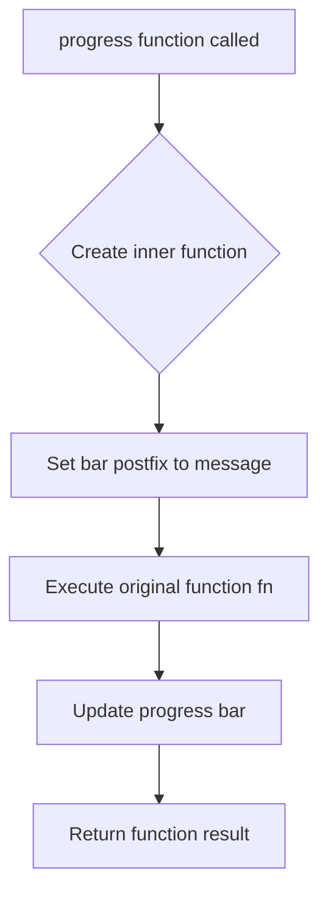

# `progress_bar.py`

## `src.ydata_profiling.utils.progress_bar.progress` · *function*

## Summary:
Wraps a function with progress bar updates for monitoring execution status.

## Description:
Creates a decorator that adds progress bar functionality to any callable function. The decorator sets a postfix message on the provided tqdm progress bar, executes the wrapped function, updates the progress bar, and returns the function's result. This allows monitoring of long-running operations through visual progress indicators.

## Args:
    fn (Callable): The function to wrap with progress bar functionality
    bar (tqdm): A tqdm progress bar instance to update during execution
    message (str): Message to display in the progress bar's postfix field

## Returns:
    Callable: A decorated version of the input function that updates the progress bar when called

## Raises:
    None explicitly raised - any exceptions from the wrapped function are propagated through

## Constraints:
    Preconditions:
    - The `bar` parameter must be a valid tqdm progress bar instance
    - The `fn` parameter must be callable
    - The `message` parameter must be a string
    
    Postconditions:
    - The returned function maintains the same signature as the original function
    - The progress bar is updated exactly once per function invocation
    - The original function's return value is preserved and returned

## Side Effects:
    - Modifies the state of the provided tqdm progress bar instance by setting its postfix string and updating it
    - May cause console output when the progress bar is updated

## Control Flow:


## Examples:
```python
from tqdm import tqdm
from src.ydata_profiling.utils.progress_bar import progress

# Create a progress bar
bar = tqdm(total=100)

# Define a function to monitor
def process_item(item):
    # Simulate work
    return item * 2

# Wrap the function with progress tracking
tracked_function = progress(process_item, bar, "Processing items")

# Call the tracked function
result = tracked_function(5)  # Updates progress bar and returns 10
```

