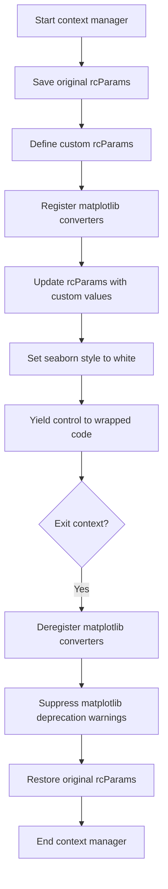

# `context.py`

## `src.ydata_profiling.visualisation.context.manage_matplotlib_context` · *function*

## Summary:
Manages matplotlib styling context by applying custom visual parameters and reverting to original settings upon exit.

## Description:
A context manager that temporarily configures matplotlib with custom styling parameters for consistent visualization appearance. It registers matplotlib converters, applies a predefined set of rcParams for visual consistency, sets seaborn style to 'white', and ensures proper cleanup by restoring original matplotlib configuration when exiting the context.

## Args:
    None

## Returns:
    Generator that yields control to the wrapped code block, allowing execution within the customized matplotlib context.

## Raises:
    None explicitly raised, though underlying matplotlib operations may raise exceptions during parameter updates.

## Constraints:
    Preconditions:
    - Matplotlib and seaborn must be properly installed and importable
    - The function should be used within a `with` statement context
    - Pandas plotting converters must be available for registration
    
    Postconditions:
    - All matplotlib rcParams are restored to their original values upon context exit
    - Matplotlib converters are deregistered to prevent interference with other code
    - Seaborn styling is reset to default after context exit

## Side Effects:
    - Modifies global matplotlib rcParams during context execution
    - Registers and deregisters matplotlib converters via pandas
    - Sets seaborn style to 'white'
    - May produce matplotlib deprecation warnings that are suppressed during cleanup

## Control Flow:


## Examples:
```python
# Basic usage
with manage_matplotlib_context():
    plt.plot([1, 2, 3], [1, 4, 9])
    plt.savefig('output.png')

# Multiple plots within context
with manage_matplotlib_context():
    fig, (ax1, ax2) = plt.subplots(1, 2)
    ax1.plot([1, 2, 3], [1, 4, 9])
    ax2.plot([1, 2, 3], [1, 8, 27])
    plt.tight_layout()
```

