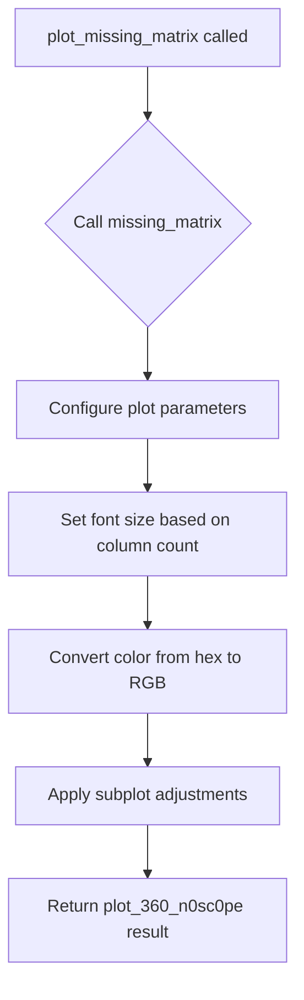

# `missing.py`

## `src.ydata_profiling.visualisation.missing.get_font_size` · *function*

## Summary:
Calculates an appropriate font size for visualization labels based on column count and label length.

## Description:
Computes a dynamic font size for displaying column labels in missing data visualizations. The function adjusts font size based on two factors: the total number of columns and the maximum length of column labels. This ensures optimal readability across different visualization scenarios.

## Args:
    columns (List[str]): A list of column names/labels that will be displayed in the visualization

## Returns:
    float: The computed font size value that balances readability and space efficiency

## Raises:
    ValueError: If columns is an empty list, which would cause max() to be called on an empty sequence

## Constraints:
    Preconditions:
        - columns must be a non-empty list of strings
        - Each string in columns must be non-null
    
    Postconditions:
        - Returns a positive float value between 8.0 and 13.0
        - Font size decreases as column count increases beyond thresholds
        - Font size decreases as label length increases beyond 20 characters

## Side Effects:
    None

## Control Flow:
```mermaid
flowchart TD
    A[Start get_font_size] --> B[Calculate max_label_length]
    B --> C{len(columns) < 20?}
    C -- Yes --> D[font_size = 13.0]
    C -- No --> E{20 <= len(columns) < 40?}
    E -- Yes --> F[font_size = 12.0]
    E -- No --> G{40 <= len(columns) < 60?}
    G -- Yes --> H[font_size = 10.0]
    G -- No --> I[font_size = 8.0]
    D --> J[Apply label length adjustment]
    F --> J
    H --> J
    I --> J
    J --> K[font_size *= min(1.0, 20.0 / max_label_length)]
    K --> L[Return font_size]
```

## Examples:
    >>> get_font_size(['col1', 'col2', 'col3'])
    13.0
    
    >>> get_font_size(['a' * 25 for _ in range(50)])
    4.0

## `src.ydata_profiling.visualisation.missing.plot_missing_matrix` · *function*

## Summary:
Creates a matrix visualization of missing data patterns in a dataset.

## Description:
Generates a visual representation showing the distribution of missing values across columns and rows in a dataset. This function serves as a wrapper that prepares parameters for the underlying missing matrix plotting function and handles the final image rendering.

## Args:
    config (Settings): Configuration object containing display settings and preferences
    notnull (Any): Boolean array indicating which values are not null in the dataset
    columns (List[str]): List of column names to display on the x-axis
    nrows (int): Number of rows in the dataset to visualize

## Returns:
    str: Path or encoded string representing the saved visualization image

## Raises:
    ValueError: When invalid image format is specified in configuration

## Constraints:
    Preconditions:
        - config must contain valid html.style.primary_colors configuration
        - notnull must be a boolean array with matching dimensions to the dataset
        - columns must be a non-empty list of strings
        - nrows must be a positive integer
    
    Postconditions:
        - A matplotlib figure is created and configured with proper spacing
        - The returned string contains a valid reference to the generated visualization

## Side Effects:
    - Creates matplotlib figure and axes objects
    - Modifies matplotlib subplot layout parameters
    - May save image files to disk or return base64 encoded strings depending on config.html.inline setting
    - Closes matplotlib figures after processing

## Control Flow:


## Examples:
```python
# Basic usage
config = Settings()
notnull_data = df.isna().values
columns = ['col1', 'col2', 'col3']
nrows = len(df)
result = plot_missing_matrix(config, notnull_data, columns, nrows)
```

## `src.ydata_profiling.visualisation.missing.plot_missing_bar` · *function*

## Summary:
Creates a bar chart visualization showing the distribution of missing data across columns in a dataset.

## Description:
Generates a matplotlib bar chart that displays the percentage of non-missing values for each column, providing a visual summary of data completeness. This function serves as a wrapper around the core plotting logic to apply consistent styling and formatting.

The function is typically called as part of the missing data visualization pipeline when generating profiling reports. It's designed to be a reusable component that handles the specific presentation of missing data bar charts while delegating the core plotting logic to the underlying `missing_bar` function.

## Args:
    config (Settings): Configuration object containing visualization settings including color schemes and display preferences
    notnull_counts (list): List of counts representing the number of non-null values for each column
    nrows (int): Total number of rows in the dataset
    columns (List[str]): List of column names for labeling the x-axis

## Returns:
    str: String representation of the generated plot, either as inline base64-encoded image data or file path depending on configuration settings

## Raises:
    ValueError: When the image format specified in config is not supported (only "png" or "svg" are accepted)

## Constraints:
    Preconditions:
    - `notnull_counts` must have the same length as `columns`
    - `nrows` must be a positive integer
    - `config` must be a properly initialized Settings object
    - `columns` must be a non-empty list of strings
    
    Postconditions:
    - A matplotlib figure is created and modified with grid removal and layout adjustments
    - The returned string contains valid image data or file reference
    - The matplotlib figure is closed after processing to prevent memory leaks

## Side Effects:
    - Creates and modifies matplotlib figures
    - May write files to disk if config.html.inline is False
    - Closes matplotlib figures to prevent memory leaks
    - Uses global matplotlib state for figure manipulation

## Control Flow:
```mermaid
flowchart TD
    A[Start plot_missing_bar] --> B{Call missing_bar}
    B --> C[Set figure size to (10,5)]
    C --> D[Calculate font size using get_font_size]
    D --> E[Get primary color from config]
    E --> F[Set labels from config]
    F --> G[Create bar chart]
    G --> H[Remove grid from all axes]
    H --> I[Adjust subplot layout]
    I --> J[Return plot_360_n0sc0pe result]
```

## Examples:
```python
# Basic usage with sample data
config = Settings()
notnull_counts = [95, 87, 100, 92]
nrows = 100
columns = ['col1', 'col2', 'col3', 'col4']

plot_result = plot_missing_bar(config, notnull_counts, nrows, columns)
# Returns string containing image data or file path
```

## `src.ydata_profiling.visualisation.missing.plot_missing_heatmap` · *function*

## Summary:
Creates and displays a heatmap visualization showing missing data patterns across columns in a dataset.

## Description:
Generates a correlation heatmap that visualizes the relationships between missing values across different columns. This function dynamically adjusts the plot dimensions and font sizes based on the number of columns to ensure optimal readability and visualization quality.

## Args:
    config (Settings): Configuration object containing plotting settings such as color map and label preferences
    corr_mat (Any): Correlation matrix representing relationships between missing value patterns
    mask (Any): Mask array for hiding specific cells in the heatmap visualization
    columns (List[str]): List of column names to be displayed on the axes

## Returns:
    str: Path or encoded string representing the saved plot image, depending on configuration settings

## Raises:
    ValueError: When an invalid image format is specified in the configuration

## Constraints:
    Preconditions:
        - corr_mat and mask should be compatible dimensions for heatmap visualization
        - columns list should not be empty
        - config should contain valid plot configuration settings
    
    Postconditions:
        - A matplotlib figure is created and properly configured
        - The plot is saved or returned according to the configuration settings
        - The matplotlib figure is closed after processing to prevent memory leaks

## Side Effects:
    - Creates and modifies matplotlib figures and axes
    - May save files to disk if html.inline is False in the configuration
    - Calls plt.subplots_adjust() to modify subplot positioning
    - Closes matplotlib figures to prevent memory leaks

## Control Flow:
```mermaid
flowchart TD
    A[Start plot_missing_heatmap] --> B{len(columns) > 10?}
    B -- Yes --> C[height += int((len(columns)-10)/5)]
    B -- No --> D[height = 4]
    C --> E[height = min(height, 10)]
    D --> E
    E --> F[font_size = get_font_size(columns)]
    F --> G{len(columns) > 40?}
    G -- Yes --> H[font_size /= 1.4]
    G -- No --> I[Continue]
    H --> I
    I --> J[Call missing_heatmap]
    J --> K{len(columns) > 40?}
    K -- Yes --> L[plt.subplots_adjust with tight margins]
    K -- No --> M[plt.subplots_adjust with standard margins]
    L --> N[Return plot_360_n0sc0pe(config)]
    M --> N
```

## Examples:
```python
# Basic usage with sample data
config = Settings()
corr_mat = np.random.rand(5, 5)
mask = np.zeros((5, 5))
columns = ['col1', 'col2', 'col3', 'col4', 'col5']
result = plot_missing_heatmap(config, corr_mat, mask, columns)
```

