# `plot.py`

## `src.ydata_profiling.visualisation.plot.format_fn` · *function*

## Summary:
Formats timestamp values as human-readable date-time strings for matplotlib axis ticks.

## Description:
A matplotlib tick formatter function that converts timestamp integers into formatted date-time strings. This function is typically used with matplotlib's FuncFormatter to display timestamp data on x-axis labels in a human-readable format. The function leverages `convert_timestamp_to_datetime` to handle timestamp conversion and applies a standard date-time format ("%Y-%m-%d %H:%M:%S").

## Args:
    tick_val (int): The timestamp value to format, typically representing seconds since Unix epoch
    tick_pos (Any): The position of the tick on the axis (not used in the implementation)

## Returns:
    str: A formatted date-time string in the format "%Y-%m-%d %H:%M:%S"

## Raises:
    None explicitly raised, but may propagate exceptions from underlying datetime conversion functions

## Constraints:
    Preconditions:
    - tick_val must be an integer representing a valid timestamp
    - The timestamp should be within the range supported by Python's datetime module
    
    Postconditions:
    - Always returns a properly formatted date-time string
    - The returned string follows the "%Y-%m-%d %H:%M:%S" format consistently

## Side Effects:
    None

## Control Flow:
```mermaid
flowchart TD
    A[format_fn called with tick_val] --> B{tick_val is int?}
    B -- Yes --> C[Convert timestamp to datetime]
    C --> D[Format datetime as "%Y-%m-%d %H:%M:%S"]
    D --> E[Return formatted string]
    B -- No --> F[Exception propagation]
```

## Examples:
```python
# Typical usage with matplotlib
import matplotlib.pyplot as plt
from matplotlib.ticker import FuncFormatter

# Create a formatter function
formatter = FuncFormatter(format_fn)

# Apply to x-axis
plt.gca().xaxis.set_major_formatter(formatter)
```

## `src.ydata_profiling.visualisation.plot._plot_word_cloud` · *function*

## Summary:
Creates a matplotlib figure containing one or more word clouds from pandas Series data.

## Description:
Generates a visualization showing word frequencies as word clouds, useful for text analysis and feature exploration. The function accepts either a single pandas Series or a list of Series, creating separate word clouds for each. This extraction into a dedicated function allows for consistent word cloud generation patterns across the profiling library while maintaining clean separation of visualization concerns.

## Args:
    series (Union[pandas.Series, List[pandas.Series]]): A single pandas Series or list of pandas Series containing word-frequency data to visualize as word clouds.
    figsize (tuple): Figure size as (width, height) in inches. Defaults to (6, 4).

## Returns:
    matplotlib.figure.Figure: A matplotlib Figure object containing the word cloud(s) arranged in subplots.

## Raises:
    None explicitly raised in the function body.

## Constraints:
    Preconditions:
    - Input series must be pandas Series objects with string keys and numeric values representing word frequencies
    - The series data should be in dictionary format where keys are words and values are frequencies
    
    Postconditions:
    - Returns a matplotlib Figure object with appropriate subplot arrangement
    - Each subplot displays a word cloud visualization with axes turned off

## Side Effects:
    - Creates a matplotlib figure using plt.figure()
    - Adds subplots to the matplotlib figure
    - Uses matplotlib's imshow() to display word clouds
    - May modify global matplotlib state through figure creation

## Control Flow:
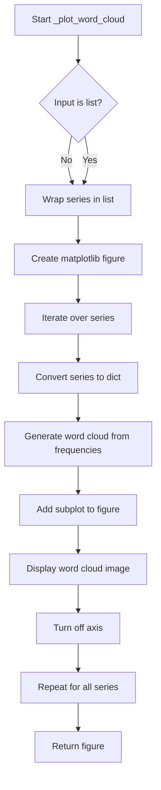

## Examples:
```python
import pandas as pd
from matplotlib import pyplot as plt
from ydata_profiling.visualisation.plot import _plot_word_cloud

# Single series example
word_freq_series = pd.Series({'python': 10, 'data': 8, 'analysis': 5})
fig = _plot_word_cloud(word_freq_series)

# Multiple series example  
word_freq_series1 = pd.Series({'python': 10, 'data': 8})
word_freq_series2 = pd.Series({'machine': 7, 'learning': 6})
fig = _plot_word_cloud([word_freq_series1, word_freq_series2])
```

## `src.ydata_profiling.visualisation.plot._plot_histogram` · *function*

## Summary:
Creates a histogram plot with customizable styling and formatting options for data visualization.

## Description:
Generates a matplotlib histogram visualization with support for both single and multiple series data. Handles date formatting when the date parameter is enabled and applies styling according to the provided configuration settings. This function is designed to be a reusable plotting utility within the ydata-profiling visualization module.

## Args:
    config (Settings): Configuration object containing styling and plotting preferences
    series (np.ndarray): Array of histogram data values, can be single array or list of arrays for multiple series
    bins (Union[int, np.ndarray]): Number of bins or bin edges for the histogram, can be integer or array-like
    figsize (tuple, optional): Figure size as (width, height) in inches. Defaults to (6, 4)
    date (bool, optional): Whether to apply date formatting to x-axis labels. Defaults to False
    hide_yaxis (bool, optional): Whether to hide the y-axis. Defaults to False

## Returns:
    plt.Axes: Matplotlib axes object containing the histogram plot

## Raises:
    None explicitly raised in the function body

## Constraints:
    Preconditions:
    - config must be a valid Settings object with html.style.primary_colors and plot.histogram.x_axis_labels attributes
    - series must be a numpy array or compatible array-like structure
    - bins must be either an integer or numpy array specifying bin edges
    
    Postconditions:
    - A matplotlib figure with histogram(s) is created and displayed
    - The returned axes object contains properly formatted histogram data

## Side Effects:
    - Creates and modifies matplotlib figures and axes
    - May modify axis formatting and visibility settings
    - Uses matplotlib's pyplot interface for figure creation

## Control Flow:
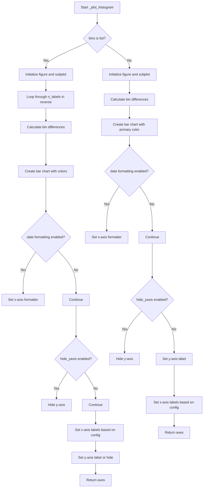

## Examples:
    # Create a simple histogram
    axes = _plot_histogram(config, series_data, bins=30)
    
    # Create a histogram with date formatting
    axes = _plot_histogram(config, series_data, bins=30, date=True)
    
    # Create a multi-series histogram
    axes = _plot_histogram(config, [series1, series2], bins=[bin_edges1, bin_edges2])
``

## `src.ydata_profiling.visualisation.plot.plot_word_cloud` · *function*

## Summary:
Generates a word cloud visualization from word frequency data and formats it according to configuration settings.

## Description:
Creates a visual representation of word frequencies as a word cloud and returns it in the configured format (inline or file-based). This function serves as the main interface for generating word cloud plots in the profiling report, separating the visualization creation from the output formatting concerns.

## Args:
    config (Settings): Configuration object containing plotting and HTML settings for output formatting
    word_counts (pd.Series): Pandas Series containing words as index and their frequencies as values

## Returns:
    str: Formatted plot representation, either as base64-encoded string for inline display (when config.html.inline=True) or file path reference (when config.html.inline=False)

## Raises:
    ValueError: When the configured image format is not supported (only "png" or "svg" are accepted)

## Constraints:
    Preconditions:
        - word_counts must be a pandas Series with words as index and numeric frequencies as values
        - config must be a valid Settings object with proper HTML and plot configurations
    Postconditions:
        - A word cloud visualization is created and properly formatted according to config settings
        - The matplotlib figure is closed after processing to prevent memory leaks

## Side Effects:
    - Creates matplotlib figures and potentially saves files to disk when html.inline is False
    - May write to filesystem when config.html.assets_path is set
    - Closes matplotlib figures to prevent memory leaks

## Control Flow:
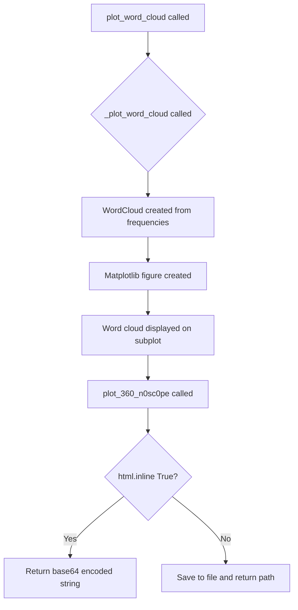

## Examples:
```python
# Basic usage with word frequency data
word_freq = pd.Series({'python': 15, 'data': 12, 'analysis': 8})
config = Settings()
result = plot_word_cloud(config, word_freq)
# Returns either base64 string or file path depending on config
```

## `src.ydata_profiling.visualisation.plot.histogram` · *function*

## Summary:
Creates a histogram visualization for a given data series with configurable binning and date formatting options.

## Description:
Generates a histogram plot for numerical or categorical data, applying appropriate styling and formatting based on configuration settings. This function serves as a wrapper that orchestrates the creation of histogram plots with proper layout management and output serialization.

The function delegates the actual plotting logic to `_plot_histogram` and handles post-processing like axis rotation and layout optimization before serializing the plot to the configured output format.

## Args:
    config (Settings): Configuration object containing visualization settings including style colors, plot dimensions, and output preferences
    series (np.ndarray): Array of values to plot in the histogram, typically numeric data
    bins (Union[int, np.ndarray]): Number of bins (integer) or array of bin edges (numpy array) for histogram calculation
    date (bool, optional): Flag indicating whether the data represents dates, affecting tick label formatting. Defaults to False

## Returns:
    str: Serialized representation of the histogram plot, either as inline base64-encoded image data (when config.html.inline=True) or file path reference (when config.html.inline=False) depending on configuration settings

## Raises:
    ValueError: When an unsupported image format is specified in the configuration or when config.html.assets_path is None and inline is False

## Constraints:
    Preconditions:
    - config must be a valid Settings object with properly initialized plot configuration
    - series must be a valid numpy array of numeric values
    - bins must be either an integer specifying number of bins or an array of bin edges
    
    Postconditions:
    - Returns a string representing the serialized plot in the configured format
    - The returned plot has appropriate axis labeling and formatting applied
    - Matplotlib figures are properly closed to prevent memory leaks

## Side Effects:
    - Creates matplotlib figure and axes objects internally
    - May generate temporary files if html.inline is False and assets_path is configured
    - Closes matplotlib figures after processing to prevent memory leaks

## Control Flow:
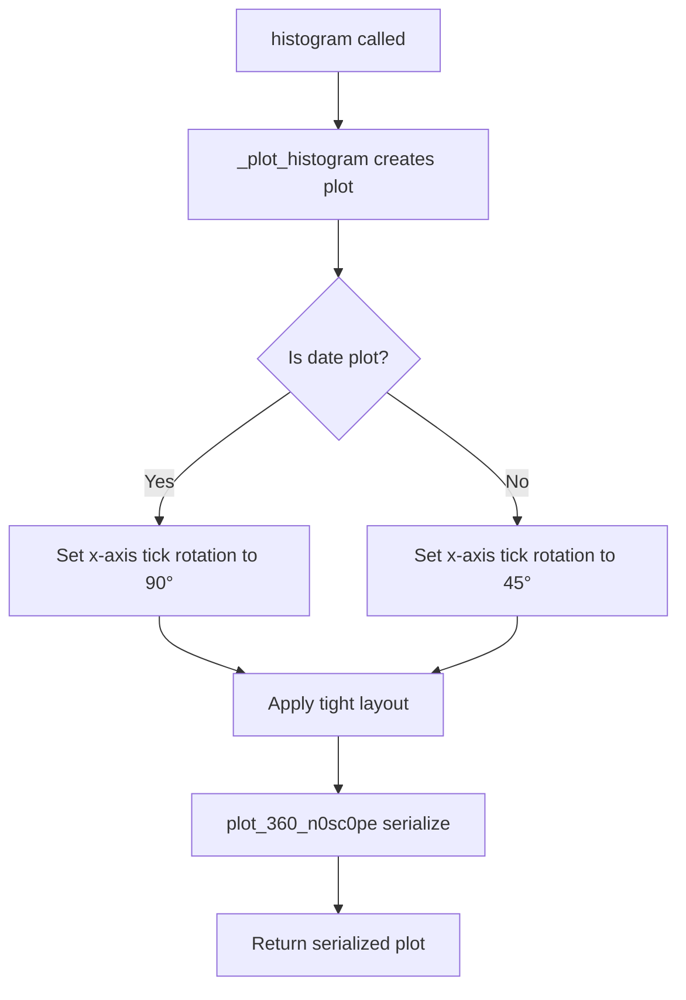

## Examples:
```python
# Basic histogram with automatic binning
config = Settings()
series = np.array([1, 2, 2, 3, 3, 3, 4, 4, 5])
result = histogram(config, series, bins=10)

# Histogram for date data
date_series = np.array([1609459200, 1609545600, 1609632000])  # Unix timestamps
result = histogram(config, date_series, bins=5, date=True)
```

## `src.ydata_profiling.visualisation.plot.mini_histogram` · *function*

## Summary:
Creates a compact histogram visualization with customized styling for small display areas.

## Description:
Generates a mini histogram plot optimized for constrained display space, typically used in data profiling reports where space efficiency is important. The function creates a histogram using the underlying `_plot_histogram` function with specific sizing and formatting parameters, then applies additional styling to make it suitable for small displays.

## Args:
    config (Settings): Configuration object containing visualization settings and style preferences
    series (np.ndarray): Array of values to plot in the histogram
    bins (Union[int, np.ndarray]): Number of bins or array of bin edges for the histogram
    date (bool, optional): Flag indicating whether the data represents dates/timestamps. Defaults to False.

## Returns:
    str: Serialized representation of the histogram plot, either as base64 encoded string (for inline HTML) or file path reference (when assets are saved externally)

## Raises:
    ValueError: When the image format specified in config is not supported (only "png" or "svg" are accepted)

## Constraints:
    Preconditions:
    - config must be a valid Settings object with proper HTML and plot configurations
    - series must be a valid numpy array of numeric values
    - bins must be either an integer (number of bins) or a numpy array of bin edges
    - When date=True, the series values should represent timestamps that can be converted by convert_timestamp_to_datetime
    
    Postconditions:
    - Returns a properly formatted string representation of the histogram
    - The returned plot maintains appropriate aspect ratio for mini display (3x2.25 inches)
    - Tick labels are appropriately sized and rotated based on date flag

## Side Effects:
    - Creates matplotlib figure and axes objects internally
    - May save image files to disk when config.html.inline is False (depending on configuration)
    - Closes matplotlib figures after processing to prevent memory leaks
    - Modifies global matplotlib state through figure and axis property changes

## Control Flow:
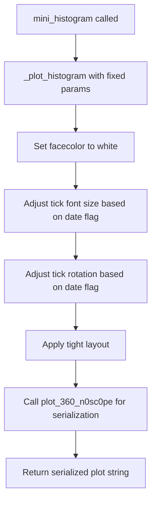

## Examples:
```python
# Basic usage with numeric data
config = Settings()
series = np.array([1, 2, 2, 3, 3, 3])
bins = 5
histogram_str = mini_histogram(config, series, bins)

# Usage with date data
date_series = np.array([1609459200, 1609545600, 1609632000])  # Unix timestamps
histogram_str = mini_histogram(config, date_series, bins, date=True)
```

## `src.ydata_profiling.visualisation.plot.get_cmap_half` · *function*

## Summary:
Creates a new colormap from the upper half of an existing colormap by sampling colors from the second half of the color range.

## Description:
This function extracts the upper half of a given colormap by sampling colors from the range [0.5, 1.0] of the original colormap's color space. It's commonly used to create more subtle or focused color schemes for visualizations where the full spectrum is too intense or distracting.

## Args:
    cmap (Union[Colormap, LinearSegmentedColormap, ListedColormap]): The source colormap to extract colors from. Must be a valid matplotlib colormap object.

## Returns:
    LinearSegmentedColormap: A new colormap containing only the upper half of colors from the input colormap, with the same number of colors as half the original colormap's resolution.

## Raises:
    None explicitly raised, but may raise exceptions from underlying matplotlib operations if invalid colormap is provided.

## Constraints:
    Preconditions:
    - Input cmap must be a valid matplotlib Colormap object
    - Input cmap.N (number of colors) must be a positive integer
    
    Postconditions:
    - Returned colormap will have exactly cmap.N // 2 colors
    - Returned colormap will be a LinearSegmentedColormap instance

## Side Effects:
    None

## Control Flow:
```mermaid
flowchart TD
    A[get_cmap_half called] --> B{Input cmap valid?}
    B -- Yes --> C[Generate linspace(0.5, 1, cmap.N // 2)]
    C --> D[Sample colors from cmap]
    D --> E[Create new LinearSegmentedColormap]
    E --> F[Return new colormap]
    B -- No --> G[Exception from matplotlib operations]
```

## Examples:
```python
# Basic usage with a matplotlib colormap
import matplotlib.pyplot as plt
from matplotlib.colors import viridis

# Create a half-version of viridis colormap
half_viridis = get_cmap_half(viridis)
plt.imshow([[0, 1]], cmap=half_viridis)
```

## `src.ydata_profiling.visualisation.plot.get_correlation_font_size` · *function*

## Summary:
Determines appropriate font size for correlation plot labels based on the number of labels present.

## Description:
This utility function calculates the optimal font size for displaying correlation matrix labels in visualization plots. It provides progressively smaller font sizes as the number of labels increases to maintain readability and prevent overlapping text. The function is designed to be called during the rendering of correlation visualizations to ensure proper label sizing.

## Args:
    n_labels (int): The number of labels in the correlation plot. Must be a non-negative integer.

## Returns:
    Optional[int]: Font size value (4, 5, 6, or 8) if n_labels exceeds the threshold conditions, or None if n_labels is 40 or fewer.

## Raises:
    None: This function does not raise any exceptions.

## Constraints:
    Preconditions:
        - n_labels must be a non-negative integer
    Postconditions:
        - Returns None when n_labels <= 40
        - Returns 4 when n_labels > 100
        - Returns 5 when 80 < n_labels <= 100
        - Returns 6 when 50 < n_labels <= 80
        - Returns 8 when 40 < n_labels <= 50

## Side Effects:
    None: This function has no side effects and is pure.

## Control Flow:
```mermaid
flowchart TD
    A[Start: get_correlation_font_size(n_labels)] --> B{n_labels > 100?}
    B -- Yes --> C[font_size = 4]
    B -- No --> D{n_labels > 80?}
    D -- Yes --> E[font_size = 5]
    D -- No --> F{n_labels > 50?}
    F -- Yes --> G[font_size = 6]
    F -- No --> H{n_labels > 40?}
    H -- Yes --> I[font_size = 8]
    H -- No --> J[return None]
    C --> K[return font_size]
    E --> K
    G --> K
    I --> K
    J --> K
```

## Examples:
    # For small correlation matrices
    font_size = get_correlation_font_size(20)  # Returns None
    
    # For medium correlation matrices  
    font_size = get_correlation_font_size(45)  # Returns 8
    
    # For large correlation matrices
    font_size = get_correlation_font_size(90)  # Returns 5
    
    # For very large correlation matrices
    font_size = get_correlation_font_size(120)  # Returns 4

## `src.ydata_profiling.visualisation.plot.correlation_matrix` · *function*

## Summary:
Creates a heatmap visualization of a correlation matrix with customizable color mapping and label formatting.

## Description:
Generates a visual representation of correlation coefficients between variables in a DataFrame. This function is used to display the strength and direction of linear relationships between features in a dataset. The visualization uses a color gradient to represent correlation values, with special handling for missing data points.

The function extracts the correlation matrix plotting logic into a separate component to enable reuse across different visualization contexts while maintaining consistent styling and formatting behaviors.

## Args:
    config (Settings): Configuration object containing visualization settings including color map preferences and image format options
    data (pd.DataFrame): DataFrame containing correlation coefficients to visualize, typically computed using pandas DataFrame.corr() method
    vmin (int, optional): Minimum value for color scaling. Defaults to -1. When set to 0, uses half colormap to emphasize positive correlations

## Returns:
    str: String representation of the generated plot, either as base64-encoded image data or file path depending on configuration settings

## Raises:
    ValueError: When image_format in config is not 'png' or 'svg'

## Constraints:
    Preconditions:
        - data must be a valid pandas DataFrame containing numeric correlation coefficients
        - config.plot.correlation.cmap must reference a valid matplotlib colormap
        - config.plot.correlation.bad must specify a valid color for bad/missing values
        - config.plot.image_format must be either 'png' or 'svg'
    
    Postconditions:
        - A matplotlib figure is created and displayed
        - The returned string contains valid image data or file reference
        - All matplotlib resources are properly closed

## Side Effects:
    - Creates and modifies matplotlib figures and axes
    - May generate temporary files if html.inline is False in config
    - Closes matplotlib figures after processing to prevent memory leaks

## Control Flow:
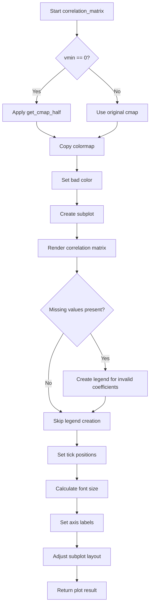

## Examples:
```python
# Basic usage with default settings
config = Settings()
correlation_df = df.corr()
result = correlation_matrix(config, correlation_df)

# Usage with custom minimum value
result = correlation_matrix(config, correlation_df, vmin=0)
```

## `src.ydata_profiling.visualisation.plot.scatter_complex` · *function*

## Summary:
Creates a scatter plot visualization for complex number data showing real versus imaginary components.

## Description:
Generates a scatter plot where the x-axis represents the real component and y-axis represents the imaginary component of complex numbers. Uses hexagonal binning for large datasets (>1000 points) and standard scatter plots for smaller datasets to optimize rendering performance.

## Args:
    config (Settings): Configuration object containing visualization settings including plot thresholds and styling options
    series (pd.Series): Pandas Series containing complex numbers to visualize

## Returns:
    str: Path or base64 encoded string representation of the generated plot image

## Raises:
    None explicitly raised by this function

## Constraints:
    Preconditions:
    - The input series must contain complex numbers
    - Config must be properly initialized with valid plot settings
    - The scatter_threshold in config must be a positive integer
    
    Postconditions:
    - A matplotlib figure is created and closed
    - The returned string represents a valid image resource

## Side Effects:
    - Creates matplotlib figure and axes
    - May generate temporary files if html.inline is False
    - Closes matplotlib figure after saving
    - Modifies global matplotlib state through pyplot calls

## Control Flow:
```mermaid
flowchart TD
    A[Start scatter_complex] --> B{len(series) > threshold?}
    B -- Yes --> C[Create light palette]
    C --> D[plt.hexbin(real, imag, cmap)]
    D --> E[Return plot_360_n0sc0pe(config)]
    B -- No --> F[plt.scatter(real, imag, color)]
    F --> E
    E --> G[End]
```

## Examples:
```python
# Basic usage with complex data
import pandas as pd
from ydata_profiling.config import Settings

# Create sample complex data
complex_series = pd.Series([1+2j, 3+4j, 5+6j])

# Configure settings
config = Settings()

# Generate scatter plot
plot_result = scatter_complex(config, complex_series)
```

## `src.ydata_profiling.visualisation.plot.scatter_series` · *function*

## Summary:
Creates a scatter plot or hexbin plot for a series of coordinate pairs, automatically choosing visualization method based on data size.

## Description:
This function generates a two-dimensional scatter plot or hexagonal binning plot for a pandas Series containing coordinate pairs (x,y). It automatically selects between a standard scatter plot and a hexbin plot depending on the number of data points relative to the configured scatter_threshold setting in the configuration. The function is designed to handle large datasets efficiently by switching to hexbin visualization when data exceeds the threshold.

## Args:
    config (Settings): Configuration object containing plotting settings including scatter_threshold and primary colors
    series (pd.Series): A pandas Series containing coordinate pairs (x,y) as tuples or lists
    x_label (str, optional): Label for the x-axis. Defaults to "Width".
    y_label (str, optional): Label for the y-axis. Defaults to "Height".

## Returns:
    str: The result of plot_360_n0sc0pe(config), which returns either a base64-encoded image string (when config.html.inline is True) or a file path (when config.html.inline is False) depending on the HTML configuration settings.

## Raises:
    None explicitly raised by this function, though underlying matplotlib/seaborn operations may raise exceptions.

## Constraints:
    Preconditions:
    - The series parameter must contain elements that can be unpacked as coordinate pairs (x,y)
    - The config parameter must be a valid Settings object with proper configuration
    - The plot.scatter_threshold configuration must be properly set (defaults to 1000)
    
    Postconditions:
    - A matplotlib figure is created and configured with appropriate labels
    - Either a scatter plot or hexbin plot is rendered based on data size
    - The matplotlib context is properly managed and cleaned up through the context manager

## Side Effects:
    - Creates and modifies matplotlib figures and axes
    - Temporarily modifies matplotlib configuration through context management
    - May generate temporary files or base64 encoded strings depending on HTML configuration
    - Uses seaborn for color palette generation

## Control Flow:
```mermaid
flowchart TD
    A[Start scatter_series] --> B{len(series) > scatter_threshold?}
    B -- Yes --> C[Create hexbin plot with light_palette color]
    B -- No --> D[Create scatter plot with primary color]
    C --> E[Return plot_360_n0sc0pe result]
    D --> E
```

## Examples:
```python
# Basic usage with default labels
config = Settings()
series = pd.Series([(1, 2), (3, 4), (5, 6)])
result = scatter_series(config, series)

# Usage with custom labels
result = scatter_series(config, series, x_label="X Coordinate", y_label="Y Coordinate")

# With large dataset that triggers hexbin visualization
large_series = pd.Series([(i, i*2) for i in range(1500)])
result = scatter_series(config, large_series)
```

## `src.ydata_profiling.visualisation.plot.scatter_pairwise` · *function*

## Summary
Creates a pairwise scatter plot between two numerical series, automatically choosing between hexbin and scatter visualization based on data size thresholds.

## Description
This function generates a scatter plot visualization for analyzing the relationship between two numerical variables. It intelligently selects between hexagonal binning and standard scatter plots depending on the number of data points, using a configurable threshold (config.plot.scatter_threshold). The function handles missing data by filtering out NaN values and applies styling based on the configuration settings.

## Args
- config (Settings): Configuration object containing plotting parameters including scatter_threshold and primary colors
- series1 (pd.Series): First numerical data series to plot on x-axis
- series2 (pd.Series): Second numerical data series to plot on y-axis  
- x_label (str): Label for the x-axis
- y_label (str): Label for the y-axis

## Returns
- str: Path or base64 encoded string representing the saved plot image, determined by the HTML configuration settings. When config.html.inline is True, returns base64 encoded image data; when False, returns file path string.

## Raises
- ValueError: When the image format specified in config is not supported (only "png" or "svg" are accepted)

## Constraints
- Preconditions: Both series must be pandas Series with numerical data; config must contain valid plot configuration with scatter_threshold attribute
- Postconditions: A matplotlib figure is created and saved according to configuration settings

## Side Effects
- Creates matplotlib figures and potentially saves files to disk when html.inline is False
- Modifies global matplotlib state through plt.xlabel() and plt.ylabel() calls
- May close matplotlib figures when using plot_360_n0sc0pe

## Control Flow
```mermaid
flowchart TD
    A[Start scatter_pairwise] --> B{len(series1) > scatter_threshold?}
    B -- Yes --> C[Create light palette colormap]
    B -- No --> D[Use primary color directly]
    C --> E[Create hexbin plot with gridsize=15]
    D --> F[Create scatter plot]
    E --> G[Return plot_360_n0sc0pe result]
    F --> G
```

## Examples
```python
# Basic usage with two numerical series
config = Settings()
series1 = pd.Series([1, 2, 3, 4, 5])
series2 = pd.Series([2, 4, 6, 8, 10])
result = scatter_pairwise(config, series1, series2, "X Variable", "Y Variable")
# Returns either a file path or base64 encoded string depending on config.html.inline setting
```

## `src.ydata_profiling.visualisation.plot._plot_stacked_barh` · *function*

## Summary:
Creates a horizontal stacked bar chart visualization with percentage labels and customizable legend options.

## Description:
Generates a horizontal stacked bar chart from categorical data, displaying percentage values and counts on bars when they exceed 8% of the total. This function is designed for creating compact, informative visualizations of categorical distributions in profiling reports.

## Args:
    data (pandas.Series): Categorical data series containing values to visualize, where index represents categories and values represent counts/frequencies.
    colors (List): List of color values corresponding to each category in the data series.
    hide_legend (bool): Flag to control whether the legend should be displayed. Defaults to False.

## Returns:
    Tuple[matplotlib.axes.Axes, matplotlib.legend.Legend]: A tuple containing the matplotlib axes object and legend object (or None if legend is hidden).

## Raises:
    None explicitly raised in the function body.

## Constraints:
    Preconditions:
    - data must be a pandas Series with numeric values
    - colors list must have the same length as the data series
    - data values should be non-negative numbers
    
    Postconditions:
    - Returns a matplotlib axes object with properly configured horizontal stacked bars
    - Legend is returned only when hide_legend=False and data contains categories

## Side Effects:
    - Creates a matplotlib figure with fixed size (7, 2)
    - Modifies matplotlib axes state by turning off axis display
    - May add text labels to bars using bar_label functionality (available in newer matplotlib versions)
    - Sets axis limits based on data sum

## Control Flow:
```mermaid
flowchart TD
    A[Start _plot_stacked_barh] --> B[Convert data index to string labels]
    B --> C[Create matplotlib figure with figsize=(7,2)]
    C --> D[Turn off axis display using ax.axis("off")]
    D --> E[Set x-axis limits to sum of data values]
    E --> F[Set y-axis limits to (0.4, 1.6)]
    F --> G[Initialize starts=0]
    G --> H[Iterate through data, labels, colors using zip()]
    H --> I[Draw horizontal bar at y=1 with specified width, height, and left position]
    I --> J[Get face color of drawn rectangle]
    J --> K{Color brightness < 0.5?}
    K -->|Yes| L[Set text_color=white]
    K -->|No| M[Set text_color=darkgrey]
    L --> N[Calculate percentage of total (x / data.sum() * 100)]
    M --> N
    N --> O{Percentage > 8 AND bar_label method exists on ax?}
    O -->|Yes| P[Add percentage/count label to bar using bar_label]
    O -->|No| Q[Skip label addition]
    P --> R[Update starts position by adding current x value]
    Q --> R
    R --> S[Check if legend should be shown]
    S --> T{hide_legend=False?}
    T -->|Yes| U[Create legend with ncol=1, bbox_to_anchor=(0, 0), fontsize="xx-large", loc="upper left"]
    T -->|No| V[Set legend=None]
    U --> W[Return (ax, legend) tuple]
    V --> W
```

## Examples:
```python
import pandas as pd
import matplotlib.pyplot as plt

# Basic usage
data = pd.Series([30, 20, 50], index=['Category A', 'Category B', 'Category C'])
colors = ['#FF6B6B', '#4ECDC4', '#45B7D1']
ax, legend = _plot_stacked_barh(data, colors)

# Usage with hidden legend
ax, legend = _plot_stacked_barh(data, colors, hide_legend=True)
```

## `src.ydata_profiling.visualisation.plot._plot_pie_chart` · *function*

## Summary:
Creates a pie chart visualization with custom percentage labels showing both percentage values and raw counts.

## Description:
Generates a matplotlib pie chart from categorical data with customized formatting that displays both percentage and absolute count values for each slice. The function allows optional legend hiding and accepts custom color schemes for visual customization.

## Args:
    data (pd.Series): Categorical data represented as a pandas Series where index values are labels and values are numeric quantities for pie slice sizes.
    colors (List): List of color specifications to be used for pie slice coloring.
    hide_legend (bool): Flag indicating whether to display the legend. Defaults to False.

## Returns:
    Tuple[plt.Axes, matplotlib.legend.Legend]: A tuple containing the matplotlib Axes object and the Legend object (or None if legend is hidden).

## Raises:
    None explicitly raised in the function body.

## Constraints:
    Preconditions:
    - data must be a pandas Series with numeric values
    - colors must be a list with sufficient elements to match the number of data points
    - data index values should be suitable for use as legend labels
    
    Postconditions:
    - A matplotlib figure with a pie chart is created
    - The returned axes object contains the pie chart visualization
    - The legend object (if created) contains proper label mappings

## Side Effects:
    - Creates a matplotlib figure with size (4, 4)
    - Modifies the current matplotlib figure state
    - May modify global matplotlib state when creating legends

## Control Flow:
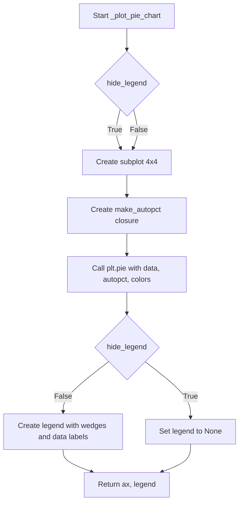

## Examples:
```python
import pandas as pd
import matplotlib.pyplot as plt

# Basic usage
data = pd.Series([30, 25, 45], index=['A', 'B', 'C'])
colors = ['#FF6B6B', '#4ECDC4', '#45B7D1']
ax, legend = _plot_pie_chart(data, colors)

# Usage with hidden legend
ax, legend = _plot_pie_chart(data, colors, hide_legend=True)
```

## `src.ydata_profiling.visualisation.plot.cat_frequency_plot` · *function*

## Summary:
Generates a categorical frequency plot (either bar chart or pie chart) for a given dataset with configurable styling and color schemes.

## Description:
Creates visual representations of categorical data frequencies using either stacked bar charts or pie charts based on configuration settings. This function serves as a centralized interface for categorical frequency visualization, handling color management, plot type selection, and proper rendering of matplotlib figures.

The function extracts the plotting logic into its own component to separate concerns between configuration handling, data processing, and visualization generation. This allows for easier testing, maintenance, and reuse of the plotting functionality while keeping the main visualization pipeline clean.

## Args:
    config (Settings): Configuration object containing plot settings including color schemes and plot type preferences
    data (pd.Series): Categorical data series containing frequency counts for each category

## Returns:
    str: A string representation of the rendered plot, typically either a base64-encoded image or file path depending on HTML configuration settings

## Raises:
    ValueError: When an invalid plot type is specified (not 'bar' or 'pie')

## Constraints:
    Preconditions:
        - config.plot.cat_freq.type must be either 'bar' or 'pie'
        - data must be a pandas Series with categorical index values
        - config.plot.cat_freq.colors, if provided, must be a list of valid color specifications
    
    Postconditions:
        - Returns a valid string representation of the plot
        - The returned plot maintains proper aspect ratios and legend positioning
        - Color handling ensures sufficient colors for all data categories

## Side Effects:
    - Creates and manipulates matplotlib figures and axes
    - May modify global matplotlib configuration temporarily through context management
    - Generates and saves plot files when HTML assets are configured (when config.html.inline is False)
    - Closes matplotlib figures after rendering to prevent memory leaks

## Control Flow:
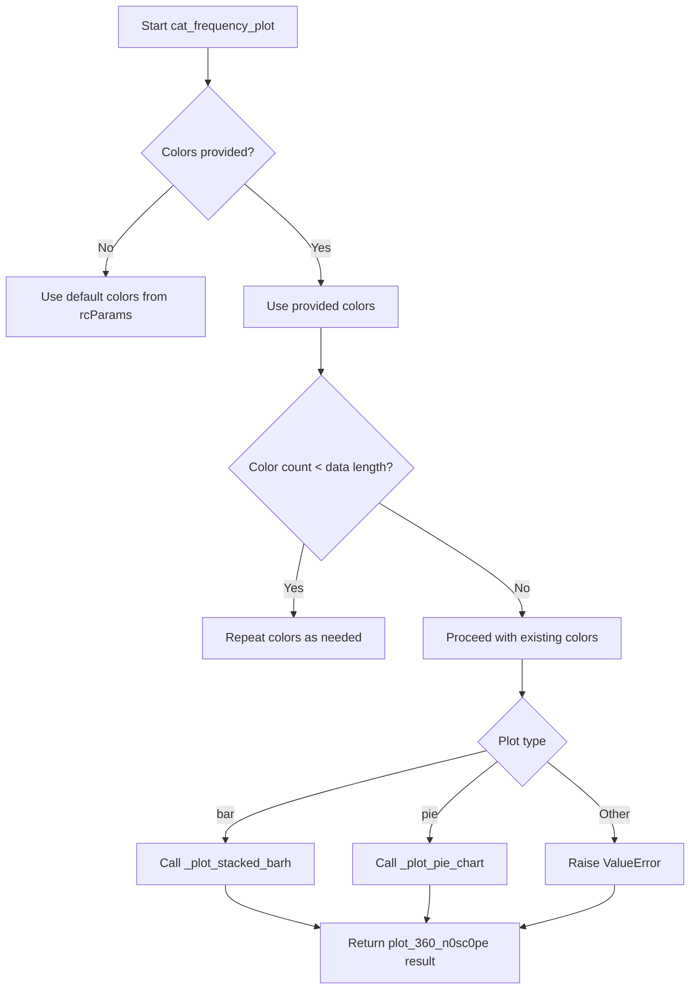

## Examples:
```python
# Basic usage with default settings
config = Settings()
data = pd.Series([10, 20, 30], index=['A', 'B', 'C'])
plot_string = cat_frequency_plot(config, data)

# Using pie chart configuration
config.plot.cat_freq.type = 'pie'
plot_string = cat_frequency_plot(config, data)
```

## `src.ydata_profiling.visualisation.plot.create_comparison_color_list` · *function*

## Summary:
Generates a list of color codes suitable for visualizing comparison data by creating interpolated colors when the available primary colors are insufficient for the required number of labels.

## Description:
This function ensures that there are enough distinct colors to represent all labels in a visualization. When the number of primary colors defined in the configuration is less than the number of labels, it generates a continuous color gradient between the first two primary colors to produce the required number of colors. If there are already sufficient colors, it returns the primary colors as-is.

## Args:
    config (Settings): Configuration object containing HTML styling settings with primary_colors and label definitions

## Returns:
    List[str]: A list of hexadecimal color codes, where each color is represented as a string starting with '#'. The list will contain exactly as many colors as there are labels.

## Raises:
    None explicitly raised

## Constraints:
    Preconditions:
    - The config parameter must be a valid Settings object
    - The config.html.style.primary_colors must be a list of valid hex color strings
    - The config.html.style._labels must be a list of strings
    
    Postconditions:
    - The returned list will contain exactly as many color strings as there are labels
    - All returned color strings will be valid hexadecimal color codes

## Side Effects:
    None

## Control Flow:
```mermaid
flowchart TD
    A[Start create_comparison_color_list] --> B{len(primary_colors) < len(_labels)?}
    B -- Yes --> C[Get first color]
    C --> D[Get second color or default #000000]
    D --> E[Create LinearSegmentedColormap]
    E --> F[Generate colors using rgb2hex]
    F --> G[Return generated colors]
    B -- No --> H[Return primary_colors]
    H --> G
```

## Examples:
```python
# Basic usage with sufficient colors
config = Settings()
config.html.style.primary_colors = ["#FF0000", "#00FF00", "#0000FF"]
config.html.style._labels = ["A", "B", "C"]
colors = create_comparison_color_list(config)
# Returns: ["#FF0000", "#00FF00", "#0000FF"]

# Usage with insufficient colors - creates interpolated colors
config = Settings()
config.html.style.primary_colors = ["#FF0000"]  # Only 1 color
config.html.style._labels = ["A", "B", "C", "D"]  # 4 labels
colors = create_comparison_color_list(config)
# Returns: interpolated colors between red and black for 4 labels

# Usage with exactly matching colors
config = Settings()
config.html.style.primary_colors = ["#FF0000", "#00FF00"]
config.html.style._labels = ["A", "B"]
colors = create_comparison_color_list(config)
# Returns: ["#FF0000", "#00FF00"]
```

## `src.ydata_profiling.visualisation.plot._format_ts_date_axis` · *function*

## Summary:
Formats the x-axis of a matplotlib plot for time series data with appropriate date tick locators and formatters.

## Description:
This utility function automatically configures the x-axis of a matplotlib axis object to properly display datetime data when the input series has a DatetimeIndex. It applies an AutoDateLocator for optimal tick placement and a ConciseDateFormatter for clean date formatting. This function is extracted to provide consistent time series axis formatting across different visualization components.

## Args:
    series (pd.Series): A pandas Series whose index contains datetime data that needs formatted x-axis display
    axis (matplotlib.axis.Axis): The matplotlib axis object to be formatted

## Returns:
    matplotlib.axis.Axis: The same axis object that was passed in, now configured with appropriate date formatting

## Raises:
    None explicitly raised by this function

## Constraints:
    Preconditions:
    - The series parameter must be a pandas Series
    - The axis parameter must be a valid matplotlib axis object
    - The series.index must be compatible with pandas DatetimeIndex type checking
    
    Postconditions:
    - If series.index is a DatetimeIndex, the axis will have date formatting applied
    - If series.index is not a DatetimeIndex, the axis remains unchanged
    - The returned axis object is identical to the input axis object

## Side Effects:
    None

## Control Flow:
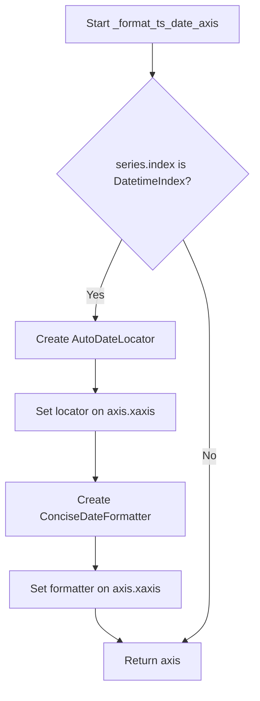

## Examples:
```python
import pandas as pd
import matplotlib.pyplot as plt
from src.ydata_profiling.visualisation.plot import _format_ts_date_axis

# Create sample time series data
dates = pd.date_range('2023-01-01', periods=100, freq='D')
series = pd.Series(range(100), index=dates)

# Create plot and format axis
fig, ax = plt.subplots()
ax.plot(series.index, series.values)
_formatted_axis = _format_ts_date_axis(series, ax)
```

## `src.ydata_profiling.visualisation.plot.plot_timeseries_gap_analysis` · *function*

## Summary:
Creates a time series visualization with highlighted data gaps for profiling and analysis.

## Description:
Generates a matplotlib figure displaying time series data with visual indicators for missing data periods (gaps). This function is used in automated data profiling to visualize temporal data patterns and identify missing value intervals. The function supports both single and multiple time series visualization with appropriate color coding and gap highlighting.

## Args:
    config (Settings): Configuration object containing styling preferences for the visualization
    series (Union[pd.Series, List[pd.Series]]): Single time series or list of time series to plot
    gaps (Union[pd.Series, List[pd.Series]]): Gap information corresponding to the time series, indicating missing data periods
    figsize (tuple): Figure dimensions as (width, height) in inches. Defaults to (6, 3)

## Returns:
    matplotlib.figure.Figure: The generated matplotlib figure object containing the time series visualization

## Raises:
    None explicitly raised in the function body

## Constraints:
    Preconditions:
    - Config object must contain valid HTML styling configuration with primary colors and labels
    - Series data must be pandas Series with datetime index for proper date formatting
    - Gap data must correspond to the series data in terms of structure and timing
    
    Postconditions:
    - Returns a properly formatted matplotlib figure with time series data
    - Time series axes are appropriately labeled and formatted for datetime data
    - Gaps are visually highlighted with semi-transparent fills

## Side Effects:
    - Creates and modifies matplotlib figure and axes objects
    - May modify global matplotlib state through the plotting operations
    - Calls the plot_360_n0sc0pe utility which handles figure saving and formatting

## Control Flow:
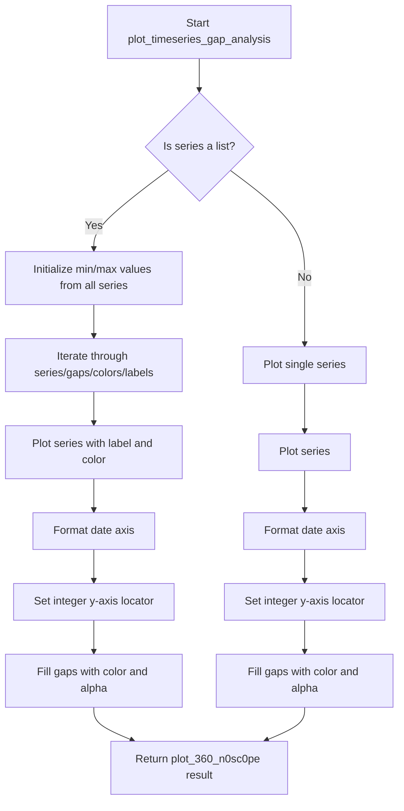

## Examples:
```python
# Single time series with gaps
config = Settings()
series = pd.Series([1, 2, 3, 4, 5], index=pd.date_range('2020-01-01', periods=5))
gaps = [pd.Timestamp('2020-01-03'), pd.Timestamp('2020-01-04')]
fig = plot_timeseries_gap_analysis(config, series, gaps)

# Multiple time series with gaps
config = Settings()
series_list = [
    pd.Series([1, 2, 3, 4, 5], index=pd.date_range('2020-01-01', periods=5)),
    pd.Series([2, 3, 4, 5, 6], index=pd.date_range('2020-01-01', periods=5))
]
gaps_list = [
    [pd.Timestamp('2020-01-03')],
    [pd.Timestamp('2020-01-04')]
]
fig = plot_timeseries_gap_analysis(config, series_list, gaps_list)
```

## `src.ydata_profiling.visualisation.plot.plot_overview_timeseries` · *function*

## Summary:
Creates a matplotlib figure displaying time series data with optional scaling and multi-series visualization.

## Description:
Generates a time series visualization from a collection of time series variables, supporting both single and multiple time series with different styling options. The function handles different data structures for time series variables and provides optional normalization of values.

## Args:
    config (Settings): Configuration object containing display and styling settings
    variables (Any): Dictionary containing time series data with keys as column names and values containing metadata including 'type' and 'series'
    figsize (tuple, optional): Figure size as (width, height) in inches. Defaults to (6, 4)
    scale (bool, optional): Whether to normalize time series data to [0,1] range. Defaults to False

## Returns:
    matplotlib.figure.Figure: The matplotlib figure object containing the time series plot

## Raises:
    None explicitly raised in the function body

## Constraints:
    Preconditions:
    - Variables dictionary must contain valid time series data with 'type' and 'series' keys
    - Time series data must be pandas Series objects
    - Config object must be properly initialized with required settings
    
    Postconditions:
    - A matplotlib figure is created and returned
    - The figure contains properly formatted time series plots
    - Legend and subplot adjustments are applied

## Side Effects:
    - Creates a matplotlib figure and subplot
    - Modifies the current matplotlib figure state through plt.legend() and plt.subplots_adjust()
    - May save the figure to disk or encode it as base64 string depending on config.html.inline setting (via plot_360_n0sc0pe)

## Control Flow:
```mermaid
flowchart TD
    A[Start plot_overview_timeseries] --> B{variables[col]["type"] is list?}
    B -- Yes --> C[Create color list and line styles]
    B -- No --> D[Process single time series]
    C --> E{All data types are TimeSeries?}
    E -- Yes --> F[Iterate through series with different styles]
    E -- No --> G[Skip non-TimeSeries data]
    F --> H[Apply scaling if requested]
    H --> I[Plot series with styling]
    D --> J[Check if type is TimeSeries]
    J -- Yes --> K[Apply scaling if requested]
    K --> L[Plot series]
    J -- No --> M[Skip non-TimeSeries data]
    I --> N[Add legend and adjust subplots]
    L --> N
    G --> N
    M --> N
    N --> O[Return plot_360_n0sc0pe(config)]
```

## Examples:
    # Basic usage with single time series
    fig = plot_overview_timeseries(config, variables_dict)
    
    # With scaling enabled
    fig = plot_overview_timeseries(config, variables_dict, scale=True)
    
    # With custom figure size
    fig = plot_overview_timeseries(config, variables_dict, figsize=(10, 6))

## `src.ydata_profiling.visualisation.plot._plot_timeseries` · *function*

## Summary:
Creates a matplotlib figure with a time series plot for one or multiple pandas Series with appropriate date formatting.

## Description:
This private function generates a time series visualization for either a single pandas Series or a list of pandas Series. It handles the creation of the matplotlib figure and subplot, applies appropriate styling including colors and labels, and formats the x-axis for datetime data. The function is designed to be used internally by the profiling library for visualizing time series data in reports.

## Args:
    config (Settings): Configuration object containing style settings including color schemes and labels
    series (Union[list, pd.Series]): Either a single pandas Series or a list of pandas Series to plot
    figsize (tuple, optional): Figure size as (width, height) in inches. Defaults to (6, 4)

## Returns:
    matplotlib.figure.Figure: The matplotlib figure object containing the time series plot

## Raises:
    None explicitly raised in the function body

## Constraints:
    Preconditions:
    - config must be a valid Settings object with html.style attributes
    - series must be either a pandas Series or a list of pandas Series
    - If series is a list, all elements must be pandas Series objects
    
    Postconditions:
    - A matplotlib figure is created with proper dimensions
    - The figure contains a single subplot with time series data
    - Date formatting is applied to the x-axis when applicable

## Side Effects:
    - Creates a matplotlib figure which may affect the current figure state
    - May modify matplotlib's global state through figure and axis operations
    - No external I/O operations or state mutations beyond matplotlib figure creation

## Control Flow:
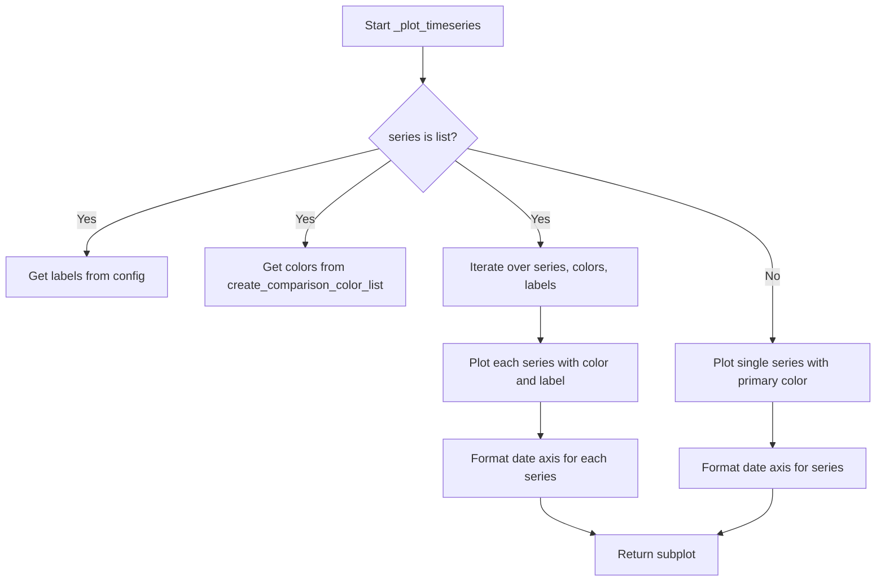

## Examples:
```python
# Single time series plot
import pandas as pd
from ydata_profiling.config import Settings
config = Settings()
series = pd.Series([1, 2, 3, 4], index=pd.date_range('2020-01-01', periods=4))
fig = _plot_timeseries(config, series)

# Multiple time series plot
series_list = [
    pd.Series([1, 2, 3, 4], index=pd.date_range('2020-01-01', periods=4)),
    pd.Series([4, 3, 2, 1], index=pd.date_range('2020-01-01', periods=4))
]
fig = _plot_timeseries(config, series_list)
```

## `src.ydata_profiling.visualisation.plot.mini_ts_plot` · *function*

## Summary:
Creates a formatted mini time series plot with customized axis formatting and returns it as a string representation.

## Description:
This function generates a compact time series visualization with specific formatting adjustments for better display in profiling reports. It leverages the internal `_plot_timeseries` function to create the base plot and applies additional styling modifications before returning the final plot representation through `plot_360_n0sc0pe`.

The function is designed to produce small, optimized time series plots suitable for inclusion in HTML reports where space efficiency and visual clarity are important considerations.

## Args:
    config (Settings): Configuration object containing HTML and plotting settings
    series (Union[list, pd.Series]): Time series data to plot, either as a list or pandas Series
    figsize (Tuple[float, float], optional): Figure size as (width, height) in inches. Defaults to (3, 2.25)

## Returns:
    str: String representation of the plotted figure, typically a base64 encoded image or file path depending on configuration

## Raises:
    None explicitly raised by this function, though underlying functions may raise exceptions

## Constraints:
    Preconditions:
    - config must be a valid Settings object with appropriate HTML and plotting configurations
    - series must be either a list or pandas Series with valid time series data
    - figsize must contain two positive float values
    
    Postconditions:
    - Returns a properly formatted string representation of the plot
    - Plot figure is properly closed after processing to prevent memory leaks

## Side Effects:
    - Modifies matplotlib global state through rcParams and tick formatting
    - Calls matplotlib.pyplot functions that may affect global plot state
    - May save files to disk if config.html.inline is False
    - Closes matplotlib figures to prevent memory leaks

## Control Flow:
```mermaid
flowchart TD
    A[mini_ts_plot called] --> B[_plot_timeseries creates base plot]
    B --> C[Set x-axis tick rotation to 45 degrees]
    C --> D[Set y-tick label size to 3]
    D --> E[Iterate through x-axis ticks]
    E --> F{series.index is DatetimeIndex?}
    F -->|Yes| G[Set x-tick label font size to 6]
    F -->|No| H[Set x-tick label font size to 8]
    G --> I[Apply tight layout]
    H --> I
    I --> J[Return plot_360_n0sc0pe result]
```

## Examples:
```python
# Basic usage with pandas Series
import pandas as pd
from ydata_profiling.config import Settings

config = Settings()
series = pd.Series([1, 2, 3, 4, 5], index=pd.date_range('2020-01-01', periods=5))
result = mini_ts_plot(config, series)

# Usage with custom figsize
result = mini_ts_plot(config, series, figsize=(4, 3))
```

## `src.ydata_profiling.visualisation.plot._get_ts_lag` · *function*

## Summary:
Calculates the appropriate lag value for time series autocorrelation plots based on configuration and series length constraints.

## Description:
This function determines the optimal lag value to use for plotting partial autocorrelation (PACF) and autocorrelation (ACF) functions in time series analysis. It ensures that the requested lag from configuration does not exceed the maximum allowable lag based on the available data points in the series.

## Args:
    config (Settings): Configuration object containing time series settings, specifically the `pacf_acf_lag` parameter
    series (pd.Series): Time series data used to calculate the maximum allowable lag based on series length

## Returns:
    int: The lag value to use for time series autocorrelation plots, which is the minimum of the configured lag and the maximum allowable lag based on series length

## Raises:
    None explicitly raised

## Constraints:
    Preconditions:
    - The `config` parameter must be a valid Settings object with proper time series configuration
    - The `series` parameter must be a valid pandas Series object
    - The series should contain sufficient data points for meaningful autocorrelation analysis
    
    Postconditions:
    - The returned lag value will always be a positive integer
    - The returned lag value will never exceed half the series length minus 1
    - The returned lag value will never exceed the configured `pacf_acf_lag` value

## Side Effects:
    None

## Control Flow:
```mermaid
flowchart TD
    A[Start _get_ts_lag] --> B[Get config lag value]
    B --> C[Calculate max_lag_size = (len(series) // 2) - 1]
    C --> D[Return min(config_lag, max_lag_size)]
```

## Examples:
    # Example 1: Normal case with sufficient data
    config = Settings()
    config.vars.timeseries.pacf_acf_lag = 20
    series = pd.Series(range(100))
    lag = _get_ts_lag(config, series)  # Returns 20 (config lag)
    
    # Example 2: Limited data case
    config = Settings()
    config.vars.timeseries.pacf_acf_lag = 50
    series = pd.Series(range(20))  # Only 20 data points
    lag = _get_ts_lag(config, series)  # Returns 9 (max allowable lag)
```

## `src.ydata_profiling.visualisation.plot._plot_acf_pacf` · *function*

## Summary:
Creates and returns ACF and PACF plots for time series data visualization.

## Description:
Generates autocorrelation function (ACF) and partial autocorrelation function (PACF) plots for time series analysis. This function is designed to visualize the correlation structure of time series data to help identify appropriate model parameters for ARIMA models.

## Args:
    config (Settings): Configuration object containing HTML styling and plotting settings
    series (pd.Series): Time series data to analyze and plot
    figsize (tuple, optional): Figure size as (width, height) in inches. Defaults to (15, 5)

## Returns:
    str: Path or base64 encoded string representing the generated plot image, depending on configuration settings

## Raises:
    None explicitly raised in this function

## Constraints:
    Preconditions:
    - The series parameter must be a valid pandas Series object
    - Config must contain properly initialized HTML styling settings
    - The series should contain sufficient data points for meaningful ACF/PACF calculation
    
    Postconditions:
    - Two subplots (ACF and PACF) are created and displayed
    - The returned string represents a valid image file or base64 representation
    - Matplotlib figures are properly closed after processing

## Side Effects:
    - Creates matplotlib figures and subplots
    - Modifies matplotlib axis collections to set face colors
    - May save files to disk or return base64 encoded strings depending on config.html.inline setting
    - Closes matplotlib figures after processing

## Control Flow:
```mermaid
flowchart TD
    A[Start _plot_acf_pacf] --> B[Get primary color from config]
    B --> C[Calculate optimal lag using _get_ts_lag]
    C --> D[Create 1x2 subplot grid]
    D --> E[Plot ACF on left subplot]
    E --> F[Plot PACF on right subplot]
    F --> G[Set face colors for polygon collections]
    G --> H[Return plot result from plot_360_n0sc0pe]
```

## Examples:
```python
# Basic usage with default figure size
config = Settings()
series = pd.Series([1, 2, 3, 4, 5, 6, 7, 8, 9, 10])
result = _plot_acf_pacf(config, series)

# Usage with custom figure size
result = _plot_acf_pacf(config, series, figsize=(20, 8))
```

## `src.ydata_profiling.visualisation.plot._plot_acf_pacf_comparison` · *function*

## Summary:
Creates side-by-side ACF and PACF plots for multiple time series to analyze autocorrelation patterns.

## Description:
Generates comparative ACF and PACF plots for time series data to help identify autocorrelation and partial autocorrelation patterns. This function is used in time series analysis to understand the temporal dependencies in data. It creates a grid of plots where each row contains an ACF plot and PACF plot for a different time series or data group.

## Args:
    config (Settings): Configuration object containing styling and plotting parameters
    series (List[pd.Series]): List of pandas Series objects representing time series data
    figsize (tuple, optional): Figure size as (width, height) in inches. Defaults to (15, 5)

## Returns:
    str: Path or encoded string representation of the generated plot image

## Raises:
    None explicitly raised in this function

## Constraints:
    Preconditions:
    - config must contain valid html.style configuration with primary_colors and _labels
    - series must be a non-empty list of pandas Series objects
    - Each series should contain numeric time series data
    
    Postconditions:
    - Returns a valid string identifier for the generated plot
    - All matplotlib figures are properly closed to prevent memory leaks

## Side Effects:
    - Creates matplotlib figure and axes
    - Modifies matplotlib axis properties (face colors of polygon collections)
    - May save files to disk if config.html.inline is False
    - Closes matplotlib figures to prevent memory leaks

## Control Flow:
```mermaid
flowchart TD
    A[Start function] --> B[Get colors from config]
    B --> C[Create subplots with nrows=n_labels, ncols=2]
    C --> D[Initialize is_first flag]
    D --> E{For each series}
    E --> F[Calculate lag limit]
    F --> G[Plot ACF with title "ACF" if is_first]
    G --> H[Plot PACF with title "PACF" if is_first]
    H --> I[Set is_first=False]
    I --> J[Loop through axes to set polygon face colors]
    J --> K[Return plot_360_n0sc0pe result]
```

## Examples:
```python
# Basic usage with single time series
config = Settings()
series = [pd.Series([1, 2, 3, 4, 5])]
result = _plot_acf_pacf_comparison(config, series)

# Usage with multiple time series
config = Settings()
series = [
    pd.Series([1, 2, 3, 4, 5]),
    pd.Series([5, 4, 3, 2, 1])
]
result = _plot_acf_pacf_comparison(config, series, figsize=(12, 6))
```

## `src.ydata_profiling.visualisation.plot.plot_acf_pacf` · *function*

*No documentation generated.*

## `src.ydata_profiling.visualisation.plot._prepare_heatmap_data` · *function*

## Summary:
Prepares and transforms DataFrame data into a pivoted format suitable for heatmap visualization, with optional sorting and entity filtering.

## Description:
This private utility function processes raw tabular data to create an appropriate data structure for heatmap plotting. It handles various data types, applies binning strategies, and organizes data into a pivot table format where rows represent entities and columns represent time bins or sorted categories. The function supports flexible sorting options and allows limiting or selecting specific entities for display.

## Args:
    dataframe (pd.DataFrame): Input DataFrame containing the data to process
    entity_column (str): Name of the column containing entity identifiers (rows in final heatmap)
    sortby (Optional[Union[str, list]], optional): Column(s) to sort by. If None, sorts by index. Defaults to None.
    max_entities (int, optional): Maximum number of entities to include when no specific entities are selected. Defaults to 5.
    selected_entities (Optional[List[str]], optional): Specific entities to include in the result. If provided, overrides max_entities. Defaults to None.

## Returns:
    pd.DataFrame: Transformed DataFrame ready for heatmap visualization with entities as rows and bins/categories as columns

## Raises:
    ValueError: When a column specified in sortby has object dtype that cannot be converted to datetime

## Constraints:
    Preconditions:
        - dataframe must be a valid pandas DataFrame
        - entity_column must exist in dataframe
        - sortby column(s) must exist in dataframe if specified
    Postconditions:
        - Returned DataFrame has entities as row index
        - Returned DataFrame has bins/categories as column headers
        - All returned values are counts or frequencies

## Side Effects:
    None

## Control Flow:
```mermaid
flowchart TD
    A[Start] --> B{sortby is None?}
    B -- Yes --> C[Create sortbykey="_index"]
    B -- No --> D[Convert sortby to list if string]
    C --> E[Copy entity_column data with reset index]
    D --> F[Copy specified columns]
    E --> G[Set column names]
    F --> G
    G --> H{sortbykey dtype == "O"?}
    H -- Yes --> I[Try to convert to datetime]
    I --> J{Conversion successful?}
    J -- No --> K[Raise ValueError]
    J -- Yes --> L[Calculate nbins]
    H -- No --> L
    L --> M[Create bins with pd.cut]
    M --> N[Group by entity_column and bins]
    N --> O[Count occurrences]
    O --> P[Reset index and pivot]
    P --> Q{selected_entities provided?}
    Q -- Yes --> R[Filter by selected_entities]
    Q -- No --> S[Limit to max_entities]
    R --> T[Return result]
    S --> T
```

## Examples:
```python
# Basic usage with default parameters
result = _prepare_heatmap_data(df, "category")

# With custom sorting
result = _prepare_heatmap_data(df, "product", sortby="sales")

# With entity selection
result = _prepare_heatmap_data(df, "region", selected_entities=["North", "South"])

# With multiple sort columns
result = _prepare_heatmap_data(df, "item", sortby=["date", "category"])
```

## `src.ydata_profiling.visualisation.plot._create_timeseries_heatmap` · *function*

## Summary:
Creates a heatmap visualization for time series data using matplotlib's pcolormesh.

## Description:
Generates a heatmap representation of time series data where each cell's color intensity corresponds to its value. The function creates a matplotlib subplot with appropriate styling for time series visualization, including inverted Y-axis to show time progression from top to bottom.

## Args:
    df (pd.DataFrame): Time series data to visualize, where rows represent time periods and columns represent variables/features.
    figsize (Tuple[int, int]): Figure dimensions in inches as (width, height). Defaults to (12, 5).
    color (str): Hex color code for the heatmap colormap. Defaults to "#337ab7" (blue).

## Returns:
    plt.Axes: Matplotlib axes object containing the heatmap visualization.

## Raises:
    None explicitly raised in the function body.

## Constraints:
    Preconditions:
    - Input df must be a valid pandas DataFrame
    - Color parameter must be a valid hex color code
    - Figsize tuple must contain two positive integers
    
    Postconditions:
    - Returns a matplotlib axes object with properly formatted time series heatmap
    - Y-axis is inverted to show time progression from top to bottom
    - X-axis has no tick marks as it represents time progression
    - Y-axis tick labels correspond to DataFrame index values

## Side Effects:
    - Creates a new matplotlib figure and axes
    - Modifies the matplotlib axes object with various styling properties
    - May affect global matplotlib state if no context management is used

## Control Flow:
```mermaid
flowchart TD
    A[Start _create_timeseries_heatmap] --> B[Create matplotlib figure]
    B --> C[Generate colormap from white to specified color]
    C --> D[Create pcolormesh with DataFrame data]
    D --> E[Set color limits to max value in DataFrame]
    E --> F[Set Y-axis ticks at row centers]
    F --> G[Set Y-axis tick labels to DataFrame index]
    G --> H[Remove X-axis ticks]
    H --> I[Set X-axis label to "Time"]
    I --> J[Invert Y-axis for time progression]
    J --> K[Return axes object]
```

## Examples:
```python
import pandas as pd
import matplotlib.pyplot as plt

# Create sample time series data
dates = pd.date_range('2023-01-01', periods=10, freq='D')
data = pd.DataFrame({
    'feature1': [1, 2, 3, 4, 5, 6, 7, 8, 9, 10],
    'feature2': [10, 9, 8, 7, 6, 5, 4, 3, 2, 1]
}, index=dates)

# Create heatmap
ax = _create_timeseries_heatmap(data, figsize=(10, 4), color="#e74c3c")
plt.show()
```

## `src.ydata_profiling.visualisation.plot.timeseries_heatmap` · *function*

## Summary:
Creates a heatmap visualization for time series data grouped by entities.

## Description:
Generates a heatmap plot showing temporal patterns for multiple entities in a time series dataset. The function prepares time series data by grouping observations by entity and time periods, then visualizes the data using a heatmap representation where colors indicate values.

This function extracts the visualization logic into a separate component to enable reuse across different profiling contexts while maintaining clean separation between data preparation and visualization concerns.

## Args:
    dataframe (pd.DataFrame): Input DataFrame containing time series data with timestamp and entity columns
    entity_column (str): Name of the column identifying different entities in the time series
    sortby (Optional[Union[str, list]], optional): Column(s) to sort entities by. Defaults to None.
    max_entities (int, optional): Maximum number of entities to display in the heatmap. Defaults to 5.
    selected_entities (Optional[List[str]], optional): Specific entities to include in the heatmap. Defaults to None.
    figsize (Tuple[int, int], optional): Figure size as (width, height) in inches. Defaults to (12, 5).
    color (str, optional): Hex color code for the heatmap cells. Defaults to "#337ab7".

## Returns:
    plt.Axes: Matplotlib Axes object containing the heatmap visualization

## Raises:
    None explicitly raised in this function

## Constraints:
    Preconditions:
    - dataframe must be a valid pandas DataFrame
    - entity_column must exist in the dataframe
    - The dataframe should contain timestamp data for proper time series visualization
    
    Postconditions:
    - Returns a matplotlib Axes object with properly formatted heatmap
    - The returned axes has aspect ratio set to 1 for square cell representation

## Side Effects:
    - Creates a matplotlib figure and axes
    - May modify global matplotlib state through the plotting process
    - Uses matplotlib's pyplot module internally

## Control Flow:
```mermaid
flowchart TD
    A[Start timeseries_heatmap] --> B{Parameters validated}
    B --> C[_prepare_heatmap_data]
    C --> D{_create_timeseries_heatmap}
    D --> E[Set aspect ratio to 1]
    E --> F[Return Axes object]
```

## Examples:
```python
import pandas as pd
import matplotlib.pyplot as plt
from ydata_profiling.visualisation.plot import timeseries_heatmap

# Basic usage
df = pd.DataFrame({
    'timestamp': pd.date_range('2020-01-01', periods=100, freq='D'),
    'entity': ['A'] * 50 + ['B'] * 50,
    'value': range(100)
})

ax = timeseries_heatmap(df, entity_column='entity')
plt.show()

# With custom parameters
ax = timeseries_heatmap(
    df, 
    entity_column='entity',
    max_entities=3,
    figsize=(15, 8),
    color='#ff6b6b'
)
plt.show()
```

## `src.ydata_profiling.visualisation.plot._set_visibility` · *function*

## Summary:
Hides the spines and sets tick mark positions for a matplotlib axis to create clean, minimal visualizations.

## Description:
This function removes the visible borders (spines) from a matplotlib axis and configures the tick marks to appear in a specified position. It's commonly used to create clean, publication-ready plots by removing unnecessary axis borders and ticks.

## Args:
    axis (matplotlib.axis.Axis): The matplotlib axis object whose spines and tick positions will be modified.
    tick_mark (str, optional): Position for tick marks. Defaults to "none". Common values include "none", "top", "bottom", "left", "right".

## Returns:
    matplotlib.axis.Axis: The modified axis object with updated spine visibility and tick positions.

## Raises:
    None explicitly raised by this function.

## Constraints:
    Preconditions:
    - The axis parameter must be a valid matplotlib axis object
    - The tick_mark parameter must be a string that matplotlib accepts for tick positioning
    
    Postconditions:
    - All four spines (top, right, bottom, left) of the axis will be set to invisible
    - X and Y axis tick positions will be set according to the tick_mark parameter

## Side Effects:
    None

## Control Flow:
```mermaid
flowchart TD
    A[Start _set_visibility] --> B{axis.spines[anchor].set_visible(False) for each anchor}
    B --> C[axis.xaxis.set_ticks_position(tick_mark)]
    C --> D[axis.yaxis.set_ticks_position(tick_mark)]
    D --> E[Return modified axis]
```

## Examples:
```python
import matplotlib.pyplot as plt
import numpy as np

# Create sample data
x = np.linspace(0, 10, 100)
y = np.sin(x)

# Create plot
fig, ax = plt.subplots()
ax.plot(x, y)

# Apply visibility settings
ax = _set_visibility(ax, tick_mark="none")

# The resulting plot will have no border spines and no tick marks
plt.show()
```

## `src.ydata_profiling.visualisation.plot.missing_bar` · *function*

## Summary:
Creates a bar chart visualization showing the percentage of non-null values for each column in a dataset, with dual axes displaying both percentages and raw counts.

## Description:
This function generates a bar chart to visualize missing data patterns in a dataset. It displays the percentage of non-null values for each column on one axis and the actual count of non-null values on a secondary axis. The visualization adapts its orientation based on the number of columns to optimize readability.

## Args:
    notnull_counts (pd.Series): A pandas Series containing the count of non-null values for each column in the dataset.
    nrows (int): The total number of rows in the dataset, used to calculate percentages.
    figsize (Tuple[float, float], optional): Figure size for the plot. Defaults to (25, 10).
    fontsize (float, optional): Font size for axis labels and tick labels. Defaults to 16.
    labels (bool, optional): Whether to display y-axis labels. Defaults to True.
    color (Tuple[float, ...], optional): RGB color tuple for the bars. Defaults to (0.41, 0.41, 0.41).
    label_rotation (int, optional): Rotation angle for x-axis labels. Defaults to 45.

## Returns:
    matplotlib.axis.Axis: The primary matplotlib axis object containing the bar chart.

## Raises:
    None explicitly raised in the function body.

## Constraints:
    Preconditions:
    - notnull_counts must be a pandas Series with numeric values
    - nrows must be a positive integer
    - All values in notnull_counts must be less than or equal to nrows
    
    Postconditions:
    - Returns a matplotlib axis object with properly formatted dual-axis bar chart
    - The primary axis shows percentage values (0-100%)
    - The secondary axis shows absolute counts

## Side Effects:
    - Creates a matplotlib figure and axis objects
    - Modifies matplotlib axis properties including tick labels, spines, and visibility
    - May affect global matplotlib state through the plotting operations

## Control Flow:
```mermaid
flowchart TD
    A[Start missing_bar] --> B{Number of columns ≤ 50?}
    B -- Yes --> C[Create vertical bar chart]
    B -- No --> D[Create horizontal bar chart]
    C --> E[Set x-axis tick labels]
    D --> F[Set y-axis tick labels]
    E --> G[Create twin x-axis]
    F --> G
    G --> H[Set twin axis properties]
    H --> I[Apply _set_visibility to both axes]
    I --> J[Return primary axis]
```

## Examples:
```python
import pandas as pd
import matplotlib.pyplot as plt
from ydata_profiling.visualisation.plot import missing_bar

# Example usage
data = pd.DataFrame({
    'A': [1, 2, None, 4],
    'B': [None, None, None, 4],
    'C': [1, 2, 3, 4]
})

notnull_counts = data.count()
nrows = len(data)

# Create missing data bar chart
ax = missing_bar(notnull_counts, nrows, figsize=(15, 8), fontsize=14)
plt.show()
```

## `src.ydata_profiling.visualisation.plot.missing_matrix` · *function*

## Summary
Creates a matrix visualization showing missing data patterns across columns and rows.

## Description
Generates a heatmap-style visualization where each cell represents whether a data value is present (colored) or missing (white). This function is used to visualize the distribution and patterns of missing data in datasets, helping identify potential data quality issues or systematic missingness.

The function is typically called by `plot_missing_matrix` as part of the missing data visualization pipeline in the ydata-profiling library.

## Args
- notnull: Array-like of boolean values indicating which data points are not null (True) vs null (False)
- columns: List of column names to display on the x-axis
- height: Integer representing the number of rows in the visualization
- figsize: Tuple of floats specifying figure dimensions (width, height). Defaults to (25, 10)
- color: Tuple of RGB values (0-1 scale) for non-null data points. Defaults to (0.41, 0.41, 0.41)
- fontsize: Float specifying the font size for axis labels. Defaults to 16
- labels: Boolean indicating whether to display column labels. Defaults to True
- label_rotation: Integer specifying rotation angle for x-axis labels in degrees. Defaults to 45

## Returns
matplotlib.axis.Axis: The matplotlib axis object containing the visualization, with proper formatting and styling applied

## Raises
No explicit exceptions are raised by this function, though underlying matplotlib operations may raise exceptions if invalid parameters are provided.

## Constraints
Preconditions:
- `notnull` must be a boolean array with shape compatible with (height, len(columns))
- `columns` must be a list of strings with length matching the width dimension
- `height` must be a positive integer

Postconditions:
- Returns a properly formatted matplotlib axis object ready for display or further modification
- The returned axis has appropriate tick marks, labels, and visual styling

## Side Effects
- Creates a matplotlib figure and axis using `plt.subplots()`
- Modifies the matplotlib axis object by setting various properties including:
  - Image display via `ax.imshow()`
  - Axis ticks, labels, and formatting
  - Grid and spine visibility settings
- May modify global matplotlib state through subplot creation

## Control Flow
```mermaid
flowchart TD
    A[Start missing_matrix] --> B[Calculate width from columns]
    B --> C[Initialize missing_grid with zeros]
    C --> D[Set non-null positions to color]
    D --> E[Set null positions to white]
    E --> F[Create matplotlib subplot]
    F --> G[Display grid using imshow]
    G --> H[Set axis properties]
    H --> I[Configure x-axis labels]
    I --> J[Add vertical separators]
    J --> K{Labels disabled AND width > 50?}
    K -->|Yes| L[Hide x-axis labels]
    K -->|No| M[Keep x-axis labels]
    L --> N[Apply visibility settings]
    M --> N
    N --> O[Return axis]
```

## Examples
```python
import numpy as np
import matplotlib.pyplot as plt
from ydata_profiling.visualisation.plot import missing_matrix

# Create sample data
notnull = np.array([[True, False, True], [False, True, True]])
columns = ['A', 'B', 'C']
height = 2

# Generate missing matrix visualization
ax = missing_matrix(notnull, columns, height, figsize=(15, 5), color=(0.2, 0.6, 0.8))

# Display the plot
plt.show()
```

## `src.ydata_profiling.visualisation.plot.missing_heatmap` · *function*

## Summary:
Creates a heatmap visualization of missing data patterns or correlation matrices with customizable formatting and labeling.

## Description:
Generates a matplotlib heatmap visualization for correlation matrices or missing data patterns, with support for custom color schemes, label formatting, and annotation controls. This function is designed to visualize relationships between variables in a dataset, particularly useful for identifying missing data patterns or correlation structures.

## Args:
    corr_mat (Any): Correlation matrix or data matrix to visualize as a heatmap
    mask (Any): Mask array to hide specific cells in the heatmap
    figsize (Tuple[float, float], optional): Figure size as (width, height) in inches. Defaults to (20, 12).
    fontsize (float, optional): Font size for axis labels. Defaults to 16.
    labels (bool, optional): Whether to display cell annotations. Defaults to True.
    label_rotation (int, optional): Rotation angle for x-axis labels in degrees. Defaults to 45.
    cmap (str, optional): Colormap name for the heatmap. Defaults to "RdBu".
    normalized_cmap (bool, optional): Whether to normalize the colormap to [-1, 1]. Defaults to True.
    cbar (bool, optional): Whether to display a colorbar. Defaults to True.
    ax (matplotlib.axis.Axis, optional): Axes object to plot on. Defaults to None.

## Returns:
    matplotlib.axis.Axis: The matplotlib axes object containing the heatmap visualization

## Raises:
    None explicitly raised in the function body

## Constraints:
    Preconditions:
    - corr_mat and mask should be compatible dimensions for heatmap plotting
    - If ax is provided, it should be a valid matplotlib axes object
    - All parameters should be of the expected types
    
    Postconditions:
    - Returns a matplotlib axes object with the heatmap plotted
    - The returned axes object has properly formatted labels and tick marks

## Side Effects:
    - Creates a new matplotlib figure and axes
    - Modifies the appearance of the axes object (labels, tick rotations, visibility)
    - May modify text annotations in the heatmap cells

## Control Flow:
```mermaid
flowchart TD
    A[Start missing_heatmap] --> B{ax provided?}
    B -- No --> C[Create new subplot]
    B -- Yes --> D[Use provided ax]
    C --> E[Set normalization args]
    D --> E
    E --> F{labels enabled?}
    F -- Yes --> G[Call sns.heatmap with annotations]
    F -- No --> H[Call sns.heatmap without annotations]
    G --> I[Format x-axis labels]
    H --> I
    I --> J[Format y-axis labels]
    J --> K[Set visibility]
    K --> L[Process text annotations]
    L --> M[Return ax]
```

## Examples:
```python
# Basic usage with default settings
import seaborn as sns
import matplotlib.pyplot as plt
import numpy as np

# Create sample correlation matrix
corr_matrix = np.random.rand(5, 5)
mask = np.zeros_like(corr_matrix, dtype=bool)
mask[np.triu_indices_from(mask)] = True

# Create heatmap
ax = missing_heatmap(corr_matrix, mask)
plt.show()

# Customized heatmap
ax = missing_heatmap(
    corr_matrix, 
    mask, 
    figsize=(15, 10), 
    fontsize=14, 
    cmap="viridis",
    labels=False
)
plt.show()
```

