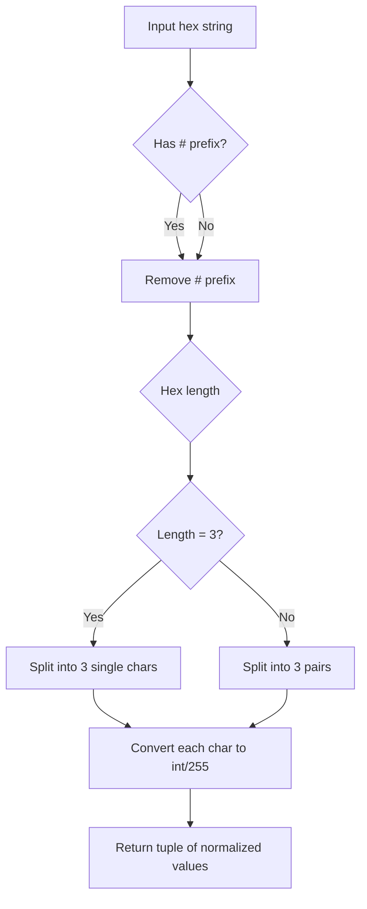
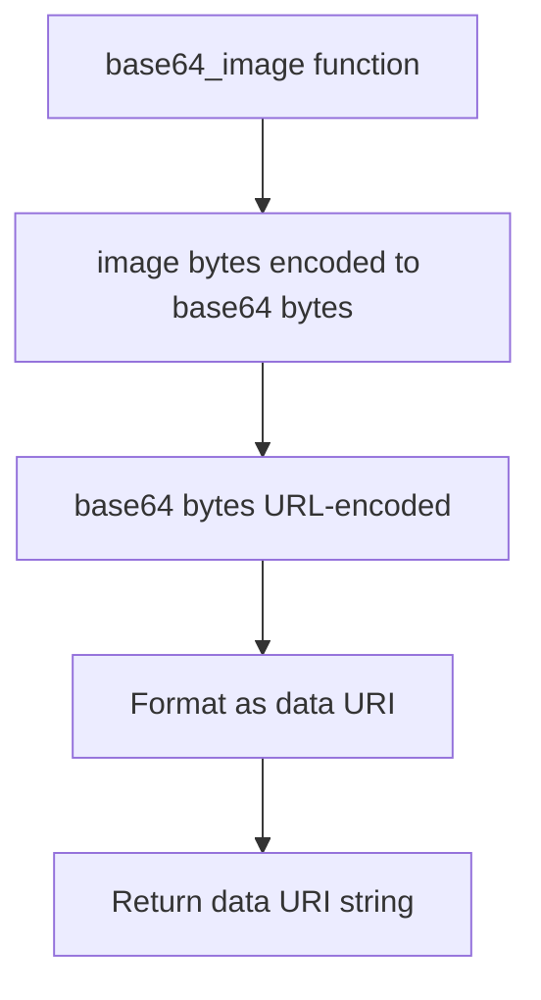

# `utils.py`

## `src.ydata_profiling.visualisation.utils.hex_to_rgb` · *function*

## Summary:
Converts a hexadecimal color string representation into a normalized RGB tuple with values between 0 and 1.

## Description:
Transforms a hexadecimal color code (e.g., "#FF0000" for red) into a tuple of floating-point values representing the red, green, and blue components normalized to the range [0, 1]. This utility function is commonly used in visualization components to handle color specifications consistently.

## Args:
    hex (str): A hexadecimal color string, optionally prefixed with "#". Valid formats include "#FF0000", "FF0000", "#00FF00", etc. Supports both 3-character (e.g., "F00") and 6-character (e.g., "FF0000") hex codes.

## Returns:
    Tuple[float, ...]: A tuple containing normalized RGB values as floats in the range [0.0, 1.0]. Always returns exactly 3 elements representing red, green, and blue components respectively.

## Raises:
    ValueError: When the hex string contains invalid hexadecimal characters or has an unsupported length (not 3 or 6 characters after removing "#").

## Constraints:
    Preconditions:
        - Input must be a string
        - Hex string must contain only valid hexadecimal characters (0-9, A-F, a-f)
        - Length of hex string (after removing #) must be either 3 or 6 characters
    
    Postconditions:
        - Output tuple always contains exactly 3 elements (RGB components)
        - Each returned value is in the range [0.0, 1.0]

## Side Effects:
    None

## Control Flow:


## Examples:
    >>> hex_to_rgb("#FF0000")
    (1.0, 0.0, 0.0)
    
    >>> hex_to_rgb("00FF00")
    (0.0, 1.0, 0.0)
    
    >>> hex_to_rgb("#0000FF")
    (0.0, 0.0, 1.0)
    
    >>> hex_to_rgb("F00")
    (1.0, 0.0, 0.0)
    
    >>> hex_to_rgb("0000FF")
    (0.0, 0.0, 1.0)
```

## `src.ydata_profiling.visualisation.utils.base64_image` · *function*

## Summary:
Converts binary image data into a base64-encoded data URI string for web embedding.

## Description:
Transforms raw binary image data into a data URI format suitable for embedding directly in HTML documents or web applications. This utility function handles the base64 encoding and proper formatting of image data for web consumption. The function is extracted to provide a reusable utility for converting binary image data into web-safe formats, avoiding duplication of encoding logic throughout the visualization components.

## Args:
    image (bytes): Binary image data to encode
    mime_type (str): MIME type of the image (e.g., 'image/png', 'image/jpeg')

## Returns:
    str: A data URI string in the format "data:mime_type;base64,encoded_data"

## Raises:
    None explicitly raised

## Constraints:
    Preconditions:
        - image parameter must be valid binary data
        - mime_type parameter must be a valid MIME type string
    Postconditions:
        - Returns a properly formatted data URI string
        - The returned string is safe for use in HTML img tags

## Side Effects:
    None

## Control Flow:


## Examples:
    # Basic usage
    image_bytes = b'\x89PNG\r\n\x1a\n...'
    mime_type = 'image/png'
    data_uri = base64_image(image_bytes, mime_type)
    # Returns: "data:image/png;base64,iVBORw0KGgoAAAANSUhEUgAAAAEAAAABCAYAAAAfFcSJAAAADUlEQVR42mP8/5+hHgAHggJ/PchI7wAAAABJRU5ErkJggg=="

## `src.ydata_profiling.visualisation.utils.plot_360_n0sc0pe` · *function*

## Summary:
Generates and saves matplotlib plots in either inline base64 format or file-based format based on configuration settings.

## Description:
This function handles the saving of matplotlib plots according to the application's HTML configuration. When configured for inline HTML output, it returns base64-encoded image data for embedding. When configured for file-based output, it saves the image to disk and returns the file path reference. The function specifically supports PNG and SVG image formats.

## Args:
    config (Settings): Configuration object containing HTML and plotting settings
    image_format (Optional[str]): Image format to save ('png' or 'svg'). Defaults to config.plot.image_format.value
    bbox_extra_artists (Optional[List[Artist]]): Additional artists to include in bounding box calculation
    bbox_inches (Optional[str]): Bounding box inches specification for plot saving

## Returns:
    str: For inline mode, returns base64-encoded image data prefixed with MIME type. For file mode, returns relative file path to saved image.

## Raises:
    ValueError: Raised when image_format is not 'png' or 'svg', or when config.html.assets_path is None in file mode

## Constraints:
    Preconditions:
        - config must be a valid Settings object
        - config.plot.image_format.value must be either 'png' or 'svg' when image_format is None
        - config.html.assets_path must not be None when in file mode
    
    Postconditions:
        - Function always returns a string representing either base64 data or file path
        - matplotlib figure is closed after saving regardless of mode

## Side Effects:
    - Creates matplotlib figures and saves them to memory or disk
    - May write files to disk when config.html.inline is False
    - Closes matplotlib figures after processing

## Control Flow:
```mermaid
flowchart TD
    A[Start plot_360_n0sc0pe] --> B{image_format None?}
    B -- Yes --> C[Set image_format=config.plot.image_format.value]
    B -- No --> C
    C --> D{image_format valid?}
    D -- No --> E[ValueError: Invalid format]
    D -- Yes --> F{config.html.inline?}
    F -- Yes --> G{image_format == "svg"?}
    G -- Yes --> H[Save to StringIO]
    G -- No --> I[Save to BytesIO with DPI]
    H --> J[Get string value]
    I --> J
    F -- No --> K{config.html.assets_path None?}
    K -- Yes --> L[ValueError: assets_path is None]
    K -- No --> M[Create file path with UUID]
    M --> N[Save to file with args]
    N --> O[Return file path]
    J --> P[Return result_string]
    P --> Q[End]
    O --> Q
```

## Examples:
```python
# Inline mode with default format
result = plot_360_n0sc0pe(config, image_format="png")

# File mode with explicit SVG format
result = plot_360_n0sc0pe(config, image_format="svg", bbox_inches="tight")
```

