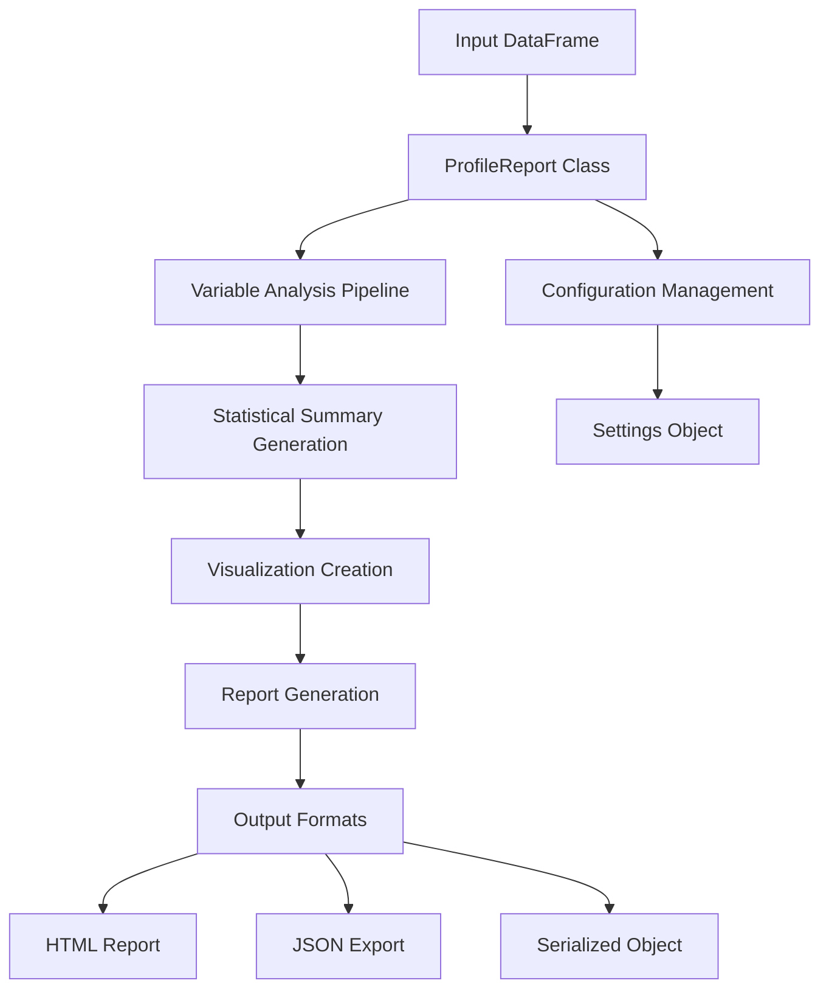

# `ydata-profiling`

## Repository Overview

### Purpose
The ydata-profiling repository provides automated data profiling capabilities for analyzing tabular datasets. It generates comprehensive statistical summaries, visualizations, and insights about data characteristics to support data quality assessment and exploratory data analysis.

### Target Users
- Data scientists and analysts
- Machine learning engineers  
- Data engineers
- Anyone working with tabular data requiring quick insights and quality assessments

### Position in Ecosystem
Standalone data profiling library that can be integrated into data science workflows, Jupyter notebooks, or CI/CD pipelines for data quality assessment and exploratory analysis.

### Architecture

Key architectural patterns:
- Pipeline-based processing for variable analysis
- Modular rendering system for different data types
- Plugin-style visualization components
- Configuration-driven behavior
- Separation of concerns between data processing and presentation

### Entry Points
1. **Python API**: `ProfileReport(df)` constructor for programmatic use
2. **Serialization**: Save/load profiling results using SerializeReport class

### Core Features
1. **Automated Data Profiling** - Comprehensive statistical analysis of all columns
2. **Type Detection** - Automatic identification of data types (numeric, categorical, text, etc.)
3. **Missing Value Analysis** - Detailed visualization and statistics of missing data patterns
4. **Distribution Visualization** - Histograms, frequency tables, and distribution plots
5. **Correlation Analysis** - Heatmaps and correlation matrices for numeric variables
6. **Time Series Analysis** - Specialized handling for temporal data
7. **Customizable Reports** - Configurable output formats and styling
8. **Serialization** - Save and load profiling results for later analysis

### Modules and Components
- **profile_report.py**: Main entry point containing ProfileReport class
- **report/structure/variables/**: Variable-specific rendering logic for different data types (categorical, text, numeric, time series, etc.)
- **visualize/plot.py**: Core plotting and visualization functions
- **serialize_report.py**: Serialization functionality for saving/loading reports
- **settings.py**: Configuration management
- **utils/dataframe.py**: Data processing utilities
- **utils/paths.py**: Path resolution utilities

### Dependencies
- pandas: Core data manipulation library
- numpy: Numerical computing foundation
- matplotlib/seaborn: Visualization backend
- jinja2: HTML template engine
- scikit-learn: Statistical analysis functions
- requests: Network operations for data fetching
- pillow: Image processing capabilities
- wordcloud: Text visualization
- tqdm: Progress tracking

---

## Modules

- [`src`](src.md)
- [`src/ydata_profiling`](src/ydata_profiling.md)
- [`src/ydata_profiling/controller`](src/ydata_profiling/controller.md)
- [`src/ydata_profiling/model`](src/ydata_profiling/model.md)
- [`src/ydata_profiling/model/pandas`](src/ydata_profiling/model/pandas.md)
- [`src/ydata_profiling/model/spark`](src/ydata_profiling/model/spark.md)
- [`src/ydata_profiling/report`](src/ydata_profiling/report.md)
- [`src/ydata_profiling/report/presentation`](src/ydata_profiling/report/presentation.md)
- [`src/ydata_profiling/report/presentation/core`](src/ydata_profiling/report/presentation/core.md)
- [`src/ydata_profiling/report/presentation/flavours`](src/ydata_profiling/report/presentation/flavours.md)
- [`src/ydata_profiling/report/presentation/flavours/html`](src/ydata_profiling/report/presentation/flavours/html.md)
- [`src/ydata_profiling/report/presentation/flavours/widget`](src/ydata_profiling/report/presentation/flavours/widget.md)
- [`src/ydata_profiling/report/structure`](src/ydata_profiling/report/structure.md)
- [`src/ydata_profiling/report/structure/variables`](src/ydata_profiling/report/structure/variables.md)
- [`src/ydata_profiling/utils`](src/ydata_profiling/utils.md)
- [`src/ydata_profiling/visualisation`](src/ydata_profiling/visualisation.md)

