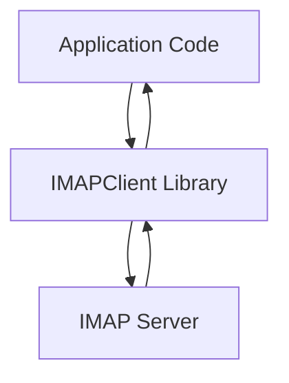

# `IMAPClient`

## Repository Overview

### Tree Structure
```
IMAPClient/
└── imapclient/
```

### Purpose
This repository provides a Python library for interacting with IMAP (Internet Message Access Protocol) servers. It offers a clean, high-level interface for managing email accounts, retrieving messages, searching mailboxes, and performing various email operations. The library abstracts away low-level IMAP protocol complexities, making it easier for developers to build applications that require email integration.

### Target Users
- Developers building email clients or integrations
- Applications requiring automated email processing
- System administrators managing email infrastructure
- Backend services that need to fetch or manipulate emails programmatically

### Position in Ecosystem
This is a standalone Python library designed to work with any standard IMAP server. It serves as a foundational component for email-related applications and can be integrated into larger systems such as email processing pipelines, monitoring tools, or web services that interact with email accounts.

### Architecture
The system follows a client-server model where the library acts as an IMAP client communicating with an IMAP server. It uses standard IMAP protocols and extensions to provide a rich set of features while maintaining simplicity in usage.

#### Data Flow Diagram (Mermaid)


### Entry Points
- **Importable API**: `from imapclient import IMAPClient`
- **CLI Interface**: Not currently implemented in this repository
- **Service Endpoints**: None directly exposed; intended for programmatic use

### Core Features
1. **Email Retrieval** - Fetch messages by ID or UID
2. **Message Search** - Search mailboxes using various criteria
3. **Folder Management** - Create, delete, rename folders
4. **Message Flags** - Set, clear, and check message flags
5. **Connection Handling** - Secure connections via SSL/TLS
6. **Advanced IMAP Extensions** - Support for IMAP extensions like IDLE, SORT, etc.

### Dependencies
- Python 3.7+
- Standard library modules (socket, ssl, etc.)
- No external dependencies beyond Python standard library

### Configuration
This library does not require configuration files or environment variables. Connection parameters are passed directly to the client constructor.

### Extension Points
- Custom IMAP command support through low-level methods
- Subclassing for custom behavior
- Plugin-like extension through composition with other libraries

---

## Modules

- [`imapclient`](imapclient.md)

