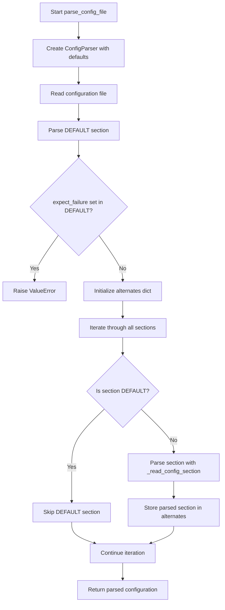
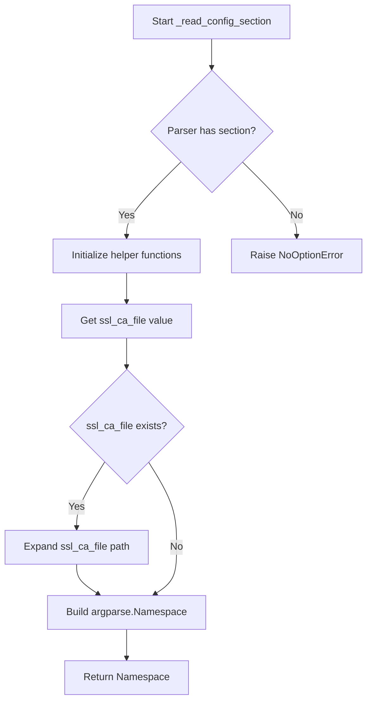
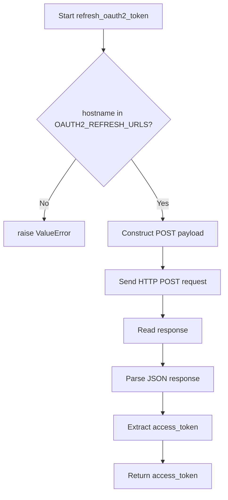
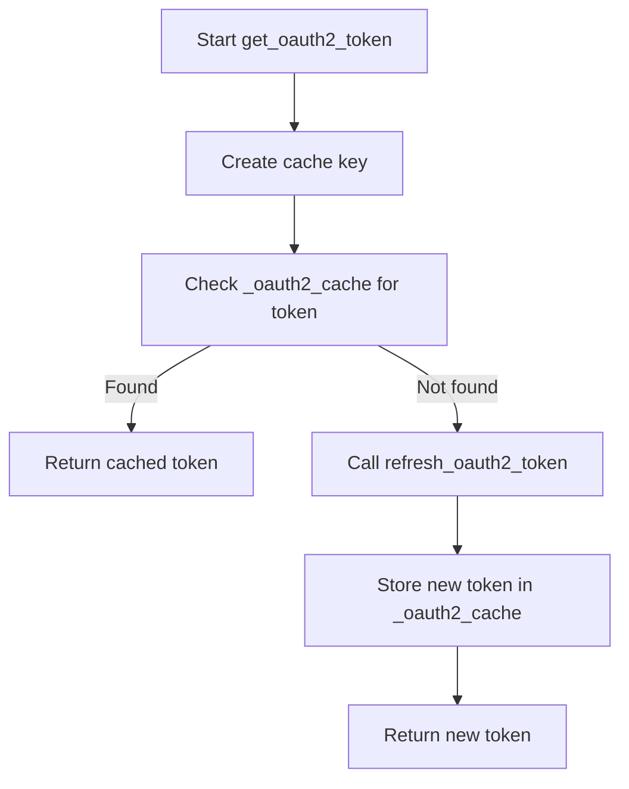

# `config.py`

## `imapclient.config.getenv` · *function*

## Summary:
Retrieves environment variables with a prefixed namespace for IMAP client configuration.

## Description:
This function provides a standardized way to access environment variables used by the IMAP client library. It automatically prefixes variable names with "imapclient_" to avoid naming conflicts with other applications. The function serves as a wrapper around `os.environ.get()` to provide consistent configuration loading behavior throughout the IMAP client implementation.

## Args:
    name (str): The base name of the environment variable to retrieve, which will be prefixed with "imapclient_".
    default (Optional[str]): The default value to return if the environment variable is not set.

## Returns:
    Optional[str]: The value of the environment variable if it exists, or the default value if it doesn't exist.

## Raises:
    None: This function does not raise any exceptions.

## Constraints:
    Preconditions:
        - The `name` parameter must be a string.
        - The `default` parameter must be either a string or None.
    Postconditions:
        - The returned value will be either the environment variable value or the provided default.
        - No modifications are made to the environment or any global state.

## Side Effects:
    None: This function performs no I/O operations or external state mutations. It only reads from the process environment variables.

## Control Flow:


## Examples:
    # Retrieve IMAP server host with default fallback
    host = getenv("host", "localhost")
    
    # Retrieve IMAP port with default fallback
    port = getenv("port", "993")
    
    # Retrieve optional authentication token
    token = getenv("auth_token", None)
```

## `imapclient.config.get_config_defaults` · *function*

## Summary:
Returns a dictionary of default configuration values for an IMAP client, including environment variable-based settings and hardcoded defaults.

## Description:
This function provides a centralized location for defining default configuration values used by the IMAP client. It combines environment variable lookups for sensitive credentials with hardcoded sensible defaults for connection parameters. The function is designed to be called early in the application lifecycle to establish a baseline configuration that can be overridden by user-provided settings.

Known callers within the codebase:
- This function is likely called during initialization of IMAP client instances to establish default configuration values before merging with user-provided configurations.

Why this logic is extracted into its own function:
- Separates configuration default logic from client instantiation logic
- Provides a single source of truth for default configuration values
- Enables easy testing of default configuration behavior
- Allows for consistent default values across different IMAP client implementations

## Returns:
A dictionary mapping configuration keys to their default values, where:
- username: Environment variable "imapclient_username" or None
- password: Environment variable "imapclient_password" or None
- ssl: Boolean True (SSL enabled by default)
- ssl_check_hostname: Boolean True (hostname checking enabled by default)
- ssl_verify_cert: Boolean True (certificate verification enabled by default)
- ssl_ca_file: None (no custom CA file specified)
- timeout: None (no timeout configured)
- starttls: Boolean False (STARTTLS disabled by default)
- stream: Boolean False (streaming disabled by default)
- oauth2: Boolean False (OAuth2 disabled by default)
- oauth2_client_id: Environment variable "imapclient_oauth2_client_id" or None
- oauth2_client_secret: Environment variable "imapclient_oauth2_client_secret" or None
- oauth2_refresh_token: Environment variable "imapclient_oauth2_refresh_token" or None
- expect_failure: None (no expected failure configured)

## Side Effects:
- Reads from process environment variables via the getenv helper function
- No external state mutations or I/O operations

## Control Flow:
```mermaid
flowchart TD
    A[get_config_defaults called] --> B[Initialize result dict]
    B --> C[Set username from getenv("username", None)]
    C --> D[Set password from getenv("password", None)]
    D --> E[Set ssl=True]
    E --> F[Set ssl_check_hostname=True]
    F --> G[Set ssl_verify_cert=True]
    G --> H[Set ssl_ca_file=None]
    H --> I[Set timeout=None]
    I --> J[Set starttls=False]
    J --> K[Set stream=False]
    K --> L[Set oauth2=False]
    L --> M[Set oauth2_client_id from getenv("oauth2_client_id", None)]
    M --> N[Set oauth2_client_secret from getenv("oauth2_client_secret", None)]
    N --> O[Set oauth2_refresh_token from getenv("oauth2_refresh_token", None)]
    O --> P[Set expect_failure=None]
    P --> Q[Return result dictionary]
```

## `imapclient.config.parse_config_file` · *function*

## Summary:
Parses a configuration file and returns structured IMAP client settings as an argparse.Namespace object.

## Description:
Reads a configuration file using configparser and converts its contents into a structured namespace containing IMAP client connection parameters. The function processes the DEFAULT section first, then iterates through all remaining sections to build alternate configuration sets. This allows for flexible configuration management supporting both base settings and multiple alternative connection profiles.

The function is designed to be called during application initialization to load user-provided configuration files. It enforces that the DEFAULT section does not contain the expect_failure setting, which is reserved for alternate sections.

## Args:
    filename (str): Path to the configuration file to parse

## Returns:
    argparse.Namespace: A namespace object containing:
        - conf (argparse.Namespace): Base configuration from DEFAULT section
        - conf.alternates (Dict[str, argparse.Namespace]): Dictionary mapping section names to their parsed configurations

## Raises:
    ValueError: When the DEFAULT section contains an expect_failure setting

## Constraints:
    Preconditions:
        - The filename argument must point to a readable file
        - The file must be in valid INI format
        - The DEFAULT section must not contain expect_failure setting
    
    Postconditions:
        - Returns a properly structured argparse.Namespace with all configuration values
        - All alternate sections are parsed and stored in conf.alternates dictionary
        - Configuration values are properly typed and validated

## Side Effects:
    - Reads from the filesystem to parse the configuration file
    - Calls internal functions to process configuration sections
    - May raise exceptions during file I/O or configuration parsing

## Control Flow:


## Examples:
    # Basic usage with a configuration file
    config = parse_config_file('/path/to/config.ini')
    # Returns a namespace with config.conf containing DEFAULT section values
    # and config.conf.alternates containing all other sections
    
    # Example config.ini content:
    # [DEFAULT]
    # host = imap.example.com
    # port = 993
    # ssl = true
    # username = user@example.com
    # password = secret
    #
    # [work]
    # host = imap.work.example.com
    # port = 993
    # ssl = true
    # username = work@example.com
    # password = worksecret
    #
    # [personal]
    # host = imap.personal.example.com
    # port = 993
    # ssl = true
    # username = personal@example.com
    # password = personalsecret

## `imapclient.config.get_string_config_defaults` · *function*

## Summary:
Converts configuration default values to string representations for consistent handling in string-based configuration contexts.

## Description:
Transforms the default configuration values returned by `get_config_defaults()` into a dictionary of string representations. This function ensures that boolean values are converted to lowercase "true"/"false" strings, and falsy values (None, empty strings, etc.) are converted to empty strings, while preserving non-falsy values as-is.

Known callers within the codebase:
- This function is likely called when preparing configuration defaults for string-based processing, such as command-line argument parsing or configuration file serialization.

Why this logic is extracted into its own function:
- Separates the conversion logic from the default value generation logic
- Provides a clean interface for obtaining string-formatted configuration defaults
- Enables consistent string representation of configuration values across different usage contexts

## Returns:
A dictionary mapping configuration keys to their string representations, where:
- Boolean True values are converted to the string "true"
- Boolean False values are converted to the string "false"
- Falsy values (None, empty strings, etc.) are converted to empty strings
- Non-falsy values are preserved as-is

## Side Effects:
- Calls `get_config_defaults()` internally, which reads from environment variables
- No external state mutations or I/O operations beyond the dependency on `get_config_defaults()`

## Control Flow:
```mermaid
flowchart TD
    A[get_string_config_defaults called] --> B[Initialize empty output dict]
    B --> C[Call get_config_defaults()]
    C --> D[Iterate over key-value pairs]
    D --> E{Value is True?}
    E -->|Yes| F[Set value to "true"]
    E -->|No| G{Value is False?}
    G -->|Yes| H[Set value to "false"]
    G -->|No| I{Value is falsy?}
    I -->|Yes| J[Set value to ""]
    I -->|No| K[Keep value as-is]
    K --> L[Store key-value pair in output dict]
    L --> M[Return output dict]
```

## `imapclient.config._read_config_section` · *function*

## Summary:
Parses configuration section from a ConfigParser object and returns structured options as an argparse.Namespace.

## Description:
This function extracts configuration values from a specified section of a configparser.ConfigParser object and converts them into a structured namespace suitable for use with IMAP client connection parameters. It handles various data types including strings, booleans, integers, floats, and optional values with proper type conversion and validation.

The function is designed to be called internally by configuration parsing logic to convert raw configuration data into a usable format for IMAP client initialization. It encapsulates the complexity of parsing different configuration value types and provides a clean interface for accessing configuration parameters.

## Args:
    parser (configparser.ConfigParser): The configuration parser containing the sections to parse
    section (str): The name of the configuration section to read

## Returns:
    argparse.Namespace: A namespace object containing all parsed configuration values with appropriate types:
        - host (str): IMAP server hostname
        - port (Optional[int]): IMAP server port number
        - ssl (bool): Whether to use SSL/TLS
        - starttls (bool): Whether to use STARTTLS
        - ssl_check_hostname (bool): Whether to verify SSL hostname
        - ssl_verify_cert (bool): Whether to verify SSL certificates
        - ssl_ca_file (Optional[str]): Path to CA certificate file (expanded with os.path.expanduser)
        - timeout (Optional[float]): Connection timeout in seconds
        - stream (bool): Whether to use streaming mode
        - username (str): Authentication username
        - password (str): Authentication password
        - oauth2 (bool): Whether to use OAuth2 authentication
        - oauth2_client_id (str): OAuth2 client ID
        - oauth2_client_secret (str): OAuth2 client secret
        - oauth2_refresh_token (str): OAuth2 refresh token
        - expect_failure (str): Expected failure condition

## Raises:
    configparser.NoOptionError: When a required configuration option is missing from the section
    ValueError: When a configuration value cannot be converted to the expected type (e.g., invalid integer or float)

## Constraints:
    Preconditions:
        - The parser argument must be a valid configparser.ConfigParser instance
        - The section argument must be a string representing an existing section in the parser
        - All required configuration options must be present in the specified section
    
    Postconditions:
        - Returns an argparse.Namespace with all configuration values properly typed
        - ssl_ca_file paths are expanded using os.path.expanduser if present
        - All optional values that are missing or empty return None

## Side Effects:
    - Calls os.path.expanduser() on ssl_ca_file if present
    - May raise configparser.NoOptionError or ValueError during parsing

## Control Flow:


## Examples:
    # Basic usage with a populated config parser
    parser = configparser.ConfigParser()
    parser.add_section('imap')
    parser.set('imap', 'host', 'imap.example.com')
    parser.set('imap', 'port', '993')
    parser.set('imap', 'ssl', 'true')
    parser.set('imap', 'username', 'user@example.com')
    parser.set('imap', 'password', 'secret')
    
    config = _read_config_section(parser, 'imap')
    # Returns argparse.Namespace with host='imap.example.com', port=993, ssl=True, etc.

## `imapclient.config.refresh_oauth2_token` · *function*

## Summary:
Refreshes an OAuth2 access token using a refresh token for a specified IMAP server hostname.

## Description:
This function handles the OAuth2 token refresh process by sending a POST request to the appropriate OAuth2 endpoint for the given hostname. It constructs the necessary payload with client credentials and refresh token, makes the HTTP request, and extracts the new access token from the JSON response.

The function is designed to be called when an existing OAuth2 access token has expired and needs to be renewed. This logic is extracted into a separate function to encapsulate the OAuth2 refresh protocol handling and make it reusable across different parts of the IMAP client implementation.

## Args:
    hostname (str): The IMAP server hostname for which to refresh the OAuth2 token. This determines the OAuth2 endpoint URL to use from the internal OAUTH2_REFRESH_URLS mapping.
    client_id (str): The OAuth2 client identifier used for authentication with the authorization server.
    client_secret (str): The OAuth2 client secret used for authentication with the authorization server.
    refresh_token (str): The refresh token used to obtain a new access token.

## Returns:
    str: The newly obtained OAuth2 access token that can be used for authenticating IMAP requests.

## Raises:
    ValueError: When the hostname is not recognized and no OAuth2 refresh URL is available for that hostname in the internal OAUTH2_REFRESH_URLS mapping.

## Constraints:
    Preconditions:
        - The hostname must be a recognized IMAP server (present in internal OAUTH2_REFRESH_URLS mapping)
        - All string parameters must be valid and non-empty
        - The refresh token must be valid and not yet expired
    
    Postconditions:
        - Returns a valid OAuth2 access token string
        - The returned token is suitable for immediate use in IMAP authentication

## Side Effects:
    - Makes an outbound HTTPS network request to the OAuth2 authorization server
    - Performs network I/O operations (HTTP POST request and response handling)
    - May trigger SSL/TLS handshake with the authorization server

## Control Flow:


## Examples:
    # Typical usage in IMAP client authentication flow
    try:
        new_token = refresh_oauth2_token(
            hostname="imap.gmail.com",
            client_id="my_client_id",
            client_secret="my_client_secret", 
            refresh_token="my_refresh_token"
        )
        # Use new_token for IMAP connection
    except ValueError as e:
        print(f"Failed to refresh token: {e}")
        # Handle unknown hostname case
```

## `imapclient.config.get_oauth2_token` · *function*

## Summary:
Retrieves an OAuth2 access token for an IMAP server, using cached tokens when available to avoid unnecessary network requests.

## Description:
This function serves as a caching layer for OAuth2 token management in IMAP client authentication. It first checks if a valid access token is already cached for the given combination of server hostname, client credentials, and refresh token. If a cached token exists and is still valid, it returns it immediately. Otherwise, it triggers a token refresh operation via the `refresh_oauth2_token` function, caches the newly acquired token, and returns it.

The function is designed to reduce redundant network calls to OAuth2 servers while ensuring that access tokens remain fresh. This logic is extracted into its own function to encapsulate the caching strategy and provide a clean interface for token acquisition throughout the IMAP client implementation.

## Args:
    hostname (str): The IMAP server hostname for which to acquire an OAuth2 access token. Must be a recognized IMAP server with associated OAuth2 endpoints.
    client_id (str): The OAuth2 client identifier used for authentication with the authorization server.
    client_secret (str): The OAuth2 client secret used for authentication with the authorization server.
    refresh_token (str): The refresh token used to obtain a new access token when no cached token is available.

## Returns:
    str: The OAuth2 access token that can be used for authenticating IMAP requests. This will either be a cached token or a freshly refreshed one.

## Raises:
    ValueError: When the hostname is not recognized and no OAuth2 refresh URL is available for that hostname in the internal OAUTH2_REFRESH_URLS mapping. This occurs during the underlying refresh_oauth2_token call.

## Constraints:
    Preconditions:
        - All string parameters must be valid and non-empty
        - The hostname must be a recognized IMAP server (present in internal OAUTH2_REFRESH_URLS mapping)
        - The refresh token must be valid and not yet expired
    
    Postconditions:
        - Returns a valid OAuth2 access token string
        - The returned token is suitable for immediate use in IMAP authentication
        - The token is stored in the internal cache for future use

## Side Effects:
    - Makes an outbound HTTPS network request to the OAuth2 authorization server when no cached token is available (via refresh_oauth2_token)
    - Performs network I/O operations (HTTP POST request and response handling) when refreshing tokens
    - May trigger SSL/TLS handshake with the authorization server
    - Updates the internal `_oauth2_cache` dictionary with the newly acquired token

## Control Flow:


## Examples:
    # Typical usage in IMAP client authentication flow
    try:
        access_token = get_oauth2_token(
            hostname="imap.gmail.com",
            client_id="my_client_id",
            client_secret="my_client_secret", 
            refresh_token="my_refresh_token"
        )
        # Use access_token for IMAP connection
    except ValueError as e:
        print(f"Failed to acquire token: {e}")
        # Handle unknown hostname case
```

## `imapclient.config.create_client_from_config` · *function*

## Summary:
Creates and configures an IMAP client instance based on configuration parameters, optionally performing authentication.

## Description:
This function serves as a centralized factory for creating IMAP client instances with proper SSL/TLS configuration and authentication. It takes a configuration namespace and returns a configured IMAPClient instance that can be used for IMAP operations. The function supports various authentication methods including OAuth2 and traditional username/password authentication, and handles SSL/TLS setup according to the configuration.

The logic is extracted into its own function to encapsulate the complexity of client creation and authentication, providing a clean interface for IMAP client instantiation throughout the application. This separation allows for easier testing and reuse of the client creation logic.

## Args:
    conf (argparse.Namespace): Configuration object containing IMAP connection parameters such as host, port, SSL settings, authentication credentials, and timeout values.
    login (bool, optional): Flag indicating whether to perform authentication after client creation. Defaults to True. If False, only the client instance is returned without authentication.

## Returns:
    imapclient.IMAPClient: A configured IMAP client instance ready for IMAP operations. If login=False, returns the unauthenticated client instance.

## Raises:
    AssertionError: When required configuration values are missing (host, OAuth2 credentials, username, or password).
    Exception: Propagates any exceptions that occur during the authentication process (e.g., network errors, invalid credentials).

## Constraints:
    Preconditions:
        - conf.host must be specified and non-empty
        - When using OAuth2 authentication, conf.oauth2_client_id, conf.oauth2_client_secret, and conf.oauth2_refresh_token must be specified
        - When using traditional authentication, conf.username and conf.password must be specified
        - conf.ssl_check_hostname, conf.ssl_verify_cert, and conf.ssl_ca_file must be properly set if SSL is enabled
    
    Postconditions:
        - Returns a valid IMAPClient instance
        - If login=True, the returned client is authenticated
        - If login=False, the returned client is unauthenticated but properly configured

## Side Effects:
    - Creates an SSL context when SSL is enabled (network I/O for certificate validation if applicable)
    - Makes network connections to the IMAP server for TLS negotiation and authentication
    - May make outbound HTTPS requests to OAuth2 authorization servers when refreshing tokens
    - Calls shutdown() on the client instance if authentication fails

## Control Flow:
```mermaid
flowchart TD
    A[Start create_client_from_config] --> B{conf.ssl?}
    B -- Yes --> C[Create ssl_context]
    C --> D[Set ssl_context properties]
    D --> E[Create IMAPClient]
    B -- No --> E[Create IMAPClient]
    E --> F{login flag?}
    F -- No --> G[Return client]
    F -- Yes --> H{conf.starttls?}
    H -- Yes --> I[Call client.starttls()]
    I --> J{conf.oauth2?}
    J -- Yes --> K[Validate OAuth2 credentials]
    K --> L[Get OAuth2 token]
    L --> M[Call client.oauth2_login()]
    J -- No --> N{conf.stream?}
    N -- No --> O[Validate username/password]
    O --> P[Call client.login()]
    N -- Yes --> Q[Return client]
    M --> Q
    P --> Q
    Q --> R[Return client]
    R --> S{Exception occurred?}
    S -- Yes --> T[Call client.shutdown()]
    T --> U[Raise exception]
```

## Examples:
    # Basic usage with default authentication
    config = argparse.Namespace(
        host="imap.example.com",
        port=993,
        ssl=True,
        ssl_check_hostname=True,
        ssl_verify_cert=True,
        username="user@example.com",
        password="password123",
        timeout=30
    )
    client = create_client_from_config(config)
    
    # Usage without authentication
    client = create_client_from_config(config, login=False)
    
    # Usage with OAuth2 authentication
    config.oauth2 = True
    config.oauth2_client_id = "client_id"
    config.oauth2_client_secret = "client_secret"
    config.oauth2_refresh_token = "refresh_token"
    client = create_client_from_config(config)

