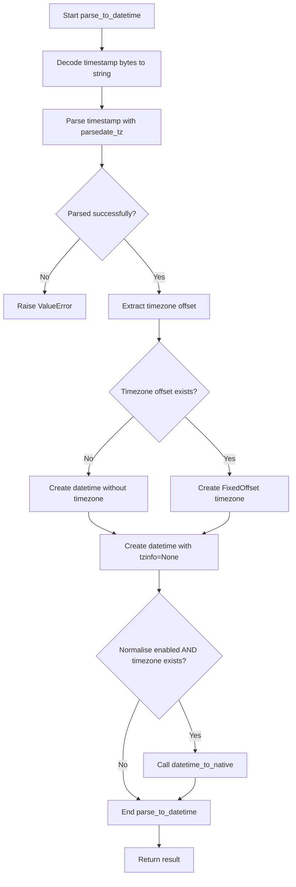
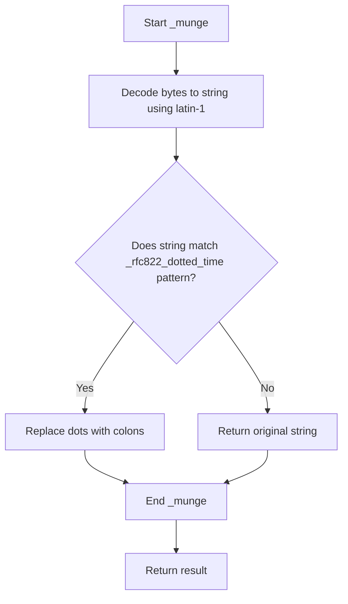

# `datetime_util.py`

## `imapclient.datetime_util.parse_to_datetime` · *function*

## Summary:
Parses a byte-encoded timestamp into a timezone-aware datetime object, with optional normalization to local time.

## Description:
Converts a byte string timestamp into a Python datetime object using email parsing utilities. This function handles RFC 822 formatted timestamps, including those with dotted time separators, and properly constructs timezone-aware datetime objects. When the normalise flag is enabled, it converts timezone-aware datetimes to the system's local timezone without timezone information.

## Args:
    timestamp (bytes): A byte string containing a timestamp in RFC 822 format that needs to be parsed into a datetime object.
    normalise (bool): Optional flag indicating whether to normalize the resulting datetime to the system's local timezone. Defaults to True.

## Returns:
    datetime: A timezone-aware datetime object constructed from the parsed timestamp. If normalise=True and timezone information is present, returns a naive datetime in local time.

## Raises:
    ValueError: Raised when the timestamp cannot be parsed by the underlying email parsing utilities.

## Constraints:
    Preconditions:
        - The timestamp parameter must be a valid byte string that can be processed by the email parsing utilities
        - The timestamp must follow RFC 822 date/time format conventions
        
    Postconditions:
        - Returns a valid datetime object with appropriate timezone information
        - If normalise=True and timezone info exists, the returned datetime will be timezone-naive

## Side Effects:
    None

## Control Flow:


## Examples:
    # Parse a timestamp with timezone
    timestamp = b"Wed, 01 Jan 2020 12:30:45 +0000"
    dt = parse_to_datetime(timestamp)
    # Returns: datetime(2020, 1, 1, 12, 30, 45, tzinfo=FixedOffset(0))

    # Parse a timestamp with timezone and normalize to local time
    timestamp = b"Wed, 01 Jan 2020 12:30:45 +0000"
    dt = parse_to_datetime(timestamp, normalise=True)
    # Returns: naive datetime in system's local timezone

## `imapclient.datetime_util.datetime_to_native` · *function*

## Summary:
Converts a timezone-aware datetime object to the system's local timezone and removes timezone information.

## Description:
This function takes a timezone-aware datetime object and converts it to the system's local timezone using the FixedOffset class, then strips the timezone information to return a naive datetime object. It serves as a utility for normalizing datetime objects to local time without timezone metadata.

## Args:
    dt (datetime): A timezone-aware datetime object that needs to be converted to local time and stripped of timezone information.

## Returns:
    datetime: A naive datetime object representing the same moment in time as the input, but in the system's local timezone and without timezone information.

## Raises:
    TypeError: If the input dt is not a datetime object or is timezone-naive.

## Constraints:
    Preconditions:
        - The input dt must be a timezone-aware datetime object (have tzinfo set)
        - The input dt must be a valid datetime object
    
    Postconditions:
        - The returned datetime object will be timezone-naive (tzinfo=None)
        - The returned datetime will represent the same moment in time as the input
        - The returned datetime will be in the system's local timezone

## Side Effects:
    None

## Control Flow:
```mermaid
flowchart TD
    A[Input datetime dt] --> B{Is dt timezone-aware?}
    B -- No --> C[Raise TypeError]
    B -- Yes --> D[Call dt.astimezone(FixedOffset.for_system())]
    D --> E[Call .replace(tzinfo=None)]
    E --> F[Return naive datetime]
```

## Examples:
    # Convert UTC datetime to local time
    utc_dt = datetime(2023, 6, 15, 12, 0, 0, tzinfo=timezone.utc)
    local_dt = datetime_to_native(utc_dt)
    # Result: naive datetime in system's local timezone
    
    # Convert already local datetime to local time (no change)
    local_dt = datetime(2023, 6, 15, 12, 0, 0, tzinfo=FixedOffset(0))
    result = datetime_to_native(local_dt)
    # Result: naive datetime in system's local timezone

## `imapclient.datetime_util.datetime_to_INTERNALDATE` · *function*

## Summary:
Converts a Python datetime object to IMAP INTERNALDATE string format.

## Description:
Transforms a Python datetime object into a string formatted according to the IMAP INTERNALDATE specification, which is used for date-time fields in IMAP protocol commands and responses. This function ensures timezone information is properly handled and formatted for IMAP compatibility. The function automatically adds timezone information if the input datetime lacks it.

## Args:
    dt (datetime): A datetime object to convert to INTERNALDATE format. If the datetime has no timezone information, it will be localized to the system's timezone.

## Returns:
    str: A string representing the datetime in IMAP INTERNALDATE format, e.g., "01-Jan-2023 12:30:45 +0000". The format consists of day-month-year hour:minute:second timezone.

## Raises:
    None explicitly raised.

## Constraints:
    Preconditions:
        - Input must be a valid datetime object
        - The datetime object may or may not have timezone information
    Postconditions:
        - Output string follows IMAP INTERNALDATE format specification
        - Timezone information is always included in the output

## Side Effects:
    None.

## Control Flow:
```mermaid
flowchart TD
    A[Start datetime_to_INTERNALDATE] --> B{dt.tzinfo is None?}
    B -- Yes --> C[dt.replace(tzinfo=FixedOffset.for_system())]
    B -- No --> D[Skip timezone adjustment]
    C --> E[fmt = "%d-" + _SHORT_MONTHS[dt.month] + "-%Y %H:%M:%S %z"]
    D --> E
    E --> F[dt.strftime(fmt)]
    F --> G[Return formatted string]
```

## Examples:
    >>> from datetime import datetime
    >>> dt = datetime(2023, 1, 1, 12, 30, 45)
    >>> datetime_to_INTERNALDATE(dt)
    '01-Jan-2023 12:30:45 +0000'
    
    >>> from datetime import datetime, timezone
    >>> dt = datetime(2023, 1, 1, 12, 30, 45, tzinfo=timezone.utc)
    >>> datetime_to_INTERNALDATE(dt)
    '01-Jan-2023 12:30:45 +0000'

## `imapclient.datetime_util._munge` · *function*

## Summary:
Converts a timestamp byte string to a standard format by replacing dotted time separators with colons when applicable.

## Description:
This function processes timestamp data received in byte format, primarily for compatibility with email parsing utilities like `parsedate_tz`. It handles special formatting for RFC 822 dotted time representations by converting dots to colons while preserving other formats unchanged. The function is designed to normalize timestamp formats that may contain dotted time separators (common in some IMAP server responses) into standard colon-separated formats.

## Args:
    timestamp (bytes): A byte string representing a timestamp, typically from IMAP server responses.

## Returns:
    str: A string representation of the timestamp, with dotted time separators converted to colons if matching RFC 822 pattern.

## Raises:
    None explicitly raised.

## Constraints:
    - Preconditions: Input must be a valid byte string that can be decoded using latin-1 encoding.
    - Postconditions: Output is always a string with proper time formatting according to RFC 822 conventions.

## Side Effects:
    - No I/O operations or external state mutations occur.
    - Only internal string manipulation and decoding.

## Control Flow:


## Examples:
    - Input: b"Wed, 01 Jan 2020 12.30.45 +0000"
      Output: "Wed, 01 Jan 2020 12:30:45 +0000"
    - Input: b"Wed, 01 Jan 2020 12:30:45 +0000"
      Output: "Wed, 01 Jan 2020 12:30:45 +0000"

## `imapclient.datetime_util.format_criteria_date` · *function*

## Summary:
Formats a datetime object into a byte string representation suitable for IMAP date criteria.

## Description:
Converts a Python datetime object into a specific string format used by IMAP servers for date filtering. This function extracts the day, month, and year from the datetime object and formats them according to IMAP requirements, returning the result as ASCII-encoded bytes. The month is represented by its three-letter abbreviation.

## Args:
    dt (datetime): A datetime object containing the date information to format.

## Returns:
    bytes: A byte string in the format "DD-MMM-YYYY" where DD is the zero-padded day, MMM is the abbreviated month name, and YYYY is the four-digit year.

## Raises:
    None explicitly raised.

## Constraints:
    - Preconditions: The input dt must be a valid datetime object.
    - Postconditions: The returned bytes represent a properly formatted IMAP date string.

## Side Effects:
    - None.

## Control Flow:
```mermaid
flowchart TD
    A[Input datetime object] --> B{Extract day, month, year}
    B --> C[Lookup short month name from _SHORT_MONTHS]
    C --> D[Format as "DD-MMM-YYYY"]
    D --> E[Encode as ASCII bytes]
    E --> F[Return bytes]
```

## Examples:
    >>> from datetime import datetime
    >>> dt = datetime(2023, 12, 25)
    >>> format_criteria_date(dt)
    b'25-Dec-2023'

