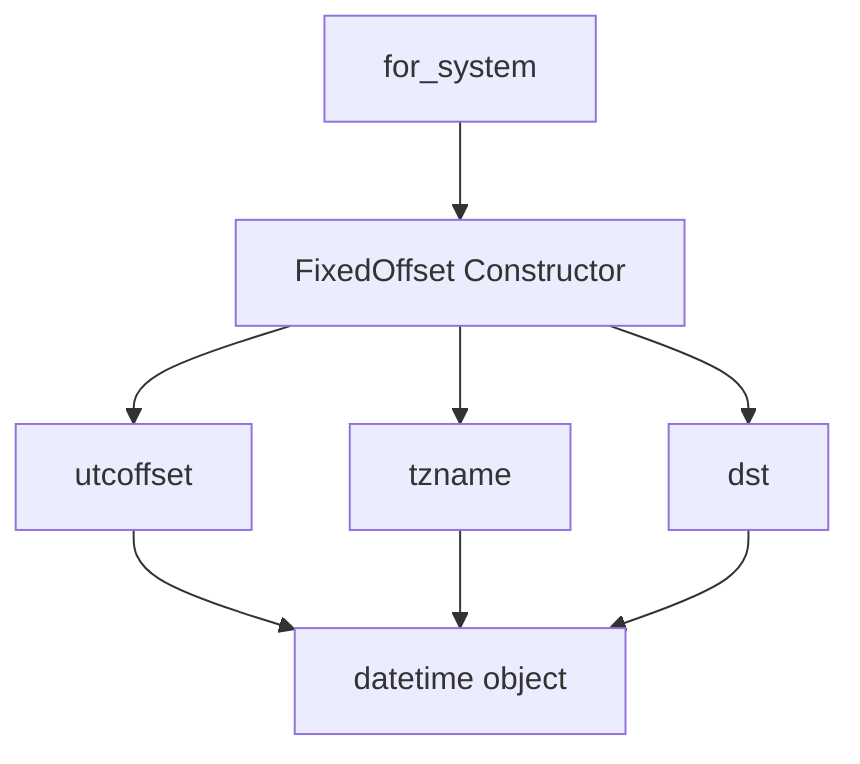

# `fixed_offset.py`

## `imapclient.fixed_offset.FixedOffset` · *class*

## Summary:
A timezone information class that represents a fixed offset from UTC, implementing the datetime.tzinfo abstract base class.

## Description:
The FixedOffset class provides a concrete implementation of datetime.tzinfo for representing timezones with a constant offset from UTC. It is designed to be used with Python's datetime objects to handle timezone-aware datetime computations. The class can be instantiated with a specific offset in minutes or created automatically from the system's local timezone settings.

## State:
- `__offset`: datetime.timedelta - The fixed offset from UTC, stored as a timedelta object
- `__name`: str - Formatted timezone name in HHMM or -HHMM format (e.g., "+0530", "-0800")

## Lifecycle:
- Creation: Instances can be created via `FixedOffset(minutes)` constructor or `FixedOffset.for_system()` class method
- Usage: Typically used with datetime objects to make them timezone-aware
- Destruction: No special cleanup required; follows standard Python object lifecycle

## Method Map:


## Raises:
- No explicit exceptions raised by __init__
- The constructor accepts any numeric value for minutes, but invalid values may cause unexpected behavior in datetime operations

## Example:
```python
# Create a timezone with +5.5 hour offset
tz = FixedOffset(330)  # 5.5 hours in minutes

# Create timezone from system settings
tz = FixedOffset.for_system()

# Use with datetime
dt = datetime.datetime(2023, 1, 1, 12, 0, 0, tzinfo=tz)
```

### `imapclient.fixed_offset.FixedOffset.__init__` · *method*

## Summary:
Initializes a FixedOffset object with a timezone offset in minutes and computes its standardized string representation.

## Description:
This method initializes the FixedOffset object by setting its internal offset and generating a formatted name string. It is called during object construction to establish the initial state of a FixedOffset instance. The method converts the offset from minutes to a standardized format like "+0500" or "-0800".

## Args:
    minutes (float): The timezone offset in minutes from UTC. Can be positive or negative.

## Returns:
    None: This method does not return a value.

## Raises:
    No exceptions are explicitly raised by this method.

## State Changes:
    Attributes READ: None
    Attributes WRITTEN: 
        - self.__offset: Set to a datetime.timedelta object representing the offset in minutes
        - self.__name: Set to a formatted string representation of the offset in HHMM format

## Constraints:
    Preconditions: The minutes argument should be a valid numeric value representing a timezone offset.
    Postconditions: The object will have self.__offset set to a datetime.timedelta and self.__name set to a properly formatted string in the format "+HHMM" or "-HHMM".

## Side Effects:
    None: This method performs no I/O operations or external service calls.

### `imapclient.fixed_offset.FixedOffset.utcoffset` · *method*

## Summary:
Returns the fixed UTC offset for this timezone instance.

## Description:
This method provides the UTC offset for the FixedOffset timezone, which is determined during object initialization. It is part of the datetime.tzinfo interface and is called by Python's datetime handling mechanisms when determining timezone-aware datetime objects' offset from UTC.

## Args:
    _ (Optional[datetime.datetime]): Unused parameter required by the tzinfo interface, typically the datetime being queried.

## Returns:
    datetime.timedelta: The fixed UTC offset previously set during initialization.

## Raises:
    None

## State Changes:
    Attributes READ: self.__offset
    Attributes WRITTEN: None

## Constraints:
    Preconditions: The FixedOffset instance must have been properly initialized with a minutes parameter.
    Postconditions: The returned timedelta represents the same offset that was used to initialize the instance.

## Side Effects:
    None

### `imapclient.fixed_offset.FixedOffset.tzname` · *method*

## Summary:
Returns the name of the timezone offset for this FixedOffset instance.

## Description:
This method provides the timezone name associated with a FixedOffset instance. It is part of the datetime.tzinfo interface implementation and is called by Python's datetime formatting functions to retrieve the timezone name for display purposes. The method ignores the datetime argument and simply returns the fixed timezone name.

## Args:
    _: Optional[datetime.datetime] - A datetime object (unused in implementation)

## Returns:
    str - The timezone name stored in the private attribute __name

## Raises:
    None

## State Changes:
    Attributes READ: self.__name
    Attributes WRITTEN: None

## Constraints:
    Preconditions: The FixedOffset instance must have been properly initialized with a __name attribute
    Postconditions: The returned string is identical to the name provided during initialization

## Side Effects:
    None

### `imapclient.fixed_offset.FixedOffset.dst` · *method*

## Summary:
Returns the daylight saving time offset for the fixed offset timezone.

## Description:
This method is part of the datetime.tzinfo interface implementation and is called by Python's datetime handling to determine the daylight saving time offset for a given datetime. Since FixedOffset represents a timezone with no daylight saving time changes, this method always returns zero.

## Args:
    _ (Optional[datetime.datetime]): A datetime object representing the date and time for which DST is being calculated. This parameter is unused in the implementation.

## Returns:
    datetime.timedelta: A timedelta of zero, indicating no daylight saving time offset.

## Raises:
    None

## State Changes:
    Attributes READ: ZERO (a module-level constant representing a zero timedelta)
    Attributes WRITTEN: None

## Constraints:
    Preconditions: The method assumes ZERO is defined as a timedelta of zero.
    Postconditions: The return value is always a timedelta of zero.

## Side Effects:
    None

### `imapclient.fixed_offset.FixedOffset.for_system` · *method*

## Summary:
Creates a FixedOffset timezone instance representing the system's local timezone offset.

## Description:
This class method constructs a FixedOffset timezone object based on the system's current local timezone settings. It determines whether daylight saving time is in effect and selects the appropriate timezone offset (standard or alternate). The resulting FixedOffset instance can be used to create timezone-aware datetime objects that reflect the system's local time zone.

The method examines the system's local time information to determine if daylight saving time is currently active (`time.localtime().tm_isdst`) and if the system supports daylight saving time (`time.daylight`). Based on these conditions, it uses either `time.altzone` (for DST) or `time.timezone` (for standard time) to calculate the offset in seconds, which is then converted to minutes and negated to match the FixedOffset constructor's expected format.

## Args:
    cls: The FixedOffset class itself (implicit first argument for classmethod)

## Returns:
    FixedOffset: An instance representing the system's local timezone offset in minutes

## Raises:
    None explicitly raised

## State Changes:
    Attributes READ: None
    Attributes WRITTEN: None

## Constraints:
    Preconditions: System time module must be properly initialized and accessible
    Postconditions: Returned FixedOffset instance accurately represents system timezone

## Side Effects:
    I/O: Calls time.localtime(), time.altzone, and time.timezone which may involve system calls
    External service calls: None
    Mutations to objects outside self: None

