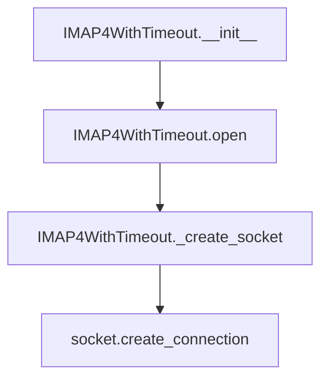

# `imap4.py`

## `imapclient.imap4.IMAP4WithTimeout` · *class*

## Summary:
IMAP4WithTimeout is a subclass of imaplib.IMAP4 that adds configurable timeout support for IMAP connections.

## Description:
This class extends the standard IMAP4 client to provide customizable timeout behavior for network operations. It allows setting a default timeout at initialization and overriding timeouts for individual operations. The class is designed to be used when establishing IMAP connections that require explicit timeout control, particularly in environments where network reliability or performance is a concern. It maintains compatibility with the standard imaplib.IMAP4 interface while extending its functionality with timeout capabilities.

## State:
- `_timeout`: Optional[float] - The default timeout value to use for socket connections. Can be None if no timeout is desired.
- `host`: str - The hostname or IP address of the IMAP server being connected to.
- `port`: int - The port number of the IMAP server being connected to.
- `sock`: socket.socket - The underlying socket connection object.
- `file`: BufferedReader - A file-like object created from the socket for reading IMAP responses.

## Lifecycle:
- Creation: Instantiate with address (str), port (int), and timeout (Optional[float]). The timeout parameter sets the default connection timeout.
- Usage: Call `open()` method to establish the connection, optionally providing host, port, and/or timeout overrides. The connection is established via `_create_socket()`.
- Destruction: Cleanup occurs automatically when the object is garbage collected, though it's recommended to explicitly close connections when done.

## Method Map:


## Raises:
- `socket.timeout`: When a socket operation exceeds the specified timeout duration.
- `socket.error`: When there are general socket-related errors during connection establishment.
- `OSError`: When there are OS-level errors during socket creation or connection.
- `imaplib.IMAP4.error`: When there are IMAP protocol-related errors during communication.

## Example:
```python
# Create an IMAP client with a 30-second default timeout
client = IMAP4WithTimeout('imap.example.com', 993, timeout=30.0)

# Connect to the server
client.open()

# Perform IMAP operations...

# Close the connection
client.close()
```

### `imapclient.imap4.IMAP4WithTimeout.__init__` · *method*

## Summary:
Initializes an IMAP4WithTimeout instance with connection parameters and timeout configuration.

## Description:
This method configures the IMAP client with the specified server address, port, and timeout settings. It stores the timeout value for later use in network operations and initializes the underlying IMAP4 connection by calling the parent class constructor.

## Args:
    address (str): The hostname or IP address of the IMAP server.
    port (int): The port number to connect to on the IMAP server.
    timeout (Optional[float]): Connection timeout in seconds, or None for no timeout.

## Returns:
    None: This method does not return a value.

## Raises:
    Exception: May raise exceptions from the parent class IMAP4.__init__ method.

## State Changes:
    Attributes READ: None
    Attributes WRITTEN: 
        - self._timeout: Stores the provided timeout value
        - Connection-related attributes from parent class initialization

## Constraints:
    Preconditions:
        - address must be a valid string representing a network address
        - port must be a positive integer within the valid port range (1-65535)
        - timeout must be either None or a positive float value
    Postconditions:
        - The instance is properly initialized with connection parameters
        - self._timeout contains the provided timeout value
        - Parent class IMAP4 initialization is completed

## Side Effects:
    - May establish a network connection to the IMAP server during initialization
    - May perform DNS resolution of the address parameter
    - Sets up socket connection for subsequent IMAP operations

### `imapclient.imap4.IMAP4WithTimeout.open` · *method*

## Summary:
Establishes a network connection to an IMAP server by creating a socket and file handle for communication.

## Description:
Initializes the IMAP client's network connection by setting up the host, port, and socket connection. This method is typically called during the setup phase of an IMAP session to prepare the client for communication with the mail server. It creates a socket connection using the configured host and port, and establishes a readable file handle for processing server responses.

## Args:
    host (str): The hostname or IP address of the IMAP server. Defaults to an empty string.
    port (int): The port number to connect to. Defaults to 143 (standard IMAP port).
    timeout (Optional[float]): Connection timeout in seconds. If None, uses the instance's default timeout (_timeout attribute).

## Returns:
    None: This method does not return a value.

## Raises:
    socket.timeout: When the connection attempt exceeds the specified timeout duration.
    socket.gaierror: When DNS resolution fails for the host address.
    ConnectionRefusedError: When the server refuses the connection attempt.
    OSError: For other OS-level errors during socket creation or connection.

## State Changes:
    Attributes READ: self._timeout (in _create_socket call)
    Attributes WRITTEN: self.host, self.port, self.sock, self.file

## Constraints:
    Preconditions: The instance must be properly initialized and ready to establish a network connection.
    Postconditions: The instance will have updated self.host, self.port, self.sock, and self.file attributes.

## Side Effects:
    I/O: Creates a network connection to the remote IMAP server.
    External service calls: Invokes socket.create_connection() which contacts DNS servers and attempts TCP connection.

### `imapclient.imap4.IMAP4WithTimeout._create_socket` · *method*

## Summary:
Creates and returns a socket connection to the IMAP server using configured host, port, and timeout settings.

## Description:
This method encapsulates the socket creation logic for establishing network connections to the IMAP server. It is called during the connection process when a new socket needs to be established. The method prioritizes the provided timeout parameter over the instance's default timeout, allowing for flexible connection timing control. This separation of concerns makes the connection logic reusable and testable.

## Args:
    timeout (Optional[float]): Connection timeout in seconds. If None, uses the instance's default timeout (_timeout attribute).

## Returns:
    socket.socket: A connected socket object ready for IMAP communication.

## Raises:
    socket.timeout: When the connection attempt exceeds the specified timeout duration.
    socket.gaierror: When DNS resolution fails for the host address.
    ConnectionRefusedError: When the server refuses the connection attempt.
    OSError: For other OS-level errors during socket creation or connection.

## State Changes:
    Attributes READ: self.host, self.port, self._timeout
    Attributes WRITTEN: None

## Constraints:
    Preconditions: The instance must have valid self.host and self.port attributes set before calling.
    Postconditions: Returns a properly initialized socket object connected to the IMAP server.

## Side Effects:
    I/O: Creates a network connection to the remote IMAP server.
    External service calls: Invokes socket.create_connection() which contacts DNS servers and attempts TCP connection.

