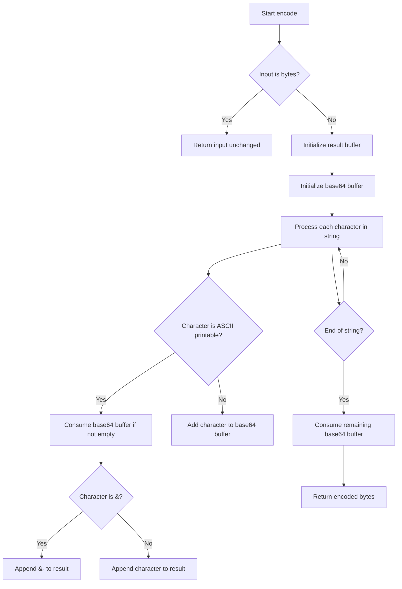
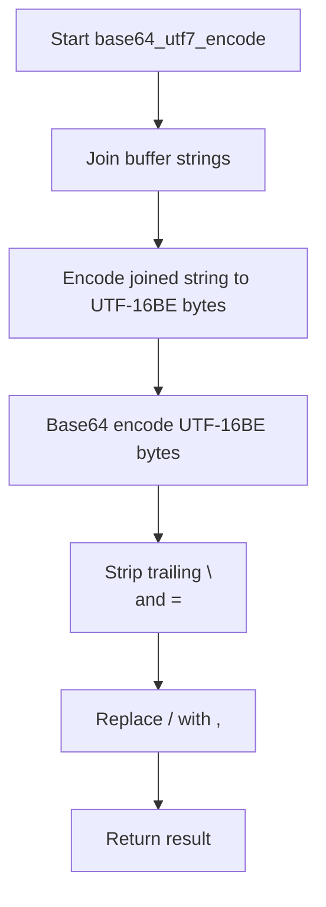

# `imap_utf7.py`

## `imapclient.imap_utf7.encode` · *function*

## Summary:
Encodes a string or bytes object into IMAP UTF-7 format, suitable for use in IMAP folder names and other identifiers.

## Description:
This function converts a string or bytes object into IMAP UTF-7 encoding, which allows non-ASCII characters to be represented in a format compatible with IMAP servers. ASCII printable characters (0x20-0x7E) are passed through unchanged, while non-ASCII characters are encoded using base64 UTF-7 encoding. The function handles special cases like the ampersand character (&) which has a special meaning in IMAP UTF-7.

## Args:
    s (Union[str, bytes]): Input string or bytes to encode. If bytes are provided, they are returned unchanged.

## Returns:
    bytes: The IMAP UTF-7 encoded representation of the input as bytes.

## Raises:
    None explicitly raised by this function.

## Constraints:
    Preconditions:
        - Input must be either a string or bytes object.
    Postconditions:
        - Output is always bytes.
        - Non-ASCII characters are properly base64-encoded in UTF-7 format.
        - Special characters like '&' are handled according to IMAP UTF-7 specification.

## Side Effects:
    None

## Control Flow:


## Examples:
    >>> encode("Hello World")
    b'Hello World'
    >>> encode("Café")
    b'Caf&AOk-'
    >>> encode(b"already_bytes")
    b'already_bytes'
```

## `imapclient.imap_utf7.decode` · *function*

## Summary:
Decodes IMAP UTF-7 encoded data into standard Unicode strings by processing base64-UTF7 encoded sequences and handling special character transitions.

## Description:
This function implements the decoding logic for IMAP's UTF-7 encoding scheme, which uses base64 encoding to represent Unicode characters outside the US-ASCII range. The function processes input bytes character-by-character, identifying UTF-7 sequences that begin with '&' and end with '-', and converts them using base64-UTF7 decoding. Non-UTF-7 characters are passed through unchanged. This extraction provides a clean separation between the parsing logic and the actual UTF-7 decoding process.

## Args:
    s (Union[bytes, str]): Input data to decode, either as bytes (for UTF-7 encoded data) or string (already decoded).

## Returns:
    str: Decoded Unicode string representing the original text. If input is already a string, it is returned unchanged.

## Raises:
    None explicitly raised by this function.

## Constraints:
    Preconditions:
        - Input must be either bytes or string type
        - When input is bytes, it should contain valid UTF-7 encoded data
    Postconditions:
        - Output is always a Unicode string
        - UTF-7 sequences are properly converted to their Unicode equivalents

## Side Effects:
    None.

## Control Flow:
```mermaid
flowchart TD
    A[Start decode] --> B{Input is bytes?}
    B -- No --> C[Return input as-is]
    B -- Yes --> D[Initialize result list and buffer]
    D --> E[Process each byte in input]
    E --> F{Byte is '&' and buffer empty?}
    F -- Yes --> G[Add '&' to buffer]
    F -- No --> H{Byte is '-' and buffer not empty?}
    H -- Yes --> I{Buffer length is 1?}
    I -- Yes --> J[Append "&" to result]
    I -- No --> K[Decode buffer content and append to result]
    J --> L[Clear buffer]
    K --> L
    H -- No --> M{Buffer not empty?}
    M -- Yes --> N[Add byte to buffer]
    M -- No --> O[Convert byte to char and append to result]
    L --> P{More bytes?}
    P -- Yes --> E
    P -- No --> Q[Check remaining buffer]
    Q --> R{Buffer exists?}
    R -- Yes --> S[Decode remaining buffer and append to result]
    R -- No --> T[Join result list to string]
    S --> T
    T --> U[Return decoded string]
```

## Examples:
    # Decode simple ASCII text
    result = decode(b"Hello World")
    # Result: "Hello World"
    
    # Decode UTF-7 encoded text
    result = decode(b"Test&AMQ-")
    # Result: "Test&AQ"
    
    # Decode mixed content
    result = decode(b"Normal&AP8-Text")
    # Result: "Normal+Text"
    
    # String input returns unchanged
    result = decode("Already decoded")
    # Result: "Already decoded"

## `imapclient.imap_utf7.base64_utf7_encode` · *function*

## Summary:
Encodes a list of UTF-8 strings into a base64-encoded byte string using UTF-16BE encoding.

## Description:
This function takes a list of string elements and concatenates them into a single UTF-8 string, which is then encoded using UTF-16BE encoding. The resulting bytes are base64-encoded using the standard base64 algorithm, with trailing newlines and equals signs stripped, and forward slashes replaced with commas. This encoding is commonly used in IMAP protocol for handling internationalized folder names.

## Args:
    buffer (List[str]): A list of string elements to be encoded. Each string is expected to be valid UTF-8.

## Returns:
    bytes: A base64-encoded byte string representing the concatenated input strings in UTF-16BE encoding.

## Raises:
    UnicodeEncodeError: If any string in the buffer contains characters that cannot be encoded in UTF-16BE.

## Constraints:
    Preconditions:
        - The input buffer must be a list of strings.
        - Each string in the buffer must be valid UTF-8.
    Postconditions:
        - The returned bytes represent the base64 encoding of the UTF-16BE encoded concatenation of all strings in the buffer.
        - Forward slashes in the base64 output are replaced with commas.

## Side Effects:
    None

## Control Flow:


## Examples:
    >>> base64_utf7_encode(["Hello", "World"])
    b'SGVsbG8V29ybGQ='
    >>> base64_utf7_encode(["Test", "String"])
    b'VGVzdFN0cmluZw=='

## `imapclient.imap_utf7.base64_utf7_decode` · *function*

## Summary:
Decodes a UTF-7 encoded byte array into a standard Unicode string using base64-UTF7 encoding rules.

## Description:
This function performs the inverse operation of base64-UTF7 encoding by converting a byte array that represents a UTF-7 encoded string into its proper Unicode representation. It handles the specific transformation required for IMAP's UTF-7 encoding scheme where commas are replaced with forward slashes and the string is prefixed with "+" and suffixed with "-".

## Args:
    s (bytearray): The UTF-7 encoded data to decode, represented as a bytearray.

## Returns:
    str: The decoded Unicode string representing the original text.

## Raises:
    UnicodeDecodeError: When the resulting byte sequence cannot be decoded using UTF-7 encoding.

## Constraints:
    Preconditions:
        - Input must be a valid bytearray containing UTF-7 encoded data.
        - The input should not contain invalid characters for the UTF-7 transformation.
    Postconditions:
        - Output is a properly decoded Unicode string.
        - The transformation maintains the semantic meaning of the original UTF-7 encoded data.

## Side Effects:
    None.

## Control Flow:
```mermaid
flowchart TD
    A[Start base64_utf7_decode] --> B[Input validation]
    B --> C{Input is bytearray?}
    C -- Yes --> D[Replace commas with slashes]
    D --> E[Prepend "+" and append "-"]
    E --> F[Decode using utf-7]
    F --> G[Return decoded string]
    C -- No --> H[Throw TypeError]
    H --> I[End]
    G --> J[End]
```

## Examples:
    # Basic usage
    encoded_data = bytearray(b"Hello,World")
    decoded = base64_utf7_decode(encoded_data)
    # Result: "Hello,World"

    # With special UTF-7 characters
    encoded_data = bytearray(b"Test&AMQ-")
    decoded = base64_utf7_decode(encoded_data)
    # Result: "Test&AQ"

