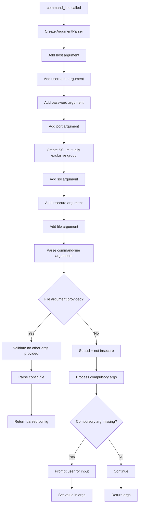

# `interact.py`

## `imapclient.interact.command_line` · *function*

## Summary:
Parses command-line arguments for IMAP client configuration and handles both direct CLI input and configuration file loading.

## Description:
Processes command-line arguments using argparse to configure an IMAP client connection. Supports both direct command-line parameter specification and loading configuration from a file. When a configuration file is specified, it validates that no conflicting parameters are also provided. The function also handles interactive credential prompts for required fields when they are not provided via command line.

Known callers within the codebase:
- This function is likely called during application startup to initialize the IMAP client configuration from command-line arguments or configuration files.

Why this logic is extracted into its own function rather than inlined:
- Centralizes argument parsing and configuration handling logic
- Enables reuse of argument parsing in different contexts (CLI vs script)
- Separates concerns between argument processing and actual client creation
- Provides a clean interface for testing argument parsing behavior

## Args:
    None (function takes no parameters)

## Returns:
    argparse.Namespace: A namespace object containing parsed configuration parameters:
        - host (str): IMAP server hostname
        - username (str): Username for authentication
        - password (str): Password for authentication
        - port (int): IMAP server port number
        - ssl (bool): Whether to use SSL/TLS connection (True by default)
        - insecure (bool): Whether to use insecure connection (without SSL/TLS)
        - file (str): Path to configuration file (if provided)

## Raises:
    SystemExit: When invalid arguments are provided or when configuration file conflicts occur
    ValueError: When configuration file parsing fails due to invalid format

## Constraints:
    Preconditions:
        - Command-line arguments must be properly formatted
        - If a configuration file is specified, no other command-line arguments can be provided
        - Required arguments (host, username, password) must be provided either via CLI or through interactive prompts
        
    Postconditions:
        - All required configuration parameters are populated
        - SSL configuration is properly resolved (ssl = not insecure)
        - Configuration values are validated and processed appropriately

## Side Effects:
    - Reads command-line arguments using argparse
    - May prompt user for input via getpass for missing credentials
    - Reads configuration file from disk when -f/--file option is used
    - Modifies the args namespace in-place during processing

## Control Flow:


## Examples:
    # Basic usage with command-line arguments
    # python script.py -H imap.example.com -u user@example.com -p secret
    
    # Usage with configuration file
    # python script.py -f /path/to/config.ini
    
    # Usage with SSL disabled
    # python script.py -H imap.example.com -u user@example.com -p secret --insecure
    
    # Usage with custom port
    # python script.py -H imap.example.com -u user@example.com -p secret -P 143
```

## `imapclient.interact.main` · *function*

## Summary:
Main entry point for the IMAP client interactive shell, establishing a connection and launching a REPL environment.

## Description:
Establishes an IMAP client connection using command-line arguments or configuration files, then attempts to launch an interactive Python shell with the connected client available as variable "c". The function provides fallback mechanisms for different Python REPL implementations (ptpython, IPython versions, built-in code module) to ensure usability across different environments.

Known callers within the codebase:
- This function is typically invoked as the main entry point when the script is run directly (via `if __name__ == "__main__"` guard in the module).

Why this logic is extracted into its own function rather than inlined:
- Encapsulates the complete workflow of connection establishment followed by interactive shell launching
- Separates the concerns of configuration parsing, connection management, and REPL initialization
- Provides a clean interface for testing the interactive session setup
- Allows for easy integration into larger applications or scripts that might want to invoke the interactive mode programmatically

## Args:
    None (function takes no parameters)

## Returns:
    int: Exit status code (0 for successful completion)

## Raises:
    ImportError: When required REPL libraries (ptpython, IPython) are not available
    Exception: Propagated from underlying connection or authentication failures

## Constraints:
    Preconditions:
        - Command-line arguments must be valid or configuration file must be readable
        - Required IMAP connection parameters (host, username, password) must be available
        - Network connectivity must be available for IMAP server connection
        
    Postconditions:
        - An IMAP client connection is established and available in the REPL environment
        - At least one REPL implementation is successfully launched (or built-in fallback)
        - The client instance is accessible as variable "c" in the REPL environment

## Side Effects:
    - Prints connection status messages to stdout
    - Establishes network connection to IMAP server
    - May prompt user for password input via getpass if not provided in arguments
    - Launches interactive Python shell process (blocks execution until shell exits)

## Control Flow:
```mermaid
flowchart TD
    A[main() called] --> B[Parse command-line arguments via command_line()]
    B --> C[Connect to IMAP server using create_client_from_config()]
    C --> D[Print connection success message]
    D --> E[Define REPL functions (ptpython, ipython_400, ipython_011, ipython_010, builtin)]
    E --> F[Attempt ptpython]
    F --> G{ImportError?}
    G -- Yes --> H[Attempt IPython 4.0+]
    G -- No --> I[Break loop]
    H --> J{ImportError?}
    J -- Yes --> K[Attempt IPython 0.11]
    J -- No --> I
    K --> L{ImportError?}
    L -- Yes --> M[Attempt IPython 0.10]
    L -- No --> I
    M --> N{ImportError?}
    N -- Yes --> O[Use built-in code.interact]
    N -- No --> I
    O --> P[Launch REPL]
    P --> Q[Return exit code]
```

## Examples:
    # Launch interactive session with default configuration
    # python -m imapclient.interact
    
    # Launch interactive session with specific configuration
    # python -m imapclient.interact -H imap.example.com -u user@example.com -p secret
    
    # Launch interactive session using configuration file
    # python -m imapclient.interact -f /path/to/config.ini

