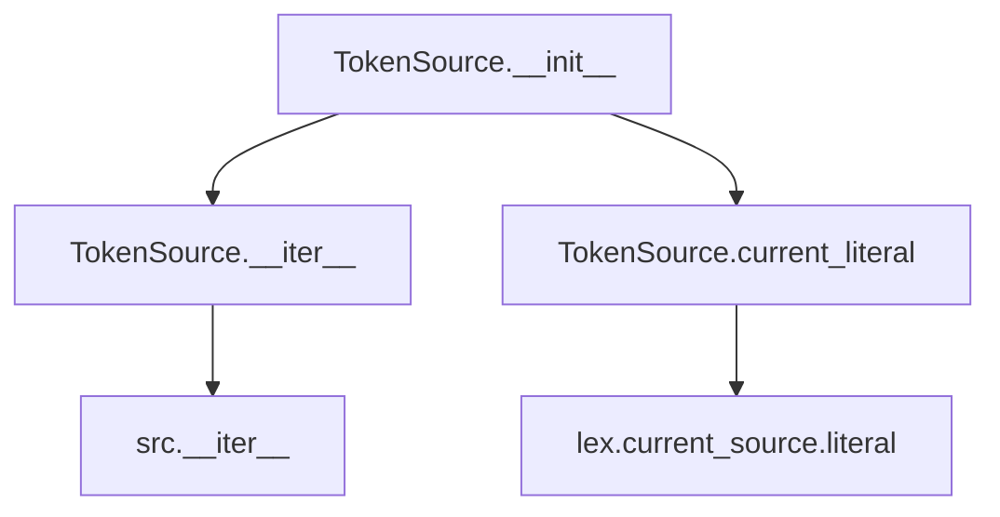
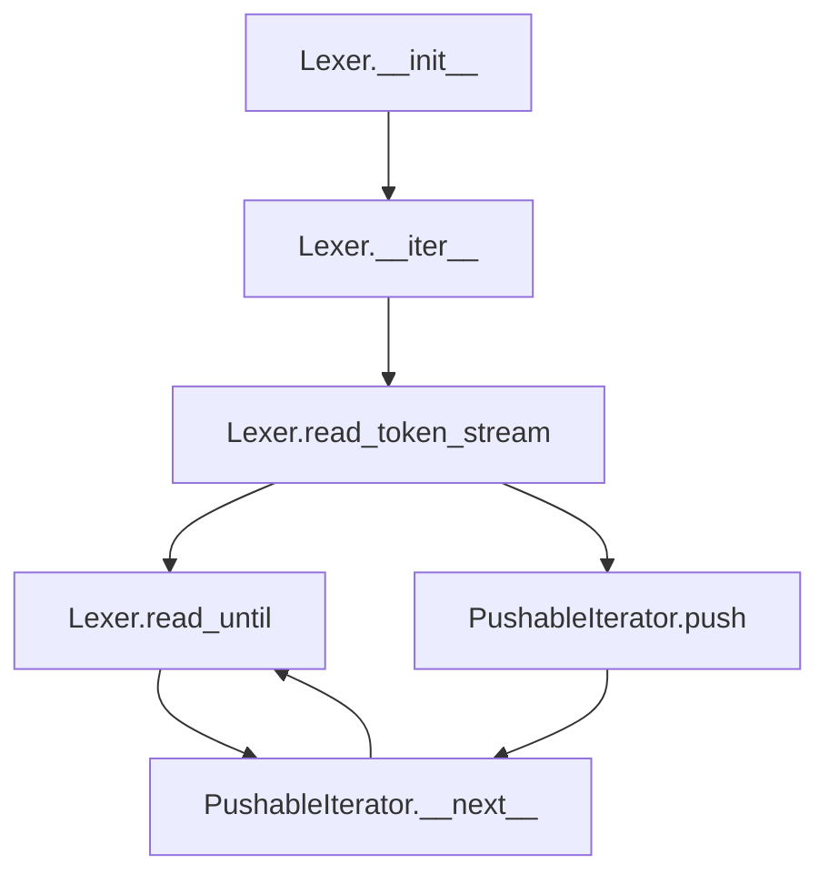
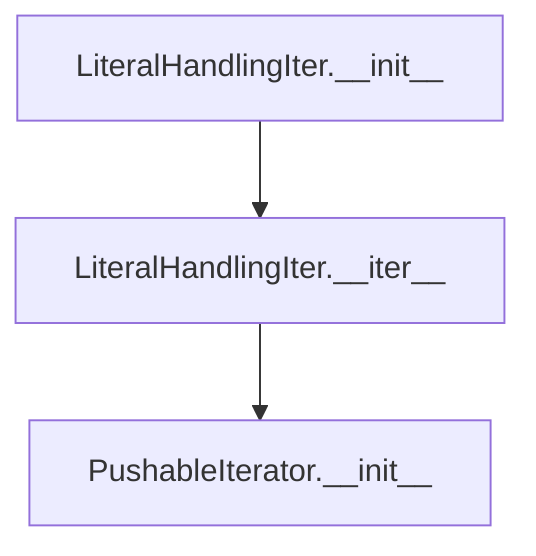
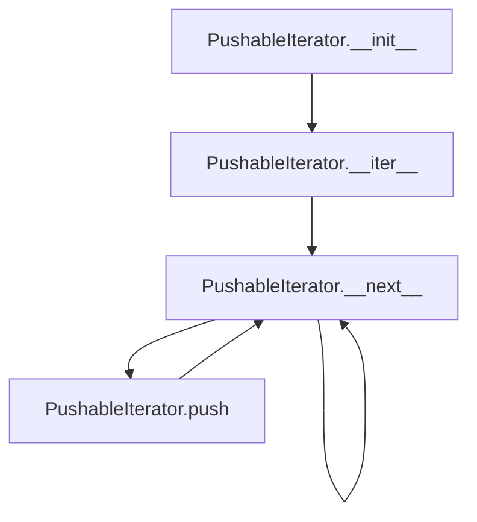

# `response_lexer.py`

## `imapclient.response_lexer.TokenSource` · *class*

## Summary:
A wrapper class that provides iteration over lexed IMAP protocol tokens while exposing access to the currently processed literal data.

## Description:
The TokenSource class serves as a convenient interface for iterating over tokens produced by a Lexer instance. It encapsulates the lexer's token stream and provides access to the current literal being processed, which is useful for parsing IMAP protocol responses where literal data blocks require special handling. The class is designed to work with IMAP protocol responses that may contain literal data indicated by size specifiers in braces.

The TokenSource works with a Lexer that internally manages a generator producing LiteralHandlingIter instances for each input chunk, allowing proper handling of IMAP protocol constructs including literal data blocks.

## State:
- `lex`: Lexer instance that performs the actual tokenization of input byte sequences
- `src`: Iterator over the tokenized output from the lexer

## Lifecycle:
- Creation: Instantiate with a list of bytes representing IMAP response chunks
- Usage: Iterate over the TokenSource instance to retrieve tokens, or access the current_literal property to inspect the current literal data
- Destruction: No explicit cleanup required; follows standard Python iterator lifecycle

## Method Map:


## Raises:
- None explicitly raised by TokenSource.__init__
- Any exceptions raised by the underlying Lexer initialization or tokenization process are propagated

## Example:
```python
# Create TokenSource with IMAP response chunks
response_chunks = [
    b"* 1 FETCH (RFC822 {5}\r\nhello",
    b"world)"
]
token_source = TokenSource(response_chunks)

# Iterate through tokens
tokens = list(token_source)
# Results in tokens like [b'*', b'1', b'FETCH', b'(RFC822', b'{5}\r\nhello', b'world)', b')']

# Access current literal during processing
for token in token_source:
    if token.startswith(b'{'):
        # Access current literal data
        current_lit = token_source.current_literal
```

### `imapclient.response_lexer.TokenSource.__init__` · *method*

## Summary:
Initializes a TokenSource object by setting up a lexical analyzer and iterator for processing IMAP protocol response data.

## Description:
The TokenSource.__init__ method prepares the object for tokenizing IMAP protocol responses by creating a Lexer instance from the provided byte text chunks and establishing an iterator over the lexer's token stream. This method serves as the constructor that initializes the internal state required for subsequent token iteration operations.

This logic is encapsulated in its own method to separate the initialization concerns from the token iteration logic, allowing for clean object construction and preparation of the underlying parsing infrastructure.

## Args:
    text (List[bytes]): A list of byte sequences representing IMAP protocol response chunks to be tokenized

## Returns:
    None: This method initializes object state and returns no value

## Raises:
    None explicitly raised: The method delegates to Lexer.__init__ which may raise ValueError or ProtocolError, but these are not caught or re-raised by this method

## State Changes:
    Attributes READ: None
    Attributes WRITTEN: 
    - self.lex: Assigned a new Lexer instance initialized with the input text
    - self.src: Assigned an iterator over the lexer's token stream

## Constraints:
    Preconditions:
    - The input text parameter must be a list of bytes
    - Each element in the text list should represent a valid chunk of IMAP protocol data
    
    Postconditions:
    - self.lex is initialized as a Lexer instance
    - self.src is initialized as an iterator over the lexer's token stream
    - Both attributes are ready for use in token iteration operations

## Side Effects:
    None: This method performs no I/O operations or external service calls. It only creates internal objects and iterators.

### `imapclient.response_lexer.TokenSource.current_literal` · *method*

## Summary:
Returns the literal data from the current source in the lexical analyzer.

## Description:
This property provides access to the literal data portion of the currently active token source. It is used during IMAP response parsing to retrieve literal data blocks that are indicated by size specifiers in braces. The method is typically called when processing FETCH responses or other IMAP commands that involve literal data.

The method is implemented as a property to provide clean, read-only access to the literal data without exposing the underlying lexer structure. It ensures that the current source is properly initialized before accessing its literal attribute. When no current source exists, it returns None.

## Returns:
    Optional[bytes]: The literal data from the current source, or None if no current source exists

## State Changes:
    Attributes READ: self.lex, self.lex.current_source
    Attributes WRITTEN: None

## Constraints:
    Preconditions: The TokenSource must have been properly initialized with text data and the lexer must have processed at least one token
    Postconditions: The returned value is either bytes containing literal data or None

## Side Effects:
    None

### `imapclient.response_lexer.TokenSource.__iter__` · *method*

## Summary:
Returns an iterator over the tokenized bytes from the underlying lexer source.

## Description:
This method provides iteration capability for the TokenSource object by returning the internal iterator over tokens. It enables the TokenSource to be used in for-loops and other iteration contexts.

## Args:
    None

## Returns:
    Iterator[bytes]: An iterator that yields bytes tokens from the lexer source.

## Raises:
    None

## State Changes:
    Attributes READ: self.src
    Attributes WRITTEN: None

## Constraints:
    Preconditions: The TokenSource must have been properly initialized with a lexer.
    Postconditions: The returned iterator will yield the same sequence of bytes tokens as the original lexer.

## Side Effects:
    None

## `imapclient.response_lexer.Lexer` · *class*

## Summary:
A lexical analyzer for IMAP protocol responses that tokenizes byte streams while handling literal data according to IMAP specifications.

## Description:
The Lexer class is responsible for breaking down IMAP protocol response data into meaningful tokens. It handles the complexities of IMAP's literal data syntax, where responses may contain data blocks indicated by size specifiers in braces. The lexer processes input byte sequences through multiple stages: preparing literal-handling iterators, reading tokens while respecting IMAP's quoting and escaping rules, and yielding properly formatted token bytes.

The lexer specifically handles IMAP protocol constructs including:
- Whitespace-separated tokens
- Quoted strings with proper escaping
- Literal data blocks indicated by size specifiers
- Bracketed expressions

## State:
- `sources`: Generator producing LiteralHandlingIter instances for each input chunk
- `current_source`: Currently active LiteralHandlingIter instance, or None if not set

## Lifecycle:
- Creation: Initialize with a list of bytes representing IMAP response chunks
- Usage: Iterate over the Lexer instance to receive tokenized bytes
- Destruction: No explicit cleanup required; follows standard Python iterator lifecycle

## Method Map:


## Raises:
- ValueError: Raised when encountering unclosed delimiters during token reading (such as unmatched quotes or brackets)
- ProtocolError: Raised by assert_imap_protocol when parsing literals encounters protocol violations

## Example:
```python
# Create lexer with IMAP response chunks
response_chunks = [
    b"* 1 FETCH (RFC822 {5}\r\nhello",
    b"world)"
]
lexer = Lexer(response_chunks)

# Iterate through tokens
tokens = list(lexer)
# Results in tokens like [b'*', b'1', b'FETCH', b'(RFC822', b'{5}\r\nhello', b'world)', b')']
```

### `imapclient.response_lexer.Lexer.__init__` · *method*

## Summary:
Initializes the Lexer with a list of IMAP response chunks and sets up the source iterator infrastructure.

## Description:
The __init__ method configures the Lexer's internal state by preparing an iterator chain for processing IMAP protocol responses. It creates a generator that converts each byte chunk into a LiteralHandlingIter instance, which handles special processing for literals in IMAP responses. The method establishes the foundational structure needed for subsequent lexical analysis operations.

## Args:
    text (List[bytes]): A list of IMAP response chunks, each represented as bytes. These chunks may contain literal data indicators that require special handling.

## Returns:
    None: This method initializes the object's state and does not return a value.

## Raises:
    None explicitly raised by this method.

## State Changes:
    Attributes READ: None
    Attributes WRITTEN: 
    - self.sources: Set to a generator expression producing LiteralHandlingIter instances from text chunks
    - self.current_source: Initialized to None, will be set during parsing operations

## Constraints:
    Preconditions:
    - text parameter must be a list of bytes objects
    - Each item in text should represent a valid IMAP response fragment
    
    Postconditions:
    - self.sources is initialized as a generator of LiteralHandlingIter objects
    - self.current_source is initialized to None

## Side Effects:
    None: This method performs no I/O operations or external service calls. It only sets up internal state.

### `imapclient.response_lexer.Lexer.read_until` · *method*

## Summary:
Reads characters from a stream until a specified ending character is encountered, handling optional escaping of the delimiter.

## Description:
This method extracts a token from a character stream by reading successive characters until it encounters the specified end character. It supports optional escaping of the end character using a backslash, allowing the end character to appear within the token when properly escaped. The method is designed to work with a PushableIterator, enabling efficient streaming parsing of IMAP protocol responses.

## Args:
    stream_i (PushableIterator): An iterator over characters to parse, supporting pushback operations.
    end_char (int): The ASCII code of the character that signals the end of the token.
    escape (bool): Whether to process backslash escaping. Defaults to True.

## Returns:
    bytearray: A byte array containing the parsed token including the terminating end character.

## Raises:
    ValueError: When the end character is not found in the stream, indicating a malformed protocol message.

## State Changes:
    Attributes READ: None
    Attributes WRITTEN: None

## Constraints:
    Preconditions: 
    - The stream_i must be a valid PushableIterator that yields integer character codes.
    - The end_char must be a valid ASCII character code.
    - BACKSLASH constant must be defined in the module scope.
    Postconditions:
    - The returned bytearray contains the full token including the terminating end character.
    - The stream position advances past the end character.

## Side Effects:
    I/O: Reads from the provided stream_i iterator, which may involve network or file I/O.
    External service calls: None
    Mutations to objects outside self: None

### `imapclient.response_lexer.Lexer.read_token_stream` · *method*

## Summary:
Processes a byte stream to extract IMAP protocol tokens, handling whitespace, quoted strings, and bracketed expressions.

## Description:
This method implements IMAP protocol tokenization by reading a byte stream and yielding tokens separated by whitespace. It properly handles special IMAP syntax including quoted strings (enclosed in double quotes) and bracketed expressions (enclosed in square brackets). The method skips leading whitespace and processes each token according to IMAP parsing rules, ensuring correct handling of nested structures and protocol compliance.

## Args:
    stream_i (PushableIterator): An iterator that supports pushing bytes back into the stream for reprocessing

## Returns:
    Iterator[bytearray]: An iterator yielding bytearray objects representing individual tokens from the input stream

## Raises:
    AssertionError: When encountering a double quote character while a token is already being built (violates IMAP protocol)

## State Changes:
    Attributes READ: WHITESPACE, NON_SPECIALS, OPEN_SQUARE, CLOSE_SQUARE, DOUBLE_QUOTE
    Attributes WRITTEN: None

## Constraints:
    Preconditions: The PushableIterator must support the push() method and proper iteration semantics
    Postconditions: All tokens are yielded in order, with proper handling of quoted strings and bracketed expressions

## Side Effects:
    I/O: Reads from the provided stream_i iterator
    External service calls: None
    Mutations to objects outside self: None

### `imapclient.response_lexer.Lexer.__iter__` · *method*

## Summary:
Returns an iterator that yields tokenized byte sequences from all registered data sources.

## Description:
This method provides iteration over all token streams from registered sources, processing each source sequentially and yielding individual tokens as bytes. It serves as the primary interface for consuming parsed tokens from the lexer's data sources. The method iterates through each source in self.sources, sets the current source, and processes each source through read_token_stream to yield individual tokens.

The method is designed to be used as the iterator protocol implementation (__iter__) for the Lexer class. It enables sequential processing of IMAP protocol response chunks, where each chunk is tokenized and yielded as individual byte sequences.

## Args:
    None

## Returns:
    Iterator[bytes]: An iterator that yields individual tokens as bytes from all registered sources.

## Raises:
    None explicitly raised

## State Changes:
    Attributes READ: self.sources, self.current_source
    Attributes WRITTEN: self.current_source (updated for each source)

## Constraints:
    Preconditions: 
    - self.sources must be iterable and contain valid data sources
    - Each source in self.sources must be iterable
    - self.read_token_stream must be callable and accept an iterator of the source
    
    Postconditions:
    - The method returns a lazy iterator that processes sources sequentially
    - Each call to read_token_stream is made with a fresh iterator from each source
    - self.current_source is updated to reflect the currently processed source

## Side Effects:
    None

## `imapclient.response_lexer.LiteralHandlingIter` · *class*

## Summary:
A wrapper class that prepares pushable iterators for parsing IMAP protocol responses containing literal data.

## Description:
The LiteralHandlingIter class is designed to handle IMAP protocol response records that may contain literal data. It processes response records where the command text ends with a closing brace (indicating a literal size) and prepares appropriate pushable iterators for downstream parsing. This class acts as a bridge between raw IMAP response data and the parsing logic that needs to handle literal data properly.

## State:
- `src_text`: bytes representing the IMAP command text, which may end with a literal size indicator like "{5}"
- `literal`: Optional bytes representing literal data associated with the command, or None if no literal is present

## Lifecycle:
- Creation: Instantiate with either a tuple of (command_bytes, literal_bytes) or just command_bytes
- Usage: Call `__iter__()` to obtain a PushableIterator for parsing the response
- Destruction: No explicit cleanup required; follows standard Python iterator lifecycle

## Method Map:


## Raises:
- ProtocolError: Raised by assert_imap_protocol when src_text does not end with '}' indicating a malformed literal

## Example:
```python
# With literal data
resp_record = (b"* 1 FETCH (RFC822 {5}\r\nhello", b"world")
handler = LiteralHandlingIter(resp_record)
iterator = iter(handler)  # Returns PushableIterator over b"* 1 FETCH (RFC822 {5}\r\nhello"

# Without literal data  
resp_record = b"* 1 FETCH (RFC822 {5}\r\nhello"
handler = LiteralHandlingIter(resp_record)
iterator = iter(handler)  # Returns PushableIterator over b"* 1 FETCH (RFC822 {5}\r\nhello"
```

### `imapclient.response_lexer.LiteralHandlingIter.__init__` · *method*

## Summary:
Initializes a LiteralHandlingIter object with either a tuple containing literal data or a single byte string response record.

## Description:
This constructor processes IMAP server response records that may contain literal data. It handles two formats: a tuple of (source_text, literal_bytes) for responses with embedded literals, or a single byte string for regular responses without literals. The method validates that literal responses properly end with a closing brace according to IMAP protocol requirements.

## Args:
    resp_record (Union[Tuple[bytes, bytes], bytes]): Either a tuple containing (source_text, literal_bytes) for responses with literals, or a single bytes object for regular responses.

## Returns:
    None: This method initializes instance attributes but does not return a value.

## Raises:
    exceptions.ProtocolError: When processing a tuple response where the source_text does not end with '}' character, indicating a malformed IMAP literal response.

## State Changes:
    Attributes READ: None
    Attributes WRITTEN: self.src_text, self.literal

## Constraints:
    Preconditions: 
    - If resp_record is a tuple, the first element must end with b"}" to comply with IMAP literal format
    - The resp_record parameter must be either a tuple of two bytes objects or a single bytes object
    
    Postconditions:
    - self.src_text will be set to the source text portion of the response
    - self.literal will be set to the literal data if present, or None if not

## Side Effects:
    None: This method performs no I/O operations or external service calls. It only sets internal object attributes.

### `imapclient.response_lexer.LiteralHandlingIter.__iter__` · *method*

## Summary:
Returns a pushable iterator over the source text bytes, enabling sequential consumption with optional value pushing back.

## Description:
This method creates and returns a PushableIterator instance initialized with the source text bytes stored in self.src_text. The returned iterator allows for sequential consumption of the bytes while providing the capability to push values back onto the iteration sequence for later retrieval. This is particularly useful in IMAP protocol parsing where lookahead or backtracking may be required.

The method serves as a factory for creating pushable iterators, encapsulating the creation logic and ensuring proper initialization with the appropriate source text. It's designed to be called during iteration setup phases of IMAP response processing.

## Args:
    None

## Returns:
    PushableIterator: An iterator over the bytes in self.src_text that supports pushing values back onto the sequence.

## Raises:
    None

## State Changes:
    Attributes READ: self.src_text
    Attributes WRITTEN: None

## Constraints:
    Preconditions: 
    - self.src_text must be initialized (not None)
    - The object must be properly constructed with a valid resp_record in __init__
    
    Postconditions:
    - Returns a valid PushableIterator instance
    - The returned iterator is initialized with self.src_text

## Side Effects:
    None

## `imapclient.response_lexer.PushableIterator` · *class*

## Summary:
A pushable iterator that allows pushing values back onto the iteration sequence for later retrieval.

## Description:
The PushableIterator class wraps an iterable and provides the ability to push values back onto the iterator, making them available for subsequent calls to next(). This is useful in parsing scenarios where lookahead is needed, such as parsing IMAP protocol responses. The class implements Python's iterator protocol and extends it with a push mechanism.

## State:
- `it`: An iterator over bytes, created from the input bytes object
- `pushed`: A list of integers that have been pushed back onto the iterator
- `NO_MORE`: A sentinel object used to indicate end-of-iteration

## Lifecycle:
- Creation: Instantiate with a bytes object; the iterator will consume bytes sequentially
- Usage: Call `__next__()` or `next()` to retrieve values; use `push()` to add values back to the front
- Destruction: No explicit cleanup required; follows standard Python iterator lifecycle

## Method Map:


## Raises:
- None explicitly raised by __init__
- Standard StopIteration raised by __next__ when iteration is exhausted

## Example:
```python
# Create iterator from bytes
data = b"hello"
it = PushableIterator(data)

# Consume values normally
first = next(it)  # Returns 104 (ASCII 'h')
second = next(it)  # Returns 101 (ASCII 'e')

# Push a value back
it.push(108)  # Push ASCII 'l'

# Next value comes from pushed stack
third = next(it)  # Returns 108 (ASCII 'l') - from push
fourth = next(it)  # Returns 108 (ASCII 'l') - from original iteration
```

### `imapclient.response_lexer.PushableIterator.__init__` · *method*

## Summary:
Initializes a pushable iterator that wraps a bytes object and prepares internal state for iteration with pushback capability.

## Description:
The `__init__` method sets up the internal state of a PushableIterator instance by creating an iterator from the provided bytes object and initializing an empty list to track pushed-back values. This method establishes the foundation for the iterator's pushback functionality, allowing subsequent values to be reinserted into the iteration sequence.

## Args:
    it (bytes): A bytes object to be converted into an iterator for sequential consumption

## Returns:
    None: This method initializes the object's internal state and returns nothing

## Raises:
    None: This method does not raise any exceptions under normal circumstances

## State Changes:
    Attributes READ: None
    Attributes WRITTEN: 
    - self.it: Set to an iterator created from the input bytes object
    - self.pushed: Initialized as an empty list to store pushed-back integer values

## Constraints:
    Preconditions:
    - The input `it` parameter must be a bytes object
    - The bytes object should be valid for iteration (not None)
    
    Postconditions:
    - self.it is initialized as an iterator over the input bytes
    - self.pushed is initialized as an empty list
    - The iterator is ready for consumption via __next__ method

## Side Effects:
    None: This method performs no I/O operations or external service calls

### `imapclient.response_lexer.PushableIterator.__iter__` · *method*

## Summary:
Returns the iterator object itself, enabling the PushableIterator to function as an iterable.

## Description:
This method implements the Python iterator protocol by returning the PushableIterator instance itself. It allows the iterator to be used in for-loops and other iteration contexts. The method is essential for making PushableIterator compatible with Python's iteration mechanics.

## Args:
    None

## Returns:
    PushableIterator: The PushableIterator instance itself, enabling iteration over its elements.

## Raises:
    None

## State Changes:
    Attributes READ: None
    Attributes WRITTEN: None

## Constraints:
    Preconditions: None
    Postconditions: The returned object is identical to self, maintaining the iterator's identity.

## Side Effects:
    None

### `imapclient.response_lexer.PushableIterator.__next__` · *method*

## Summary:
Returns the next integer value from the underlying iterator, or a pushed-back value if available.

## Description:
This method implements the iterator protocol's `__next__` method for the `PushableIterator` class. It provides a mechanism to peek ahead or backtrack in an iteration by allowing values to be "pushed back" into the iterator. When a value has been pushed back using the `push` method, it will be returned on the next call to `__next__`. Otherwise, it delegates to the underlying iterator.

## Args:
    None

## Returns:
    int: The next integer value from the iterator or a pushed-back value.

## Raises:
    StopIteration: When the underlying iterator is exhausted and no values are pushed back.

## State Changes:
    Attributes READ: self.pushed, self.it
    Attributes WRITTEN: self.pushed (when popping a pushed value)

## Constraints:
    Preconditions: The underlying iterator (`self.it`) must be initialized and iterable.
    Postconditions: If a pushed value exists, it is removed from `self.pushed` and returned. Otherwise, the next value from `self.it` is returned.

## Side Effects:
    None

### `imapclient.response_lexer.PushableIterator.push` · *method*

## Summary:
Adds an integer item to the front of the iterator's pending items queue, making it available for immediate retrieval on the next iteration.

## Description:
This method allows pushing integer values back onto the iterator's internal stack, enabling a form of lookahead or deferred processing. It is typically used when parsing IMAP responses where certain tokens need to be "pushed back" into the stream for reprocessing.

## Args:
    item (int): The integer value to add to the front of the pending items queue.

## Returns:
    None: This method does not return any value.

## Raises:
    None: This method does not raise any exceptions.

## State Changes:
    Attributes READ: self.pushed
    Attributes WRITTEN: self.pushed

## Constraints:
    Preconditions: The object must be initialized and have a valid pushed list attribute.
    Postconditions: The item is appended to the end of self.pushed, making it available for the next call to __next__.

## Side Effects:
    None: This method only modifies the internal state of the object and has no external side effects.

