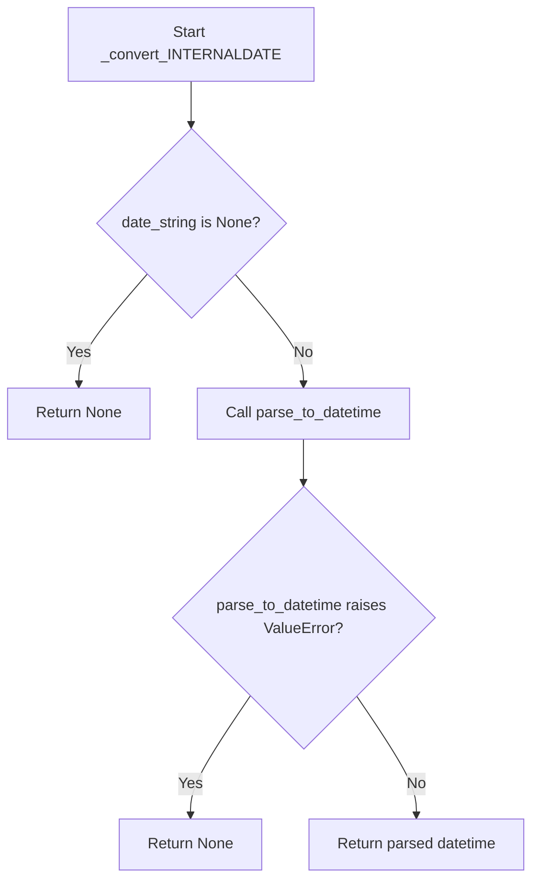
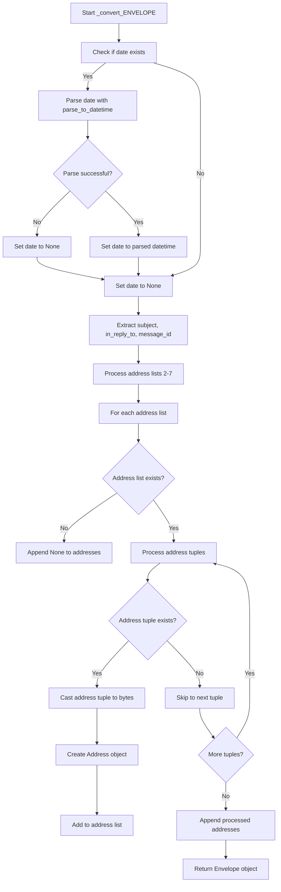
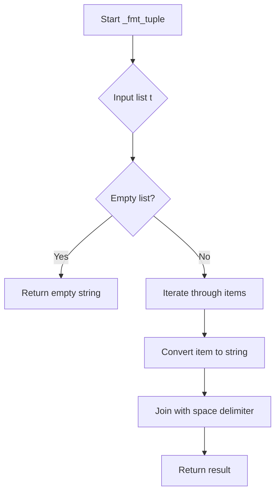

# `response_parser.py`

## `imapclient.response_parser.parse_response` · *function*

## Summary:
Parses a list of IMAP protocol response tokens into a tuple of Python-native data types.

## Description:
Converts raw byte-encoded IMAP protocol tokens into structured Python objects suitable for further processing. This function serves as the primary interface for parsing IMAP responses, handling special cases like empty responses and delegating the actual parsing to the `gen_parsed_response` generator function. The function ensures that IMAP protocol semantics are correctly translated into Python data types, including handling NIL values, literals, quoted strings, and numeric values.

The function is designed to handle the common case where IMAP responses arrive as lists of byte tokens, converting them into a more usable tuple format for downstream processing. It maintains consistency with the IMAP protocol's type system while providing Pythonic representations.

## Args:
    data (List[bytes]): A list of byte-encoded IMAP protocol tokens representing a complete response. Each item in the list corresponds to a token from the IMAP response stream.

## Returns:
    Tuple[_Atom, ...]: A tuple containing the parsed Python objects for each IMAP token. The tuple elements can be:
        - None for NIL tokens
        - bytes for literal data blocks
        - str for quoted strings
        - int for numeric tokens
        - bytes for unprocessed tokens
    Returns an empty tuple when the input contains only a None sentinel value.

## Raises:
    ProtocolError: When parsing errors occur during token processing, either directly from the underlying parsing functions or when invalid token formats are encountered.

## Constraints:
    - Preconditions: The input data must be a list of bytes representing valid IMAP protocol tokens.
    - Postconditions: The returned tuple contains properly typed Python objects matching the IMAP protocol semantics.

## Side Effects:
    None.

## Control Flow:
```mermaid
flowchart TD
    A[Start parse_response] --> B{data == [None]?}
    B -->|Yes| C[Return empty tuple]
    B -->|No| D[Call gen_parsed_response(data)]
    D --> E[Convert generator to tuple]
    E --> F[Return parsed tuple]
```

## Examples:
    >>> # Basic usage with simple tokens
    >>> tokens = [b'*', b'1', b'FETCH', b'(UID', b'12345)', b')']
    >>> parse_response(tokens)
    (b'*', b'1', b'FETCH', (b'UID', 12345), b')')
    
    >>> # Empty response handling
    >>> parse_response([None])
    ()
    
    >>> # Error handling example
    >>> bad_tokens = [b'*', b'1', b'INVALID_TOKEN']
    >>> try:
    ...     parse_response(bad_tokens)
    ... except ProtocolError as e:
    ...     print(f"Parsing failed: {e}")
```

## `imapclient.response_parser.parse_message_list` · *function*

## Summary:
Parses IMAP SEARCH command response message IDs into a structured SearchIds object with optional modseq metadata.

## Description:
Processes raw IMAP SEARCH command responses containing message identifiers and optional metadata. This function extracts message IDs from the response data and optionally parses additional metadata such as modseq values. The function handles both byte and string input data, decoding bytes to ASCII strings for processing.

The function is specifically designed to handle IMAP SEARCH responses which typically consist of a single line containing message IDs followed by optional metadata. It enforces strict validation of the response format and raises appropriate errors for malformed input.

## Args:
    data (List[Union[bytes, str]]): A list containing exactly one element representing the IMAP SEARCH response. The element can be either bytes or string type containing the message ID data.

## Returns:
    SearchIds: An instance of SearchIds class containing:
        - Message IDs as integers in the list portion
        - Optional modseq value as an integer in the modseq attribute
        Returns an empty SearchIds instance when input data is empty.

## Raises:
    ValueError: When data contains zero or more than one element, or when the message data format doesn't match expected patterns.

## Constraints:
    - Preconditions: Input data must be a list with exactly one element containing message ID data.
    - Postconditions: The returned SearchIds object contains parsed message IDs and any available modseq metadata.

## Side Effects:
    None.

## Control Flow:
```mermaid
flowchart TD
    A[Start parse_message_list] --> B{len(data) != 1?}
    B -->|Yes| C[raise ValueError]
    B -->|No| D[message_data = data[0]]
    D --> E{message_data empty?}
    E -->|Yes| F[return SearchIds()]
    E -->|No| G{isinstance message_data bytes?}
    G -->|Yes| H[decode to ascii]
    G -->|No| I[continue with string]
    I --> J[match _msg_id_pattern against message_data]
    J -->|No match| K[raise ValueError]
    J -->|Match| L[parse message IDs from group(1)]
    L --> M[extract extra data after message IDs]
    M --> N{extra data exists?}
    N -->|Yes| O[parse extra with parse_response]
    O --> P{item is tuple with modseq?}
    P -->|Yes| Q[set ids.modseq]
    P -->|No| R{item is int?}
    R -->|Yes| S[append to ids]
    N -->|No| T[return ids]
```

## Examples:
    >>> # Basic usage with message IDs
    >>> data = [b'1 2 3 4 5']
    >>> result = parse_message_list(data)
    >>> print(list(result))
    [1, 2, 3, 4, 5]
    
    >>> # Usage with modseq metadata
    >>> data = [b'1 2 3 MODSEQ 12345']
    >>> result = parse_message_list(data)
    >>> print(result.modseq)
    12345
    
    >>> # Empty response handling
    >>> data = [b'']
    >>> result = parse_message_list(data)
    >>> print(len(result))
    0

## `imapclient.response_parser.gen_parsed_response` · *function*

## Summary:
Generates parsed IMAP protocol response atoms from a list of byte tokens by processing each token through the atom parser.

## Description:
This function serves as the main entry point for parsing IMAP protocol responses. It takes a list of byte-encoded tokens and processes them sequentially using the atom() parser function, yielding properly typed Python objects for each token. The function handles empty input gracefully and ensures proper error propagation when parsing issues occur.

The function is designed to be a generator that yields parsed atoms incrementally, making it memory-efficient for large IMAP responses. It acts as a bridge between raw token streams and structured Python data representations.

## Args:
    text (List[bytes]): A list of byte-encoded IMAP protocol tokens to be parsed. Each item in the list represents a token from the IMAP response stream.

## Returns:
    Iterator[_Atom]: An iterator that yields parsed Python objects for each IMAP token. The yielded objects can be:
        - None for NIL tokens
        - bytes for literal data blocks
        - str for quoted strings
        - int for numeric tokens
        - bytes for unprocessed tokens

## Raises:
    ProtocolError: When a parsing error occurs during token processing, either directly from the atom() function or when a ValueError is caught during token conversion.

## Constraints:
    - Preconditions: The input text must be a list of bytes representing valid IMAP protocol tokens.
    - Postconditions: The function returns an iterator that produces properly typed Python objects matching the IMAP protocol semantics.

## Side Effects:
    None.

## Control Flow:
```mermaid
flowchart TD
    A[Start gen_parsed_response] --> B{not text?}
    B -->|Yes| C[Return empty iterator]
    B -->|No| D[Create TokenSource from text]
    D --> E[Iterate through tokens in src]
    E --> F[Call atom(src, token)]
    F --> G[Yield parsed atom]
    G --> H{Exception raised?}
    H -->|ProtocolError| I[Rethrow ProtocolError]
    H -->|ValueError| J[Wrap ValueError in ProtocolError]
```

## Examples:
    >>> # Basic usage with simple tokens
    >>> tokens = [b'*', b'1', b'FETCH', b'(UID', b'12345)', b')']
    >>> list(gen_parsed_response(tokens))
    [b'*', b'1', b'FETCH', (b'UID', 12345), b')']
    
    >>> # Empty input handling
    >>> list(gen_parsed_response([]))
    []
    
    >>> # Error handling example
    >>> bad_tokens = [b'*', b'1', b'INVALID_TOKEN']
    >>> try:
    ...     list(gen_parsed_response(bad_tokens))
    ... except ProtocolError as e:
    ...     print(f"Parsing failed: {e}")
```

## `imapclient.response_parser.parse_fetch_response` · *function*

## Summary:
Parses IMAP FETCH command responses into a structured dictionary mapping message IDs to their associated metadata.

## Description:
Processes raw IMAP protocol responses from FETCH commands and converts them into a nested dictionary structure. Each message is indexed by either its sequence number or UID (depending on the uid_is_key parameter), with associated metadata stored as key-value pairs. This function handles various IMAP response types including UID, INTERNALDATE, ENVELOPE, BODY, and BODYSTRUCTURE, converting them into appropriate Python objects.

The function is designed to be a core component of the IMAP client's response parsing pipeline, extracting structured data from raw protocol responses for easier consumption by higher-level application logic. It provides robust error handling for malformed responses and supports flexible indexing options.

## Args:
    text (List[bytes]): Raw IMAP protocol response tokens from a FETCH command, typically obtained from the server
    normalise_times (bool): When True, converts timezone-aware datetimes to local time; defaults to True
    uid_is_key (bool): When True, uses message UIDs as dictionary keys; when False, uses sequence numbers; defaults to True

## Returns:
    defaultdict[int, _ParseFetchResponseInnerDict]: A dictionary-like structure where:
        - Keys are message identifiers (either sequence numbers or UIDs based on uid_is_key)
        - Values are dictionaries mapping attribute names to their parsed values
        - The inner dictionaries contain parsed metadata such as SEQ, UID, INTERNALDATE, ENVELOPE, etc.

## Raises:
    ProtocolError: When encountering malformed responses including:
        - Unexpected end of response stream
        - Non-tuple response items
        - Uneven number of response items
        - Invalid message IDs or UIDs

## Constraints:
    Preconditions:
        - Input text must be a list of bytes representing valid IMAP protocol tokens
        - Each message response must be a tuple with even-length items
        - Message IDs and UIDs must be convertible to integers
    Postconditions:
        - Returns a defaultdict with properly parsed message data
        - All parsed dates are timezone-aware datetime objects when available
        - All parsed envelopes contain properly structured address information

## Side Effects:
    None

## Control Flow:
```mermaid
flowchart TD
    A[Start parse_fetch_response] --> B{Is text [None]?}
    B -- Yes --> C[Return empty defaultdict]
    B -- No --> D[Call gen_parsed_response]
    D --> E[Initialize parsed_response defaultdict]
    E --> F[Loop while True]
    F --> G[Try get next message ID]
    G --> H{StopIteration?}
    H -- Yes --> I[Break loop]
    H -- No --> J[Try get next message response]
    J --> K{StopIteration?}
    K -- Yes --> L[Raise ProtocolError: unexpected EOF]
    K -- No --> M{Is message response tuple?}
    M -- No --> N[Raise ProtocolError: bad response type]
    M -- Yes --> O{Even number of items?}
    O -- No --> P[Raise ProtocolError: uneven number of response items]
    O -- Yes --> Q[Initialize msg_data with SEQ]
    Q --> R[Loop through response items 2 at a time]
    R --> S[Get attribute name and value]
    S --> T{Attribute is UID?}
    T -- Yes --> U[Convert UID to int]
    U --> V{uid_is_key?}
    V -- Yes --> W[Update msg_id to UID]
    V -- No --> X[Store UID in msg_data]
    T -- No --> Y{Attribute is INTERNALDATE?}
    Y --> Z[Convert with _convert_INTERNALDATE]
    Y -- No --> AA{Attribute is ENVELOPE?}
    AA --> AB[Convert with _convert_ENVELOPE]
    AA -- No --> AC{Attribute is BODY/BODYSTRUCTURE?}
    AC --> AD[Create BodyData object]
    AC -- No --> AE[Store as-is]
    AE --> AF[Update parsed_response[msg_id]]
    AF --> AG[Continue loop]
```

## Examples:
    # Basic usage with sequence-numbered messages
    response_data = [
        b'* 1 FETCH (UID 12345 INTERNALDATE "01-Jan-2020 12:30:45 +0000" SUBJECT "Test")',
        b'* 2 FETCH (UID 12346 INTERNALDATE "02-Jan-2020 14:15:30 +0000" SUBJECT "Test2")'
    ]
    result = parse_fetch_response(response_data)
    # Returns defaultdict with keys 12345, 12346 (using UID as key) containing parsed metadata
    
    # Usage with sequence number keys
    result = parse_fetch_response(response_data, uid_is_key=False)
    # Returns defaultdict with keys 1, 2 (using sequence numbers as key) containing parsed metadata

## `imapclient.response_parser._int_or_error` · *function*

## Summary:
Converts an atom value to an integer, raising a protocol error if conversion fails.

## Description:
This utility function attempts to convert the provided atom value to an integer. It is designed to handle IMAP protocol responses where numeric values are expected but may be malformed or of incorrect type. The function extracts the conversion logic into a reusable component to avoid duplication throughout the parser.

## Args:
    value (_Atom): The atom value to convert to an integer. Can be of any type that might represent a number.
    error_text (str): A descriptive error message prefix to include in the ProtocolError if conversion fails.

## Returns:
    int: The converted integer value if successful.

## Raises:
    ProtocolError: When the value cannot be converted to an integer, with a detailed error message including the error_text and the string representation of the problematic value.

## Constraints:
    Preconditions:
        - The value parameter must be compatible with the int() constructor or be None/invalid.
        - The error_text parameter must be a string describing the expected value type.
    
    Postconditions:
        - If successful, returns an integer value.
        - If unsuccessful, raises a ProtocolError with a descriptive message.

## Side Effects:
    None

## Control Flow:
```mermaid
flowchart TD
    A[Start _int_or_error] --> B{Try int(value)}
    B -- Success --> C[Return int(value)]
    B -- Failure --> D[Except TypeError/ValueError]
    D --> E[Raise ProtocolError]
    E --> F[End]
```

## Examples:
    # Successful conversion
    result = _int_or_error("123", "Expected message ID")
    # result = 123
    
    # Failed conversion
    try:
        _int_or_error("abc", "Expected sequence number")
    except ProtocolError as e:
        print(e)
        # Output: "Expected sequence number: 'abc'"
```

## `imapclient.response_parser._convert_INTERNALDATE` · *function*

## Summary:
Converts an IMAP INTERNALDATE string into a timezone-aware datetime object, with optional normalization to local time.

## Description:
This function processes IMAP INTERNALDATE responses by converting them into Python datetime objects. It serves as a wrapper around the parse_to_datetime utility function, handling special cases like None inputs and parsing errors gracefully. The function is designed to extract timestamp information from IMAP protocol responses and convert it into standard Python datetime objects for further processing.

## Args:
    date_string (_Atom): A byte string representing an IMAP INTERNALDATE, or None if no date is available
    normalise_times (bool): Flag indicating whether to normalize timezone-aware datetimes to local time. Defaults to True

## Returns:
    Optional[datetime.datetime]: A timezone-aware datetime object if parsing succeeds, or None if the input is None or parsing fails

## Raises:
    None explicitly raised - any ValueError from parse_to_datetime is caught and handled by returning None

## Constraints:
    Preconditions:
        - The date_string parameter should be either None or a byte string in RFC 822 format
        - When normalise_times is True, timezone-aware datetimes will be converted to local time
    
    Postconditions:
        - Returns a valid datetime object or None
        - If date_string is None, always returns None
        - If parsing fails, always returns None

## Side Effects:
    None

## Control Flow:


## Examples:
    # Convert a valid INTERNALDATE string
    date_str = b"Wed, 01 Jan 2020 12:30:45 +0000"
    result = _convert_INTERNALDATE(date_str)
    # Returns: datetime(2020, 1, 1, 12, 30, 45, tzinfo=FixedOffset(0))
    
    # Handle None input
    result = _convert_INTERNALDATE(None)
    # Returns: None
    
    # Handle invalid date string
    result = _convert_INTERNALDATE(b"Invalid Date")
    # Returns: None
```

## `imapclient.response_parser._convert_ENVELOPE` · *function*

## Summary:
Converts an IMAP ENVELOPE response tuple into a structured Envelope object with parsed date, subject, and address information.

## Description:
This function processes raw IMAP ENVELOPE response data, which is typically received from IMAP server commands like FETCH with ENVELOPE, and transforms it into a structured Envelope object. It handles date parsing, subject extraction, and conversion of address lists into Address objects. The function is designed to handle malformed or missing data gracefully by returning None for invalid dates and skipping problematic address entries.

## Args:
    envelope_response (_Atom): A tuple containing raw IMAP ENVELOPE response data with the following structure:
        - Index 0: Date string (bytes) or None
        - Index 1: Subject string (bytes)
        - Index 2-7: Address lists (tuples of tuples) or None for each address type (from, sender, reply_to, to, cc, bcc)
        - Index 8: In-reply-to string (bytes)
        - Index 9: Message-ID string (bytes)
    normalise_times (bool): Flag to control whether parsed dates should be normalized to local time. Defaults to True.

## Returns:
    Envelope: An Envelope object containing:
        - date: Parsed datetime object or None if parsing fails
        - subject: Raw subject bytes
        - from_: Tuple of Address objects or None
        - sender: Tuple of Address objects or None
        - reply_to: Tuple of Address objects or None
        - to: Tuple of Address objects or None
        - cc: Tuple of Address objects or None
        - bcc: Tuple of Address objects or None
        - in_reply_to: Raw in-reply-to bytes
        - message_id: Raw message-id bytes

## Raises:
    None explicitly raised, though ValueError may be raised internally by parse_to_datetime and caught silently.

## Constraints:
    Preconditions:
        - envelope_response must be a tuple with at least 10 elements
        - Elements at indices 0, 1, 8, and 9 must be bytes or None
        - Elements at indices 2-7 must be tuples or None representing address lists
        - Elements within address tuples must be bytes or None
    Postconditions:
        - Returns a properly initialized Envelope object
        - Invalid dates result in None rather than raising exceptions
        - Address lists with invalid entries are skipped rather than causing failures

## Side Effects:
    None

## Control Flow:


## Examples:
    # Basic usage with complete envelope data
    envelope_data = (
        b"Wed, 01 Jan 2020 12:30:45 +0000",  # date
        b"Test Subject",                      # subject
        ((b"John", b"", b"john", b"example.com"),),  # from
        None,                                 # sender
        None,                                 # reply_to
        None,                                 # to
        None,                                 # cc
        None,                                 # bcc
        b"<message-id@example.com>",          # in_reply_to
        b"<message-id@example.com>"           # message_id
    )
    envelope = _convert_ENVELOPE(envelope_data)
    # Returns Envelope with parsed date, subject, from address, etc.

## `imapclient.response_parser.atom` · *function*

## Summary:
Converts IMAP protocol tokens into appropriate Python data types based on token format and context.

## Description:
Processes individual IMAP protocol tokens and converts them into Python-native data types. This function handles various token formats including parentheses for tuples, NIL values, literal data blocks, quoted strings, numeric values, and raw tokens. It serves as a fundamental building block in IMAP response parsing, ensuring proper type conversion from protocol-level representations to Python objects.

## Args:
    src (TokenSource): Source of IMAP protocol tokens providing access to literal data when needed.
    token (bytes): Individual IMAP protocol token to be converted into a Python data type.

## Returns:
    _Atom: Python representation of the token, which can be:
        - None for NIL tokens
        - bytes for literal data blocks
        - str for quoted strings
        - int for numeric tokens
        - bytes for unprocessed tokens

## Raises:
    ProtocolError: When a literal token lacks corresponding literal data or when literal data size doesn't match expected length.

## Constraints:
    - Preconditions: The token must be a valid IMAP protocol token and src must be a valid TokenSource.
    - Postconditions: The returned value matches the expected Python type for the given token format.

## Side Effects:
    None.

## Control Flow:
```mermaid
flowchart TD
    A[Start atom] --> B{token == b"("}
    B -->|Yes| C[return parse_tuple(src)]
    B -->|No| D{token == b"NIL"}
    D -->|Yes| E[return None]
    D -->|No| F{token starts with b"{")
    F -->|Yes| G[Parse literal length]
    G --> H{literal_text is None?}
    H -->|Yes| I[raise ProtocolError]
    H -->|No| J{len(literal_text) != literal_len?}
    J -->|Yes| K[raise ProtocolError]
    J -->|No| L[return literal_text]
    F -->|No| M{token is quoted string?}
    M -->|Yes| N[return token without quotes]
    M -->|No| O{token is digit?}
    O -->|Yes| P{token starts with b"0" and len > 1?}
    P -->|Yes| Q[return token]
    P -->|No| R[return int(token)]
    O -->|No| S[return token]
```

## Examples:
    >>> # Converting NIL token
    >>> atom(src, b"NIL")
    None
    
    >>> # Converting quoted string
    >>> atom(src, b'"Hello World"')
    b'Hello World'
    
    >>> # Converting numeric token
    >>> atom(src, b"123")
    123
    
    >>> # Converting literal token
    >>> src.current_literal = b"Hello"
    >>> atom(src, b"{5}")
    b'Hello'
```

## `imapclient.response_parser.parse_tuple` · *function*

## Summary:
Parses a tuple structure from an IMAP response token stream, converting tokens into a nested tuple of atoms.

## Description:
Processes a stream of IMAP protocol tokens to construct a nested tuple structure. This function handles the parsing of parenthetical expressions in IMAP responses, recursively processing nested tuples and converting atomic tokens into appropriate Python types. It serves as a core component in the IMAP client's response parsing pipeline, enabling structured interpretation of complex server responses.

## Args:
    src (TokenSource): An iterator-like object providing IMAP protocol tokens. The source must support iteration and provide bytes tokens representing IMAP protocol elements.

## Returns:
    _Atom: A tuple containing parsed atoms from the token stream. The tuple may contain nested tuples, strings, integers, or None values depending on the token structure encountered.

## Raises:
    ProtocolError: When encountering an incomplete tuple structure (missing closing parenthesis) or when a literal token doesn't correspond to available literal data.

## Constraints:
    - Preconditions: The TokenSource must provide valid IMAP protocol tokens and must be iterable.
    - Postconditions: The returned tuple contains properly parsed atoms according to IMAP protocol rules, with nested structures preserved.

## Side Effects:
    None.

## Control Flow:
```mermaid
flowchart TD
    A[Start parse_tuple] --> B[Initialize empty list out]
    B --> C[Iterate through tokens from src]
    C --> D{Token equals b")"?}
    D -->|Yes| E[Return tuple(out)]
    D -->|No| F[Append atom(src, token) to out]
    F --> C
    C --> G{End of src stream?}
    G -->|Yes| H[Raise ProtocolError]
```

## Examples:
    >>> # Parsing a simple tuple
    >>> src = TokenSource([b"1", b"2", b")"])
    >>> parse_tuple(src)
    (1, 2)
    
    >>> # Parsing nested tuples
    >>> src = TokenSource([b"1", b"(", b"2", b"3", b")", b")"])
    >>> parse_tuple(src)
    (1, (2, 3))
    
    >>> # Handling NIL values
    >>> src = TokenSource([b"NIL", b")"])
    >>> parse_tuple(src)
    (None,)
```

## `imapclient.response_parser._fmt_tuple` · *function*

## Summary:
Converts a list of IMAP atoms into a space-delimited string representation.

## Description:
Formats a list of IMAP protocol atoms (typically parsed from IMAP server responses) into a single space-separated string. This utility function is used internally by the IMAP client to normalize and serialize atom sequences for further processing or display.

## Args:
    t (List[_Atom]): A list of IMAP protocol atoms to be formatted. Each atom is typically a string or bytes object representing a token from an IMAP response.

## Returns:
    str: A space-delimited string containing all atoms in the input list, converted to strings.

## Raises:
    None explicitly raised.

## Constraints:
    - Preconditions: The input list must be iterable and contain elements that can be converted to strings.
    - Postconditions: The returned string will have each atom separated by a single space character.

## Side Effects:
    None.

## Control Flow:


## Examples:
    >>> _fmt_tuple(['INBOX', 'UNSEEN'])
    'INBOX UNSEEN'
    
    >>> _fmt_tuple(['FLAGGED', 'NOT', 'DELETED'])
    'FLAGGED NOT DELETED'
    
    >>> _fmt_tuple([])
    ''

