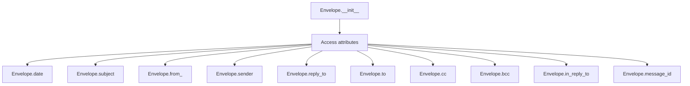
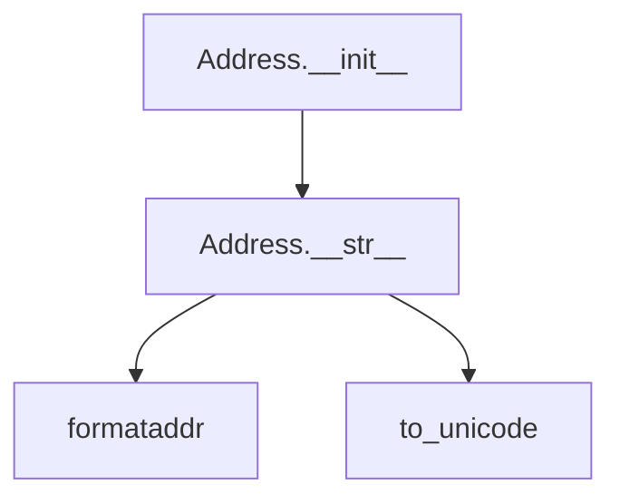
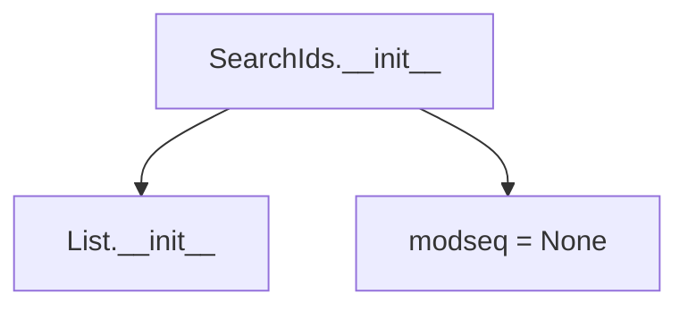

# `response_types.py`

## `imapclient.response_types.Envelope` · *class*

## Summary:
Represents the envelope information of an email message in IMAP responses, containing metadata such as date, subject, and address fields.

## Description:
The Envelope class serves as a structured container for email message metadata received from IMAP servers. It captures essential envelope information including message timing, subject line, and various address fields (from, sender, reply-to, to, cc, bcc). This class is typically created by IMAP parsing functions when processing FETCH responses containing envelope data. The class provides a standardized interface for accessing email metadata without requiring manual parsing of raw IMAP responses.

## State:
- date: Optional[datetime.datetime] - Message sending date and time, or None if not available
- subject: bytes - Subject line of the email message encoded as bytes
- from_: Optional[Tuple["Address", ...]] - Sender address information, or None if not available
- sender: Optional[Tuple["Address", ...]] - Explicit sender address information, or None if not available
- reply_to: Optional[Tuple["Address", ...]] - Reply-to address information, or None if not available
- to: Optional[Tuple["Address", ...]] - Primary recipient addresses, or None if not available
- cc: Optional[Tuple["Address", ...]] - Carbon copy recipient addresses, or None if not available
- bcc: Optional[Tuple["Address", ...]] - Blind carbon copy recipient addresses, or None if not available
- in_reply_to: bytes - Reference to parent message ID, or empty bytes if not applicable
- message_id: bytes - Unique identifier for the email message encoded as bytes

All attributes are initialized during object construction and represent parsed email envelope data from IMAP responses. The Address class is used for address fields, which contains components like name, route, mailbox, and host.

## Lifecycle:
- Creation: Instantiated with email envelope data typically by IMAP parsing functions; no required arguments as all fields are optional
- Usage: Access attributes directly to retrieve email metadata; typically used in conjunction with Address objects for address fields
- Destruction: No special cleanup required; uses standard Python garbage collection

## Method Map:


## Raises:
No exceptions are explicitly raised by the constructor. The class assumes all provided data is properly formatted and validated by the IMAP parsing layer that creates instances.

## Example:
```python
# Create an envelope instance (typically done by IMAP parser)
envelope = Envelope(
    date=datetime.datetime(2023, 1, 15, 10, 30, 0),
    subject=b"Meeting Notes",
    from_=(Address(name=b"John Doe", route=b"", mailbox=b"john", host=b"example.com"),),
    sender=None,
    reply_to=None,
    to=(Address(name=b"Jane Smith", route=b"", mailbox=b"jane", host=b"example.com"),),
    cc=None,
    bcc=None,
    in_reply_to=b"<original-message-id@example.com>",
    message_id=b"<unique-message-id@example.com>"
)

# Access envelope properties
print(envelope.subject.decode('utf-8'))  # "Meeting Notes"
print(str(envelope.from_[0]))  # "John Doe <john@example.com>"
```

## `imapclient.response_types.Address` · *class*

## Summary:
Represents an email address with name, route, mailbox, and host components for IMAP responses.

## Description:
The Address class encapsulates email address information parsed from IMAP server responses. It stores address components as bytes and provides string representation that formats them according to RFC standards. This class is typically instantiated by IMAP parsing functions when processing address-related fields in email messages.

## State:
- name: bytes - Display name portion of the address
- route: bytes - Routing information for the address
- mailbox: bytes - Mailbox name portion of the address
- host: bytes - Host domain portion of the address

All attributes are initialized during object construction and can be None/empty bytes.

## Lifecycle:
- Creation: Instantiate with bytes values for name, route, mailbox, and host parameters
- Usage: Call __str__() method to get formatted email address string
- Destruction: No special cleanup required; uses standard Python garbage collection

## Method Map:


## Raises:
No exceptions are explicitly raised by the constructor. The __str__ method converts an Address object into a formatted email address string suitable for display, handling potential encoding issues internally.

## Example:
```python
# Create an address instance
addr = Address(name=b"John Doe", route=b"", mailbox=b"john", host=b"example.com")

# Get formatted string representation
formatted = str(addr)  # Returns "John Doe <john@example.com>"
```

### `imapclient.response_types.Address.__str__` · *method*

## Summary:
Converts an Address object into a formatted email address string suitable for display.

## Description:
This method transforms the Address object's constituent parts (name, mailbox, host) into a properly formatted email address string using the standard RFC 5322 format. It handles cases where either mailbox or host may be missing by falling back to the available component. The method leverages utility functions to ensure proper Unicode handling and uses email formatting conventions.

The method is typically called when displaying email addresses in user interfaces or when preparing email headers. It's implemented as a dedicated method to encapsulate the formatting logic and avoid duplication elsewhere in the codebase.

## Args:
    None

## Returns:
    str: A formatted email address string in the format "Name <mailbox@host>" or "mailbox@host" if name is not provided.

## Raises:
    None explicitly raised

## State Changes:
    Attributes READ: self.mailbox, self.host, self.name

## Constraints:
    Preconditions: The Address object must have at least one of mailbox or host populated.
    Postconditions: The returned string follows RFC 5322 email formatting standards.

## Side Effects:
    None

## `imapclient.response_types.SearchIds` · *class*

## Summary:
A specialized list type for storing IMAP search result identifiers with optional modseq metadata.

## Description:
The SearchIds class extends Python's built-in List[int] to represent IMAP search results, adding support for optional modseq (modification sequence) tracking. This class serves as a typed container for message IDs returned by IMAP SEARCH commands, enabling efficient handling of search results while maintaining metadata about mailbox state changes.

The class is particularly useful in IMAP client implementations where synchronization with server-side mailbox modifications is required. The modseq attribute allows clients to track when search results were obtained relative to mailbox modifications.

## State:
- `modseq`: Optional[int] - Tracks the modification sequence number associated with the search results. Initially set to None, can be updated after search operations. When present, it indicates the mailbox state at the time of the search. Valid range is any positive integer or None.

## Lifecycle:
- Creation: Instantiated with zero or more integer arguments representing message IDs. The modseq attribute is initialized to None.
- Usage: Functions as a standard list of integers, with additional modseq tracking capability. No specific usage sequence required. Can be used interchangeably with regular lists of integers.
- Destruction: Inherits standard list destruction behavior; no special cleanup required.

## Method Map:


## Raises:
- No exceptions are explicitly raised by __init__.
- Inherently inherits all exceptions from List.__init__ when invalid arguments are passed (e.g., passing non-integer values when constructing from a list).

## Example:
```python
# Create empty SearchIds
ids = SearchIds()

# Create with initial message IDs
ids = SearchIds(1, 2, 3, 4, 5)

# Access as regular list
print(len(ids))  # 5
print(ids[0])    # 1

# Add message IDs
ids.append(6)
ids.extend([7, 8])

# Set modseq after search
ids.modseq = 12345

# Check modseq
if ids.modseq is not None:
    print(f"Search results from modseq {ids.modseq}")
```

### `imapclient.response_types.SearchIds.__init__` · *method*

## Summary:
Initializes a SearchIds instance with optional message IDs and sets the modseq attribute to None.

## Description:
The __init__ method constructs a SearchIds object, which is a specialized list type for storing IMAP search result identifiers. It delegates initialization to the parent List class and initializes the modseq attribute to None. This method is part of the SearchIds class lifecycle and prepares the object for subsequent operations like appending message IDs or setting modification sequence numbers.

The SearchIds class extends Python's built-in List[int] to represent IMAP search results, adding support for optional modseq (modification sequence) tracking. This enables efficient handling of search results while maintaining metadata about mailbox state changes.

## Args:
    *args (Any): Variable length argument list that gets passed to the parent List.__init__ method. Typically contains integer message IDs or is empty.

## Returns:
    None: This method does not return a value.

## Raises:
    Exception: May raise exceptions inherited from List.__init__ when invalid arguments are provided (e.g., non-integer values when constructing from a list).

## State Changes:
    Attributes READ: None
    Attributes WRITTEN: self.modseq

## Constraints:
    Preconditions: The arguments passed to *args must be compatible with List.__init__ (e.g., integers for message IDs).
    Postconditions: The SearchIds instance is initialized with the provided arguments and self.modseq is set to None.

## Side Effects:
    None: This method performs no I/O operations or external service calls.

## `imapclient.response_types.BodyData` · *class*

## Summary:
Represents structured email message body data parsed from IMAP responses, supporting both single-part and multipart message structures.

## Description:
The BodyData class serves as a container for parsed email message body content received from IMAP servers. It handles both simple (single-part) and complex (multipart) email structures by recursively parsing nested tuples into hierarchical data structures. This abstraction allows client code to work uniformly with different email message formats without needing to understand the underlying IMAP protocol response format.

## State:
- `_data`: Internal storage containing either a flat tuple of IMAP response elements for simple messages, or a nested structure for multipart messages where the first element is a list of subparts
- `is_multipart`: Property indicating whether the message contains multiple parts (True when first element is a list)

## Lifecycle:
- Creation: Instantiated via the `create` class method which parses raw IMAP response tuples into structured BodyData objects
- Usage: Access data through standard tuple indexing and use `is_multipart` property to determine structure type
- Destruction: No special cleanup required; relies on Python's garbage collection

## Method Map:
```mermaid
graph TD
    A[IMAP Response Tuple] --> B{create()}
    B --> C[BodyData Instance]
    C --> D[is_multipart Property]
    D --> E{Check first element type}
    E -->|List| F[Multipart Message]
    E -->|Not List| G[Single Part Message]
```

## Raises:
- None explicitly raised by `__init__` or `create` method
- May raise `IndexError` if response tuple is malformed or empty (inherited from tuple access)

## Example:
```python
# Creating from IMAP response
raw_response = (
    ('text', 'plain', ('charset', 'us-ascii'), None, None, '7bit', 123, 5),
    ('text', 'html', ('charset', 'us-ascii'), None, None, '7bit', 456, 10)
)
body_data = BodyData.create(raw_response)
print(body_data.is_multipart)  # True for multipart
```

### `imapclient.response_types.BodyData.create` · *method*

## Summary:
Creates a BodyData instance from an IMAP server response tuple, recursively handling multipart message structures.

## Description:
This classmethod serves as a factory for creating BodyData instances from IMAP server response tuples. When the first element of the response is a tuple (indicating a multipart message), it recursively processes the nested message parts by creating child BodyData objects for each part. For simple messages (where the first element is not a tuple), it creates a basic BodyData instance directly from the response. This method enables proper parsing of complex IMAP message structures into hierarchical BodyData objects.

## Args:
    cls: The BodyData class type (used for classmethod)
    response (Tuple[_Atom, ...]): IMAP server response tuple containing message data, where _Atom can be bytes, str, int, or tuple

## Returns:
    BodyData: A new BodyData instance representing the parsed message data, with recursive handling of multipart messages

## Raises:
    None explicitly raised

## State Changes:
    Attributes READ: None
    Attributes WRITTEN: None

## Constraints:
    Preconditions:
        - response must be a tuple of _Atom objects
        - response[0] must be either a tuple (multipart) or other _Atom type (simple)
    Postconditions:
        - Returns a valid BodyData instance
        - For multipart responses, recursively processes all nested parts into a hierarchical structure
        - The returned BodyData maintains the structural integrity of the original IMAP response

## Side Effects:
    None

### `imapclient.response_types.BodyData.is_multipart` · *method*

## Summary:
Determines whether the body data represents a multipart message by checking if the first element is a list.

## Description:
This method evaluates the structure of BodyData instances to identify if they contain multiple parts. It's typically called during IMAP message parsing when processing email content to distinguish between simple and complex message structures. The method serves as a utility for determining message composition without requiring full parsing of the entire message body.

In the BodyData class, this property examines the first element of the data structure to determine if it's a list, which indicates a multipart message structure. This is used internally during IMAP response processing to properly handle different message formats.

## Args:
    None

## Returns:
    bool: True if the body data represents a multipart message (first element is a list), False otherwise.

## Raises:
    None

## State Changes:
    Attributes READ: self[0] (accesses first element of the BodyData instance)
    Attributes WRITTEN: None

## Constraints:
    Preconditions: The BodyData instance must support indexing operations and have at least one element.
    Postconditions: Returns a boolean value indicating multipart status without modifying instance state.

## Side Effects:
    None

