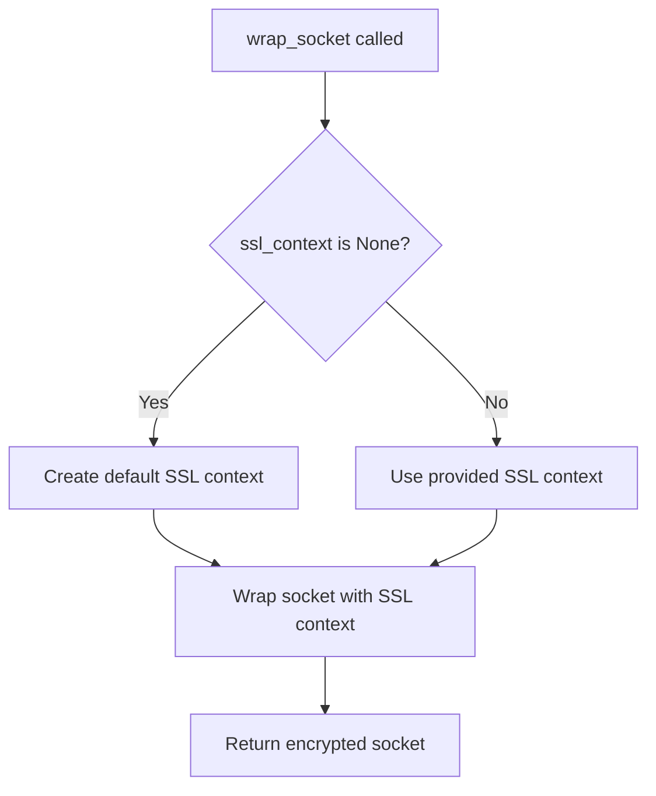

# `tls.py`

## `imapclient.tls.wrap_socket` · *function*

## Summary:
Wraps a socket with SSL/TLS encryption for secure communication with an IMAP server.

## Description:
This function takes a plain socket connection and applies SSL/TLS encryption to it, enabling secure communication with an IMAP server. It creates a default SSL context if none is provided and configures it appropriately for server authentication.

## Args:
    sock (socket.socket): The underlying socket to be wrapped with SSL/TLS encryption.
    ssl_context (Optional[ssl.SSLContext]): An existing SSL context to use for wrapping the socket. If None, a default context is created.
    host (str): The hostname of the server to which the socket connects, used for server hostname verification.

## Returns:
    socket.socket: A new socket object that wraps the original socket with SSL/TLS encryption.

## Raises:
    ssl.SSLError: If there is an error during the SSL/TLS handshake or encryption process.
    OSError: If there is a low-level error during socket operations.

## Constraints:
    Preconditions:
        - The sock parameter must be a valid, connected socket object.
        - The host parameter must be a valid hostname string.
        - The ssl_context parameter, if provided, must be a valid ssl.SSLContext instance.
    
    Postconditions:
        - The returned socket is a secure SSL/TLS wrapped version of the input socket.
        - The SSL context is properly configured for server authentication.

## Side Effects:
    - Establishes an SSL/TLS encrypted connection over the provided socket.
    - May perform network I/O during the SSL handshake process.

## Control Flow:


## Examples:
```python
import socket
import ssl
from imapclient.tls import wrap_socket

# Create a plain socket connection
sock = socket.socket(socket.AF_INET, socket.SOCK_STREAM)
sock.connect(('imap.example.com', 993))

# Wrap with SSL/TLS using default context
secure_sock = wrap_socket(sock, None, 'imap.example.com')

# Or with a custom SSL context
context = ssl.create_default_context()
secure_sock = wrap_socket(sock, context, 'imap.example.com')
```

## `imapclient.tls.IMAP4_TLS` · *class*

## Summary:
IMAP4_TLS is a subclass of imaplib.IMAP4 that provides secure IMAP communication over TLS/SSL connections.

## Description:
This class extends the standard IMAP4 client to support secure communication with IMAP servers using TLS/SSL encryption. It handles the establishment of encrypted connections and provides the necessary methods for secure data transfer. The class is designed to be used as a drop-in replacement for standard IMAP4 clients when secure connections are required.

## State:
- ssl_context: ssl.SSLContext, optional SSL context for secure connections
- _timeout: Optional[float], default timeout value for socket operations
- host: str, hostname of the IMAP server (set during open())
- port: int, port number of the IMAP server (set during open())
- sock: socket.socket, underlying secure socket connection
- file: io.BufferedReader, buffered reader for reading responses from the server

## Lifecycle:
- Creation: Instantiate with host, port, ssl_context, and optional timeout parameters
- Usage: Call open() to establish a secure TLS-encrypted connection, then use standard IMAP methods
- Destruction: Call shutdown() or use as context manager to clean up resources

## Method Map:
```mermaid
flowchart TD
    A[IMAP4_TLS.__init__] --> B[IMAP4.__init__]
    B --> C[IMAP4_TLS.open]
    C --> D[socket.create_connection]
    D --> E[wrap_socket]
    E --> F[sock.makefile("rb")]
    F --> G[IMAP4_TLS.read]
    G --> H[IMAP4_TLS.readline]
    H --> I[IMAP4_TLS.send]
    I --> J[IMAP4_TLS.shutdown]
```

## Raises:
- TypeError: If ssl_context is not an ssl.SSLContext or None
- OSError: If socket connection fails or SSL handshake fails
- ssl.SSLError: If SSL/TLS handshake fails during connection establishment

## Example:
```python
import ssl
from imapclient.tls import IMAP4_TLS

# Create secure IMAP client
context = ssl.create_default_context()
client = IMAP4_TLS('imap.example.com', 993, context)

# Connect to server
client.open()

# Perform IMAP operations
client.login('username', 'password')
client.select_folder('INBOX')
messages = client.search(['UNSEEN'])

# Close connection
client.logout()
```

### `imapclient.tls.IMAP4_TLS.__init__` · *method*

## Summary:
Initializes an IMAP4_TLS instance with SSL context and connection parameters, preparing it for secure IMAP communication.

## Description:
This method serves as the constructor for the IMAP4_TLS class, configuring TLS-specific attributes and initializing the underlying IMAP4 connection. It stores the SSL context and timeout settings, then calls the parent IMAP4 class constructor to establish the basic connection framework. This setup enables subsequent secure TLS connections to IMAP servers.

## Args:
    host (str): The hostname or IP address of the IMAP server.
    port (int): The port number to connect to on the IMAP server.
    ssl_context (Optional[ssl.SSLContext]): SSL context configuration for secure connections, or None to use default settings.
    timeout (Optional[float]): Connection timeout in seconds, or None for no timeout.

## Returns:
    None: This method initializes the object in-place and does not return a value.

## Raises:
    Exception: May raise exceptions from the parent imaplib.IMAP4.__init__ method, such as socket errors, invalid host/port combinations, or network connectivity issues.

## State Changes:
    Attributes READ: None
    Attributes WRITTEN: self.ssl_context, self._timeout, self.file

## Constraints:
    Preconditions: 
    - host must be a valid string representing a network address
    - port must be a positive integer
    - ssl_context must be either an ssl.SSLContext object or None
    - timeout must be a positive float or None
    
    Postconditions:
    - self.ssl_context is set to the provided ssl_context parameter
    - self._timeout is set to the provided timeout parameter
    - The parent IMAP4 class is properly initialized with host and port
    - self.file is declared as io.BufferedReader type (type annotation only, not initialized here)

## Side Effects:
    None: This method performs no direct I/O operations. However, the parent IMAP4.__init__ call may perform network-related setup operations during initialization.

### `imapclient.tls.IMAP4_TLS.open` · *method*

## Summary:
Establishes a secure TLS-encrypted connection to an IMAP server using the specified host, port, and timeout settings.

## Description:
This method initializes a secure connection to an IMAP server by creating a TCP socket connection and wrapping it with SSL/TLS encryption. It sets up the necessary socket infrastructure for subsequent IMAP operations, including configuring the connection timeout and establishing the secure channel.

## Args:
    host (str): The hostname or IP address of the IMAP server. Defaults to an empty string.
    port (int): The port number to connect to. Defaults to 993 (standard IMAPS port).
    timeout (Optional[float]): Connection timeout in seconds. If None, uses the instance's _timeout attribute.

## Returns:
    None: This method does not return a value.

## Raises:
    OSError: If there is a network error during socket creation or connection.
    ssl.SSLError: If there is an error during the SSL/TLS handshake process.

## State Changes:
    Attributes READ: self._timeout
    Attributes WRITTEN: self.host, self.port, self.sock, self.file

## Constraints:
    Preconditions:
        - The host parameter must be a valid hostname or IP address string.
        - The port parameter must be a valid port number (typically 993 for IMAPS).
        - The timeout parameter, if provided, must be a positive float or None.
    
    Postconditions:
        - The instance's host, port, sock, and file attributes are updated.
        - A secure SSL/TLS socket connection is established and available for IMAP operations.

## Side Effects:
    - Creates a network connection to the specified IMAP server.
    - Performs SSL/TLS handshake with the server.
    - May block for up to the specified timeout duration during connection establishment.

### `imapclient.tls.IMAP4_TLS.read` · *method*

## Summary:
Reads a specified number of bytes from the underlying file buffer.

## Description:
This method provides a direct interface to read data from the IMAP connection's file buffer. It is typically called during IMAP protocol operations when message content or command responses need to be retrieved from the network stream. The method delegates to the underlying file object's read method, which reads from the secure socket connection established by the open() method.

## Args:
    size (int): Number of bytes to read from the file buffer.

## Returns:
    bytes: The bytes read from the file buffer. May return fewer bytes than requested if end-of-file is reached or if the underlying socket connection is closed.

## Raises:
    None explicitly raised.

## State Changes:
    Attributes READ: self.file
    Attributes WRITTEN: None

## Constraints:
    Preconditions: The IMAP connection must be established and self.file must be initialized (typically via the open() method). The file buffer must be in a readable state.
    Postconditions: The file pointer advances by the number of bytes read, or to the end of the file if fewer bytes are available. The returned bytes represent the next size bytes from the connection stream.

## Side Effects:
    I/O operation on the underlying socket connection through the file buffer. May block until data becomes available or the connection is closed.

### `imapclient.tls.IMAP4_TLS.readline` · *method*

## Summary:
Reads a single line from the underlying SSL/TLS socket connection and returns it as bytes.

## Description:
This method provides a wrapper around the buffered reader's readline() method to read a single line from the IMAP server connection. It is part of the IMAP4_TLS class that extends imaplib.IMAP4 to support TLS-encrypted connections. The method is typically called during IMAP protocol communication to read server responses line by line.

## Args:
    None

## Returns:
    bytes: A single line from the IMAP server connection, including the trailing newline character. Returns empty bytes when end-of-file is reached, indicating no more data is available.

## Raises:
    IOError: If there is an error during the read operation from the underlying socket connection.
    OSError: If there is a low-level error during socket operations or I/O operations.
    Exception: If the underlying file object raises any other exception during readline operation.

## State Changes:
    Attributes READ: self.file
    Attributes WRITTEN: None

## Constraints:
    Preconditions:
        - The IMAP4_TLS instance must be properly initialized with an active SSL/TLS connection
        - The self.file attribute must be a valid BufferedReader object
        - The underlying socket connection must be established and readable
    
    Postconditions:
        - The method advances the file pointer to the beginning of the next line
        - The returned bytes contain the line data plus the newline delimiter

## Side Effects:
    - Performs I/O operations on the underlying SSL/TLS socket connection
    - May block until data is available from the network
    - Reads data from the network stream, consuming bytes from the connection

### `imapclient.tls.IMAP4_TLS.send` · *method*

## Summary:
Sends raw byte data through the TLS-encrypted socket connection.

## Description:
Transmits raw byte data over the secure socket connection established during TLS negotiation. This method serves as a direct wrapper around the underlying socket's sendall() method to ensure all data is transmitted reliably within the TLS-encrypted communication channel.

## Args:
    data (Buffer): Raw bytes to be sent over the TLS-encrypted socket connection.

## Returns:
    None: This method does not return any value.

## Raises:
    OSError: Raised when the socket connection fails or data transmission encounters an error.
    AttributeError: Raised if the socket connection (self.sock) has not been properly initialized.

## State Changes:
    Attributes READ: self.sock
    Attributes WRITTEN: None

## Constraints:
    Preconditions: The socket connection (self.sock) must be established and in a writable state. The IMAP4_TLS instance must have completed the TLS handshake process.
    Postconditions: All data in the input buffer is sent through the socket connection.

## Side Effects:
    I/O: Performs network I/O operation by sending data through the TLS-encrypted socket connection.

### `imapclient.tls.IMAP4_TLS.shutdown` · *method*

## Summary:
Closes the underlying network connection and cleans up associated resources.

## Description:
This method terminates the IMAP session by closing the underlying socket connection and cleaning up associated file handles. It delegates the actual shutdown logic to the parent `imaplib.IMAP4.shutdown()` method. This method is typically called when ending an IMAP session to ensure proper cleanup of network resources.

## Args:
    self: The IMAP4_TLS instance to shut down.

## Returns:
    None: This method does not return any value.

## Raises:
    Exception: May raise exceptions from the underlying socket or file handle closure operations, though specific exceptions depend on the platform and connection state.

## State Changes:
    Attributes READ: None
    Attributes WRITTEN: None

## Constraints:
    Preconditions: The IMAP4_TLS instance must be initialized and connected to an IMAP server.
    Postconditions: The underlying socket connection is closed, and associated file handles are cleaned up.

## Side Effects:
    I/O: Closes the underlying socket connection and file handles.
    External service calls: None

