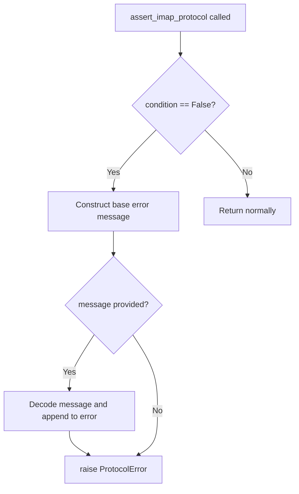

# `util.py`

## `imapclient.util.to_unicode` · *function*

## Summary:
Converts bytes or string input to a Unicode string using ASCII decoding with graceful error handling.

## Description:
This utility function standardizes input data to Unicode strings by converting bytes objects using ASCII decoding. When ASCII decoding fails, it logs a warning and applies lenient error handling to preserve as much data as possible.

## Args:
    s (Union[bytes, str]): Input data that may be either bytes or a string to be converted to Unicode.

## Returns:
    str: A Unicode string representation of the input data.

## Raises:
    None explicitly raised, but may raise UnicodeDecodeError internally during fallback handling.

## Constraints:
    Preconditions:
        - Input must be either bytes or str type.
    Postconditions:
        - Output is always a string object representing the Unicode form of the input.

## Side Effects:
    - Writes a warning message to the logger when ASCII decoding fails and fallback is used.

## Control Flow:
```mermaid
flowchart TD
    A[Input s] --> B{isinstance(s, bytes)?}
    B -- Yes --> C[Try decode("ascii")]
    C --> D{UnicodeDecodeError?}
    D -- Yes --> E[Log warning]
    E --> F[decode("ascii", "ignore")]
    D -- No --> G[Return decoded string]
    F --> G
    B -- No --> H[Return s unchanged]
    G --> I[Return result]
    H --> I
```

## Examples:
    >>> to_unicode(b"hello")
    'hello'
    >>> to_unicode("hello")
    'hello'
    >>> to_unicode(b"caf\xe9")
    'caf�'  # Warning logged due to fallback handling

## `imapclient.util.to_bytes` · *function*

## Summary:
Converts a string or bytes object to bytes using the specified character encoding.

## Description:
This utility function standardizes input to bytes format, handling both string and bytes inputs gracefully. It is commonly used in IMAP client operations where data needs to be consistently encoded as bytes for network transmission or storage.

## Args:
    s (Union[bytes, str]): Input data that can be either a string or bytes object.
    charset (str): Character encoding to use when converting strings to bytes. Defaults to "ascii".

## Returns:
    bytes: The input converted to bytes format. If input is already bytes, it is returned unchanged.

## Raises:
    UnicodeEncodeError: When the string contains characters that cannot be encoded with the specified charset.

## Constraints:
    Preconditions:
        - The charset parameter must be a valid encoding recognized by Python's encode() method.
        - Input s must be either a string or bytes object.
    Postconditions:
        - The returned value is always a bytes object.
        - If input is bytes, it is returned as-is without modification.

## Side Effects:
    None

## Control Flow:
```mermaid
flowchart TD
    A[Input s] --> B{isinstance(s, str)?}
    B -- Yes --> C[s.encode(charset)]
    B -- No --> D[s (already bytes)]
    C --> E[Return bytes]
    D --> E
```

## Examples:
    # Convert string to bytes
    result = to_bytes("hello")
    # Returns: b'hello'
    
    # Convert string with custom encoding
    result = to_bytes("café", "utf-8")
    # Returns: b'caf\xc3\xa9'
    
    # Pass bytes unchanged
    result = to_bytes(b"hello")
    # Returns: b'hello'

## `imapclient.util.assert_imap_protocol` · *function*

## Summary:
Validates IMAP protocol compliance by raising a ProtocolError when server responses violate expected protocol behavior.

## Description:
This function serves as a protocol validation checkpoint that ensures IMAP server responses conform to expected standards. It is typically called during IMAP command processing when parsing server replies to verify proper formatting and adherence to IMAP specifications. The function extracts validation logic from command processing flows to maintain clean separation between protocol handling and business logic.

## Args:
    condition (bool): The boolean expression that must evaluate to True for protocol compliance. When False, the validation fails.
    message (Optional[bytes]): Optional raw bytes message from the server that provides additional context about the protocol violation. Defaults to None.

## Returns:
    None: This function never returns normally; it raises an exception when validation fails.

## Raises:
    exceptions.ProtocolError: Raised when the condition parameter evaluates to False, indicating an IMAP protocol violation. The error message includes contextual information from the server response when provided.

## Constraints:
    Preconditions:
        - The condition argument must be a boolean value
        - When message is provided, it must be valid bytes that can be decoded with ASCII encoding
    Postconditions:
        - Function execution halts upon protocol violation detection
        - No return value is produced on successful validation

## Side Effects:
    None: This function performs no I/O operations or external state mutations. It only raises an exception when validation fails.

## Control Flow:


## Examples:
```python
# Valid protocol case - no exception raised
assert_imap_protocol(True)

# Invalid protocol case with message
server_response = b"BAD unexpected syntax"
assert_imap_protocol(False, server_response)
# Raises: exceptions.ProtocolError("Server replied with a response that violates the IMAP protocol: BAD unexpected syntax")
```

## `imapclient.util.chunk` · *function*

## Summary:
Splits a sequence into fixed-size chunks for batch processing.

## Description:
Divides an input sequence into smaller subsequences of a specified maximum size. This utility function is commonly used to process large datasets in manageable batches, particularly useful for operations that benefit from chunked processing such as database queries, API requests, or file operations.

The function handles edge cases gracefully, returning an empty iterator when given an empty sequence or when the chunk size is zero or negative.

## Args:
    lst (tuple/list): The input sequence to be split into chunks. Can be any sequence type (list, tuple, string, etc.) that supports slicing.
    size (int): The maximum number of elements in each chunk. Must be a positive integer.

## Returns:
    Iterator[tuple/list]: An iterator that yields successive chunks of the input sequence, each of size at most `size`.

## Raises:
    None

## Constraints:
    Preconditions:
        - The input `lst` must be a sequence type that supports indexing and slicing operations.
        - The `size` parameter must be a positive integer (size > 0).
    Postconditions:
        - Each yielded chunk will contain at most `size` elements from the original sequence.
        - The concatenation of all yielded chunks will reconstruct the original sequence.

## Side Effects:
    None

## Control Flow:
```mermaid
flowchart TD
    A[Start chunk() with lst, size] --> B{size <= 0?}
    B -- Yes --> C[Return empty iterator]
    B -- No --> D{len(lst) == 0?}
    D -- Yes --> E[Return empty iterator]
    D -- No --> F[Initialize i = 0]
    F --> G{i < len(lst)?}
    G -- No --> H[Stop iteration]
    G -- Yes --> I[Yield lst[i:i+size]]
    I --> J[i += size]
    J --> G
```

## Examples:
    >>> list(chunk([1, 2, 3, 4, 5], 2))
    [[1, 2], [3, 4], [5]]
    
    >>> list(chunk("abcdefgh", 3))
    ['abc', 'def', 'gh']
    
    >>> list(chunk([], 5))
    []
    
    >>> list(chunk([1, 2, 3], 0))
    []
```

