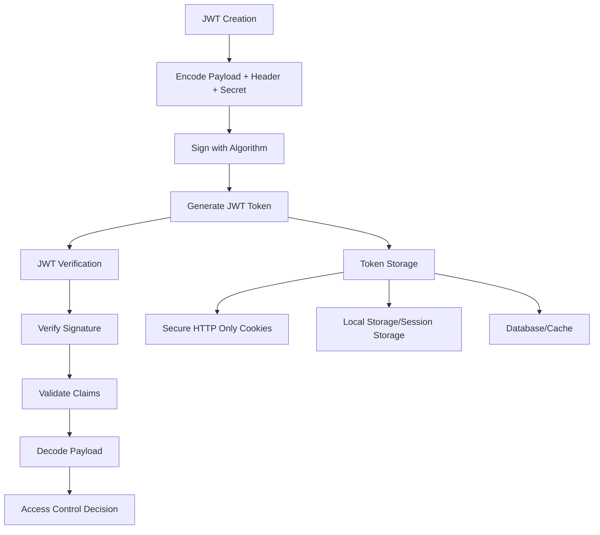

# `PyJWT`

# PyJWT Repository Documentation

## Tree
```
PyJWT/
├── docs/
│   └── conf.py
└── jwt/
```

## Purpose
PyJWT (JSON Web Token) is a Python library that implements JSON Web Token (JWT) specifications for secure token creation and verification. It enables developers to encode, decode, and verify JWTs, which are commonly used for authentication, information exchange, and secure communication between parties.

The library addresses the need for standardized, interoperable token-based authentication and authorization systems in modern web applications and APIs. It provides a robust, secure implementation of JWT standards while maintaining simplicity and ease of use.

### Target Users
- Backend developers building authentication systems
- API developers implementing token-based security
- Security engineers requiring JWT compliance
- Full-stack developers integrating authentication flows

### Scenarios
- User authentication and session management
- API authorization and access control
- Secure information exchange between services
- Single Sign-On (SSO) implementations

### Position in Ecosystem
PyJWT is a standalone cryptographic library that serves as a foundational component for JWT-based authentication systems. It integrates with web frameworks like Flask, Django, FastAPI, and others to provide JWT functionality. It operates as a low-level security primitive that other authentication libraries and frameworks can build upon.

## Architecture


Key architectural patterns:
- **Cryptographic Abstraction**: Provides clean interfaces for various signing algorithms
- **Modular Design**: Separates encoding, decoding, and verification concerns
- **Algorithm Flexibility**: Supports multiple signing methods (HS256, RS256, ES256, etc.)
- **Security First**: Implements proper cryptographic practices and validation

## Entry Points
### Importable APIs
- `jwt.encode(payload, secret, algorithm)` - Creates JWT tokens
- `jwt.decode(token, secret, algorithms)` - Verifies and decodes JWT tokens
- `jwt.get_unverified_header(token)` - Extracts header without verification
- `jwt.get_unverified_claims(token)` - Extracts payload without verification

### Target Audience
- Developers building authentication systems
- API consumers requiring JWT handling
- Security-focused applications needing token validation

## Core Features
1. **JWT Encoding** - Create signed JWT tokens from payloads
2. **JWT Decoding** - Verify and extract data from JWT tokens
3. **Multiple Algorithms** - Support for HS256, HS384, HS512, RS256, ES256, PS256, and more
4. **Claim Validation** - Built-in validation of standard claims (exp, iat, nbf, etc.)
5. **Header Access** - Direct access to token headers without verification
6. **Unverified Access** - Safe access to token contents without validation
7. **Custom Claims** - Support for application-specific claims
8. **Error Handling** - Comprehensive exception types for different failure modes

## Dependencies
- Python 3.7+
- Cryptographic libraries (via `cryptography` package for RSA/ECDSA algorithms)
- Standard library modules (`hashlib`, `hmac`, `base64`, `json`, `time`, `datetime`)

## Configuration
No configuration files or environment variables are required for basic operation. The library uses sensible defaults for all cryptographic parameters.

## Extension Points
- **Custom Algorithms**: Implement custom signing/verification algorithms
- **Custom Validators**: Add custom claim validation logic
- **Middleware Integration**: Extend with framework-specific middleware
- **Storage Adapters**: Custom token storage mechanisms

---

## Modules

- [`docs`](docs.md)
- [`jwt`](jwt.md)

