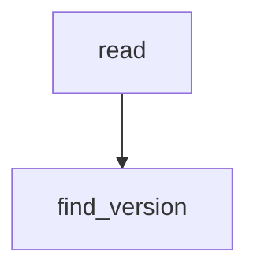

# `docs`

## Tree:
```
docs/
└── conf.py
```

## Role:
Manages configuration and utility functions for documentation builds, particularly for extracting package version information.

## Description:
The `docs.conf` module serves as a configuration and utility module specifically designed for documentation builds, most notably for projects using Sphinx. It provides helper functions to read files relative to the documentation directory and extract version information from Python packages, ensuring that documentation reflects the correct package version at build time.

### Primary Consumers:
- Sphinx documentation build system
- CI/CD pipelines that generate documentation artifacts
- Documentation generation scripts

### Cohesion Principle:
This module groups together file reading utilities and version extraction logic that are commonly needed during documentation builds. These functionalities share the common theme of accessing project metadata and configuration files from the documentation context.

## Components:
- `read(*parts: str) -> str`: Reads file contents relative to the current module's directory.
- `find_version(*file_paths: str) -> str`: Extracts version string from a Python file containing `__version__`.



## Public API:
- `read(*parts: str) -> str`: Reads a file at a path constructed from the given parts relative to the current module's directory.
- `find_version(*file_paths: str) -> str`: Extracts the version string from a Python file containing a `__version__` variable.

## Dependencies:
- Standard library modules: `os`, `pathlib`, `re`
- No external dependencies

## Constraints:
- All file paths used in `read()` and `find_version()` must be relative to the `docs/conf.py` directory.
- The `find_version()` function assumes the version is declared in the format `__version__ = "x.y.z"` or `__version__ = 'x.y.z'`.
- Both functions require appropriate file permissions to read the target files.

---

## Files

- [`conf.py`](docs/conf.md)

