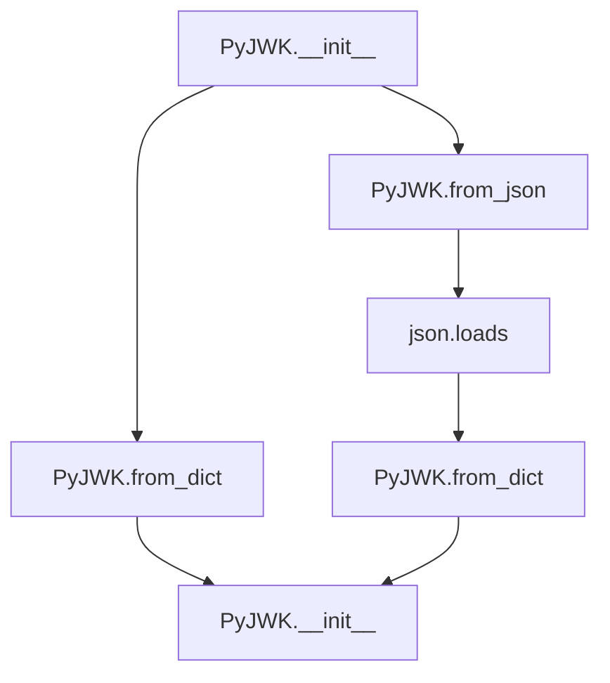
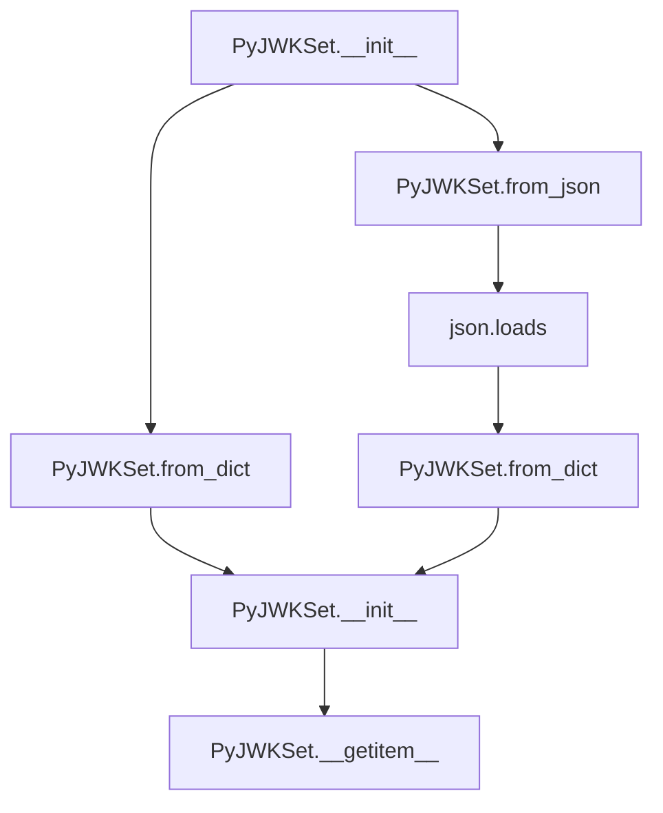
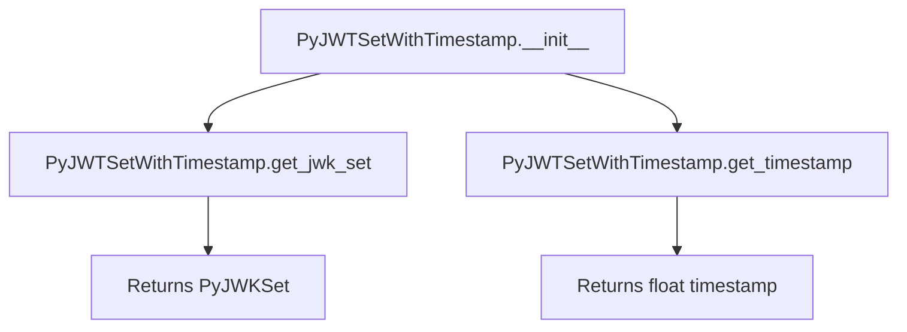

# `api_jwk.py`

## `jwt.api_jwk.PyJWK` · *class*

## Summary:
Represents a JSON Web Key (JWK) with associated cryptographic algorithm and key material for JWT operations.

## Description:
The PyJWK class serves as a wrapper around JSON Web Key data, providing standardized access to cryptographic keys used in JWT signing and verification. It handles key type detection, algorithm selection, and key material conversion from JWK format to usable cryptographic objects. This class is typically instantiated through factory methods like `from_dict()` or `from_json()` rather than direct construction.

## State:
- `_algorithms`: Dictionary mapping algorithm names to their corresponding algorithm classes, populated by calling `get_default_algorithms()`
- `_jwk_data`: Dictionary containing the raw JWK data passed during initialization
- `Algorithm`: Class reference to the cryptographic algorithm handler for this key
- `key`: The actual cryptographic key object created by calling `Algorithm.from_jwk()`

## Lifecycle:
- Creation: Instantiate via `PyJWK.from_dict()` or `PyJWK.from_json()` static methods, or directly with `PyJWK(jwk_data, algorithm)`
- Usage: Access properties like `key_type`, `key_id`, `public_key_use` or use the `key` attribute for cryptographic operations
- Destruction: No special cleanup required; relies on Python's garbage collection

## Method Map:


## Raises:
- `InvalidKeyError`: When required JWK fields like "kty" are missing or unsupported key types/crv values are encountered
- `PyJWKError`: When cryptographic algorithms are not available due to missing dependencies or when unable to find an algorithm for the given key

## Example:
```python
# Create from dictionary
jwk_dict = {"kty": "RSA", "n": "...", "e": "..."}
key = PyJWK.from_dict(jwk_dict)

# Create from JSON string
jwk_json = '{"kty": "EC", "crv": "P-256", "x": "...", "y": "..."}'
key = PyJWK.from_json(jwk_json)

# Access key properties
print(key.key_type)  # "RSA" or "EC"
print(key.key_id)    # Key ID if present
print(key.public_key_use)  # Public key usage if present
```

### `jwt.api_jwk.PyJWK.__init__` · *method*

## Summary:
Initializes a PyJWK object by processing JWK data and determining the appropriate cryptographic algorithm based on key type and parameters.

## Description:
The `__init__` method configures a PyJWK instance by validating the provided JWK data structure, inferring the cryptographic algorithm when not explicitly specified, and initializing the cryptographic key. This method serves as the primary constructor that prepares the object for cryptographic operations by setting up the appropriate algorithm class and key data.

## Args:
    jwk_data (JWKDict): A dictionary containing the JSON Web Key data with required fields such as 'kty' (key type).
    algorithm (str | None): Optional cryptographic algorithm. If not provided, it's automatically inferred from the JWK data based on key type and curve parameters.

## Returns:
    None: This method initializes the object's internal state and does not return a value.

## Raises:
    InvalidKeyError: When required key parameters like 'kty', 'crv' are missing or when encountering unsupported key types or curves.
    PyJWKError: When a required cryptographic library is not installed for the selected algorithm, or when unable to find an algorithm for the provided key.

## State Changes:
    Attributes READ: self._jwk_data
    Attributes WRITTEN: self._algorithms, self._jwk_data, self.Algorithm, self.key

## Constraints:
    Preconditions:
        - The jwk_data must be a dictionary containing valid JWK parameters.
        - The 'kty' field must be present in jwk_data.
    Postconditions:
        - self.Algorithm is set to a valid algorithm class from the loaded algorithms.
        - self.key is initialized with the proper key data from the JWK.
        - The algorithm is properly inferred for EC, RSA, oct, and OKP key types.

## Side Effects:
    None: This method performs no I/O or external service calls. It only manipulates internal object state.

## Algorithm Inference Logic:
When no explicit algorithm is provided, the method infers it based on key type:
- EC keys: Uses ES256 (P-256 or unspecified), ES384 (P-384), ES512 (P-521), or ES256K (secp256k1)
- RSA keys: Uses RS256
- oct keys: Uses HS256
- OKP keys: Uses EdDSA for Ed25519 curve, raises error for other curves

## Usage Context:
This method is typically called during the instantiation of PyJWK objects when loading keys from JWK format for cryptographic operations such as signing or verification.

### `jwt.api_jwk.PyJWK.from_dict` · *method*

## Summary:
Creates a new PyJWK instance from a dictionary representation of a JSON Web Key.

## Description:
This static method serves as a factory constructor for creating PyJWK objects from JWK dictionary data. It provides a clean interface for instantiating JWK objects while handling the underlying initialization logic. The method is typically called during JWT processing workflows when converting JWK data from JSON format into usable key objects.

## Args:
    obj (JWKDict): A dictionary containing the JSON Web Key data
    algorithm (str | None, optional): The algorithm associated with the key. If not provided, the algorithm will be inferred from the key data itself. Defaults to None.

## Returns:
    PyJWK: A new PyJWK instance initialized with the provided key data and algorithm

## Raises:
    InvalidKeyError: When the key data is missing required fields like 'kty', or contains unsupported key types/crv values
    PyJWKError: When the required cryptographic libraries are not installed for the specified algorithm, or when an algorithm cannot be found for the key

## State Changes:
    Attributes READ: None
    Attributes WRITTEN: None

## Constraints:
    Preconditions: The obj parameter must be a valid JWK dictionary with proper structure
    Postconditions: The returned PyJWK instance will have properly initialized Algorithm and key attributes

## Side Effects:
    None

### `jwt.api_jwk.PyJWK.from_json` · *method*

## Summary:
Creates a new PyJWK instance from a JSON string representation of a JSON Web Key.

## Description:
This static method serves as a factory constructor for creating PyJWK objects from JSON-formatted JWK data. It parses the JSON string into a dictionary and delegates to the `from_dict` method for actual object creation. This method is typically called during JWT processing workflows when converting JWK data from JSON format into usable key objects.

## Args:
    data (str): A JSON string containing the JSON Web Key data
    algorithm (None, optional): The algorithm associated with the key. If not provided, the algorithm will be inferred from the key data itself. Defaults to None.

## Returns:
    PyJWK: A new PyJWK instance initialized with the parsed key data and algorithm

## Raises:
    json.JSONDecodeError: When the input data string is not valid JSON
    InvalidKeyError: When the key data is missing required fields like 'kty', or contains unsupported key types/crv values
    PyJWKError: When the required cryptographic libraries are not installed for the specified algorithm, or when an algorithm cannot be found for the key

## State Changes:
    Attributes READ: None
    Attributes WRITTEN: None

## Constraints:
    Preconditions: The data parameter must be a valid JSON string representing a JWK
    Postconditions: The returned PyJWK instance will have properly initialized Algorithm and key attributes

## Side Effects:
    None

### `jwt.api_jwk.PyJWK.key_type` · *method*

## Summary:
Returns the key type identifier from the JWK data structure.

## Description:
This method extracts the "kty" (key type) parameter from the internal JWK data dictionary. It serves as a convenient accessor for the cryptographic key type, which is essential for determining how to process and validate the key.

## Args:
    None

## Returns:
    str | None: The key type string (e.g., "RSA", "EC", "oct") if present in the JWK data, otherwise None.

## Raises:
    None

## State Changes:
    Attributes READ: self._jwk_data
    Attributes WRITTEN: None

## Constraints:
    Preconditions: The instance must have a valid _jwk_data attribute containing a dictionary.
    Postconditions: The returned value is either a string representing the key type or None.

## Side Effects:
    None

### `jwt.api_jwk.PyJWK.key_id` · *method*

## Summary:
Returns the key identifier (kid) from the JWK data, or None if not present.

## Description:
This property extracts the "kid" (key ID) field from the underlying JWK data dictionary. It serves as a convenient accessor for the key identifier that is commonly used for key selection and management in JWT operations.

## Args:
    None

## Returns:
    str | None: The key identifier string if present in the JWK data, otherwise None.

## Raises:
    None

## State Changes:
    Attributes READ: self._jwk_data
    Attributes WRITTEN: None

## Constraints:
    Preconditions: The instance must have been initialized with valid JWK data.
    Postconditions: The returned value is either a string representing the key ID or None.

## Side Effects:
    None

### `jwt.api_jwk.PyJWK.public_key_use` · *method*

## Summary:
Returns the public key use identifier from the JWK data.

## Description:
This method retrieves the "use" parameter from the JWK (JSON Web Key) data structure, which indicates the intended use of the key such as "sig" for signing or "enc" for encryption. It serves as a getter for the key's usage attribute.

## Args:
    self: The PyJWK instance containing the JWK data.

## Returns:
    str | None: The value of the "use" field from the JWK data, or None if the field is not present.

## Raises:
    None explicitly raised.

## State Changes:
    Attributes READ: self._jwk_data
    Attributes WRITTEN: None

## Constraints:
    Preconditions: The PyJWK instance must have been initialized with valid JWK data.
    Postconditions: The returned value is either a string representing the key use or None.

## Side Effects:
    None.

## `jwt.api_jwk.PyJWKSet` · *class*

## Summary:
A container class for managing a collection of JSON Web Keys (JWKs) used in JWT operations.

## Description:
The PyJWKSet class represents a collection of JSON Web Keys that can be used for signing, verifying, encrypting, or decrypting JWT tokens. It provides methods for creating instances from various data formats and accessing individual keys by their key IDs. This class acts as a central repository for cryptographic keys in JWT workflows, enabling efficient key management and retrieval.

## State:
- `keys`: list[PyJWK] - A list of PyJWK objects representing the individual keys in this set. This list is populated during initialization and cannot be empty after successful construction.

## Lifecycle:
- Creation: Instances are created through static factory methods `from_dict()` or `from_json()`, or directly via the constructor with a list of JWK dictionaries
- Usage: Keys can be accessed using bracket notation (`jwk_set["key_id"]`) or by iterating over the `keys` attribute
- Destruction: No special cleanup required; relies on Python's garbage collection

## Method Map:


## Raises:
- `PyJWKSetError`: Raised when the input keys list is empty, not a list, or contains no usable keys after processing
- `KeyError`: Raised when attempting to access a key by ID that doesn't exist in the set

## Example:
```python
# Create from JSON string
jwks_json = '''
{
  "keys": [
    {
      "kty": "RSA",
      "n": "0vx7agoebGcQSuuPiLJXZptN9nndrQmbXEps2aiAFb...s",
      "e": "AQAB",
      "alg": "RS256",
      "kid": "abc123"
    }
  ]
}
'''
jwk_set = PyJWKSet.from_json(jwks_json)

# Access a key by ID
key = jwk_set["abc123"]

# Iterate through all keys
for key in jwk_set.keys:
    print(key.key_type)
```

### `jwt.api_jwk.PyJWKSet.__init__` · *method*

## Summary:
Initializes a PyJWKSet object by validating and processing a list of JWK dictionaries into usable PyJWK objects.

## Description:
The `__init__` method serves as the constructor for the PyJWKSet class, responsible for transforming a list of JSON Web Key (JWK) dictionaries into a collection of PyJWK objects that can be used for JWT operations. This method validates the input structure, attempts to create PyJWK instances for each key, and ensures that at least one usable key exists in the set.

## Args:
    keys (list[JWKDict]): A list of dictionaries representing JSON Web Keys. Each dictionary must conform to the JWK specification.

## Returns:
    None: This method initializes the object's state and does not return any value.

## Raises:
    PyJWKSetError: Raised when the input keys list is empty, not a list type, or contains no usable keys after processing.

## State Changes:
    Attributes READ: None
    Attributes WRITTEN: self.keys

## Constraints:
    Preconditions:
        - The `keys` argument must be a list-like object
        - Each item in the list must be a valid JWK dictionary
    Postconditions:
        - self.keys will contain a list of PyJWK objects
        - If successful, self.keys will not be empty
        - All keys in self.keys will be valid PyJWK instances that can be used for cryptographic operations

## Side Effects:
    None: This method performs no I/O operations or external service calls. It only processes the input data and creates internal objects.

### `jwt.api_jwk.PyJWKSet.from_dict` · *method*

## Summary:
Creates a new PyJWKSet instance from a dictionary representation containing JWK keys.

## Description:
This static method serves as a factory constructor for creating PyJWKSet instances from JSON-like dictionary objects. It extracts the "keys" array from the input dictionary and passes it to the PyJWKSet constructor. This method enables convenient instantiation of JWK sets from parsed JSON data or other dictionary-based sources.

## Args:
    obj (dict[str, Any]): A dictionary containing a "keys" key with a list of JWK dictionaries as its value.

## Returns:
    PyJWKSet: A new PyJWKSet instance initialized with the keys extracted from the input dictionary.

## Raises:
    PyJWKSetError: If the keys list is empty or invalid, or if no usable keys are found after processing.

## State Changes:
    - Attributes READ: None
    - Attributes WRITTEN: None (creates new instance)

## Constraints:
    - Preconditions: The input dictionary must be a valid dictionary object.
    - Postconditions: The returned PyJWKSet instance contains valid JWK objects or raises an appropriate error.

## Side Effects:
    - None

### `jwt.api_jwk.PyJWKSet.from_json` · *method*

## Summary:
Creates a new PyJWKSet instance from a JSON string representation containing JWK keys.

## Description:
This static method serves as a factory constructor for creating PyJWKSet instances from JSON-formatted strings. It parses the input JSON string into a Python dictionary using standard JSON parsing, then delegates to the `from_dict` method to construct the actual PyJWKSet object. This method enables convenient instantiation of JWK sets from JSON data commonly encountered in JWT operations and key management workflows.

The method exists as a separate utility to provide a clean, standardized way to create JWK sets from JSON strings without requiring manual JSON parsing in client code. It follows the pattern of having dedicated parsing methods for different input formats (JSON string vs. dictionary).

## Args:
    data (str): A JSON string containing a JWK Set structure with a "keys" array of JWK dictionaries

## Returns:
    PyJWKSet: A new PyJWKSet instance initialized with the keys parsed from the JSON string

## Raises:
    json.JSONDecodeError: When the input string is not valid JSON format
    PyJWKSetError: If the parsed JSON does not contain valid JWK data or if no usable keys are found after processing

## State Changes:
    - Attributes READ: None
    - Attributes WRITTEN: None (creates new instance)

## Constraints:
    - Preconditions: The data parameter must be a valid JSON string representing a JWK Set structure
    - Postconditions: The returned PyJWKSet instance contains valid JWK objects or raises an appropriate error

## Side Effects:
    - Parses JSON string into Python dictionary
    - May raise JSON decoding errors if input is malformed

### `jwt.api_jwk.PyJWKSet.__getitem__` · *method*

## Summary:
Retrieves a JWK from the key set by its key ID.

## Description:
This method provides dictionary-like access to the JWK set by searching for a key with a matching key ID. It is designed to be used with bracket notation (e.g., `jwk_set["key_id"]`) to fetch specific keys from the collection.

## Args:
    kid (str): The key ID to search for within the key set.

## Returns:
    PyJWK: The JWK object that matches the provided key ID.

## Raises:
    KeyError: When no key in the key set has a matching key ID.

## State Changes:
    Attributes READ: self.keys
    Attributes WRITTEN: None

## Constraints:
    Preconditions: The key set must be initialized with keys and the kid argument must be a non-empty string.
    Postconditions: The returned key object maintains its original properties and is not modified by this operation.

## Side Effects:
    None

## `jwt.api_jwk.PyJWTSetWithTimestamp` · *class*

## Summary:
A wrapper class that associates a PyJWKSet with a timestamp for tracking when it was created or last updated.

## Description:
The PyJWTSetWithTimestamp class serves as a container that pairs a PyJWKSet object with a timestamp. This abstraction enables tracking of when a key set was created or last accessed, which is useful for implementing cache invalidation, key rotation policies, or monitoring key set freshness in JWT operations. The class is typically instantiated by the PyJWTSetCache to manage cached key sets with timestamps.

## State:
- `jwk_set`: PyJWKSet - The underlying key set object that this wrapper contains. This attribute is initialized in __init__ and cannot be None. The PyJWKSet can be created through various methods including from_dict(), from_json(), or directly via constructor.
- `timestamp`: float - A monotonic timestamp indicating when this wrapper was created. The timestamp is obtained using time.monotonic() and represents elapsed time since an unspecified starting point.

## Lifecycle:
- Creation: Instantiated by passing a PyJWKSet object to the constructor. The timestamp is automatically recorded using time.monotonic(). The PyJWKSet itself can be created through various factory methods.
- Usage: Typically accessed through get_jwk_set() and get_timestamp() methods to retrieve the wrapped key set and its associated timestamp.
- Destruction: No special cleanup required; relies on Python's garbage collection.

## Method Map:


## Raises:
- No exceptions are explicitly raised by the constructor.

## Example:
```python
# Create a PyJWKSet using one of the standard factory methods
jwk_set = PyJWKSet.from_dict({"keys": [...]})

# Wrap it with a timestamp
wrapped_set = PyJWTSetWithTimestamp(jwk_set)

# Retrieve the wrapped key set and timestamp
retrieved_jwk_set = wrapped_set.get_jwk_set()
timestamp = wrapped_set.get_timestamp()
```

### `jwt.api_jwk.PyJWTSetWithTimestamp.__init__` · *method*

## Summary:
Initializes a PyJWTSetWithTimestamp wrapper with a PyJWKSet and records the current timestamp.

## Description:
The `__init__` method constructs a PyJWTSetWithTimestamp instance by associating a provided PyJWKSet with a timestamp. This timestamp is captured using `time.monotonic()` to track when the wrapper was created, enabling features like cache invalidation or key set freshness monitoring. The method serves as the primary constructor for this wrapper class, ensuring that each instance maintains both the key set and its creation time.

## Args:
    jwk_set (PyJWKSet): The PyJWKSet object to be wrapped. Must be a valid PyJWKSet instance containing a collection of JSON Web Keys used for JWT operations; cannot be None.

## Returns:
    None: This method does not return a value.

## Raises:
    No exceptions are explicitly raised by this method.

## State Changes:
    Attributes READ: None
    Attributes WRITTEN: 
        - self.jwk_set: Assigned the provided PyJWKSet instance
        - self.timestamp: Assigned the current monotonic timestamp from time.monotonic()

## Constraints:
    Preconditions:
        - The `jwk_set` argument must be a valid PyJWKSet instance containing a collection of JSON Web Keys.
    Postconditions:
        - The instance will have `self.jwk_set` set to the provided `jwk_set`.
        - The instance will have `self.timestamp` set to the result of `time.monotonic()` at initialization time.

## Side Effects:
    None: This method performs no I/O operations or external service calls. It only assigns attributes to the instance.

### `jwt.api_jwk.PyJWTSetWithTimestamp.get_jwk_set` · *method*

## Summary:
Returns the JWK set stored in the timestamped JWT set wrapper.

## Description:
This method provides access to the underlying JWK set instance that is encapsulated within the PyJWTSetWithTimestamp wrapper. It serves as a simple getter to retrieve the JWK set without modifying the wrapper's state.

## Args:
    None

## Returns:
    PyJWKSet: The JWK set instance currently stored in the wrapper.

## Raises:
    None

## State Changes:
    Attributes READ: self.jwk_set
    Attributes WRITTEN: None

## Constraints:
    Preconditions: The PyJWTSetWithTimestamp instance must have been properly initialized with a valid JWK set.
    Postconditions: The returned JWK set instance maintains the same state as originally stored in self.jwk_set.

## Side Effects:
    None

### `jwt.api_jwk.PyJWTSetWithTimestamp.get_timestamp` · *method*

## Summary:
Returns the timestamp when this JWT key set was created or last updated.

## Description:
This method provides access to the timestamp attribute that tracks when the PyJWTSetWithTimestamp instance was initialized. It serves as a getter method for the internal timestamp field, enabling clients to determine the age or freshness of the key set.

## Args:
    None

## Returns:
    float: The timestamp value representing when this key set was created or last updated, measured in seconds since an unspecified epoch.

## Raises:
    None

## State Changes:
    Attributes READ: self.timestamp
    Attributes WRITTEN: None

## Constraints:
    Preconditions: The instance must have been properly initialized with a valid PyJWKSet and timestamp.
    Postconditions: The returned timestamp value remains unchanged after the initial creation of the instance.

## Side Effects:
    None

