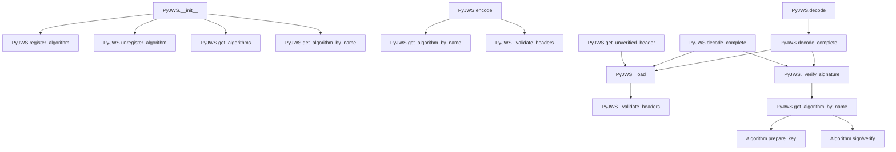

# `api_jws.py`

## `jwt.api_jws.PyJWS` · *class*

## Summary:
A class for creating and verifying JSON Web Signatures (JWS) that manages cryptographic algorithms and handles JWT encoding/decoding operations.

## Description:
The PyJWS class serves as the primary interface for working with JSON Web Signatures in the pyjwt library. It provides methods for encoding payloads into signed JWT tokens and decoding existing JWT tokens while verifying their signatures. The class maintains a registry of available cryptographic algorithms and allows dynamic registration/unregistration of custom algorithms.

This class is typically instantiated by the main JWT library interface and used internally for JWS operations. It's designed to be flexible, supporting various cryptographic algorithms and providing options for signature verification control.

## State:
- `_algorithms`: dict[str, Algorithm] - Maps algorithm names to their implementation objects. Initialized with default algorithms from `get_default_algorithms()`.
- `_valid_algs`: set[str] - Set of currently valid algorithm names that can be used for signing/verification.
- `options`: dict[str, bool] - Configuration options, including `verify_signature` which controls whether signature verification occurs during decoding.

## Lifecycle:
- Creation: Instantiate with optional `algorithms` list and `options` dictionary. Algorithms are filtered from defaults based on the provided list.
- Usage: Call `encode()` to create signed JWTs or `decode()`/`decode_complete()` to validate and extract JWT data. 
- Destruction: No explicit cleanup required; standard Python garbage collection applies.

## Method Map:


## Raises:
- `ValueError`: When attempting to register an algorithm that already exists.
- `TypeError`: When trying to register a non-Algorithm object.
- `KeyError`: When attempting to unregister a non-existent algorithm.
- `DecodeError`: During token parsing when segments are invalid or missing.
- `InvalidAlgorithmError`: When an unsupported or unspecified algorithm is encountered.
- `InvalidSignatureError`: When signature verification fails.
- `NotImplementedError`: When a required cryptographic algorithm is not available due to missing dependencies.

## Example:
```python
# Create a PyJWS instance
jws = PyJWS(algorithms=['HS256'])

# Encode a payload
payload = b'{"sub":"1234567890","name":"John Doe","iat":1516239022}'
token = jws.encode(payload, 'secret', algorithm='HS256')

# Decode and verify the token
decoded = jws.decode(token, 'secret', algorithms=['HS256'])
print(decoded)  # b'{"sub":"1234567890","name":"John Doe","iat":1516239022}'
```

### `jwt.api_jws.PyJWS.__init__` · *method*

## Summary:
Initializes a PyJWS instance with specified algorithms and verification options.

## Description:
Configures the PyJWS object by setting up available cryptographic algorithms and verification options. This method establishes the valid algorithms that can be used for JWT signature verification and initializes the default verification options, allowing customization of the JWT validation process. The initialization process filters the default algorithms to only include those specified in the algorithms parameter.

## Args:
    algorithms (list[str] | None): List of algorithm names to allow for signature verification. If None, all default algorithms are used. Defaults to None.
    options (dict[str, Any] | None): Dictionary of verification options to override defaults. If None, uses default options. Defaults to None.

## Returns:
    None

## Raises:
    None

## State Changes:
    Attributes READ: 
        - self._algorithms (during filtering process)
    Attributes WRITTEN: 
        - self._algorithms: Dictionary mapping algorithm names to algorithm implementations, filtered to only include valid algorithms
        - self._valid_algs: Set of valid algorithm names
        - self.options: Dictionary of verification options merged with defaults

## Constraints:
    Preconditions:
        - algorithms parameter must be a list of strings or None
        - options parameter must be a dictionary or None
    Postconditions:
        - self._algorithms contains only the algorithms specified in the algorithms parameter or all default algorithms
        - self._valid_algs contains the set of valid algorithm names
        - self.options contains the merged default and custom options

## Side Effects:
    None

### `jwt.api_jws.PyJWS._get_default_options` · *method*

## Summary:
Returns the default configuration options for JWT signature verification.

## Description:
This static method provides the default options dictionary that controls the behavior of JWT verification operations. It is called during the initialization of the PyJWS class to establish baseline verification settings. The method ensures that signature verification is enabled by default, which is a security best practice.

## Args:
    None

## Returns:
    dict[str, bool]: A dictionary containing default verification options with "verify_signature" set to True.

## Raises:
    None

## State Changes:
    None

## Constraints:
    None

## Side Effects:
    None

### `jwt.api_jws.PyJWS.register_algorithm` · *method*

## Summary:
Registers a new cryptographic algorithm handler with the JWT signing instance.

## Description:
This method allows extending the PyJWS class with custom algorithm implementations by associating an algorithm identifier with its corresponding algorithm object. It is typically called during application initialization or configuration to add support for additional signing algorithms beyond the default set.

## Args:
    alg_id (str): Unique identifier for the algorithm (e.g., "RS256")
    alg_obj (Algorithm): Instance of an Algorithm subclass implementing the signing/verification logic

## Returns:
    None: This method does not return any value

## Raises:
    ValueError: When attempting to register an algorithm with an ID that already exists
    TypeError: When the provided alg_obj is not an instance of the Algorithm class

## State Changes:
    Attributes READ: self._algorithms, self._valid_algs
    Attributes WRITTEN: self._algorithms, self._valid_algs

## Constraints:
    Preconditions: 
    - The alg_id must be a string that is not already present in self._algorithms
    - The alg_obj must be an instance of the Algorithm class
    Postconditions:
    - The algorithm mapping is added to self._algorithms dictionary
    - The algorithm identifier is added to the self._valid_algs set

## Side Effects:
    None: This method performs only in-memory operations and has no external side effects

### `jwt.api_jws.PyJWS.unregister_algorithm` · *method*

## Summary:
Removes a cryptographic algorithm from the set of registered algorithms and valid algorithms.

## Description:
This method removes a specified algorithm identifier from both the internal registry of registered algorithms and the list of valid algorithms. It ensures that the algorithm can no longer be used for JWT signing or verification operations. This method is typically called to remove deprecated or insecure algorithms from the available set.

## Args:
    alg_id (str): The identifier of the algorithm to be unregistered.

## Returns:
    None: This method does not return any value.

## Raises:
    KeyError: Raised when attempting to unregister an algorithm that is not currently registered.

## State Changes:
    Attributes READ: self._algorithms, self._valid_algs
    Attributes WRITTEN: self._algorithms, self._valid_algs

## Constraints:
    Preconditions: The algorithm identifier must exist in self._algorithms.
    Postconditions: The algorithm identifier will be removed from both self._algorithms and self._valid_algs dictionaries/lists.

## Side Effects:
    None: This method only modifies internal state and does not perform any I/O or external service calls.

### `jwt.api_jws.PyJWS.get_algorithms` · *method*

## Summary:
Returns a list of supported algorithm names that are valid for JWS operations.

## Description:
This method provides access to the set of cryptographic algorithms that are considered valid for signing and verifying JSON Web Signatures. It serves as a read-only interface to the internal collection of valid algorithms maintained by the PyJWS instance.

The method is typically called during token validation processes or when configuring signing options to ensure only supported algorithms are used. It's separated from direct attribute access to provide a clean interface and potentially enable future enhancements like filtering or caching.

## Args:
    None

## Returns:
    list[str]: A list containing the names of all valid algorithms currently configured for this PyJWS instance.

## Raises:
    None

## State Changes:
    Attributes READ: self._valid_algs
    Attributes WRITTEN: None

## Constraints:
    Preconditions: The PyJWS instance must have been properly initialized with valid algorithm configurations.
    Postconditions: The returned list is a copy of the internal algorithm collection, ensuring external modifications don't affect the internal state.

## Side Effects:
    None

### `jwt.api_jws.PyJWS.get_algorithm_by_name` · *method*

## Summary:
Retrieves a cryptographic algorithm instance by its name from the available algorithms registry.

## Description:
This method serves as a lookup mechanism to fetch a specific algorithm implementation from the internal algorithms dictionary. It is used during JWT processing when a particular signing algorithm needs to be accessed for validation or creation of signatures. The method handles special cases where cryptographic algorithms are requested but the cryptography library is not installed.

## Args:
    alg_name (str): The name of the algorithm to retrieve (e.g., 'HS256', 'RS256')

## Returns:
    Algorithm: The algorithm instance associated with the given name

## Raises:
    NotImplementedError: When the requested algorithm is not found in the registry. Specifically raises:
        - With a detailed message about cryptography installation if the algorithm requires crypto and it's not available
        - With a generic "Algorithm not supported" message for other cases

## State Changes:
    Attributes READ: self._algorithms
    Attributes WRITTEN: None

## Constraints:
    Preconditions: 
        - The PyJWS instance must have been initialized with algorithms
        - The alg_name must correspond to a key in self._algorithms or be in requires_cryptography when crypto is unavailable
    Postconditions: 
        - Returns a valid Algorithm instance if found
        - Raises NotImplementedError if algorithm is not supported

## Side Effects:
    None

### `jwt.api_jws.PyJWS.encode` · *method*

## Summary:
Encodes a JWT payload with the specified key and algorithm, returning a compact JWS representation.

## Description:
Creates a JSON Web Signature (JWS) by encoding a payload with a cryptographic signature using the specified algorithm and key. This method constructs the three segments of a JWS (header, payload, signature) and combines them into a compact string format. It handles both standard and detached payload scenarios, and supports custom headers and JSON serialization options.

The method is designed as a standalone component to encapsulate the entire JWT encoding process, separating concerns from the underlying cryptographic operations and header management. This allows for clean separation of responsibilities and makes the encoding logic reusable and testable.

Known callers:
- Direct usage in application code for creating JWT tokens
- Internal calls from other methods in the PyJWS class when constructing JWTs

This logic is its own method rather than being inlined because it represents a complete, self-contained operation for JWT creation that needs to be reused across different contexts and provides a clear interface for external users.

## Args:
    self: The PyJWS instance
    payload (bytes): The payload data to be signed, typically containing claims
    key (AllowedPrivateKeys | str | bytes): The cryptographic key used for signing
    algorithm (str | None, optional): The signing algorithm to use. Defaults to "HS256"
    headers (dict[str, Any] | None, optional): Additional header parameters to include. Defaults to None
    json_encoder (type[json.JSONEncoder] | None, optional): Custom JSON encoder for header serialization. Defaults to None
    is_payload_detached (bool, optional): Whether to use detached payload mode. Defaults to False
    sort_headers (bool, optional): Whether to sort header keys when serializing. Defaults to True

## Returns:
    str: A compact JWS string representation of the signed JWT

## Raises:
    NotImplementedError: When the specified algorithm is not supported or available
    InvalidAlgorithmError: When the specified algorithm is not in the list of valid algorithms
    Exception: Various exceptions from cryptographic operations or JSON serialization

## State Changes:
    Attributes READ: self.header_typ, self._algorithms, self._valid_algs
    Attributes WRITTEN: None

## Constraints:
    Preconditions: 
    - Payload must be bytes
    - Key must be compatible with the specified algorithm
    - Algorithm must be registered in the instance's valid algorithms
    Postconditions:
    - Returns a properly formatted JWS string
    - Header contains appropriate typ and alg fields
    - Signature is computed correctly according to the algorithm

## Side Effects:
    None: This method does not perform I/O operations or mutate external state beyond returning the encoded string

### `jwt.api_jws.PyJWS.decode_complete` · *method*

## Summary:
Decodes a JWT and returns the complete components including payload, header, and signature.

## Description:
This method performs the complete decoding process of a JSON Web Token (JWT), extracting and returning all its constituent parts: the payload, header, and signature. It handles both standard and detached payloads, and optionally verifies the signature if enabled in the options. This method is designed to provide access to all JWT components for inspection or further processing, unlike the `decode` method which only returns the payload.

## Args:
    jwt (str | bytes): The JWT string or bytes to decode.
    key (AllowedPublicKeys | str | bytes): The key used for signature verification. Defaults to an empty string.
    algorithms (list[str] | None): List of allowed algorithms for signature verification. Required if signature verification is enabled.
    options (dict[str, Any] | None): Decoding options that override default settings. Defaults to None.
    detached_payload (bytes | None): The detached payload when the JWT header indicates b64=false. Required when b64 is False.
    **kwargs: Additional deprecated keyword arguments that will be removed in version 3.

## Returns:
    dict[str, Any]: A dictionary containing:
        - "payload" (bytes): The decoded payload of the JWT.
        - "header" (dict[str, Any]): The decoded header of the JWT.
        - "signature" (bytes): The signature portion of the JWT.

## Raises:
    DecodeError: When the JWT is malformed, lacks required components, or when b64=False but detached_payload is not provided.
    InvalidAlgorithmError: When the algorithm specified in the header is not allowed or not supported.
    InvalidSignatureError: When signature verification fails.

## State Changes:
    Attributes READ: self.options, self._algorithms, self._valid_algs
    Attributes WRITTEN: None

## Constraints:
    Preconditions:
        - If signature verification is enabled, the `algorithms` parameter must be provided.
        - If the JWT header has b64=False, the `detached_payload` parameter must be provided.
    Postconditions:
        - Returns a dictionary with exactly three keys: "payload", "header", and "signature".
        - All returned components are properly decoded from the JWT.

## Side Effects:
    - Issues a deprecation warning if additional kwargs are passed.
    - May raise exceptions during decoding or signature verification processes.

### `jwt.api_jws.PyJWS.decode` · *method*

## Summary:
Decodes a JWT and returns only the payload portion, without the header or signature.

## Description:
This method serves as a convenience wrapper around `decode_complete()` that extracts and returns only the payload portion of a decoded JWT. It is designed to simplify the common use case where only the payload data is needed, rather than the full decoded components.

The method performs the following operations:
1. Validates any deprecated keyword arguments and issues a warning if present
2. Calls `decode_complete()` to perform the full decoding process
3. Extracts and returns only the payload field from the decoded result

This method is typically called during the token validation and extraction phase of an authentication workflow, where the application needs to access the claims contained within the JWT payload.

## Args:
- jwt (str | bytes): The JWT string or bytes to decode
- key (AllowedPublicKeys | str | bytes): The key used for signature verification (default: "")
- algorithms (list[str] | None): List of allowed algorithms for verification (required when verify_signature is True)
- options (dict[str, Any] | None): Decoding options dictionary
- detached_payload (bytes | None): The detached payload when b64 header is False

## Returns:
- Any: The decoded payload data extracted from the JWT

## Raises:
- DecodeError: When the JWT format is invalid or when required parameters are missing
- InvalidAlgorithmError: When the algorithm specified in the header is not allowed or supported
- InvalidSignatureError: When signature verification fails
- NotImplementedError: When a required cryptographic algorithm is not available

## State Changes:
- Attributes READ: self.options, self._algorithms, self._valid_algs
- Attributes WRITTEN: None

## Constraints:
- Preconditions: 
  - When verify_signature is enabled (default), the `algorithms` parameter must be provided
  - The JWT must be properly formatted with three dot-separated segments
- Postconditions:
  - Returns the payload portion of the JWT as parsed JSON or raw bytes
  - The returned payload maintains the original data type from the JWT

## Side Effects:
- Issues a deprecation warning if additional keyword arguments are passed
- May perform cryptographic signature verification if enabled
- May raise exceptions during parsing or verification processes

### `jwt.api_jws.PyJWS.get_unverified_header` · *method*

## Summary:
Retrieves the header portion of a JWT token without performing signature validation.

## Description:
Extracts and returns the header portion of a JSON Web Token (JWT) without verifying the token's signature. This method is useful for accessing header information such as algorithm type or key identifiers when the token's authenticity is not yet established or when signature verification is deferred. The method performs basic validation on the extracted headers to ensure header integrity.

Known callers:
- Direct usage by developers who need to inspect JWT headers without verification
- Internal processing in JWT decoding pipelines where header inspection occurs before signature validation

This logic is separated into its own method to provide a clean interface for header extraction without signature verification, allowing for flexible JWT processing workflows where header inspection may occur independently of signature validation.

## Args:
    jwt (str | bytes): The JWT token to parse, either as a string or bytes.

## Returns:
    dict[str, Any]: A dictionary containing the parsed JWT header fields.

## Raises:
    DecodeError: When the JWT token is malformed, has invalid padding, contains invalid JSON, or lacks required segments.
    InvalidTokenError: When the 'kid' field in the header is present but is not a string.

## State Changes:
    - Attributes READ: None
    - Attributes WRITTEN: None

## Constraints:
    - Preconditions: The jwt argument must be either a string or bytes type
    - Postconditions: The returned header dictionary is properly parsed and validated

## Side Effects:
    - Performs base64url decoding operations
    - Executes JSON parsing operations
    - May raise DecodeError for malformed tokens
    - May raise InvalidTokenError for invalid header fields

### `jwt.api_jws.PyJWS._load` · *method*

## Summary:
Parses a JWT string into its constituent parts: payload, signing input, header, and signature.

## Description:
This method extracts and decodes the four main components of a JSON Web Token (JWT) - header, payload, and signature - while also returning the full signing input. It serves as a foundational parsing utility that breaks down JWT tokens into their raw components for further validation and processing. The method handles both string and bytes input formats, validates segment structure, and performs base64url decoding and JSON parsing for the header.

## Args:
    jwt (str | bytes): The JWT token to parse, either as a string or bytes.

## Returns:
    tuple[bytes, bytes, dict[str, Any], bytes]: A tuple containing:
        - payload (bytes): Decoded payload data
        - signing_input (bytes): The concatenation of header and payload segments (used for signature verification)
        - header (dict[str, Any]): Parsed header as a dictionary
        - signature (bytes): Decoded signature data

## Raises:
    DecodeError: When the JWT token is malformed, has invalid padding, contains invalid JSON, or lacks required segments.

## State Changes:
    - Attributes READ: None
    - Attributes WRITTEN: None

## Constraints:
    - Preconditions: The jwt argument must be either a string or bytes type
    - Postconditions: All returned components are properly decoded and validated
    - The JWT must contain exactly three segments separated by dots (header.payload.signature)

## Side Effects:
    - Performs base64url decoding operations
    - Executes JSON parsing operations
    - May raise DecodeError for malformed tokens

### `jwt.api_jws.PyJWS._verify_signature` · *method*

## Summary:
Verifies the cryptographic signature of a JWT token using the specified algorithm and key.

## Description:
This method performs signature validation for a JSON Web Token by extracting the algorithm from the header, validating it against allowed algorithms, preparing the key for the specific algorithm, and then verifying the signature using the algorithm's verify method. It is part of the JWT decoding process and ensures token integrity.

## Args:
    signing_input (bytes): The raw bytes of the signed content to verify
    header (dict[str, Any]): The decoded JWT header containing the algorithm identifier
    signature (bytes): The signature bytes to validate against the signing input
    key (AllowedPublicKeys | str | bytes): The cryptographic key used for signature verification, defaults to empty string
    algorithms (list[str] | None): Optional list of allowed algorithms, defaults to None

## Returns:
    None: This method does not return a value but raises exceptions on verification failure

## Raises:
    InvalidAlgorithmError: When the algorithm is not specified, not allowed, or not supported
    InvalidSignatureError: When the signature verification fails

## State Changes:
    Attributes READ: None
    Attributes WRITTEN: None

## Constraints:
    Preconditions:
        - The header dictionary must contain an "alg" key
        - The signing_input and signature must be valid byte sequences
        - The key must be compatible with the specified algorithm
    Postconditions:
        - If successful, the signature is validated as authentic
        - If unsuccessful, an appropriate exception is raised

## Side Effects:
    None: This method performs no I/O operations or external service calls

### `jwt.api_jws.PyJWS._validate_headers` · *method*

## Summary:
Validates the 'kid' field in JWT headers if present, ensuring it is a string.

## Description:
This method performs validation on the 'kid' (Key ID) header field when it exists in the provided headers dictionary. It is called during JWT encoding and decoding processes to ensure header integrity. The validation specifically checks that if a 'kid' field is present, it must be a string type.

Known callers:
- `encode()` method: Called when headers are provided during JWT encoding
- `get_unverified_header()` method: Called when retrieving headers without verification
- `_load()` method: Called during JWT parsing to validate headers

This logic is separated into its own method to provide a clean interface for validating the 'kid' header field and to allow reuse across different JWT processing flows.

## Args:
    headers (dict[str, Any]): A dictionary containing JWT header fields.

## Returns:
    None: This method does not return any value.

## Raises:
    InvalidTokenError: Raised by the internal `_validate_kid` method when the 'kid' field is present but is not a string.

## State Changes:
    Attributes READ: None
    Attributes WRITTEN: None

## Constraints:
    Preconditions: The headers parameter must be a dictionary.
    Postconditions: If a 'kid' field is present in headers, it must be a string.

## Side Effects:
    None: This method does not perform any I/O operations or mutate external state.

### `jwt.api_jws.PyJWS._validate_kid` · *method*

## Summary:
Validates that the Key ID header parameter is a string type.

## Description:
This method ensures the Key ID (kid) header parameter in a JWT token is of string type. It is called during the JWT decoding process to validate header parameters before signature verification. The validation prevents malformed tokens with non-string key IDs from being processed further.

## Args:
    kid (Any): The Key ID value to validate, typically extracted from the JWT header

## Returns:
    None: This method does not return any value

## Raises:
    InvalidTokenError: Raised when the kid parameter is not a string type

## State Changes:
    Attributes READ: None
    Attributes WRITTEN: None

## Constraints:
    Preconditions: The method expects the kid parameter to be passed from the JWT header parsing process
    Postconditions: The method either completes silently (if kid is a string) or raises an InvalidTokenError

## Side Effects:
    None: This method performs no I/O operations or external service calls

