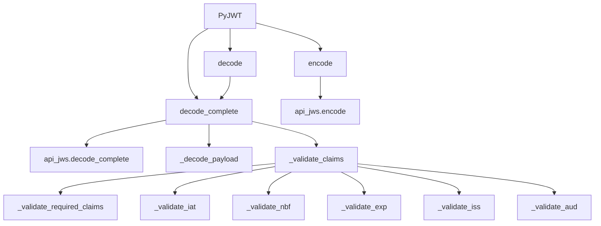

# `api_jwt.py`

## `jwt.api_jwt.PyJWT` · *class*

## Summary:
A class for encoding and decoding JSON Web Tokens (JWTs) with support for various validation options and claim checking.

## Description:
The PyJWT class provides methods for creating and validating JWT tokens according to RFC 7519 standards. It handles both encoding payloads into JWT format and decoding JWTs back into payloads while performing various security validations. The class allows customization of validation behavior through configurable options and supports different signing algorithms.

## State:
- `options`: dict[str, Any] - Configuration options that control validation behavior. Includes keys like "verify_signature", "verify_exp", "verify_nbf", "verify_iat", "verify_aud", "verify_iss", and "require". These are initialized with default values and can be overridden via constructor arguments.

## Lifecycle:
- Creation: Instantiate with optional configuration options dictionary. Default options are applied and merged with provided options.
- Usage: Call encode() to create JWTs or decode()/decode_complete() to validate and extract payloads from existing JWTs.
- Destruction: No explicit cleanup required; uses standard Python garbage collection.

## Method Map:


## Raises:
- TypeError: When payload is not a dictionary in encode() method
- DecodeError: When JWT decoding fails due to invalid format or structure
- ExpiredSignatureError: When token expiration time has passed
- ImmatureSignatureError: When token is not yet valid (issued or not before time in future)
- InvalidAudienceError: When audience validation fails
- InvalidIssuedAtError: When issued at claim is not an integer
- InvalidIssuerError: When issuer validation fails
- MissingRequiredClaimError: When required claims are missing from payload

## Example:
```python
# Create a JWT encoder/decoder instance
jwt_handler = PyJWT(options={"verify_signature": True})

# Encode a payload
payload = {"sub": "1234567890", "name": "John Doe", "iat": 1516239022}
token = jwt_handler.encode(payload, "secret_key", algorithm="HS256")

# Decode and validate the token
decoded = jwt_handler.decode(token, "secret_key", algorithms=["HS256"])
print(decoded)  # {"sub": "1234567890", "name": "John Doe", "iat": 1516239022}
```

### `jwt.api_jwt.PyJWT.__init__` · *method*

## Summary:
Initializes the PyJWT instance with configurable verification options, merging default settings with user-provided overrides.

## Description:
This method sets up the verification configuration for JWT decoding operations by combining default options with any custom options provided by the caller. It ensures that the instance maintains a complete set of verification parameters that control how JWT tokens are validated during decoding.

The initialization process separates concerns by delegating the creation of default options to the `_get_default_options()` method, while allowing users to override specific behaviors through the options parameter. This approach enables flexible configuration without requiring users to specify all options explicitly.

## Args:
    options (dict[str, Any] | None): A dictionary of verification options to override defaults. If None, an empty dictionary is used. Defaults to None.

## Returns:
    None: This method does not return a value.

## Raises:
    None: This method does not raise any exceptions.

## State Changes:
    Attributes READ: None
    Attributes WRITTEN: 
        - self.options: Updated to contain the merged default and user-provided options

## Constraints:
    Preconditions:
        - The `_get_default_options()` method must be available and return a dictionary
        - All keys in the options parameter must be compatible with the expected option structure
    Postconditions:
        - The `self.options` attribute is initialized as a dictionary containing merged default and provided options
        - The resulting dictionary will always contain all expected verification options

## Side Effects:
    None: This method performs no I/O operations or external service calls.

### `jwt.api_jwt.PyJWT._get_default_options` · *method*

## Summary:
Returns a dictionary of default verification options for JWT decoding operations.

## Description:
This method provides the default set of verification flags and requirements that are used during JWT decoding. It establishes the baseline validation behavior for signature verification and standard claim checks. The method is called during the initialization of decoding operations to establish default validation settings.

## Args:
    None

## Returns:
    dict[str, bool | list[str]]: A dictionary containing default verification options with the following keys:
        - "verify_signature" (bool): Whether to verify the JWT signature, defaults to True
        - "verify_exp" (bool): Whether to verify the expiration time claim, defaults to True
        - "verify_nbf" (bool): Whether to verify the not-before time claim, defaults to True
        - "verify_iat" (bool): Whether to verify the issued-at time claim, defaults to True
        - "verify_aud" (bool): Whether to verify the audience claim, defaults to True
        - "verify_iss" (bool): Whether to verify the issuer claim, defaults to True
        - "require" (list[str]): List of required claims to validate, defaults to empty list

## Raises:
    None

## State Changes:
    None

## Constraints:
    None

## Side Effects:
    None

### `jwt.api_jwt.PyJWT.encode` · *method*

## Summary:
Encodes a dictionary payload into a JWT token string using the specified signing key and algorithm.

## Description:
This method transforms a dictionary payload into a JSON Web Token (JWT) by first validating and processing datetime claims, then serializing the payload, and finally signing it using the JWS (JSON Web Signature) encoding process. The method ensures proper handling of time-based claims (exp, iat, nbf) by converting datetime objects to Unix timestamps, and provides flexibility in specifying encoding parameters such as the signing algorithm, custom headers, and JSON encoder. This method serves as the primary interface for creating signed JWT tokens in the PyJWT library, separating concerns between payload preparation and signature generation.

## Args:
    payload (dict[str, Any]): A dictionary containing the claims to be included in the JWT. Must be a dictionary object.
    key (AllowedPrivateKeys | str | bytes): The secret key or private key used for signing the JWT. Type depends on the selected algorithm.
    algorithm (str | None, optional): The signing algorithm to use. Defaults to "HS256".
    headers (dict[str, Any] | None, optional): Optional header parameters to include in the JWT. Defaults to None.
    json_encoder (type[json.JSONEncoder] | None, optional): Custom JSON encoder class for handling special serialization cases. Defaults to None.
    sort_headers (bool, optional): Whether to sort headers alphabetically. Defaults to True.

## Returns:
    str: A JWT token string in the format "header.payload.signature".

## Raises:
    TypeError: If the payload is not a dictionary object.

## State Changes:
    Attributes READ: None
    Attributes WRITTEN: None

## Constraints:
    Preconditions:
    - The payload argument must be a dictionary containing JSON-serializable values.
    - Time-based claims (exp, iat, nbf) in the payload, if present, must be datetime objects.
    Postconditions:
    - The returned JWT string is properly formatted with valid base64url-encoded components.
    - Time-based claims are converted to Unix timestamps if they are datetime objects.
    - The payload dictionary is not modified in-place (a copy is made).

## Side Effects:
    None

### `jwt.api_jwt.PyJWT._encode_payload` · *method*

## Summary:
Encodes a dictionary payload into a UTF-8 byte string using JSON serialization with compact formatting.

## Description:
This method serializes the provided payload dictionary into a JSON string with minimal whitespace using compact separators (comma and colon), then encodes it to UTF-8 bytes. It serves as a utility for preparing payload data for JWT token creation while maintaining strict control over JSON formatting. Although the headers parameter is accepted in the method signature, it is not utilized in the current implementation.

## Args:
    payload (dict[str, Any]): The dictionary containing the claims to be encoded into the JWT payload.
    headers (dict[str, Any] | None): Optional headers parameter that is accepted but not used in the current implementation.
    json_encoder (type[json.JSONEncoder] | None): Optional custom JSON encoder class to handle special serialization cases.

## Returns:
    bytes: A UTF-8 encoded byte string representation of the JSON-serialized payload.

## Raises:
    TypeError: If the payload contains non-serializable objects that cannot be handled by the default JSON encoder or provided json_encoder.

## State Changes:
    Attributes READ: None
    Attributes WRITTEN: None

## Constraints:
    Preconditions: 
    - The payload argument must be a dictionary-like object containing serializable values.
    - All values within the payload must be JSON serializable.
    Postconditions:
    - The returned bytes represent a valid JSON serialization of the payload with compact formatting.

## Side Effects:
    None

### `jwt.api_jwt.PyJWT.decode_complete` · *method*

## Summary:
Decodes a JWT token completely, including header, payload, and signature, while performing claim validation.

## Description:
This method performs full decoding of a JSON Web Token (JWT), extracting all components including header, payload, and signature. It handles cryptographic signature verification when enabled and validates JWT claims such as expiration, issuance time, issuer, and audience according to configured options. Unlike simpler decode methods, this one returns the complete decoded structure including all JWT components rather than just the payload. This method is part of the PyJWT library's core decoding functionality and is typically called during the token validation pipeline.

## Args:
    jwt (str | bytes): The JWT string or bytes to decode
    key (AllowedPublicKeys | str | bytes): The key to use for signature verification, defaults to empty string
    algorithms (list[str] | None): List of allowed algorithms for signature verification, required when verify_signature is True
    options (dict[str, Any] | None): Dictionary of decoding options including verification flags and configuration
    verify (bool | None): Deprecated verification flag, use options["verify_signature"] instead
    detached_payload (bytes | None): Optional detached payload for signature verification
    audience (str | Iterable[str] | None): Expected audience value(s) for validation
    issuer (str | None): Expected issuer value for validation
    leeway (float | timedelta): Time margin in seconds for time-based validations
    **kwargs (Any): Deprecated keyword arguments that will trigger warnings

## Returns:
    dict[str, Any]: A dictionary containing all decoded JWT components:
        - "header": Decoded header as a dictionary
        - "payload": Decoded payload as a dictionary
        - "signature": Raw signature bytes
        - "alg": Algorithm identifier

## Raises:
    DecodeError: When signature verification fails or required algorithms are not provided
    ExpiredSignatureError: When the token's expiration claim has passed
    ImmatureSignatureError: When the token's not-before claim indicates future validity
    InvalidAudienceError: When the audience claim doesn't match expected value(s)
    InvalidIssuerError: When the issuer claim doesn't match expected value
    MissingRequiredClaimError: When required claims are missing from the payload
    InvalidIssuedAtError: When the issued-at claim is invalid

## State Changes:
    Attributes READ: None
    Attributes WRITTEN: None

## Constraints:
    Preconditions:
        - When verify_signature is enabled, algorithms must be provided
        - The jwt parameter must be a valid JWT string or bytes
        - Options dictionary must be properly formatted
    Postconditions:
        - All enabled validations are performed and pass successfully
        - The returned dictionary contains all decoded JWT components
        - The payload is validated against configured claims

## Side Effects:
    Warnings: Issues deprecation warnings for kwargs and verify parameter conflicts
    None: No external I/O or state modifications beyond returning results

### `jwt.api_jwt.PyJWT._decode_payload` · *method*

## Summary:
Decodes a JSON string payload from a decoded JWT dictionary into a Python dictionary object.

## Description:
This method extracts and deserializes the JSON payload string from a decoded JWT dictionary, validating that it represents a proper JSON object. It is used internally by the PyJWT class during the token decoding process to transform the encoded payload back into its original Python dictionary form.

## Args:
    decoded (dict[str, Any]): A dictionary containing the decoded JWT components, specifically expected to have a "payload" key with a JSON string value.

## Returns:
    dict[str, Any]: A Python dictionary representing the decoded JSON payload.

## Raises:
    DecodeError: If the payload string is not valid JSON or if the resulting payload is not a dictionary object.

## State Changes:
    Attributes READ: None
    Attributes WRITTEN: None

## Constraints:
    Preconditions: The decoded argument must be a dictionary containing a "payload" key with a string value that represents valid JSON.
    Postconditions: The returned value is always a dictionary object representing the parsed JSON payload.

## Side Effects:
    None

### `jwt.api_jwt.PyJWT.decode` · *method*

## Summary:
Decodes a JWT and returns only the payload portion of the token.

## Description:
This method performs JWT decoding and extracts the payload component from the token. It serves as a convenience wrapper around the more comprehensive `decode_complete` method, providing direct access to the payload while maintaining all verification and decoding logic. This method is typically used when only the payload data is needed, rather than the full token components.

The method delegates to `decode_complete` internally to handle the actual decoding and verification process, then extracts and returns only the payload portion from the result. It supports all standard JWT decoding features including signature verification, audience/issuer validation, and time-based claim validation.

## Args:
    jwt (str | bytes): The JWT string or bytes to decode.
    key (AllowedPublicKeys | str | bytes): The key used for signature verification. Defaults to an empty string.
    algorithms (list[str] | None): List of allowed algorithms for signature verification. Required if signature verification is enabled.
    options (dict[str, Any] | None): Decoding options that override default settings. Defaults to None.
    verify (bool | None): Whether to verify the signature. Defaults to None (uses default behavior).
    detached_payload (bytes | None): The detached payload when the JWT header indicates b64=false. Required when b64 is False.
    audience (str | Iterable[str] | None): Expected audience claim value(s) for validation.
    issuer (str | None): Expected issuer claim value for validation.
    leeway (float | timedelta): Acceptable time tolerance for expiration/activation time validation.
    **kwargs (Any): Additional deprecated keyword arguments that will be removed in version 3.

## Returns:
    Any: The decoded payload of the JWT, typically a dictionary or other serializable object.

## Raises:
    DecodeError: When the JWT is malformed, lacks required components, or when b64=False but detached_payload is not provided.
    InvalidAlgorithmError: When the algorithm specified in the header is not allowed or not supported.
    InvalidSignatureError: When signature verification fails.
    ExpiredSignatureError: When the token has expired.
    ImmatureSignatureError: When the token is not yet valid.
    InvalidAudienceError: When the audience claim does not match expectations.
    InvalidIssuerError: When the issuer claim does not match expectations.
    MissingRequiredClaimError: When required claims are missing from the token.
    InvalidIssuedAtError: When the issued-at claim is invalid.

## State Changes:
    Attributes READ: None
    Attributes WRITTEN: None

## Constraints:
    Preconditions:
        - If signature verification is enabled, the `algorithms` parameter must be provided.
        - If the JWT header has b64=False, the `detached_payload` parameter must be provided.
    Postconditions:
        - Returns the payload portion of the decoded JWT.
        - All verification and decoding logic from `decode_complete` is applied.

## Side Effects:
    - Issues a deprecation warning if additional kwargs are passed.
    - May raise exceptions during decoding or signature verification processes.

### `jwt.api_jwt.PyJWT._validate_claims` · *method*

## Summary:
Validates JWT claims against configured requirements and time-based constraints.

## Description:
Performs comprehensive validation of JWT claims including required claims, issued-at (iat), not-before (nbf), expiration (exp), issuer (iss), and audience (aud) claims. This method serves as the central validation entry point for JWT decoding operations, orchestrating calls to specialized validation methods based on configuration options. It is typically called during the JWT decoding process after initial parsing but before returning the decoded payload.

## Args:
    payload (dict[str, Any]): The decoded JWT payload containing claim values to validate
    options (dict[str, Any]): Configuration options controlling which validations to perform, including verification flags and required claims
    audience (str | Iterable[str] | None): Expected audience value(s) for validation, or None to skip audience validation
    issuer (str | None): Expected issuer value for validation, or None to skip issuer validation
    leeway (float | timedelta): Time margin in seconds for time-based validations, can be float or timedelta

## Returns:
    None: This method does not return a value but raises exceptions on validation failure

## Raises:
    TypeError: Raised when audience parameter is not a string, iterable, or None
    MissingRequiredClaimError: Raised when required claims are missing from payload
    ImmatureSignatureError: Raised when iat or nbf claims indicate future validity
    ExpiredSignatureError: Raised when exp claim indicates expired signature
    InvalidIssuerError: Raised when iss claim does not match expected issuer
    InvalidAudienceError: Raised when aud claim does not match expected audience
    InvalidIssuedAtError: Raised when iat claim is not a valid integer

## State Changes:
    Attributes READ: None - this method only reads from parameters
    Attributes WRITTEN: None - this method does not modify any instance attributes

## Constraints:
    Preconditions:
        - The payload parameter must be a dictionary containing JWT claims
        - The options parameter must be a dictionary with validation configuration including verification flags and required claims
        - The audience parameter must be a string, iterable of strings, or None
        - The issuer parameter must be a string or None
        - The leeway parameter must be a float or timedelta
    Postconditions:
        - All enabled validations are performed and pass successfully
        - If any validation fails, an appropriate exception is raised

## Side Effects:
    None: This method performs no I/O operations or external service calls

### `jwt.api_jwt.PyJWT._validate_required_claims` · *method*

## Summary:
Validates that all required claims specified in the validation options are present in the JWT payload.

## Description:
This method performs validation by checking that all claims listed in the 'require' configuration option are present in the decoded JWT payload. It is invoked during JWT decoding and validation to enforce mandatory claim presence. The method iterates through each required claim and raises an exception if any are missing.

## Args:
    payload (dict[str, Any]): The decoded JWT payload containing claim-value pairs
    options (dict[str, Any]): Configuration options dictionary containing validation settings, specifically the 'require' key with a list of required claim names

## Returns:
    None: This method does not return any value

## Raises:
    MissingRequiredClaimError: Raised when any claim listed in options['require'] is not found in the payload

## State Changes:
    Attributes READ: None
    Attributes WRITTEN: None

## Constraints:
    Preconditions:
        - The payload parameter must be a dictionary containing JWT claims
        - The options parameter must be a dictionary with a 'require' key containing an iterable of claim names
        - All claim names in options['require'] must be strings
    Postconditions:
        - If all required claims are present, the method completes successfully
        - If any required claim is missing, the method raises MissingRequiredClaimError immediately

## Side Effects:
    None: This method performs no I/O operations or external service calls

### `jwt.api_jwt.PyJWT._validate_iat` · *method*

## Summary:
Validates the issued-at timestamp in a JWT payload to ensure the token is not issued in the future.

## Description:
This method checks that the 'iat' (issued at) claim in the JWT payload represents a valid timestamp that is not in the future, accounting for a configurable leeway period. It is part of the JWT validation process to ensure temporal consistency of tokens. This validation prevents tokens from being used before they were issued.

## Args:
    payload (dict[str, Any]): The decoded JWT payload containing the 'iat' claim
    now (float): Current timestamp for comparison
    leeway (float): Time in seconds to allow for clock skew when validating timestamps

## Returns:
    None: This method does not return a value but raises exceptions on validation failure

## Raises:
    InvalidIssuedAtError: When the 'iat' claim cannot be converted to an integer
    ImmatureSignatureError: When the 'iat' timestamp is later than the current time plus leeway

## State Changes:
    Attributes READ: None
    Attributes WRITTEN: None

## Constraints:
    Preconditions:
        - The payload dictionary must contain an 'iat' key
        - The 'iat' value must be convertible to an integer
        - The 'now' parameter must represent a valid Unix timestamp
        - The 'leeway' parameter must be a non-negative number
    Postconditions:
        - If validation passes, the token's issued-at timestamp is confirmed to be valid
        - If validation fails, an appropriate exception is raised

## Side Effects:
    None: This method performs no I/O operations or external service calls

### `jwt.api_jwt.PyJWT._validate_nbf` · *method*

## Summary:
Validates that the token's Not Before timestamp is not in the future, accounting for a configurable leeway period.

## Description:
This method checks the "nbf" (Not Before) claim in a JWT payload to ensure the token is not being used before its intended validity start time. It's part of the standard JWT validation process that occurs during token decoding. The method compares the nbf timestamp against the current time plus a configurable leeway window to allow for clock skew between systems.

## Args:
    payload (dict[str, Any]): The decoded JWT payload containing the "nbf" claim
    now (float): Current timestamp (in seconds since epoch) to compare against
    leeway (float): Time in seconds to allow for clock skew when comparing timestamps

## Returns:
    None: This method does not return a value but raises exceptions on validation failure

## Raises:
    DecodeError: When the "nbf" claim is present but cannot be converted to an integer
    ImmatureSignatureError: When the "nbf" timestamp is later than the current time plus leeway

## State Changes:
    Attributes READ: None - this method only reads from the payload parameter
    Attributes WRITTEN: None - this method does not modify any instance attributes

## Constraints:
    Preconditions:
        - The payload dictionary must contain an "nbf" key
        - The "nbf" value must be convertible to an integer
        - The now parameter must represent a valid timestamp
        - The leeway parameter must be a non-negative number
    
    Postconditions:
        - If validation passes, the token's Not Before claim is valid
        - If validation fails, an appropriate exception is raised

## Side Effects:
    None - This method performs no I/O operations or external service calls

### `jwt.api_jwt.PyJWT._validate_exp` · *method*

## Summary:
Validates that a JWT token has not expired by checking the expiration time claim against the current time with configurable leeway.

## Description:
This method performs expiration validation for JWT tokens by extracting the "exp" claim from the payload and comparing it to the current time adjusted by leeway. It ensures tokens cannot be used after their designated expiration time while allowing for clock skew tolerance.

The method is called during JWT decoding operations when validating token expiration. It's separated from other validation logic to provide a clean, focused validation step that can be easily tested and maintained independently.

## Args:
    payload (dict[str, Any]): The decoded JWT payload containing the "exp" claim
    now (float): Current timestamp for comparison
    leeway (float): Time in seconds to allow for clock skew tolerance

## Returns:
    None: This method does not return a value but raises exceptions on validation failure

## Raises:
    DecodeError: When the "exp" claim is not an integer value
    ExpiredSignatureError: When the token's expiration time is earlier than (current time - leeway)

## State Changes:
    Attributes READ: None - this method only reads from parameters
    Attributes WRITTEN: None - this method does not modify any instance attributes

## Constraints:
    Preconditions:
        - The payload dictionary must contain an "exp" key
        - The "exp" value must be convertible to an integer
        - The now parameter must be a valid timestamp
        - The leeway parameter must be a non-negative number
    
    Postconditions:
        - If no exception is raised, the token's expiration time is valid (not yet expired)
        - The method does not modify any object state

## Side Effects:
    None: This method performs no I/O operations or external service calls

### `jwt.api_jwt.PyJWT._validate_aud` · *method*

## Summary:
Validates that the audience claim in a JWT payload matches the expected audience value(s) according to specified validation rules.

## Description:
This method performs audience validation for JWT tokens by checking if the 'aud' claim in the payload matches the provided audience parameter. It supports both strict and non-strict validation modes, handling various data types for audience claims and expected audiences. The method is called during JWT decoding operations when audience validation is required.

## Args:
    payload (dict[str, Any]): The decoded JWT payload containing the 'aud' claim to validate
    audience (str | Iterable[str] | None): The expected audience value(s) to match against the payload's 'aud' claim, or None to skip validation
    strict (bool): When True, enforces strict validation rules including exact string matching and format validation; when False, allows flexible matching against lists of audiences

## Returns:
    None: This method does not return a value but raises exceptions on validation failure

## Raises:
    InvalidAudienceError: Raised when audience validation fails in either strict or non-strict mode due to mismatched audiences or invalid claim formats
    MissingRequiredClaimError: Raised when the 'aud' claim is missing from the payload but audience validation is required

## State Changes:
    Attributes READ: None - this method only reads from parameters
    Attributes WRITTEN: None - this method does not modify any instance attributes

## Constraints:
    Preconditions:
        - The payload parameter must be a dictionary containing JWT claims
        - The audience parameter must be a string, iterable of strings, or None
        - The strict parameter must be a boolean value
    Postconditions:
        - If validation passes, the method returns normally
        - If validation fails, an appropriate exception is raised

## Side Effects:
    None: This method performs no I/O operations or external service calls

### `jwt.api_jwt.PyJWT._validate_iss` · *method*

## Summary:
Validates that the issuer claim in a JWT payload matches the expected issuer value.

## Description:
This method validates the 'iss' (issuer) claim within a JWT payload against an expected issuer value. It is called during the JWT validation process to ensure the token originates from a trusted source. When the issuer is None, the validation is skipped. This method is part of the standard JWT decoding workflow and helps prevent tokens from unauthorized sources from being accepted.

## Args:
    payload (dict[str, Any]): The decoded JWT payload containing claims
    issuer (Any): The expected issuer value to validate against, or None to skip validation

## Returns:
    None: This method does not return any value

## Raises:
    MissingRequiredClaimError: Raised when the 'iss' claim is missing from the payload
    InvalidIssuerError: Raised when the 'iss' claim in the payload does not match the expected issuer

## State Changes:
    Attributes READ: None
    Attributes WRITTEN: None

## Constraints:
    Preconditions:
        - The payload parameter must be a dictionary containing JWT claims
        - The issuer parameter can be any value that supports equality comparison
    Postconditions:
        - If the method completes successfully, either issuer is None or the issuer claim matches the expected issuer
        - If the method raises an exception, the validation failed and the token should not be accepted

## Side Effects:
    None: This method performs no I/O operations or external service calls

