# `exceptions.py`

## `jwt.exceptions.PyJWTError` · *class*

## Summary:
Base exception class for PyJWT library errors.

## Description:
PyJWTError serves as the root exception class for all custom exceptions raised by the PyJWT library. It provides a common base for exception handling that allows applications to catch all JWT-related errors using a single except clause. This class inherits from Python's built-in Exception class, making it compatible with standard exception handling patterns.

## State:
- No instance attributes or state variables as it is a simple exception base class
- The class itself has no constructor parameters beyond those inherited from Exception

## Lifecycle:
- Creation: Instantiated by subclasses or directly when a JWT-related error occurs
- Usage: Used in exception handling blocks to catch JWT-specific errors
- Destruction: Managed automatically by Python's garbage collector

## Method Map:
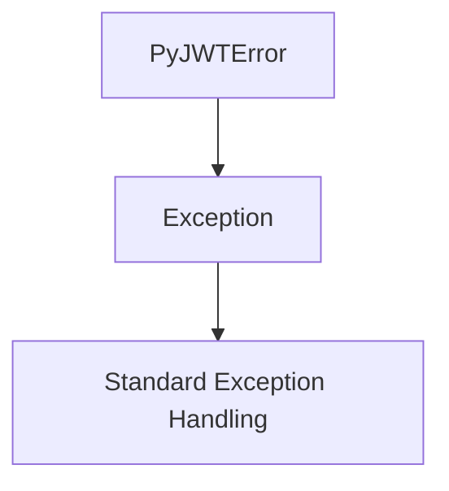

## Raises:
- No explicit raises in __init__ as it inherits from Exception with no special initialization requirements

## Example:
```python
try:
    # Some JWT operation that fails
    token = jwt.decode(invalid_token, key, algorithms=['HS256'])
except jwt.PyJWTError:
    # Handle any JWT-related error
    print("A JWT error occurred")
```

## `jwt.exceptions.InvalidTokenError` · *class*

## Summary:
Represents an error that occurs when a JWT token is invalid or cannot be processed due to structural or semantic issues.

## Description:
InvalidTokenError is a specialized exception that indicates a JWT token is malformed, expired, or otherwise invalid for processing. It extends PyJWTError, making it part of the PyJWT library's exception hierarchy. This exception is typically raised by JWT decoding operations when the token fails validation checks such as signature verification, expiration, or incorrect format.

## State:
- Inherits from PyJWTError, which itself inherits from Python's built-in Exception class
- No additional instance attributes or state variables beyond those inherited from Exception
- No constructor parameters required as it is a simple marker exception

## Lifecycle:
- Creation: Instantiated automatically by JWT decoding functions when token validation fails
- Usage: Caught by exception handlers that process JWT-related errors
- Destruction: Managed automatically by Python's garbage collection

## Method Map:
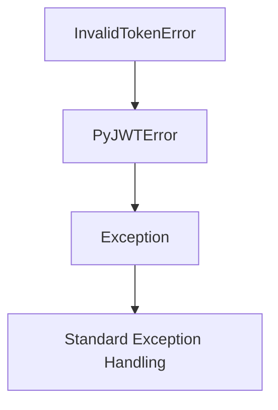

## Raises:
- No explicit raises in __init__ as it inherits from Exception with no special initialization requirements

## Example:
```python
import jwt

try:
    decoded = jwt.decode('invalid.token.here', 'secret', algorithms=['HS256'])
except jwt.InvalidTokenError:
    print("Token is invalid or malformed")
```

## `jwt.exceptions.DecodeError` · *class*

## Summary:
Represents an error that occurs when a JWT token cannot be decoded due to structural or formatting issues.

## Description:
DecodeError is a specialized exception that indicates a JWT token is malformed or improperly formatted, preventing successful decoding. It inherits from InvalidTokenError, which is part of PyJWT's exception hierarchy for handling various JWT validation failures. This exception is typically raised during JWT decoding operations when the token structure violates JWT specifications or contains invalid components.

## State:
- Inherits all state from InvalidTokenError, which inherits from Python's built-in Exception class
- No additional instance attributes or state variables
- No constructor parameters required as it is a simple marker exception

## Lifecycle:
- Creation: Instantiated automatically by JWT decoding functions when token format validation fails
- Usage: Caught by exception handlers that process JWT decoding errors
- Destruction: Managed automatically by Python's garbage collection

## Method Map:
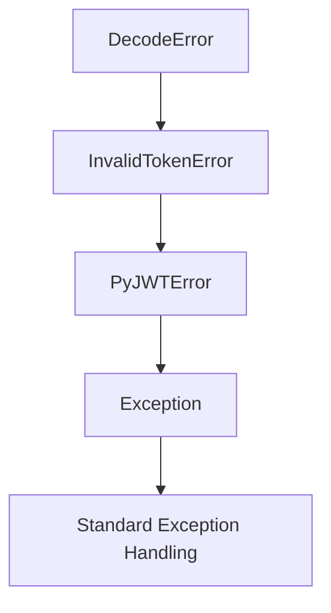

## Raises:
- No explicit raises in __init__ as it inherits from Exception with no special initialization requirements

## Example:
```python
import jwt

try:
    decoded = jwt.decode('invalid.token.here', 'secret', algorithms=['HS256'])
except jwt.DecodeError:
    print("Token could not be decoded due to formatting issues")
```

## `jwt.exceptions.InvalidSignatureError` · *class*

## Summary:
Represents an error that occurs when a JWT token's signature is invalid or cannot be verified.

## Description:
InvalidSignatureError is a specialized exception that indicates a JWT token has an invalid signature, meaning the token was either tampered with or was not signed with the expected key. This exception extends DecodeError, which is part of PyJWT's exception hierarchy for handling various JWT decoding failures. It is typically raised during JWT decoding operations when signature verification fails, signaling that the token's integrity cannot be confirmed.

## State:
- Inherits all state from DecodeError, which inherits from InvalidTokenError and ultimately from Python's built-in Exception class
- No additional instance attributes or state variables
- No constructor parameters required as it is a simple marker exception

## Lifecycle:
- Creation: Instantiated automatically by JWT decoding functions when signature verification fails
- Usage: Caught by exception handlers that process JWT decoding errors, particularly those focused on authentication and authorization
- Destruction: Managed automatically by Python's garbage collection

## Method Map:
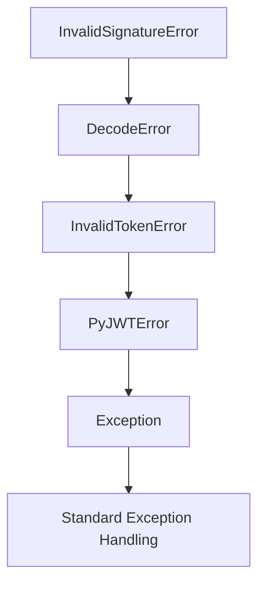

## Raises:
- No explicit raises in __init__ as it inherits from Exception with no special initialization requirements

## Example:
```python
import jwt

try:
    decoded = jwt.decode('valid.token.with.invalid.signature', 'secret', algorithms=['HS256'])
except jwt.InvalidSignatureError:
    print("Token signature is invalid or cannot be verified")
```

## `jwt.exceptions.ExpiredSignatureError` · *class*

## Summary:
Represents an error that occurs when a JWT token has expired and cannot be processed.

## Description:
ExpiredSignatureError is a specialized exception that indicates a JWT token is no longer valid because its expiration time has passed. It extends InvalidTokenError, which is part of PyJWT's exception hierarchy for handling various token validation failures. This exception is typically raised by JWT decoding operations when the token's 'exp' claim has been exceeded.

## State:
- Inherits from InvalidTokenError, which itself inherits from PyJWTError and ultimately from Python's built-in Exception class
- No additional instance attributes or state variables beyond those inherited from Exception
- No constructor parameters required as it is a simple marker exception

## Lifecycle:
- Creation: Instantiated automatically by JWT decoding functions when token expiration is detected
- Usage: Caught by exception handlers that process JWT-related errors, particularly those handling expired tokens
- Destruction: Managed automatically by Python's garbage collection

## Method Map:
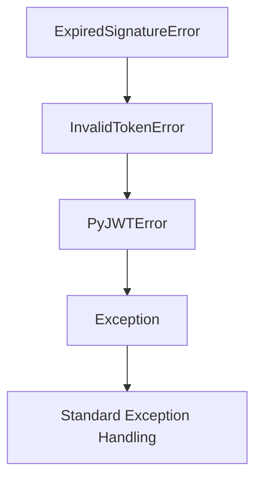

## Raises:
- No explicit raises in __init__ as it inherits from Exception with no special initialization requirements

## Example:
```python
import jwt

try:
    decoded = jwt.decode('expired.token.here', 'secret', algorithms=['HS256'])
except jwt.ExpiredSignatureError:
    print("Token has expired")
```

## `jwt.exceptions.InvalidAudienceError` · *class*

## Summary:
Represents an error that occurs when a JWT token's audience claim is invalid or does not match expected values.

## Description:
InvalidAudienceError is a specialized exception that indicates a JWT token's audience (aud) claim is either missing, malformed, or does not match the expected audience value during token validation. This exception extends InvalidTokenError, making it part of the PyJWT library's exception hierarchy for handling various token validation failures. It is typically raised by JWT decoding operations when the audience validation fails.

## State:
- Inherits from InvalidTokenError, which itself inherits from PyJWTError and ultimately from Python's built-in Exception class
- No additional instance attributes or state variables beyond those inherited from Exception
- No constructor parameters required as it is a simple marker exception

## Lifecycle:
- Creation: Instantiated automatically by JWT decoding functions when audience validation fails
- Usage: Caught by exception handlers that process JWT-related errors, particularly those handling audience validation
- Destruction: Managed automatically by Python's garbage collection

## Method Map:
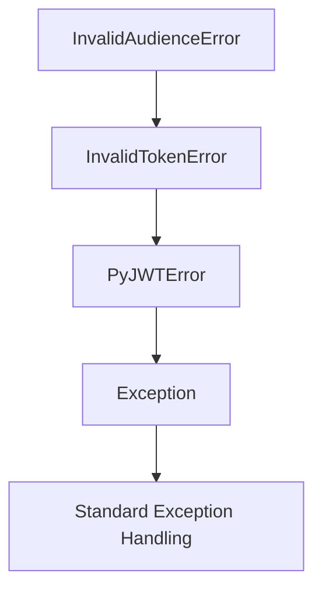

## Raises:
- No explicit raises in __init__ as it inherits from Exception with no special initialization requirements

## Example:
```python
import jwt

try:
    decoded = jwt.decode('valid.token.here', 'secret', algorithms=['HS256'], audience='expected_audience')
except jwt.InvalidAudienceError:
    print("Token audience is invalid or missing")
```

## `jwt.exceptions.InvalidIssuerError` · *class*

## Summary:
Represents an error that occurs when a JWT token's issuer claim is invalid or does not match the expected value.

## Description:
InvalidIssuerError is a specialized exception that indicates a JWT token's issuer (iss) claim is either missing, malformed, or does not match the expected issuer value during token validation. This exception extends InvalidTokenError, making it part of the PyJWT library's exception hierarchy for handling JWT validation failures. It is typically raised by JWT decoding operations when the issuer validation check fails.

## State:
- Inherits from InvalidTokenError, which itself inherits from PyJWTError and ultimately from Python's built-in Exception class
- No additional instance attributes or state variables beyond those inherited from Exception
- No constructor parameters required as it is a simple marker exception

## Lifecycle:
- Creation: Instantiated automatically by JWT decoding functions when issuer validation fails
- Usage: Caught by exception handlers that process JWT-related errors, particularly those handling issuer validation
- Destruction: Managed automatically by Python's garbage collection

## Method Map:
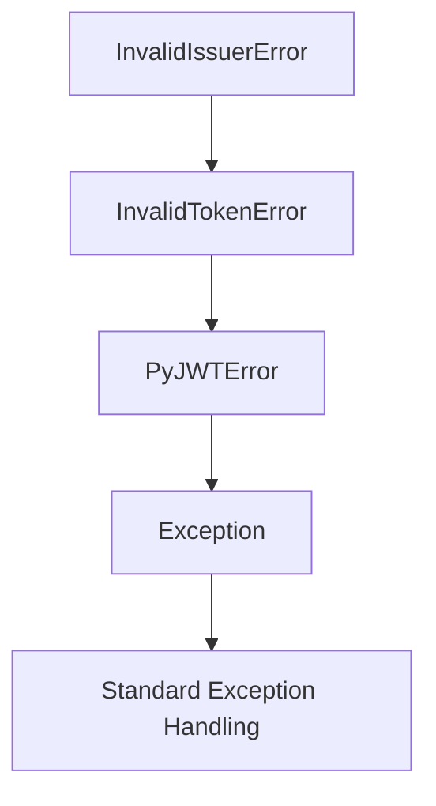

## Raises:
- No explicit raises in __init__ as it inherits from Exception with no special initialization requirements

## Example:
```python
import jwt

try:
    decoded = jwt.decode('valid.token.here', 'secret', algorithms=['HS256'], issuer='expected_issuer')
except jwt.InvalidIssuerError:
    print("Token issuer is invalid or does not match expected value")
```

## `jwt.exceptions.InvalidIssuedAtError` · *class*

## Summary:
Represents an error that occurs when a JWT token's issued-at timestamp is invalid or in the future.

## Description:
InvalidIssuedAtError is a specialized exception that indicates a JWT token's 'iat' (issued at) claim is either missing, malformed, or set to a future timestamp. This exception is raised during JWT decoding when the token's issued-at time violates the validation rules, typically because the token was issued after the current time. It extends InvalidTokenError, making it part of the PyJWT library's exception hierarchy for handling various token validation failures.

## State:
- Inherits from InvalidTokenError, which itself inherits from PyJWTError and ultimately Exception
- No additional instance attributes or state variables beyond those inherited from Exception
- No constructor parameters required as it is a simple marker exception

## Lifecycle:
- Creation: Instantiated automatically by JWT decoding functions when issued-at validation fails
- Usage: Caught by exception handlers that process JWT-related errors, particularly those handling token time-based validations
- Destruction: Managed automatically by Python's garbage collection

## Method Map:
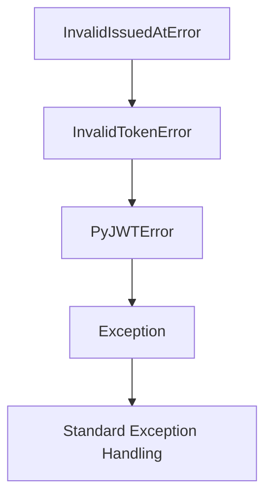

## Raises:
- No explicit raises in __init__ as it inherits from Exception with no special initialization requirements

## Example:
```python
import jwt
from datetime import datetime, timedelta

# Create a token with a future issued-at time
future_time = datetime.utcnow() + timedelta(hours=1)
payload = {'iat': future_time.timestamp()}
token = jwt.encode(payload, 'secret', algorithm='HS256')

# This will raise InvalidIssuedAtError when decoded
try:
    decoded = jwt.decode(token, 'secret', algorithms=['HS256'])
except jwt.InvalidIssuedAtError:
    print("Token was issued in the future")
```

## `jwt.exceptions.ImmatureSignatureError` · *class*

## Summary:
Represents an error that occurs when a JWT token's signature is not yet valid due to an early 'nbf' (not before) claim.

## Description:
ImmatureSignatureError is a specialized exception that indicates a JWT token's signature is not yet valid because the token contains a 'nbf' (not before) claim that specifies a future timestamp. This exception is raised during JWT decoding when the current time is earlier than the token's validity start time. It extends InvalidTokenError, which itself inherits from PyJWTError, making it part of PyJWT's exception hierarchy for handling various token validation failures.

## State:
- Inherits all state from InvalidTokenError (which inherits from PyJWTError and Exception)
- No additional instance attributes or state variables
- No constructor parameters required as it is a simple marker exception

## Lifecycle:
- Creation: Automatically instantiated by JWT decoding functions when a token's 'nbf' claim is in the future
- Usage: Caught by exception handlers that process JWT-related errors, particularly those handling token validity periods
- Destruction: Managed automatically by Python's garbage collection

## Method Map:
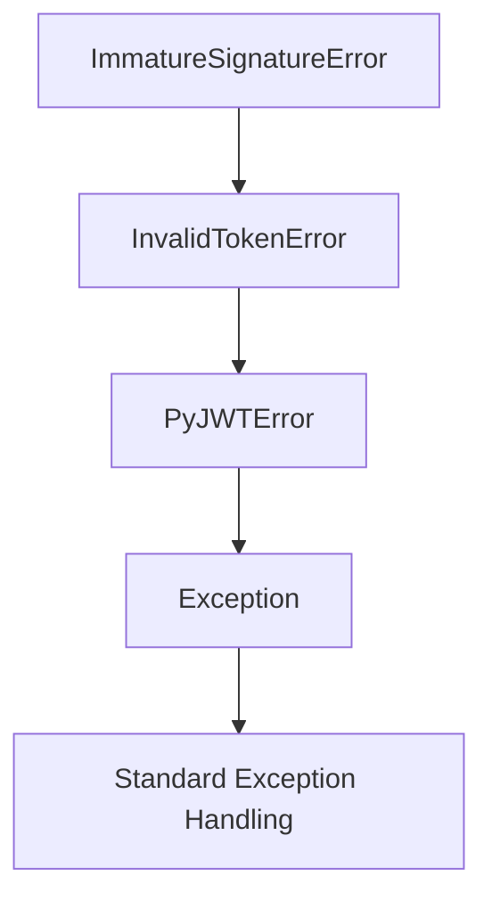

## Raises:
- No explicit raises in __init__ as it inherits from Exception with no special initialization requirements

## Example:
```python
import jwt
from datetime import datetime, timedelta

# Create a token with a future 'nbf' claim
future_time = datetime.utcnow() + timedelta(hours=1)
payload = {'some': 'data', 'nbf': int(future_time.timestamp())}
token = jwt.encode(payload, 'secret', algorithm='HS256')

# Attempting to decode this token will raise ImmatureSignatureError
try:
    decoded = jwt.decode(token, 'secret', algorithms=['HS256'])
except jwt.ImmatureSignatureError:
    print("Token signature is not yet valid")
```

## `jwt.exceptions.InvalidKeyError` · *class*

## Summary:
Exception raised when an invalid key is encountered during JWT operations.

## Description:
InvalidKeyError is a specialized exception that indicates a problem with the cryptographic key used in JWT signing or verification operations. This exception extends PyJWTError and is raised when the provided key is incompatible with the expected algorithm or format for JWT processing. It serves as a distinct error type to allow targeted exception handling for key-related issues in JWT workflows.

## State:
- Inherits from PyJWTError, which itself inherits from Python's built-in Exception class
- No additional instance attributes or state variables beyond those inherited from Exception
- No constructor parameters required as it is a simple marker exception

## Lifecycle:
- Creation: Instantiated automatically by the JWT library when an invalid key is detected during signing or verification operations
- Usage: Caught by exception handlers that specifically handle key validation failures
- Destruction: Managed automatically by Python's garbage collection mechanism

## Method Map:
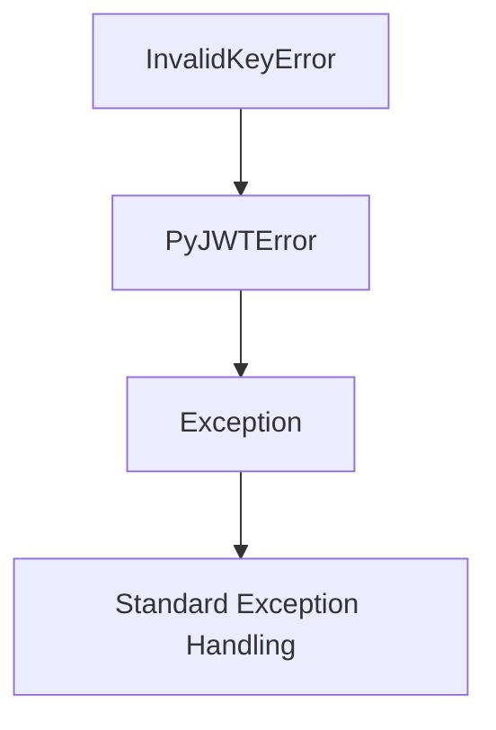

## Raises:
- No explicit raises in __init__ as it inherits from Exception with no special initialization requirements
- Raised internally by JWT library functions when key validation fails

## Example:
```python
import jwt

try:
    # Attempt to decode a token with an invalid key
    payload = jwt.decode(token, invalid_key, algorithms=['HS256'])
except jwt.InvalidKeyError:
    # Handle the specific case of invalid key
    print("The provided key is invalid for JWT operations")
```

## `jwt.exceptions.InvalidAlgorithmError` · *class*

## Summary:
Represents an error that occurs when a JWT token is invalid due to an unsupported or incorrect algorithm.

## Description:
InvalidAlgorithmError is a specialized exception that indicates a JWT token cannot be processed because the signing algorithm specified in the token header is not supported or is invalid. This exception extends InvalidTokenError, making it part of the PyJWT library's exception hierarchy for handling JWT validation failures. It is typically raised during JWT decoding operations when the algorithm used to sign the token is not among those allowed by the application's configuration.

## State:
- Inherits from InvalidTokenError, which itself inherits from PyJWTError and ultimately from Python's built-in Exception class
- No additional instance attributes or state variables beyond those inherited from Exception
- No constructor parameters required as it is a simple marker exception

## Lifecycle:
- Creation: Instantiated automatically by JWT decoding functions when an unsupported algorithm is encountered
- Usage: Caught by exception handlers that process JWT-related errors, particularly those dealing with algorithm validation
- Destruction: Managed automatically by Python's garbage collection

## Method Map:
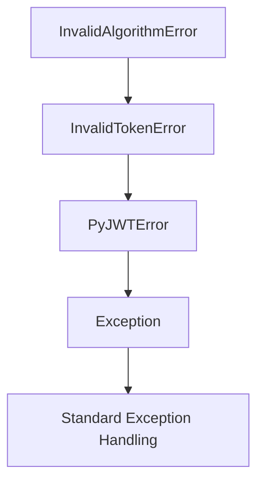

## Raises:
- No explicit raises in __init__ as it inherits from Exception with no special initialization requirements

## Example:
```python
import jwt

try:
    decoded = jwt.decode('valid.token.with.invalid.algorithm', 'secret', algorithms=['HS256'])
except jwt.InvalidAlgorithmError:
    print("Token uses an unsupported or invalid algorithm")
```

## `jwt.exceptions.MissingRequiredClaimError` · *class*

## Summary:
Represents an error that occurs when a required claim is missing from a JWT token during validation.

## Description:
MissingRequiredClaimError is a specialized exception that indicates a JWT token is missing a required claim during decoding or validation. This exception extends InvalidTokenError and is specifically raised when a token lacks a claim that was expected to be present according to the validation rules. It serves as a distinct error type to differentiate missing claims from other token validation failures.

## State:
- claim (str): The name of the missing required claim that caused the error
- The claim attribute stores the string identifier of the missing claim
- No additional state beyond the inherited Exception state

## Lifecycle:
- Creation: Instantiated by JWT validation logic when a required claim is not found in the token payload
- Usage: Caught by exception handlers that process JWT validation errors, particularly those handling required claim validation
- Destruction: Managed automatically by Python's garbage collection

## Method Map:
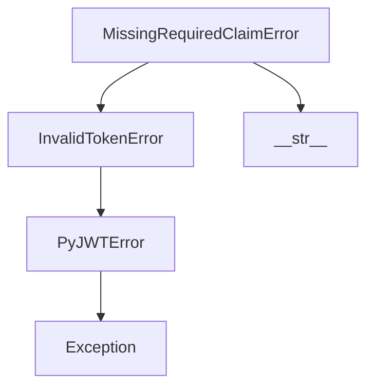

## Raises:
- No explicit raises in __init__ as it inherits from Exception with no special initialization requirements

## Example:
```python
import jwt

try:
    decoded = jwt.decode('valid.token.here', 'secret', algorithms=['HS256'], options={'require': ['exp']})
except jwt.MissingRequiredClaimError as e:
    print(f"Missing required claim: {e.claim}")
```

### `jwt.exceptions.MissingRequiredClaimError.__init__` · *method*

## Summary:
Initializes a MissingRequiredClaimError instance with the name of the missing required claim.

## Description:
This method sets up the error instance to track which specific claim was missing from a JWT token during validation. It is part of the exception hierarchy for JWT validation failures and provides contextual information about the validation issue.

## Args:
    claim (str): The name of the required claim that was not found in the token payload

## Returns:
    None: This method does not return a value

## Raises:
    No exceptions are raised by this method

## State Changes:
    Attributes READ: No self attributes are read during initialization
    Attributes WRITTEN: Sets self.claim to the provided claim string

## Constraints:
    Preconditions: The claim argument must be a string representing the name of a required JWT claim
    Postconditions: After execution, self.claim will contain the exact string value passed as the claim parameter

## Side Effects:
    None: This method performs no I/O operations or external service calls

### `jwt.exceptions.MissingRequiredClaimError.__str__` · *method*

## Summary:
Returns a string representation of the error indicating which JWT claim is missing.

## Description:
This method provides a human-readable error message when a JWT token is missing a required claim. It is called during exception handling to format the error for display or logging purposes.

## Args:
    None

## Returns:
    str: A formatted error message indicating the missing claim, e.g., "Token is missing the "sub" claim"

## Raises:
    None

## State Changes:
    Attributes READ: self.claim
    Attributes WRITTEN: None

## Constraints:
    Preconditions: The instance must have a valid claim attribute set during initialization
    Postconditions: The returned string is always formatted consistently with the pattern "Token is missing the "{claim}" claim"

## Side Effects:
    None

## `jwt.exceptions.PyJWKError` · *class*

## Summary:
Base exception class for PyJWK library errors.

## Description:
PyJWKError serves as the root exception class for all custom exceptions raised by the PyJWK library. It provides a common base for exception handling that allows applications to catch all JWK-related errors using a single except clause. This class inherits from PyJWTError, which itself inherits from Python's built-in Exception class, making it compatible with standard exception handling patterns and part of a broader JWT error hierarchy.

## State:
- No instance attributes or state variables as it is a simple exception base class
- The class itself has no constructor parameters beyond those inherited from Exception

## Lifecycle:
- Creation: Instantiated by subclasses or directly when a JWK-related error occurs
- Usage: Used in exception handling blocks to catch JWK-specific errors
- Destruction: Managed automatically by Python's garbage collector

## Method Map:
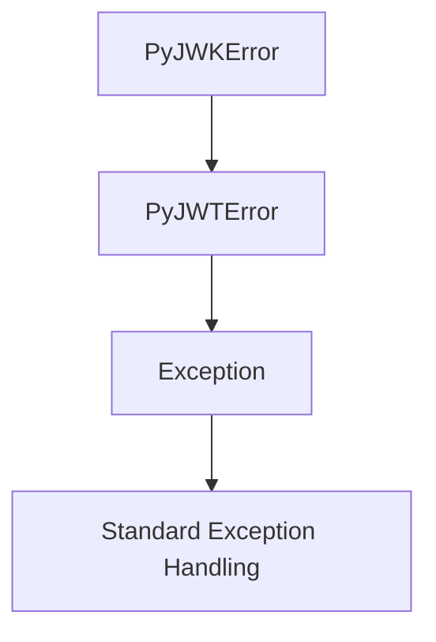

## Raises:
- No explicit raises in __init__ as it inherits from Exception with no special initialization requirements

## Example:
```python
try:
    # Some JWK operation that fails
    key = jwk.get_key(key_data)
except jwk.PyJWKError:
    # Handle any JWK-related error
    print("A JWK error occurred")
```

## `jwt.exceptions.PyJWKSetError` · *class*

## Summary:
Base exception class for PyJWKSet-related errors in the PyJWT library.

## Description:
PyJWKSetError is a specialized exception class that extends PyJWTError and serves as the base exception for all errors occurring within the JWK Set (JSON Web Key Set) processing functionality of the PyJWT library. This exception class provides a distinct error category for JWK Set operations, allowing developers to specifically catch and handle JWK Set-related failures separate from other JWT processing errors.

## State:
- Inherits from PyJWTError, which inherits from Python's built-in Exception class
- No instance attributes or state variables as it is a simple exception base class
- No constructor parameters beyond those inherited from Exception

## Lifecycle:
- Creation: Instantiated when JWK Set processing encounters an error condition
- Usage: Caught by exception handlers that specifically target JWK Set operations
- Destruction: Managed automatically by Python's garbage collector

## Method Map:
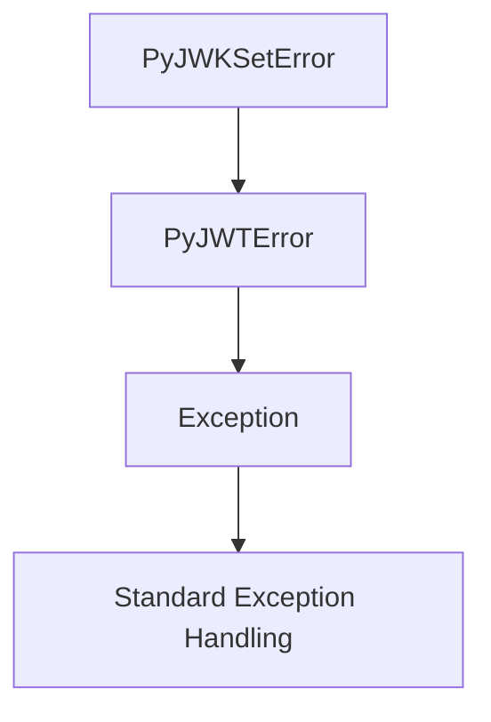

## Raises:
- No explicit raises in __init__ as it inherits from Exception with no special initialization requirements

## Example:
```python
try:
    # Attempt to process a JWK Set that is malformed
    jwk_set = jwt.PyJWKSet.from_dict(invalid_jwk_set_data)
except jwt.PyJWKSetError:
    # Handle JWK Set specific errors
    print("A JWK Set processing error occurred")
```

## `jwt.exceptions.PyJWKClientError` · *class*

## Summary:
Base exception class for PyJWK client-related errors in the PyJWT library.

## Description:
PyJWKClientError is a specialized exception class that extends PyJWTError to handle errors specific to the JSON Web Key (JWK) client functionality within the PyJWT library. This exception serves as a distinct error type for issues that occur during JWK key retrieval, validation, or processing operations, allowing developers to differentiate JWK client errors from other JWT-related errors.

## State:
- Inherits all attributes and behavior from PyJWTError
- No additional instance attributes or state variables
- No constructor parameters beyond those inherited from Exception

## Lifecycle:
- Creation: Instantiated when JWK client operations encounter failures
- Usage: Caught by exception handlers that specifically need to handle JWK client errors
- Destruction: Managed automatically by Python's garbage collector

## Method Map:
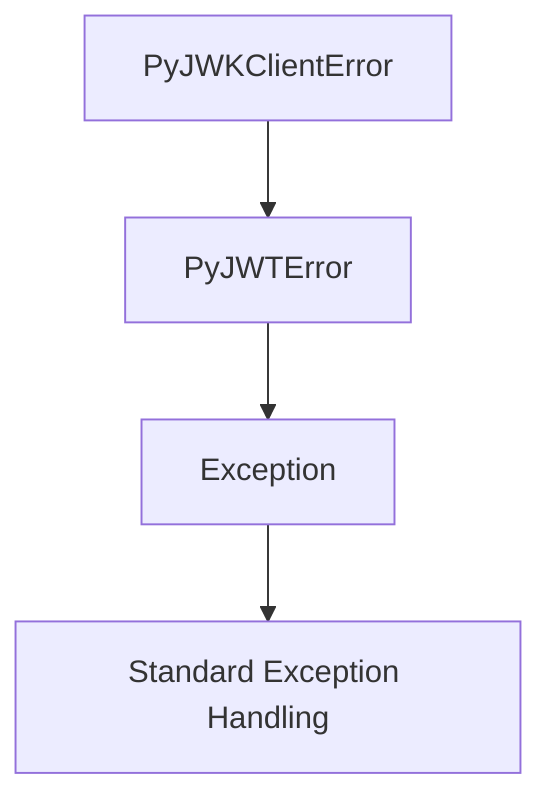

## Raises:
- No explicit raises in __init__ as it inherits from PyJWTError with no special initialization requirements

## Example:
```python
from jwt.exceptions import PyJWKClientError

try:
    # Attempt to retrieve keys from a JWK set
    keys = jwk_client.get_keys()
except PyJWKClientError as e:
    # Handle JWK client specific errors
    print(f"JWK client error occurred: {e}")
```

## `jwt.exceptions.PyJWKClientConnectionError` · *class*

## Summary:
Exception class representing connection-related errors in the PyJWK client.

## Description:
PyJWKClientConnectionError is a specialized exception that extends PyJWKClientError to handle network or connectivity issues encountered during JSON Web Key (JWK) client operations. This exception type specifically identifies problems related to establishing or maintaining connections to JWK endpoints, such as timeouts, DNS resolution failures, or network unreachable errors. It allows developers to distinguish connection failures from other JWK client errors like invalid key formats or validation issues.

## State:
- Inherits all attributes and behavior from PyJWKClientError
- No additional instance attributes or state variables
- No constructor parameters beyond those inherited from Exception
- Maintains the standard exception behavior with message and args

## Lifecycle:
- Creation: Instantiated when network connection attempts fail during JWK retrieval operations
- Usage: Caught by exception handlers that specifically need to handle connection-related failures
- Destruction: Managed automatically by Python's garbage collector

## Method Map:
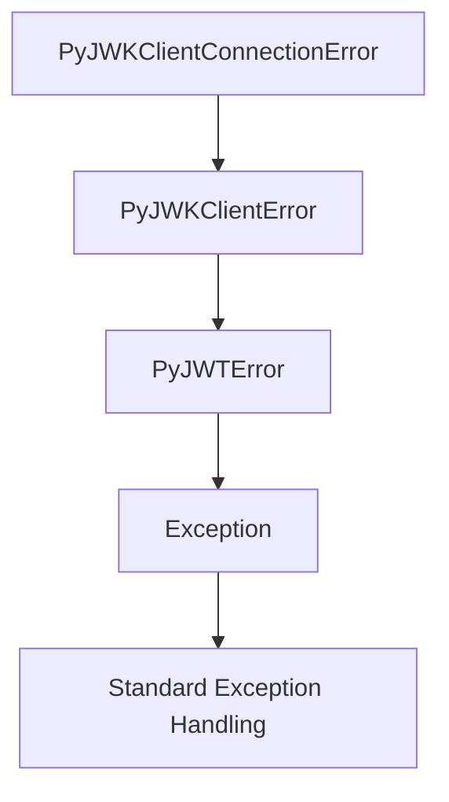

## Raises:
- No explicit raises in __init__ as it inherits from PyJWKClientError with no special initialization requirements

## Example:
```python
from jwt.exceptions import PyJWKClientConnectionError

try:
    # Attempt to fetch JWK set from remote endpoint
    jwk_set = jwk_client.get_jwk_set()
except PyJWKClientConnectionError as e:
    # Handle network connectivity issues
    print(f"Connection failed: {e}")
    # Implement retry logic or fallback mechanism
```

