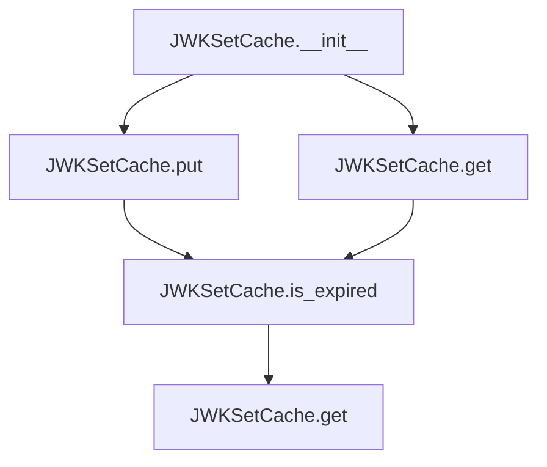

# `jwk_set_cache.py`

## `jwt.jwk_set_cache.JWKSetCache` · *class*

## Summary:
A cache implementation for storing and retrieving JSON Web Key Sets (JWKs) with automatic expiration based on a configurable lifespan.

## Description:
The JWKSetCache class provides a thread-safe mechanism for caching PyJWKSet objects with automatic expiration. It wraps JWK sets in timestamped containers to track their freshness and automatically invalidates cached entries when they exceed their configured lifespan. This class is particularly useful in JWT validation scenarios where public keys need to be periodically refreshed from external sources while maintaining performance through caching.

## State:
- `jwk_set_with_timestamp`: Optional[PyJWTSetWithTimestamp] - The cached JWK set wrapped with a timestamp, or None if no cache entry exists. This attribute is initialized to None in __init__ and updated via the put() method.
- `lifespan`: int - The maximum age (in seconds) that a cached JWK set can remain valid. A negative value indicates infinite lifetime. This parameter is set during initialization and cannot be modified afterward.

## Lifecycle:
- Creation: Instantiate with a positive integer lifespan parameter to define cache expiration policy
- Usage: Call put() to store JWK sets, then get() to retrieve them (with automatic expiration handling)
- Destruction: No explicit cleanup required; relies on Python's garbage collection

## Method Map:


## Raises:
- No explicit exceptions are raised by __init__ or any other methods in normal operation

## Example:
```python
# Create cache with 3600-second (1-hour) lifespan
cache = JWKSetCache(lifespan=3600)

# Store a JWK set
jwk_set = PyJWKSet.from_dict({"keys": [...]})
cache.put(jwk_set)

# Retrieve the cached JWK set
cached_jwk_set = cache.get()
if cached_jwk_set is not None:
    # Use the cached JWK set for JWT validation
    pass
else:
    # Cache expired or empty, fetch fresh JWK set
    pass
```

### `jwt.jwk_set_cache.JWKSetCache.__init__` · *method*

## Summary:
Initializes a JWKSetCache instance with a specified lifespan for cached JWK sets.

## Description:
This method sets up the cache object by initializing the JWK set storage to None and storing the configured lifespan. It serves as the constructor for the JWKSetCache class, preparing the object for subsequent operations like fetching and caching JWK sets.

## Args:
    lifespan (int): The maximum age (in seconds) that cached JWK sets are considered valid.

## Returns:
    None: This method does not return any value.

## Raises:
    None: This method does not raise any exceptions.

## State Changes:
    Attributes READ: None
    Attributes WRITTEN: 
    - self.jwk_set_with_timestamp: Set to None initially, indicating no cached JWK set exists
    - self.lifespan: Set to the provided lifespan value

## Constraints:
    Preconditions:
    - The lifespan argument must be a non-negative integer
    - The method should only be called during object initialization
    
    Postconditions:
    - self.jwk_set_with_timestamp will be initialized to None
    - self.lifespan will be set to the provided value

## Side Effects:
    None: This method performs no I/O operations or external service calls.

### `jwt.jwk_set_cache.JWKSetCache.put` · *method*

## Summary:
Stores a JSON Web Key Set with timestamp metadata for caching purposes.

## Description:
The put method assigns a PyJWKSet object to the cache, wrapping it with a timestamp for expiration tracking. This method is part of the JWKSetCache class that manages cached key sets with configurable lifespans. The method handles both valid key sets and None values by either creating a timestamped wrapper or clearing the cache entry. This encapsulation allows the cache to maintain a consistent interface for storing and retrieving key sets while tracking their freshness.

## Args:
    jwk_set (PyJWKSet): A JSON Web Key Set to store in the cache, or None to clear the cache entry.

## Returns:
    None: This method does not return any value.

## Raises:
    None: This method does not explicitly raise exceptions.

## State Changes:
    Attributes READ: None
    Attributes WRITTEN: self.jwk_set_with_timestamp

## Constraints:
    Preconditions: The jwk_set parameter must be either a valid PyJWKSet instance or None.
    Postconditions: After execution, self.jwk_set_with_timestamp will either contain a PyJWTSetWithTimestamp wrapper around the provided jwk_set or be set to None.

## Side Effects:
    None: This method performs no I/O operations or external service calls.

### `jwt.jwk_set_cache.JWKSetCache.get` · *method*

## Summary:
Retrieves the JWK set from the cached timestamped JWK set if it exists and hasn't expired.

## Description:
This method provides access to the cached JWK set while ensuring the cache is still valid. It checks if the cached JWK set exists and whether it has expired before returning the underlying JWK set. This method encapsulates the logic for validating cache freshness and accessing the cached data. The cache expiration is determined by comparing the current timestamp with the cached timestamp plus the configured lifespan.

## Args:
    None

## Returns:
    Optional[PyJWKSet]: The cached JWK set if it exists and hasn't expired, otherwise None

## Raises:
    None

## State Changes:
    Attributes READ: self.jwk_set_with_timestamp, self.lifespan, self.is_expired()
    Attributes WRITTEN: None

## Constraints:
    Preconditions: The instance must be properly initialized with a valid JWK set cache mechanism
    Postconditions: Returns either a valid PyJWKSet or None, with no modification to instance state

## Side Effects:
    None

### `jwt.jwk_set_cache.JWKSetCache.is_expired` · *method*

## Summary:
Checks whether the cached JWK set has exceeded its configured lifetime and should be considered expired.

## Description:
This method determines if the currently cached JWK set has surpassed its defined lifespan threshold. It is used internally by the JWKSetCache class to decide whether to invalidate and replace the cached key set. The expiration check compares the current monotonic time against the timestamp of the cached set plus its configured lifespan.

The method uses time.monotonic() which returns a float representing the number of seconds since an unspecified starting point, providing a monotonic clock that is unaffected by system clock adjustments.

## Args:
    None

## Returns:
    bool: True if the cached JWK set has expired (current time exceeds timestamp + lifespan), False otherwise.

## Raises:
    None

## State Changes:
    Attributes READ: self.jwk_set_with_timestamp, self.lifespan
    Attributes WRITTEN: None

## Constraints:
    Preconditions:
        - self.jwk_set_with_timestamp must be either None or a valid PyJWTSetWithTimestamp instance
        - self.lifespan must be an integer greater than or equal to -1
    Postconditions:
        - Returns a boolean value indicating expiration status
        - Does not modify any instance attributes

## Side Effects:
    None

