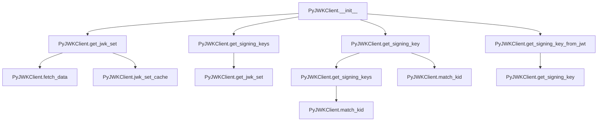

# `jwks_client.py`

## `jwt.jwks_client.PyJWKClient` · *class*

## Summary:
A client for fetching and managing JSON Web Key Sets (JWKS) from remote endpoints for JWT signature verification.

## Description:
The PyJWKClient class provides a robust interface for retrieving JSON Web Key Sets (JWKS) from remote HTTP endpoints and managing the caching of these keys for efficient JWT signature verification. It handles automatic key refreshing, caching strategies, and key matching based on Key IDs (KID) to support secure JWT validation workflows.

## State:
- `uri` (str): The URL endpoint from which JWKS data is fetched
- `headers` (Dict[str, Any]): HTTP headers to be sent with requests to the JWKS endpoint
- `timeout` (int): Request timeout in seconds for HTTP operations
- `ssl_context` (Optional[SSLContext]): SSL context for secure HTTPS connections
- `jwk_set_cache` (Optional[JWKSetCache]): Cache instance for storing fetched JWKS data with expiration
- `get_signing_key` (Callable): The get_signing_key method, potentially wrapped with LRU caching

## Lifecycle:
- Creation: Initialize with a URI and optional caching parameters
- Usage: Call get_signing_key() to retrieve a specific signing key by Key ID, or get_signing_key_from_jwt() to extract and retrieve the appropriate key from a JWT token
- Destruction: No explicit cleanup required; relies on Python's garbage collection

## Method Map:


## Raises:
- `PyJWKClientError`: Raised when lifespan is not positive, or when JWKS endpoint returns invalid data, or when no signing keys are found
- `PyJWKClientConnectionError`: Raised when HTTP requests fail due to network issues or timeouts

## Example:
```python
from jwt.jwks_client import PyJWKClient

# Create client with caching
client = PyJWKClient(
    uri="https://example.com/.well-known/jwks.json",
    cache_keys=True,
    max_cached_keys=32,
    cache_jwk_set=True,
    lifespan=300
)

# Get a signing key by Key ID
key = client.get_signing_key("key-id-123")

# Get a signing key from a JWT token
token = "eyJhbGciOiJSUzI1NiIsInR5cCI6IkpXVCJ9..."
key = client.get_signing_key_from_jwt(token)
```

### `jwt.jwks_client.PyJWKClient.__init__` · *method*

## Summary:
Initializes a PyJWKClient instance with configuration options for fetching and caching JSON Web Key Sets (JWKS) from a remote endpoint.

## Description:
Configures the client with a JWKS endpoint URI and optional caching parameters. This method sets up internal state for HTTP communication and initializes caching mechanisms based on the provided configuration flags and parameters. The client can be configured to cache both the entire JWKS and individual signing keys, with customizable lifespans and cache sizes.

## Args:
    uri (str): The URL endpoint from which JSON Web Key Sets (JWKS) will be fetched
    cache_keys (bool): Whether to enable LRU caching for individual signing key lookups. Defaults to False
    max_cached_keys (int): Maximum number of signing keys to cache when cache_keys=True. Defaults to 16
    cache_jwk_set (bool): Whether to enable caching of the entire JWKS. Defaults to True
    lifespan (int): Time in seconds that cached JWKS data remains valid. Defaults to 300
    headers (Optional[Dict[str, Any]]): HTTP headers to include in requests to the JWKS endpoint. Defaults to None
    timeout (int): Request timeout in seconds for HTTP operations. Defaults to 30
    ssl_context (Optional[SSLContext]): SSL context for secure HTTPS connections. Defaults to None

## Returns:
    None: This method initializes instance attributes and does not return a value

## Raises:
    PyJWKClientError: Raised when lifespan parameter is less than or equal to zero, indicating invalid cache lifespan configuration

## State Changes:
    Attributes READ: None
    Attributes WRITTEN: 
    - self.uri: Stores the JWKS endpoint URI
    - self.jwk_set_cache: Initializes cache instance or sets to None based on cache_jwk_set flag
    - self.headers: Stores HTTP headers for requests
    - self.timeout: Stores request timeout value
    - self.ssl_context: Stores SSL context for secure connections
    - self.get_signing_key: Potentially wraps the method with LRU caching when cache_keys=True

## Constraints:
    Preconditions:
    - The uri parameter must be a valid string representing a URL
    - When cache_jwk_set=True, lifespan must be greater than zero
    - When cache_keys=True, max_cached_keys should be a positive integer
    Postconditions:
    - All instance attributes are properly initialized
    - If cache_jwk_set=True, jwk_set_cache is initialized with the provided lifespan
    - If cache_keys=True, get_signing_key method is wrapped with LRU cache

## Side Effects:
    None: This method performs no I/O operations or external service calls. It only initializes internal state and potentially applies function wrapping.

### `jwt.jwks_client.PyJWKClient.fetch_data` · *method*

## Summary:
Retrieves and parses JSON data from a configured URI, returning it as a Python object while managing caching.

## Description:
This method performs an HTTP GET request to fetch JSON-formatted data from the URI specified in the instance's `uri` attribute. It handles network-related exceptions by raising a `PyJWKClientConnectionError`. The fetched data is cached using the configured `jwk_set_cache` if available. This method is part of the JWKS client responsible for retrieving public keys used for JWT validation.

## Args:
    None

## Returns:
    Any: The parsed JSON data from the remote URI, typically a dictionary containing JWK set information.

## Raises:
    PyJWKClientConnectionError: When the HTTP request fails due to network issues, timeouts, or URL resolution problems.

## State Changes:
    Attributes READ: self.uri, self.headers, self.timeout, self.ssl_context, self.jwk_set_cache
    Attributes WRITTEN: None

## Constraints:
    Preconditions: The instance must have a valid uri attribute set, and the server must be reachable.
    Postconditions: The fetched data is always attempted to be cached in self.jwk_set_cache if it's configured, regardless of success or failure.

## Side Effects:
    I/O: Makes an HTTP request to an external URI.
    External service call: Communicates with a remote server to fetch JSON data.
    Cache mutation: Stores the fetched data in the configured JWKSetCache if available.

### `jwt.jwks_client.PyJWKClient.get_jwk_set` · *method*

## Summary:
Retrieves and validates the JSON Web Key Set (JWKS) from a configured URI, optionally using cached data.

## Description:
Fetches the JWKS data from the configured URI, either from cache or by making a network request. This method ensures the returned data is a valid JSON object before converting it into a PyJWKSet instance. It serves as the primary interface for obtaining the key set used for JWT validation.

The method first attempts to retrieve cached data if a cache is configured and refresh is False. If no cached data is available or refresh is True, it fetches fresh data from the configured URI using the fetch_data() method. The retrieved data must be a dictionary; otherwise, a PyJWKClientError is raised.

## Args:
    refresh (bool): If True, bypasses any cached data and forces a fresh fetch from the URI. Defaults to False.

## Returns:
    PyJWKSet: A PyJWKSet instance constructed from the retrieved JSON data.

## Raises:
    PyJWKClientError: When the JWKS endpoint does not return a valid JSON object (i.e., not a dictionary).

## State Changes:
    Attributes READ: self.jwk_set_cache, self.uri, self.headers, self.timeout, self.ssl_context
    Attributes WRITTEN: None

## Constraints:
    Preconditions: The instance must have a valid uri attribute set, and the server must be reachable.
    Postconditions: The returned PyJWKSet is always constructed from valid dictionary data.

## Side Effects:
    I/O: Makes an HTTP request to an external URI when no valid cached data is available.
    External service call: Communicates with a remote server to fetch JSON data.
    Cache access: Reads from the configured JWKSetCache if available.

### `jwt.jwks_client.PyJWKClient.get_signing_keys` · *method*

## Summary:
Retrieves a list of signing keys from the JSON Web Key Set (JWKS) by filtering keys based on their public key use and key ID attributes.

## Description:
This method fetches the latest JSON Web Key Set (JWKS) from the configured URI and filters it to return only those keys suitable for signing operations. It specifically looks for keys where the `public_key_use` attribute is either "sig" or None, and where a `key_id` is present. This filtering ensures that only valid signing keys are returned for JWT verification purposes.

The method is designed to be called internally by the JWT verification process to obtain the appropriate keys for validating signatures. It serves as a bridge between the raw JWKS data and the specific subset of keys needed for signing operations.

## Args:
    refresh (bool): If True, bypasses any cached data and forces a fresh fetch from the configured URI. Defaults to False.

## Returns:
    List[PyJWK]: A list of PyJWK objects that are suitable for signing operations. Each key must have a `public_key_use` attribute of "sig" or None, and a valid `key_id`.

## Raises:
    PyJWKClientError: When the JWKS endpoint does not contain any keys suitable for signing operations (i.e., no keys meet the filtering criteria).

## State Changes:
    Attributes READ: self.jwk_set_cache, self.uri, self.headers, self.timeout, self.ssl_context
    Attributes WRITTEN: None

## Constraints:
    Preconditions: The instance must have a valid uri attribute set, and the server must be reachable.
    Postconditions: The returned list of PyJWK objects will always contain at least one key, assuming the JWKS endpoint returns valid data.

## Side Effects:
    I/O: Makes an HTTP request to an external URI when no valid cached data is available.
    External service call: Communicates with a remote server to fetch JSON data.
    Cache access: Reads from the configured JWKSetCache if available.

### `jwt.jwks_client.PyJWKClient.get_signing_key` · *method*

## Summary:
Retrieves a signing key from the JWKS endpoint by matching the provided key ID, with automatic cache refresh capability.

## Description:
This method attempts to find a signing key in the cached or fetched JWKS set that matches the given key ID. It first tries to retrieve signing keys from cache, and if no match is found, it refreshes the cache and tries again. This method is designed to be robust against temporary inconsistencies in the JWKS endpoint by implementing a retry mechanism with cache refresh. It is commonly used during JWT validation to obtain the appropriate signing key for verifying signatures.

## Args:
    kid (str): The key ID to match against the signing keys.

## Returns:
    PyJWK: The matching signing key object.

## Raises:
    PyJWKClientError: If no signing key matching the provided key ID can be found after attempting to refresh the cache.

## State Changes:
    Attributes READ: self.uri, self.jwk_set_cache, self.headers, self.timeout, self.ssl_context
    Attributes WRITTEN: None

## Constraints:
    Preconditions: The PyJWKClient instance must be properly initialized with a valid URI and optional caching configuration.
    Postconditions: Either a matching PyJWK object is returned, or a PyJWKClientError is raised.

## Side Effects:
    Makes HTTP requests to the configured JWKS endpoint via fetch_data() if cache refresh is required.
    May update the internal JWK set cache if cache_jwk_set is enabled.
    May modify the cached signing keys if cache_keys is enabled due to the LRU cache behavior.

### `jwt.jwks_client.PyJWKClient.get_signing_key_from_jwt` · *method*

## Summary:
Retrieves the signing key associated with a JWT token by extracting the key ID from the token header and looking up the corresponding key in the JWKS.

## Description:
This method extracts the key ID (kid) from a JWT token's header and retrieves the corresponding signing key from the JWKS endpoint. It is used during JWT validation to dynamically determine which key should be used to verify the token's signature. The method first decodes the JWT without signature verification to access the header, then uses the key ID from the header to look up the appropriate signing key.

## Args:
    token (str): The JWT token string from which to extract the key ID for signing key lookup.

## Returns:
    PyJWK: The signing key object that corresponds to the key ID found in the JWT header.

## Raises:
    PyJWKClientError: If no signing key matching the extracted key ID can be found in the JWKS.

## State Changes:
    Attributes READ: self.jwk_set_cache, self.uri, self.headers, self.timeout, self.ssl_context
    Attributes WRITTEN: None

## Constraints:
    Preconditions: The PyJWKClient instance must be properly initialized with a valid URI and optional caching configuration.
    Postconditions: A valid PyJWK object is returned that can be used for signature verification.

## Side Effects:
    Makes HTTP requests to the configured JWKS endpoint via fetch_data() if cache refresh is required.
    May update the internal JWK set cache if cache_jwk_set is enabled.
    May modify the cached signing keys if cache_keys is enabled due to the LRU cache behavior.

### `jwt.jwks_client.PyJWKClient.match_kid` · *method*

## Summary:
Matches a signing key from a list by its key ID.

## Description:
This function searches through a list of PyJWK objects to find and return the first key that matches the specified key ID. It is used to locate the appropriate signing key for JWT verification based on the key identifier.

## Args:
    signing_keys (List[PyJWK]): A list of PyJWK objects representing available signing keys.
    kid (str): The key ID to match against the signing keys.

## Returns:
    Optional[PyJWK]: The matching PyJWK object if found, otherwise None.

## Raises:
    None explicitly raised.

## State Changes:
    None.

## Constraints:
    Preconditions:
    - The signing_keys list must be iterable.
    - Each item in signing_keys must have a key_id attribute.
    - The kid parameter must be a string.

    Postconditions:
    - Returns either a PyJWK object with matching key_id or None.
    - Does not modify the input signing_keys list.

## Side Effects:
    None.

