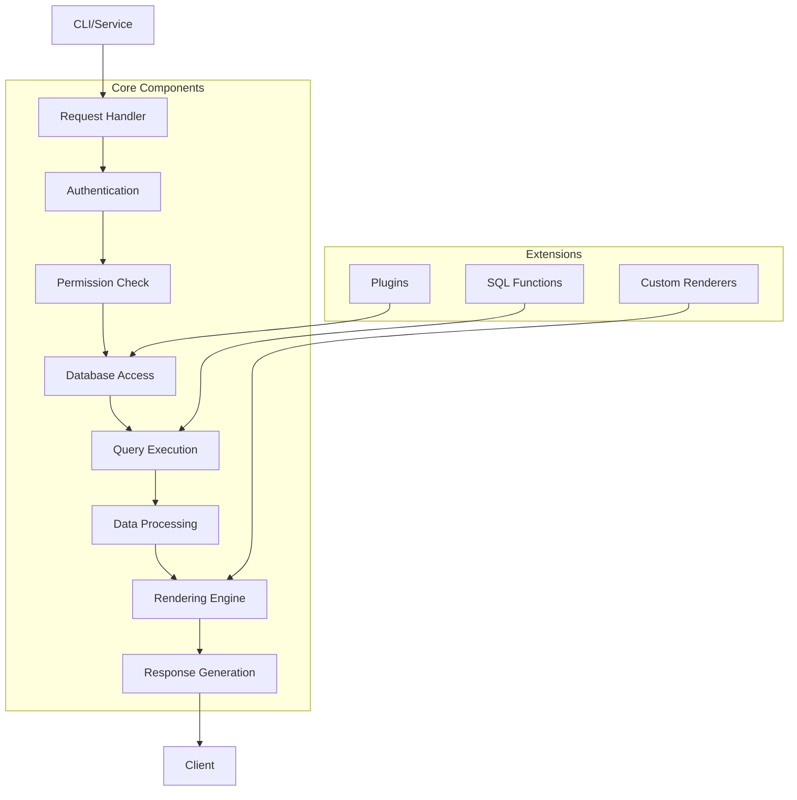

# `datasette`

## Repository Overview

### Tree Structure
```
datasette/
├── publish/          # Publishing and deployment functionality
├── utils/            # Utility functions and helpers
├── views/            # View rendering and presentation logic
├── actor_auth_cookie.py     # Cookie-based actor authentication
├── blob_renderer.py         # Binary data blob rendering
├── database.py              # Core database management and query execution
├── default_magic_parameters.py   # Default magic parameters for queries
├── default_menu_links.py         # Default navigation menu links
├── default_permissions.py        # Default permission policies
├── forbidden.py         # Forbidden access response handler
├── handle_exception.py  # Centralized exception handling
├── inspect.py           # Dataset metadata inspection
├── plugins.py           # Plugin integration and extension points
├── renderer.py          # Core rendering engine for views
├── sql_functions.py     # Custom SQL functions
├── tracer.py            # Tracing and logging utilities
└── url_builder.py       # URL construction utilities
```

### Purpose
Datasette is a tool for exploring and publishing data. It allows users to connect to SQLite databases, explore their contents through a web interface, and publish them as interactive websites. The repository provides the core infrastructure for managing datasets, handling user authentication, rendering data views, and supporting extensible functionality through plugins.

Target users include data scientists, developers, and analysts who want to quickly explore datasets and share them publicly. Datasette enables rapid data exploration and publication without requiring complex backend development.

In the broader ecosystem, Datasette serves as both a standalone tool and a foundation for building data-centric applications. It can be used as a command-line tool, imported as a Python library, or deployed as a web service.

### Architecture


Key architectural patterns include:
- Modular design with clear separation of concerns
- Plugin architecture for extensibility
- Asynchronous database operations for performance
- Thread-safe connection management
- Middleware-style request processing pipeline

### Entry Points
1. **CLI Commands**: `datasette serve` to start a web server, `datasette publish` to deploy datasets (entry points likely defined in setup.py or main module)
2. **Importable APIs**: Direct Python imports for programmatic access to database operations and rendering
3. **Service Endpoints**: HTTP endpoints for browsing datasets, querying data, and managing permissions

### Core Features
- Database connection and query execution with timeout handling
- Web-based dataset exploration interface
- Plugin system for extending functionality
- Authentication and authorization mechanisms
- Custom SQL function support
- Data rendering with various output formats
- Metadata inspection capabilities
- URL construction utilities

### Dependencies
- **sqlite3**: Core database connectivity and operations
- **typing**: Type annotations for better code clarity
- **collections**: Data structure utilities

### Configuration
Configuration is primarily handled through:
- Command-line arguments for CLI usage
- Environment variables for runtime settings
- Configuration files for persistent settings
- Plugin configurations for extended functionality

### Extension Points
- **Plugins**: Implement custom functionality through the plugin system
- **Renderers**: Extend view rendering with custom renderers
- **SQL Functions**: Add custom SQL functions for queries
- **Hooks**: Implement hooks for intercepting and modifying behavior
- **URL Builders**: Customize URL generation for resources

---

## Modules

- [`datasette`](datasette.md)
- [`datasette/publish`](datasette/publish.md)
- [`datasette/utils`](datasette/utils.md)
- [`datasette/views`](datasette/views.md)

