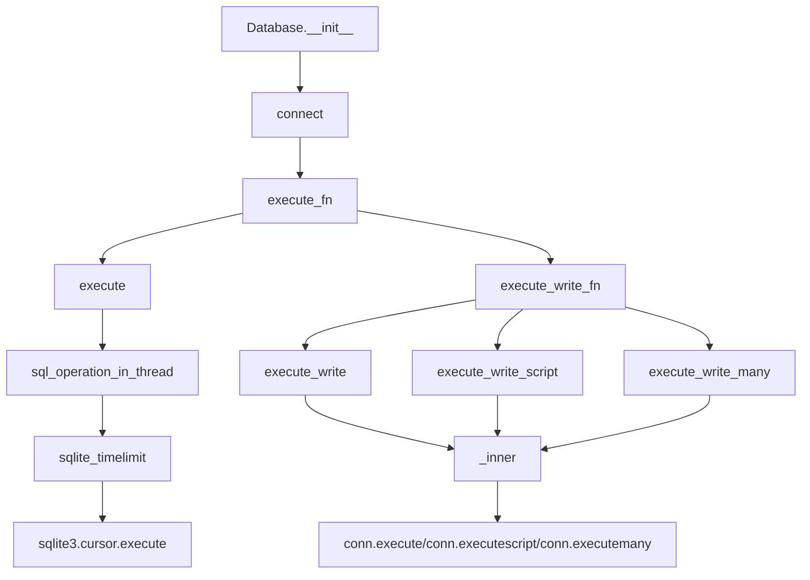
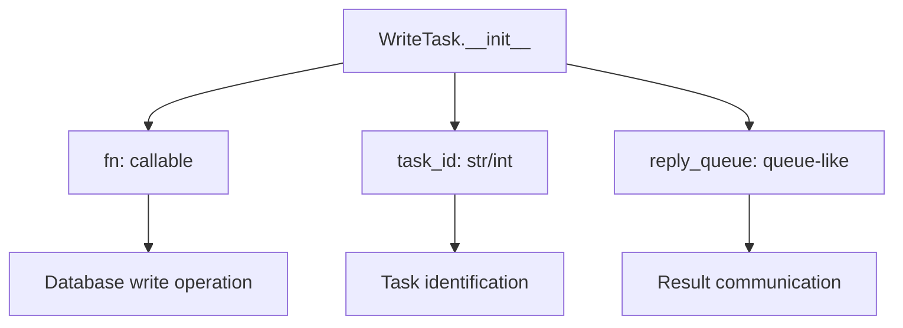
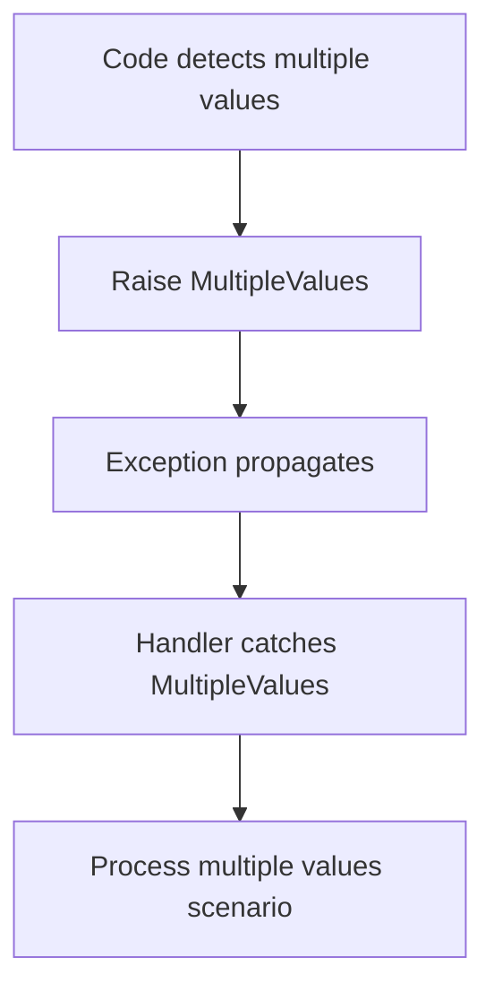
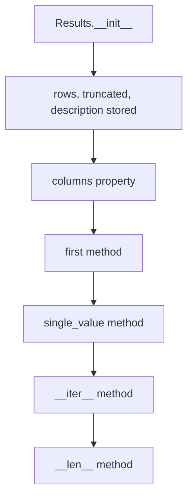

# `database.py`

## `datasette.database.Database` · *class*

## Summary:
Database class manages SQLite database connections and provides asynchronous access to database operations for Datasette.

## Description:
The Database class serves as the central abstraction for managing SQLite database connections and operations within Datasette. It handles both read and write operations with appropriate connection pooling, thread safety, and resource management. The class supports various database types including file-based databases, in-memory databases, and shared memory databases, with different access modes (read-only, mutable, immutable).

The class implements sophisticated connection management strategies:
- Single-threaded mode: Uses direct connection objects for both reads and writes
- Multi-threaded mode: Uses thread pools and queues for write operations to ensure thread safety
- Connection lifecycle management: Properly opens/closes connections and cleans up resources

Key responsibilities include:
- Managing database connection lifecycle and pooling
- Providing asynchronous access to database operations
- Handling read/write separation with appropriate connection settings
- Caching database metadata like table counts, sizes, and hashes
- Supporting various database access patterns (queries, writes, schema introspection)

## State:
- name (str): Database name identifier, initially None
- route (str): Route pattern for accessing this database, initially None  
- ds: Reference to the Datasette instance that owns this database
- path (str): File path to the database file, None for in-memory databases
- is_mutable (bool): Whether the database supports write operations, defaults to True
- is_memory (bool): Whether this is an in-memory database, defaults to False
- memory_name (str): Name for shared memory databases, None for regular databases
- cached_hash (str): Cached hash of the database file, None for mutable/memory databases
- cached_size (int): Cached size of the database file, None for mutable databases
- _cached_table_counts (dict): Cached table count information, None when not cached
- _write_thread (threading.Thread): Background thread for write operations in multi-threaded mode
- _write_queue (queue.Queue): Queue for write tasks in multi-threaded mode
- _read_connection (sqlite3.Connection): Single read-only connection in single-threaded mode
- _write_connection (sqlite3.Connection): Single write connection in single-threaded mode
- _all_file_connections (list): List of all file-based connections for proper cleanup

## Lifecycle:
Creation: Instantiate with Datasette instance and optional path/is_mutable flags
Usage: Call methods like execute(), execute_write(), table_names(), etc. 
Destruction: Call close() method to clean up connections, or rely on context manager behavior

## Method Map:


## Raises:
- AssertionError: When attempting to write to a read-only database
- sqlite3.OperationalError: When database operations fail due to operational issues
- sqlite3.DatabaseError: When database operations fail due to database errors
- QueryInterrupted: When SQL queries are interrupted by timeout

## Example:
```python
# Create database instance
db = Database(datasette_instance, path="/path/to/database.db")

# Execute a read query
results = await db.execute("SELECT * FROM my_table LIMIT 10")

# Execute a write operation
await db.execute_write("INSERT INTO my_table (col1, col2) VALUES (?, ?)", 
                       params=("value1", "value2"))

# Get table names
tables = await db.table_names()

# Close connections
db.close()
```

### `datasette.database.Database.__init__` · *method*

## Summary:
Initializes a Database instance with configuration parameters and sets up internal state for database operations.

## Description:
This method initializes a Database object, setting up essential attributes for database management including connection handling, mutability flags, and caching mechanisms. It serves as the constructor for the Database class and prepares the object for subsequent database operations.

## Args:
    ds (Datasette): Reference to the Datasette application instance
    path (str, optional): File path to the SQLite database file. Defaults to None
    is_mutable (bool): Flag indicating if the database can be modified. Defaults to True
    is_memory (bool): Flag indicating if the database is in-memory. Defaults to False
    memory_name (str, optional): Name for in-memory database. Defaults to None

## Returns:
    None: This method initializes the object's state and does not return a value

## Raises:
    None explicitly raised

## State Changes:
    Attributes READ: None
    Attributes WRITTEN: 
    - self.name: Set to None
    - self.route: Set to None
    - self.ds: Set to the provided ds parameter
    - self.path: Set to the provided path parameter
    - self.is_mutable: Set to the provided is_mutable parameter
    - self.is_memory: Set to the provided is_memory parameter, potentially overridden by memory_name
    - self.memory_name: Set to the provided memory_name parameter
    - self.cached_hash: Set to None
    - self.cached_size: Set to None
    - self._cached_table_counts: Set to None
    - self._write_thread: Set to None
    - self._write_queue: Set to None
    - self._read_connection: Set to None
    - self._write_connection: Set to None
    - self._all_file_connections: Set to empty list

## Constraints:
    Preconditions:
    - ds parameter must be a valid Datasette instance
    - path parameter must be a string or None
    - is_mutable parameter must be a boolean
    - is_memory parameter must be a boolean
    - memory_name parameter must be a string or None
    
    Postconditions:
    - All internal state attributes are initialized to their default values
    - If memory_name is provided, is_memory flag is set to True regardless of initial value

## Side Effects:
    None

### `datasette.database.Database.cached_table_counts` · *method*

## Summary:
Returns cached table count information for the database, populating the cache if needed.

## Description:
This method provides access to pre-computed table counts for the database. It implements a lazy caching mechanism that only computes the table counts once and stores them for subsequent accesses. The method is typically called during database inspection or metadata retrieval operations when the database's inspect_data contains table count information. Unlike the `table_counts` method which computes counts on-demand, this property leverages pre-computed data when available.

## Args:
    None

## Returns:
    dict[str, int] or None: A dictionary mapping table names to their row counts, or None if no inspection data is available for this database.

## Raises:
    None explicitly raised

## State Changes:
    Attributes READ: self._cached_table_counts, self.ds.inspect_data, self.name
    Attributes WRITTEN: self._cached_table_counts

## Constraints:
    Preconditions: The database instance must have a valid name attribute and the inspect_data must be properly initialized. The inspect_data should contain table information for this database name.
    Postconditions: The _cached_table_counts attribute will be populated with table count data if inspection data exists, or remain None otherwise.

## Side Effects:
    None

### `datasette.database.Database.suggest_name` · *method*

## Summary:
Returns a suggested name for the database based on its path or memory name.

## Description:
This method determines an appropriate name for the database instance by checking available identifying information. It is designed to provide a consistent naming scheme for database objects regardless of whether they are file-based or in-memory databases.

## Args:
    None

## Returns:
    str: A string representing the suggested database name. The returned value depends on the following priority:
         - If self.path exists, returns the stem of the path (filename without extension)
         - If self.memory_name exists, returns the memory name
         - Otherwise, returns "db" as a default fallback

## Raises:
    None

## State Changes:
    Attributes READ: self.path, self.memory_name
    Attributes WRITTEN: None

## Constraints:
    Preconditions: None
    Postconditions: The returned string is always a valid identifier for the database

## Side Effects:
    None

### `datasette.database.Database.connect` · *method*

## Summary:
Establishes and returns a SQLite database connection with appropriate configuration based on database type and access mode.

## Description:
This method creates a SQLite database connection tailored to the specific characteristics of the database instance. It handles different database types including in-memory databases, mutable databases, and immutable databases, applying appropriate URI parameters and connection settings. The method is called internally by other methods in the Database class to obtain connections for database operations, such as execute_write_fn and execute_fn.

## Args:
    write (bool): When True, opens the connection in write mode. Defaults to False.

## Returns:
    sqlite3.Connection: A SQLite connection object configured according to the database type and access requirements.

## Raises:
    AssertionError: When write=True is specified for a non-mutable database (i.e., when self.is_mutable is False).

## State Changes:
    Attributes READ: self.memory_name, self.is_memory, self.is_mutable, self.ds.nolock, self.path
    Attributes WRITTEN: self._all_file_connections

## Constraints:
    Preconditions: 
    - If write=True, then self.is_mutable must be True
    - self.path must be defined for non-memory databases
    Postconditions:
    - A valid SQLite connection object is returned
    - The connection is added to self._all_file_connections list

## Side Effects:
    - Creates a new SQLite database connection
    - May perform I/O operations to establish the connection
    - Modifies the internal list of file connections (self._all_file_connections)
    - Sets PRAGMA query_only=1 when not in write mode for memory databases

### `datasette.database.Database.close` · *method*

## Summary:
Closes all database connections managed by this database instance.

## Description:
This method iterates through all file-based database connections stored in the internal `_all_file_connections` collection and closes each one. It is typically called during the cleanup phase of a database session to ensure proper resource deallocation. The method is designed to be idempotent - calling it multiple times is safe.

## Args:
    None

## Returns:
    None

## Raises:
    AttributeError: If `self._all_file_connections` is not initialized or is not iterable.
    Exception: Any exception raised by individual connection.close() calls may propagate up, though this is uncommon for standard SQLite connections.

## State Changes:
    Attributes READ: self._all_file_connections
    Attributes WRITTEN: None

## Constraints:
    Preconditions: The `self._all_file_connections` attribute must be initialized as an iterable collection (list, tuple, etc.) containing SQLite connection objects that support the `close()` method.
    Postconditions: All connections in `self._all_file_connections` will have their `close()` method called, releasing associated resources. Individual connection states are not tracked or modified by this method.

## Side Effects:
    I/O operations: Each connection.close() call performs I/O to close the underlying database file handle.
    Resource cleanup: Frees up system resources associated with database connections.
    Connection invalidation: After calling this method, any further attempts to use the closed connections will likely raise exceptions.

### `datasette.database.Database.execute_write` · *method*

## Summary:
Executes a write SQL statement within a database transaction and returns the execution results.

## Description:
This method provides a mechanism to execute write operations (INSERT, UPDATE, DELETE) on the database asynchronously. It wraps the SQL execution within a transaction context using a context manager (`with conn:`) and delegates to the underlying `execute_write_fn` method for thread-safe execution. The method is designed to be part of the Database class and ensures proper transaction handling and resource management.

The method uses a tracing mechanism to log SQL execution details for performance monitoring and debugging purposes.

## Args:
    sql (str): The SQL statement to execute.
    params (dict, optional): Parameters to bind to the SQL statement. Defaults to None.
    block (bool): Whether to wait for the operation to complete before returning. Defaults to True.

## Returns:
    sqlite3.Cursor: A cursor object representing the result of the SQL execution.

## Raises:
    Exception: If the operation fails and block is True, the underlying exception is re-raised.

## State Changes:
    Attributes READ: self.name, self.ds, self._write_connection, self._write_queue, self._write_thread
    Attributes WRITTEN: self._write_connection, self._write_queue, self._write_thread

## Constraints:
    Preconditions: The Database instance must be properly initialized with a valid connection setup.
    Postconditions: If block=True, the operation completes successfully or raises an exception. If block=False, a task ID is returned immediately.

## Side Effects:
    I/O: Database write operations are performed.
    Thread creation: A new thread may be started if write operations are queued.
    Logging: Execution tracing information is recorded via the trace utility.

### `datasette.database.Database.execute_write_script` · *method*

## Summary:
Executes a SQL script containing multiple statements within a database transaction, ensuring atomicity of the entire script execution.

## Description:
This method provides a thread-safe mechanism for executing multi-statement SQL scripts against the database. It wraps the script execution within a transaction context using SQLite's `executescript()` method, which allows multiple SQL statements separated by semicolons to be executed as a single unit. The method leverages the underlying `execute_write_fn` to manage concurrent write operations safely.

The method is typically called during database initialization, schema migrations, or bulk data modification operations where multiple SQL statements need to be executed together as a single atomic transaction. It ensures that either all statements in the script succeed or none do, maintaining database consistency.

## Args:
    sql (str): The SQL script containing one or more statements to be executed. Must be a valid SQL script string with statements separated by semicolons.
    block (bool): Controls whether to wait for completion (True, default) or return immediately with a task ID (False). When True, the method blocks until execution completes.

## Returns:
    Any: The result of executing the SQL script, typically the return value from the underlying database connection's executescript() method. When block=False, returns a UUID task identifier representing the queued operation.

## Raises:
    Exception: Any exceptions raised by the underlying database connection or execution mechanisms, such as SQL syntax errors, constraint violations, or database connection issues.

## State Changes:
    Attributes READ: self.name, self.ds
    Attributes WRITTEN: None

## Constraints:
    Preconditions: The database must be writable and accessible. The SQL script must be valid and compatible with the database schema.
    Postconditions: The SQL script is executed as a single atomic transaction if successful.

## Side Effects:
    I/O: Performs database I/O operations including connection management and script execution. May involve thread switching when using async execution paths.

### `datasette.database.Database.execute_write_many` · *method*

## Summary:
Executes a batch SQL write operation with parameter sequences, counting affected rows and tracing the execution.

## Description:
This method performs a bulk SQL write operation using the `executemany` method on a database connection. It counts the total number of parameters processed across all sequences and traces the execution for monitoring purposes. The method is designed to handle batch operations efficiently while maintaining thread safety through the underlying `execute_write_fn` mechanism.

The method uses a nested helper function `_inner` that wraps the database connection and counts parameters during execution. It also integrates with the tracing system to monitor performance and execution details. The underlying `sqlite3` module is used for database operations.

## Args:
    sql (str): The SQL statement to execute, typically containing placeholders for parameters.
    params_seq (sequence): A sequence of parameter sequences to be used with the SQL statement.
    block (bool): If True (default), waits for completion before returning. If False, returns immediately with a task ID.

## Returns:
    Any: The result of the database operation, typically a cursor object from the executed statement.

## Raises:
    Exception: Any exceptions raised by the underlying database connection or execution mechanisms.

## State Changes:
    Attributes READ: self.name, self.execute_write_fn
    Attributes WRITTEN: None directly, but affects database state through write operations

## Constraints:
    Preconditions: The database must be writable, and the SQL statement must be valid for batch execution.
    Postconditions: The database is updated with the results of the batch operation, and execution is traced.

## Side Effects:
    I/O: Performs database write operations and tracing I/O.
    External service calls: Uses the tracing mechanism from the tracer module and sqlite3 database operations.

### `datasette.database.Database.execute_write_fn` · *method*

## Summary:
Executes a write operation function within a database connection, managing thread-safe execution for concurrent writes through either synchronous or asynchronous execution paths.

## Description:
This method provides a thread-safe mechanism for executing write operations on a database. When the Datasette instance doesn't use an executor (`ds.executor is None`), it executes the function synchronously using a dedicated write connection. When an executor is available, it queues the operation for background execution in a separate thread, returning either the result or a task ID depending on the `block` parameter.

The method is designed to handle concurrent write operations safely, ensuring that write operations don't interfere with each other or with read operations.

## Args:
    fn (callable): A function that accepts a database connection as its sole argument and performs write operations. The function should be designed to work with SQLite connections.
    block (bool): If True (default), the method blocks until the operation completes and returns the result. If False, it immediately returns a UUID task identifier for tracking the operation.

## Returns:
    Any: When block=True, returns the result of executing the provided function `fn`. When block=False, returns a UUID task identifier representing the queued operation.

## Raises:
    Exception: When block=True and the operation raises an exception, it is re-raised directly.

## State Changes:
    Attributes READ: self.ds, self._write_connection, self._write_queue, self._write_thread
    Attributes WRITTEN: self._write_connection, self._write_queue, self._write_thread

## Constraints:
    Preconditions: The database must be mutable if attempting to write. The function `fn` must accept a single database connection argument.
    Postconditions: If ds.executor is None, a write connection is established and used. Otherwise, the write operation is queued for background processing.

## Side Effects:
    I/O: Creates and manages database connections, potentially creating new threads and queues for write operations. May write to stderr in case of exceptions in the background thread.

### `datasette.database.Database._execute_writes` · *method*

## Summary:
Processes database write operations in a dedicated thread, handling connection management and task execution.

## Description:
This private method serves as the main execution loop for the database write thread. It establishes a write-capable database connection, prepares it for use, and continuously processes write tasks from the `_write_queue`. Each task contains a function to execute against the database connection, and results are returned via the task's reply queue. This method is designed to run in a separate thread to enable asynchronous write operations without blocking the main execution thread.

## Args:
    None

## Returns:
    None

## Raises:
    Exception: Propagates exceptions from database connection setup or task execution to the calling thread via the reply queue.

## State Changes:
    Attributes READ: self.connect, self.ds._prepare_connection, self._write_queue
    Attributes WRITTEN: None

## Constraints:
    Preconditions: 
    - The Database instance must have a valid connection configuration
    - The write queue must be initialized before this method is called
    - The method assumes that the database is mutable or uses memory storage
    - The method is intended to be called only from a dedicated thread
    
    Postconditions:
    - All write tasks in the queue are processed
    - Each task's result is sent back through its reply queue
    - The database connection is properly established and managed

## Side Effects:
    - Creates and manages a dedicated thread for write operations (via `_write_thread`)
    - Establishes a database connection for write operations
    - Writes error messages to stderr when exceptions occur during task execution
    - Puts results back into task reply queues for communication with calling threads
    - May modify the database state through executed write operations

### `datasette.database.Database.execute_fn` · *method*

## Summary:
Executes a database operation function with an appropriate SQLite connection, managing connection lifecycle and supporting both synchronous and asynchronous execution contexts.

## Description:
This method serves as a central mechanism for executing database operations that require a SQLite connection. It handles connection management by either using a pre-established connection or creating a new one when needed. The method supports two execution modes: when `self.ds.executor` is None (single-threaded mode), it uses a direct connection approach; when an executor is available (multi-threaded mode), it runs the operation in a separate thread pool. This design allows for efficient database access while maintaining thread safety and proper resource management.

Known callers:
- `execute_write_fn` (for write operations)
- `execute` (for SQL query execution)
- Various utility methods like `table_columns`, `primary_keys`, etc.

This method exists to abstract away the complexity of connection management and execution context switching, providing a clean interface for database operations regardless of whether they run in the main thread or a thread pool.

## Args:
    fn (callable): A function that accepts a single SQLite connection argument and performs database operations. The function should return the result of the database operation.

## Returns:
    The return value of the provided function `fn`. This could be query results, modification counts, or any other value returned by the database operation.

## Raises:
    Any exceptions that may occur during database operations or connection establishment, including those raised by the provided function `fn`.

## State Changes:
    Attributes READ: self.ds.executor, self._read_connection, self.name, self.ds
    Attributes WRITTEN: self._read_connection (when initialized in single-threaded mode)

## Constraints:
    Preconditions:
    - The Database instance must be properly initialized
    - The provided function `fn` must accept a single SQLite connection argument
    - The function `fn` should not perform long-running operations that would block the thread pool
    Postconditions:
    - A valid SQLite connection is provided to the function `fn`
    - The function's return value is properly returned to the caller
    - Connections are properly managed and reused when possible

## Side Effects:
    - Creates new SQLite database connections when needed
    - May perform I/O operations to establish database connections
    - In multi-threaded mode, executes the provided function in a separate thread pool
    - May modify global connection cache via `setattr(connections, self.name, conn)` in multi-threaded mode

### `datasette.database.Database.execute` · *method*

## Summary:
Executes a SQL query against the database and returns formatted results with optional truncation and timeout handling.

## Description:
This asynchronous method executes a SQL query using a dedicated database connection, applying configurable timeouts and result truncation. It handles database connection management, query execution in a separate thread, and proper error reporting. The method is designed to be the primary interface for executing read-only queries against the database while ensuring safe resource usage and appropriate error handling.

## Args:
- sql (str): The SQL query string to execute
- params (dict, optional): Parameters to bind to the SQL query. Defaults to None
- truncate (bool): Whether to apply result truncation based on configured limits. When True, results may be truncated and the truncated flag will be set on the returned Results object. Defaults to False
- custom_time_limit (int, optional): Custom timeout in milliseconds for this query. Defaults to None
- page_size (int, optional): Page size to use for result limiting. Defaults to None
- log_sql_errors (bool): Whether to log SQL errors to stderr. Defaults to True

## Returns:
- Results: A Results object containing the query results, truncated status, and column descriptions

## Raises:
- QueryInterrupted: When a query is interrupted (typically due to timeout)
- sqlite3.OperationalError: When database operation fails
- sqlite3.DatabaseError: When database integrity issues occur

## State Changes:
- Attributes READ: self.ds.page_size, self.ds.sql_time_limit_ms, self.ds.max_returned_rows, self.name
- Attributes WRITTEN: None

## Constraints:
- Preconditions: Database instance must be properly initialized with valid connection settings
- Postconditions: Returns a Results object with populated rows, truncated flag, and column descriptions

## Side Effects:
- I/O operations: Database query execution
- External service calls: Connection management through self.execute_fn
- Logging: Error messages written to stderr when log_sql_errors=True

### `datasette.database.Database.hash` · *method*

## Summary:
Computes and caches a SHA-256 hash of the database file for immutable databases, returning None for mutable or memory databases.

## Description:
This method calculates a cryptographic hash of the database file to enable cache invalidation and change detection. It serves as a lazy-loaded property that caches the result for performance. The hash is only computed for persistent databases that are not mutable or in-memory. The method first checks for a cached hash, then handles special cases (mutable/memory databases), then checks inspect data, and finally computes the hash from the file.

## Args:
    None

## Returns:
    str or None: SHA-256 hexadecimal hash string of the database file if the database is immutable and persistent, otherwise None.

## Raises:
    None explicitly raised

## State Changes:
    Attributes READ: self.cached_hash, self.is_mutable, self.is_memory, self.ds.inspect_data, self.name, self.path
    Attributes WRITTEN: self.cached_hash

## Constraints:
    Preconditions: The Database instance must have valid attributes: cached_hash, is_mutable, is_memory, ds, name, and path.
    Postconditions: If a hash is computed, it is stored in self.cached_hash for future calls.

## Side Effects:
    I/O: Reads the entire database file to compute the hash (potentially expensive for large files)
    External service calls: None

### `datasette.database.Database.size` · *method*

## Summary:
Calculates and returns the size of the database file in bytes, using cached values when available to optimize performance.

## Description:
This method determines the size of the database file by implementing a tiered approach to minimize filesystem access. It prioritizes cached values when available, handles special cases for in-memory and mutable databases, and falls back to filesystem statistics when necessary.

The method is typically invoked during database inspection and metadata retrieval operations to provide size information for display or processing. It's designed as a separate method to encapsulate the complexity of size determination and enable efficient caching.

## Args:
    None

## Returns:
    int: Size of the database file in bytes. Returns 0 for in-memory databases, and caches results for subsequent calls.

## Raises:
    FileNotFoundError: When the database file doesn't exist and cannot be accessed via filesystem stats.

## State Changes:
    Attributes READ: self.cached_size, self.is_memory, self.is_mutable, self.path, self.name, self.ds.inspect_data
    Attributes WRITTEN: self.cached_size (when cache is populated)

## Constraints:
    Preconditions: 
    - Database instance must be properly initialized with required attributes (path, name, etc.)
    - File system access must be available for Path operations
    
    Postconditions:
    - Returns integer size value (0 for memory databases)
    - Caches result in self.cached_size for subsequent calls
    - File system is accessed only when necessary

## Side Effects:
    I/O: File system stat() operations to determine file size
    External service calls: None
    Mutations to objects outside self: May update self.cached_size attribute

### `datasette.database.Database.table_counts` · *method*

## Summary:
Retrieves row counts for all tables in the database, caching results for immutable databases.

## Description:
This asynchronous method calculates the number of rows in each table of the database by executing a COUNT(*) query on each table. It implements caching for immutable databases to avoid repeated expensive queries. The method is designed to handle potential query interruptions and database errors gracefully by returning None for problematic tables.

## Args:
- limit (int): Maximum time in milliseconds to allow for each individual table count query. Defaults to 10

## Returns:
- dict: A dictionary mapping table names to their row counts (integers) or None if the count could not be determined

## Raises:
- QueryInterrupted: When a table count query is interrupted due to timeout
- sqlite3.OperationalError: When database operation fails during table count calculation
- sqlite3.DatabaseError: When database integrity issues occur during table count calculation

## State Changes:
- Attributes READ: self.is_mutable, self.cached_table_counts
- Attributes WRITTEN: self._cached_table_counts (only for mutable databases)

## Constraints:
- Preconditions: Database instance must be properly initialized and accessible
- Postconditions: Returns a dictionary with all table names as keys and integer counts or None as values

## Side Effects:
- I/O operations: Database queries to count rows in each table
- External service calls: Database connection management through self.execute

### `datasette.database.Database.mtime_ns` · *method*

## Summary:
Returns the last modification time of the database file in nanoseconds, or None for in-memory databases.

## Description:
This method retrieves the modification timestamp of the database file associated with this database instance. It is designed to provide metadata about when the database was last modified, which can be useful for cache invalidation or change detection. The method is specifically implemented as a property to provide clean access to this metadata without requiring explicit method calls.

## Args:
    None

## Returns:
    int or None: The last modification time of the database file in nanoseconds since the Unix epoch. Returns None for in-memory databases (when `is_memory` is True).

## Raises:
    None

## State Changes:
    Attributes READ: self.is_memory, self.path
    Attributes WRITTEN: None

## Constraints:
    Preconditions: The database must have a valid file path (`self.path`) when not in-memory.
    Postconditions: The returned value represents the actual file modification time or None for in-memory databases.

## Side Effects:
    I/O: Performs a filesystem stat operation on the database file path.

### `datasette.database.Database.attached_databases` · *method*

## Summary:
Returns a list of attached database objects for the current database instance, excluding the main database.

## Description:
This method queries the SQLite database for information about attached databases using the PRAGMA database_list command. It filters out the main database (where seq=0) and returns only attached databases. This method is designed to encapsulate the logic for retrieving attached database information in a reusable way, providing a clean interface for accessing database attachment details.

The filtering logic ensures that only attached databases are returned, excluding the primary database connection itself. This is useful for applications that need to know what additional databases are attached to the current database connection.

## Args:
    None

## Returns:
    list[AttachedDatabase]: A list of AttachedDatabase named tuples containing information about each attached database. Each tuple contains database metadata from the PRAGMA output, with fields typically including name, file path, and sequence number.

## Raises:
    None explicitly raised

## State Changes:
    Attributes READ: None
    Attributes WRITTEN: None

## Constraints:
    Preconditions: The database connection must be properly initialized and accessible.
    Postconditions: Returns a list of AttachedDatabase objects representing attached databases only (excluding the main database).

## Side Effects:
    I/O: Executes a SQL query against the SQLite database connection.
    External service calls: None
    Mutations to objects outside self: None

### `datasette.database.Database.table_exists` · *method*

## Summary:
Checks whether a specified table exists in the SQLite database by querying the sqlite_master table.

## Description:
This asynchronous method performs a database query to determine if a table with the given name exists in the SQLite database. It leverages the sqlite_master system table which contains metadata about database objects. The method executes a SELECT query that returns rows when the table exists, and no rows when it doesn't. The result is converted to a boolean value where True indicates the table exists and False indicates it does not.

## Args:
    table (str): The name of the table to check for existence. Must be a valid SQLite table name.

## Returns:
    bool: True if the table exists, False otherwise.

## Raises:
    Any exceptions raised by the underlying database execution mechanism (e.g., connection errors, query execution failures).

## State Changes:
    Attributes READ: None
    Attributes WRITTEN: None

## Constraints:
    Preconditions: The Database instance must be properly initialized and connected to a valid SQLite database.
    Postconditions: The method returns a boolean value indicating table existence without modifying the database state.

## Side Effects:
    I/O: Performs a synchronous database query operation against the SQLite database.
    External service calls: None
    Mutations to objects outside self: None

### `datasette.database.Database.table_names` · *method*

## Summary:
Retrieves the names of all tables in the SQLite database.

## Description:
This method queries the SQLite master table to collect all table names. It is designed as a dedicated async method to encapsulate database table discovery logic, making it reusable and testable. The method executes a SQL query against the database and processes the results to extract table names.

## Args:
    None

## Returns:
    list[str]: A list of table names as strings from the database.

## Raises:
    Any exceptions that may occur during database execution or query processing.

## State Changes:
    Attributes READ: None
    Attributes WRITTEN: None

## Constraints:
    Preconditions: The Database instance must be properly initialized and connected to a valid SQLite database.
    Postconditions: The returned list contains only valid table names from the database schema.

## Side Effects:
    I/O: Performs an asynchronous database query against the SQLite database.

### `datasette.database.Database.table_columns` · *method*

## Summary:
Retrieves a list of column names for a specified database table asynchronously.

## Description:
Fetches the names of all columns in the given table by executing a database query through the connection management system. This method delegates to the utility function `table_columns` which internally retrieves detailed column metadata and extracts only the column names.

Known callers:
- Called by internal components that need quick access to column names for table analysis, schema inspection, or data processing workflows.

This logic is encapsulated in its own method to provide a clean abstraction layer for column name retrieval, separating concerns from raw SQL execution and connection handling while ensuring proper asynchronous execution.

## Args:
    table (str): Name of the database table to query for column names.

## Returns:
    list[str]: A list of column names for the specified table.

## Raises:
    Any exceptions that may occur during database query execution or connection establishment, including those from the underlying `table_columns` utility function or `execute_fn`.

## State Changes:
    Attributes READ: self.ds.executor, self._read_connection, self.name, self.ds
    Attributes WRITTEN: self._read_connection (when initialized in single-threaded mode)

## Constraints:
    Preconditions:
    - The Database instance must be properly initialized
    - The specified table name must exist in the database
    - The provided function `fn` must accept a single SQLite connection argument
    Postconditions:
    - A valid SQLite connection is provided to the underlying utility function
    - A list of column names is returned for the specified table

## Side Effects:
    - Performs database I/O operations to execute PRAGMA queries
    - May create new SQLite database connections when needed
    - May perform I/O operations to establish database connections

### `datasette.database.Database.table_column_details` · *method*

## Summary:
Retrieves detailed column metadata for a specified database table using SQLite PRAGMA commands.

## Description:
Fetches comprehensive information about each column in the given table, including column name, data type, constraints, and other attributes. This method automatically selects between `PRAGMA table_xinfo()` (for SQLite 3.26.0+) and `PRAGMA table_info()` based on the SQLite version available. The method delegates to the utility function `table_column_details` which handles the actual database query execution through the connection management provided by `execute_fn`.

Known callers:
- Called by various utility methods and internal components that require detailed column metadata for table analysis, schema inspection, or data processing workflows.

This logic is encapsulated in its own method to provide a clean abstraction layer for column metadata retrieval, separating concerns from raw SQL execution and connection handling while automatically adapting to different SQLite versions.

## Args:
    table (str): Name of the database table to query for column details.

## Returns:
    list[Column]: A list of Column named tuples containing detailed information about each column in the specified table. Each Column tuple contains the following fields:
        - cid (int): Column index
        - name (str): Column name
        - type (str): Data type
        - notnull (bool): Whether the column is NOT NULL
        - dflt_value (str): Default value
        - pk (int): Primary key index (0 if not part of primary key)
        - hidden (int): Hidden flag (0 for older SQLite versions)

## Raises:
    Any exceptions that may occur during database query execution or connection establishment, including those from the underlying `table_column_details` utility function or `execute_fn`.

## State Changes:
    Attributes READ: self.ds.executor, self._read_connection, self.name, self.ds
    Attributes WRITTEN: self._read_connection (when initialized in single-threaded mode)

## Constraints:
    Preconditions:
    - The Database instance must be properly initialized
    - The specified table name must exist in the database
    - The provided function `fn` must accept a single SQLite connection argument
    Postconditions:
    - A valid SQLite connection is provided to the underlying utility function
    - Detailed column information is returned for the specified table

## Side Effects:
    - Performs database I/O operations to execute PRAGMA queries
    - May create new SQLite database connections when needed
    - May perform I/O operations to establish database connections

### `datasette.database.Database.primary_keys` · *method*

## Summary:
Retrieves the primary key column names for a specified database table.

## Description:
This method fetches the primary key information for a given table by executing a database operation that determines which columns serve as primary keys. It leverages the existing `execute_fn` infrastructure to manage database connections and execute the underlying `detect_primary_keys` utility function.

Known callers:
- Various utility methods that require primary key information for table analysis
- Database introspection routines that need to understand table schema

This method exists as a dedicated interface to encapsulate the logic for retrieving primary key information, separating this concern from the raw database operations and making it reusable across different parts of the system.

## Args:
    table (str): The name of the database table for which to retrieve primary key information.

## Returns:
    list[str]: A list of column names that constitute the primary key for the specified table, sorted by their primary key priority.

## Raises:
    Any exceptions that may occur during database connection establishment or query execution, including those raised by the underlying `detect_primary_keys` function.

## State Changes:
    Attributes READ: None
    Attributes WRITTEN: None

## Constraints:
    Preconditions:
    - The Database instance must be properly initialized
    - The specified table must exist in the database
    - The table must have a defined primary key structure
    Postconditions:
    - Returns a list of primary key column names in order of priority
    - The returned list is empty if the table has no primary key

## Side Effects:
    - Performs database I/O operations to query table schema information
    - May create new database connections through the `execute_fn` mechanism

### `datasette.database.Database.fts_table` · *method*

## Summary:
Determines if a table in the database has a corresponding FTS (Full Text Search) virtual table and returns the FTS table name if it exists.

## Description:
This method checks whether a given table has an associated FTS (Full Text Search) virtual table in the SQLite database. It uses the `detect_fts` utility function to perform the check. The method is designed to be called asynchronously and leverages the database's existing connection management through `execute_fn`.

## Args:
    table (str): The name of the table to check for an associated FTS table.

## Returns:
    str or None: The name of the FTS table if it exists, otherwise None.

## Raises:
    None explicitly raised by this method. Exceptions from underlying database operations or `detect_fts` may propagate.

## State Changes:
    Attributes READ: None
    Attributes WRITTEN: None

## Constraints:
    Preconditions: The database must be properly initialized and accessible.
    Postconditions: The method returns either the name of the FTS table or None, with no modification to the database state.

## Side Effects:
    I/O: Performs database queries to check for the existence of tables in the sqlite_master table.
    External service calls: None
    Mutations to objects outside self: None

### `datasette.database.Database.label_column_for_table` · *method*

## Summary:
Determines the appropriate column to use as a label for a given database table based on metadata, naming conventions, or structural analysis.

## Description:
This method identifies a suitable column name for displaying human-readable labels for rows in a database table. It follows a prioritized approach: first checking for an explicitly defined label column in table metadata (via self.ds.table_metadata), then looking for common naming patterns like 'name' or 'title', and finally making a heuristic choice based on column count and presence of 'id' or 'pk' columns. This method is part of the Database class and is used to enhance user experience by automatically selecting meaningful display columns.

## Args:
    table (str): The name of the database table to analyze.

## Returns:
    str or None: The name of the column to use as a label, or None if no suitable column is found.

## Raises:
    None explicitly raised.

## State Changes:
    Attributes READ: self.ds, self.name
    Attributes WRITTEN: None

## Constraints:
    Preconditions:
        - The table name must be valid and exist in the database.
        - The database connection must be established.
    Postconditions:
        - Returns either a column name string or None.
        - The returned column name corresponds to an existing column in the table.

## Side Effects:
    - Executes database queries via self.execute_fn to fetch column information.
    - May involve I/O operations for database access.

### `datasette.database.Database.foreign_keys_for_table` · *method*

## Summary:
Retrieves outbound foreign key information for a specified database table.

## Description:
Fetches the outbound foreign key relationships defined on the given table by querying the SQLite pragma information. This method abstracts the database access logic through the `execute_fn` helper, ensuring proper connection management and execution context handling. The returned foreign keys are filtered to exclude compound foreign keys, keeping only simple foreign key relationships.

Known callers:
- This method is likely called during database schema inspection or table metadata retrieval processes, particularly when building relationship graphs or validating referential integrity.

This logic is encapsulated in its own method to provide a clean abstraction for foreign key retrieval, separate from general database query execution, and to leverage the existing connection management infrastructure in `execute_fn`.

## Args:
    table (str): Name of the database table for which to retrieve outbound foreign key information.

## Returns:
    list[dict]: A list of dictionaries, each containing:
        - "column" (str): The name of the foreign key column in the source table
        - "other_table" (str): The name of the referenced table
        - "other_column" (str): The name of the referenced column in the other table

## Raises:
    Any exceptions that may occur during database connection establishment or query execution, including those raised by the underlying `get_outbound_foreign_keys` utility function or `execute_fn`.

## State Changes:
    Attributes READ: None
    Attributes WRITTEN: None

## Constraints:
    Preconditions:
    - The Database instance must be properly initialized
    - The specified table name must exist in the database
    - The table must have foreign key constraints defined
    Postconditions:
    - Returns a list of foreign key relationship definitions for the specified table
    - The returned list contains only simple (non-compound) foreign keys

## Side Effects:
    - Performs database I/O operations to query the SQLite pragma
    - May create new database connections through the `execute_fn` mechanism

### `datasette.database.Database.hidden_table_names` · *method*

## Summary:
Returns a list of hidden table names in the database by collecting system tables, Spatialite tables, and metadata-defined hidden tables.

## Description:
This asynchronous method compiles a comprehensive list of hidden table names by gathering tables from multiple sources. It first retrieves table names from the database's sqlite_master table, then adds Spatialite-specific tables if Spatialite is detected, followed by tables marked as hidden in database metadata. Finally, it identifies tables that start with any of the previously identified hidden table prefixes, making them hidden as well.

The method is used internally by Datasette to properly handle hidden tables in web interface rendering and API responses. It's designed to be self-contained and not rely on external state beyond the database connection and metadata.

Known callers:
- Internal Datasette processes that require knowledge of hidden tables
- Database metadata and display logic

This method exists as a dedicated utility to centralize the logic for identifying hidden tables, rather than scattering this logic throughout the codebase.

## Args:
    None

## Returns:
    list[str]: A list of table names that should be considered hidden in the database. These include system tables, Spatialite tables, and metadata-defined hidden tables.

## Raises:
    Any exceptions that may occur during database query execution through `self.execute()` or `self.execute_fn()`.

## State Changes:
    Attributes READ: self.ds, self.name
    Attributes WRITTEN: None

## Constraints:
    Preconditions:
    - The Database instance must be properly initialized with a valid connection
    - The database must be accessible for querying
    Postconditions:
    - Returns a list of strings representing hidden table names
    - The returned list contains no duplicates (though the implementation may add duplicates during processing)

## Side Effects:
    - I/O operations: Database queries to retrieve table information
    - External service calls: Connection management through `self.execute_fn()` and `self.execute()`

### `datasette.database.Database.view_names` · *method*

## Summary:
Retrieves the names of all SQL views defined in the database.

## Description:
This asynchronous method queries the SQLite metadata table `sqlite_master` to collect the names of all database views. It executes a SELECT query filtering for records where type='view' and returns a list of view names.

## Args:
    None

## Returns:
    list[str]: A list of strings containing the names of all views in the database. Returns an empty list if no views exist.

## Raises:
    None explicitly raised

## State Changes:
    Attributes READ: None
    Attributes WRITTEN: None

## Constraints:
    Preconditions: The Database instance must be properly initialized and connected to a valid SQLite database.
    Postconditions: The returned list contains only valid view names from the database schema.

## Side Effects:
    I/O: Performs a database query operation via the execute method.
    External service calls: None
    Mutations to objects outside self: None

### `datasette.database.Database.get_all_foreign_keys` · *method*

## Summary:
Retrieves all foreign key relationships in the database, organized by table with incoming and outgoing references.

## Description:
This method provides a comprehensive view of all foreign key constraints within the SQLite database by analyzing the schema and pragma information. It aggregates both incoming and outgoing foreign key relationships for each table, enabling applications to understand database referential integrity and relationship structure.

The method delegates to the `get_all_foreign_keys` utility function through the `execute_fn` wrapper, ensuring proper connection management and execution context handling. This separation allows for consistent database access patterns while keeping the core foreign key analysis logic centralized in the utilities module.

Known callers:
- This method is likely called during database metadata inspection or schema analysis phases, particularly when building relationship maps or validating referential integrity.

This logic is encapsulated in its own method to provide a clean abstraction layer that separates database access concerns from the core foreign key analysis algorithm, making it reusable across different parts of the application.

## Args:
    None

## Returns:
    dict: A dictionary mapping table names to their foreign key relationships, where each table entry contains:
        - "incoming": list of foreign key references pointing to this table
        - "outgoing": list of foreign key references originating from this table
    Each foreign key entry is a dictionary with keys: "other_table", "column", "other_column"

## Raises:
    Any exceptions that may occur during database operations or connection establishment, including those raised by the underlying `get_all_foreign_keys` utility function.

## State Changes:
    Attributes READ: None
    Attributes WRITTEN: None

## Constraints:
    Preconditions:
    - The Database instance must be properly initialized with a valid SQLite connection
    - The database must be accessible and contain valid schema information
    Postconditions:
    - Returns a complete mapping of all foreign key relationships in the database
    - The returned dictionary structure is consistent with the expected format

## Side Effects:
    - Performs database queries to retrieve schema information
    - May create new database connections through the execute_fn mechanism
    - Executes I/O operations to read database metadata

### `datasette.database.Database.get_table_definition` · *method*

## Summary:
Retrieves the SQL definition of a database table or view, including associated index definitions.

## Description:
This method queries the SQLite master table to fetch the CREATE statement for a specified table or view, and then appends all associated index definitions. It is designed to provide complete schema information for a given database object.

The method is called during database schema inspection operations, particularly when building metadata about tables and views for display or analysis purposes. It serves as a dedicated utility for retrieving complete schema definitions rather than inlining the SQL logic elsewhere.

## Args:
    table (str): Name of the table or view to retrieve definition for
    type_ (str): Type of database object to look up, defaults to "table" (other valid values include "view")

## Returns:
    str or None: Full SQL definition including table/view creation statement and all associated indexes, or None if the table/view doesn't exist

## Raises:
    None explicitly raised - relies on underlying execute() method for any database-related exceptions

## State Changes:
    Attributes READ: None
    Attributes WRITTEN: None

## Constraints:
    Preconditions: 
    - Database connection must be established
    - Table/view name must be a valid SQLite identifier
    - The specified table/view must exist in the database
    
    Postconditions:
    - Returns properly formatted SQL with semicolon terminators
    - Index definitions are appended to the main table definition

## Side Effects:
    - Performs asynchronous database queries via the execute() method
    - May trigger database I/O operations

### `datasette.database.Database.get_view_definition` · *method*

## Summary:
Retrieves the complete SQL definition of a database view, including associated index definitions.

## Description:
This asynchronous method fetches the CREATE statement for a specified view from the SQLite master table and appends all associated index definitions. It internally calls `self.get_table_definition(view, "view")` to retrieve the complete schema information.

The method is used during database schema inspection operations to provide complete view schema information for display or analysis purposes. It serves as a dedicated utility for retrieving view definitions rather than inlining the SQL logic elsewhere.

## Args:
    view (str): Name of the view to retrieve definition for

## Returns:
    str or None: Full SQL definition including view creation statement and all associated indexes, or None if the view doesn't exist

## Raises:
    None explicitly raised - relies on underlying execute() method for any database-related exceptions

## State Changes:
    Attributes READ: None
    Attributes WRITTEN: None

## Constraints:
    Preconditions: 
    - Database connection must be established
    - View name must be a valid SQLite identifier
    - The specified view must exist in the database
    
    Postconditions:
    - Returns properly formatted SQL with semicolon terminators
    - Index definitions are appended to the main view definition

## Side Effects:
    - Performs asynchronous database queries via the execute() method
    - May trigger database I/O operations

### `datasette.database.Database.__repr__` · *method*

## Summary:
Returns a string representation of the Database object that includes its name and optional metadata tags.

## Description:
This method provides a human-readable string representation of a Database instance, primarily used for debugging and logging purposes. It constructs a formatted string that displays the database name along with optional tags indicating its mutable status, memory usage, hash, and size.

## Args:
    None

## Returns:
    str: A formatted string representation in the form "<Database: name (tag1, tag2, ...)>", where tags are optional and depend on the database's properties. If no tags apply, returns "<Database: name>".

## Raises:
    None

## State Changes:
    Attributes READ: self.name, self.is_mutable, self.is_memory, self.hash, self.size

## Constraints:
    Preconditions: The Database instance must have a valid name attribute.
    Postconditions: The returned string follows a consistent format with optional tags.

## Side Effects:
    None

## `datasette.database.WriteTask` · *class*

## Summary:
Represents a database write operation task with associated metadata for asynchronous execution.

## Description:
The WriteTask class encapsulates a database write operation along with identifying information and communication mechanisms. It serves as a container for write operations that are scheduled for execution in a separate thread or process, allowing the main application thread to remain responsive while database writes occur asynchronously.

This class is designed to work within an asynchronous task execution framework where write operations are queued and processed separately from the main application flow. It provides a standardized way to package write functions with their identifiers and reply mechanisms.

## State:
- fn: callable function representing the database write operation to be executed
  - Type: callable object (function, method, or callable instance)
  - Valid range: Any callable that performs a database write operation
  - Invariant: Must be a valid callable that can be invoked with appropriate arguments
- task_id: unique identifier for this write task
  - Type: str or int
  - Valid range: Unique identifier within the scope of task management
  - Invariant: Must be unique among all active tasks to ensure proper tracking
- reply_queue: communication channel for returning results or status updates
  - Type: queue-like object supporting put() operations
  - Valid range: Must support standard queue.put() interface for sending responses
  - Invariant: Must be a thread-safe or async-compatible queue for inter-thread communication

## Lifecycle:
- Creation: Instantiate with a callable function, unique task ID, and reply queue
- Usage: Typically passed to a task executor or scheduler that invokes the function
- Destruction: No explicit cleanup required; managed by garbage collection

## Method Map:


## Raises:
- No explicit exceptions raised by __init__
- Exceptions may occur during function execution if fn raises them

## Example:
```python
import queue
import uuid
from datasette.database import WriteTask

# Create a write task
def my_write_operation(db_connection):
    # Perform database write operation
    cursor = db_connection.cursor()
    cursor.execute("INSERT INTO users (name) VALUES (?)", ("John Doe",))
    return "Insert successful"

# Create task with unique ID and reply queue
task_id = str(uuid.uuid4())
reply_queue = queue.Queue()
write_task = WriteTask(my_write_operation, task_id, reply_queue)

# The task would typically be submitted to an executor
# executor.submit(write_task.fn, db_connection)
# Results can be retrieved from reply_queue
```

### `datasette.database.WriteTask.__init__` · *method*

## Summary:
Initializes a database write task with a function, task identifier, and reply communication channel.

## Description:
The `__init__` method constructs a `WriteTask` instance by storing the database write function, its unique identifier, and the queue used for communicating results back to the caller. This method serves as the constructor that sets up the fundamental attributes required for asynchronous database write operations.

This logic is separated into its own method to provide a clean initialization interface for the `WriteTask` class. It ensures that all necessary components for task execution and result communication are properly stored as instance attributes, making the task ready for submission to an execution engine.

## Args:
- fn: callable function representing the database write operation to execute
  - Type: callable object (function, method, or callable instance)
  - Allowed values: Any callable that performs a database write operation
  - Default value: None (required parameter)
- task_id: unique identifier for this write task
  - Type: str or int
  - Allowed values: Any unique identifier within the task management scope
  - Default value: None (required parameter)
- reply_queue: communication channel for returning results or status updates
  - Type: queue-like object supporting put() operations
  - Allowed values: Any thread-safe or async-compatible queue implementing put() method
  - Default value: None (required parameter)

## Returns:
- None: This method does not return a value

## Raises:
- No explicit exceptions raised by this method

## State Changes:
- Attributes READ: None
- Attributes WRITTEN: 
  - self.fn: stores the database write function
  - self.task_id: stores the unique task identifier
  - self.reply_queue: stores the result communication channel

## Constraints:
- Preconditions:
  - The `fn` argument must be a valid callable object
  - The `task_id` must be unique within the task management scope
  - The `reply_queue` must support the `put()` method for communication
- Postconditions:
  - All three instance attributes (`fn`, `task_id`, `reply_queue`) are properly initialized
  - The instance is ready for use in an asynchronous task execution environment

## Side Effects:
- None: This method performs no I/O operations or external service calls
- The method only assigns parameters to instance attributes

## `datasette.database.QueryInterrupted` · *class*

## Summary:
Represents an exception thrown when a database query is interrupted during execution.

## Description:
This exception class is used to wrap database query interruptions, capturing essential debugging information including the original exception, SQL statement, and execution parameters. It serves as a specialized error type that allows higher-level code to distinguish between normal database errors and query interruption errors, particularly in asynchronous or long-running query contexts.

## State:
- e: The original exception that caused the query interruption (typically a sqlite3.OperationalError or similar)
- sql: The SQL statement that was being executed when the interruption occurred (str)
- params: The parameters passed to the SQL statement at the time of interruption (tuple/list)

## Lifecycle:
- Creation: Instantiated with three arguments: the original exception (e), the SQL string (sql), and the parameters (params)
- Usage: Raised by database query execution mechanisms when an interrupt signal is received or timeout occurs
- Destruction: Inherits standard Python exception cleanup behavior

## Raises:
- None: This is an exception class itself, so it doesn't raise other exceptions

## Example:
```python
# Typical usage in database query execution
try:
    cursor.execute(sql, params)
except sqlite3.OperationalError as e:
    raise QueryInterrupted(e, sql, params)

# Handling the exception
try:
    result = database.execute_query(sql, params)
except QueryInterrupted as qi:
    logger.error(f"Query interrupted: {qi.sql}")
    # Handle interruption appropriately
```

### `datasette.database.QueryInterrupted.__init__` · *method*

## Summary:
Initializes a QueryInterrupted exception with error details, SQL query, and parameters.

## Description:
This method constructs a QueryInterrupted exception instance, storing the underlying error, SQL statement, and query parameters for later use in error reporting or handling. It serves as the constructor for the QueryInterrupted class, which is likely used to represent database query interruption scenarios.

## Args:
    e (Exception): The underlying exception that caused the query interruption.
    sql (str): The SQL query that was interrupted.
    params (tuple or dict): The parameters associated with the SQL query.

## Returns:
    None: This method initializes instance attributes and does not return a value.

## Raises:
    None: This method does not raise any exceptions itself.

## State Changes:
    Attributes READ: None
    Attributes WRITTEN: self.e, self.sql, self.params

## Constraints:
    Preconditions: The arguments e, sql, and params should be provided with appropriate types (e should be an Exception, sql should be a string, params should be tuple or dict).
    Postconditions: The instance will have self.e, self.sql, and self.params set to the provided values.

## Side Effects:
    None: This method performs no I/O operations or external service calls. It only assigns values to instance attributes.

## `datasette.database.MultipleValues` · *class*

## Summary:
Custom exception raised when multiple values are encountered where a single value is expected.

## Description:
The MultipleValues exception is a specialized exception class used to indicate that an operation expected to return a single value but encountered multiple values instead. This is commonly used in database operations or data processing scenarios where data integrity requires single-value consistency. The exception extends Python's built-in Exception class and provides no additional functionality beyond standard exception behavior.

## State:
- No instance attributes or state beyond inheritance from Exception
- Inherits standard exception behavior including message handling capabilities
- No constructor parameters defined, allowing instantiation with or without arguments

## Lifecycle:
- Creation: Instantiated with `MultipleValues()` or `MultipleValues("message")`
- Usage: Raised during database queries or data processing when multiple results conflict with single-value expectations
- Destruction: Managed automatically by Python's exception handling mechanism

## Method Map:


## Raises:
- MultipleValues: Triggered when code encounters multiple values where a single value is expected

## Example:
```python
# In a database context where single result is expected
def get_user_by_email(email):
    results = db.execute("SELECT id FROM users WHERE email = ?", [email])
    if len(results) == 0:
        raise ValueError("User not found")
    elif len(results) > 1:
        raise MultipleValues("Multiple users found with same email")
    return results[0]['id']
```

## `datasette.database.Results` · *class*

## Summary:
Encapsulates query results from database operations, providing convenient access to rows, columns, and single-value extraction.

## Description:
The Results class serves as a container for database query results, offering a clean interface for accessing and manipulating tabular data. It is typically created by database query methods and provides utility methods for common data access patterns such as retrieving the first row, extracting single values, or iterating over all results. The class maintains metadata about the query results including whether they were truncated and the column descriptions.

## State:
- rows: list of tuples representing database rows, where each tuple contains column values in order
- truncated: boolean indicating if the result set was truncated due to limits
- description: sequence of tuples describing column metadata (column name, type, etc.)

## Lifecycle:
- Creation: Instantiate with rows (list of tuples), truncated (boolean), and description (sequence of column metadata)
- Usage: Access columns via the columns property, retrieve first row with first(), extract single values with single_value(), iterate over results with __iter__, or get result count with __len__
- Destruction: Managed automatically by Python's garbage collection

## Method Map:


## Raises:
- MultipleValues: Raised by single_value() when results contain more than one row or more than one column in the row

## Example:
```python
# Typical usage pattern
results = Results(
    rows=[('Alice', 30), ('Bob', 25)],
    truncated=False,
    description=[('name',), ('age',)]
)

# Access columns
print(results.columns)  # ['name', 'age']

# Get first row
first_row = results.first()  # ('Alice', 30)

# Iterate over results
for row in results:
    print(row)

# Get length
count = len(results)  # 2
```

### `datasette.database.Results.__init__` · *method*

## Summary:
Initializes a Results object with query results, truncation status, and column description metadata.

## Description:
The `__init__` method sets up the internal state of a Results object by storing the query result rows, indicating whether the results were truncated due to limits, and preserving column description metadata from the database query. This method serves as the constructor for the Results class, establishing the foundational data structure that represents a database query result set.

## Args:
    rows (list): A list of rows returned by a database query, where each row is typically a tuple or dict representing a record.
    truncated (bool): A boolean flag indicating whether the query results were truncated due to a LIMIT clause or other imposed restrictions.
    description (list): A list of column description tuples containing metadata about each column in the query result, such as names, types, and nullability.

## Returns:
    None: This method does not return a value; it initializes instance attributes.

## Raises:
    None: This method does not explicitly raise exceptions.

## State Changes:
    Attributes READ: None
    Attributes WRITTEN: 
        - self.rows: Stores the query result rows
        - self.truncated: Stores the truncation status flag
        - self.description: Stores the column description metadata

## Constraints:
    Preconditions:
        - The `rows` argument should be iterable and represent valid database query results
        - The `truncated` argument should be a boolean value
        - The `description` argument should be a list of column metadata tuples
    Postconditions:
        - All three arguments are stored as instance attributes
        - The instance is properly initialized with the provided data

## Side Effects:
    None: This method performs no I/O operations, external service calls, or mutations to objects outside the instance.

### `datasette.database.Results.columns` · *method*

## Summary:
Returns a list of column names from the database query result set's description metadata.

## Description:
Extracts column names from the SQLite query result's description attribute, which contains metadata about each column in the result set. This method provides convenient access to the column schema without requiring manual parsing of the description tuples.

## Args:
    self: The Results instance containing query result metadata.

## Returns:
    list[str]: A list of column names as strings, where each name corresponds to a column in the query result.

## Raises:
    None explicitly raised.

## State Changes:
    Attributes READ: self.description
    Attributes WRITTEN: None

## Constraints:
    Preconditions: The self.description attribute must be a sequence of tuples, where each tuple contains column metadata with the column name at index 0.
    Postconditions: The returned list contains exactly one string per column in the query result, preserving the order of columns.

## Side Effects:
    None.

### `datasette.database.Results.first` · *method*

## Summary:
Returns the first row from the results set, or None if no rows exist.

## Description:
This method provides a convenient way to access the first result from a query execution. It is typically called during result processing phases when only the initial record is needed for decision-making or display purposes. The method serves as a clean abstraction over direct index access to the internal rows collection.

## Args:
    None

## Returns:
    Any: The first row in the results set, or None if the results set is empty.

## Raises:
    None

## State Changes:
    Attributes READ: self.rows
    Attributes WRITTEN: None

## Constraints:
    Preconditions: The object must have a rows attribute that supports indexing.
    Postconditions: The method does not modify the object's state.

## Side Effects:
    None

### `datasette.database.Results.single_value` · *method*

## Summary:
Returns the single value from a query result when exactly one row and one column exist, otherwise raises MultipleValues.

## Description:
This method extracts a scalar value from a database query result that contains exactly one row and one column. It is designed to handle cases where a query is expected to return a single scalar value, such as an aggregate function result or a lookup operation. The method validates that the result set matches the expected single-value format before returning the value.

## Args:
    None

## Returns:
    The single value from the query result if conditions are met.

## Raises:
    MultipleValues: When the result does not contain exactly one row with one column.

## State Changes:
    Attributes READ: self.rows
    Attributes WRITTEN: None

## Constraints:
    Preconditions: 
    - self.rows must be a list-like object
    - self.rows must contain at least one element if present
    - The first row in self.rows must also be a list-like object containing at least one element
    
    Postconditions:
    - If successful, returns the value at position [0][0] of self.rows
    - If unsuccessful, raises MultipleValues exception

## Side Effects:
    None

### `datasette.database.Results.__iter__` · *method*

## Summary:
Enables iteration over the result rows by returning an iterator over the internal rows collection.

## Description:
This method implements Python's iterator protocol for the Results class, allowing instances to be used in for-loops and other iteration contexts. It provides access to the underlying row data without exposing the internal storage mechanism directly.

The method is implemented as a standard Python __iter__ method that delegates to the built-in iter() function applied to self.rows. This approach maintains encapsulation while providing clean iteration semantics.

Known callers include any code that iterates over Results instances, such as in template rendering or data processing pipelines where individual rows need to be processed sequentially.

## Args:
    None

## Returns:
    iterator: An iterator object over the rows stored in self.rows

## Raises:
    None

## State Changes:
    Attributes READ: self.rows
    Attributes WRITTEN: None

## Constraints:
    Preconditions: The self.rows attribute must be initialized and contain iterable data
    Postconditions: The returned iterator will yield the same sequence of rows as accessed via self.rows

## Side Effects:
    None

### `datasette.database.Results.__len__` · *method*

## Summary:
Returns the number of rows in the results set.

## Description:
This method provides length semantics for the Results object, allowing it to be used with Python's built-in `len()` function. It directly delegates to the underlying `rows` attribute to determine the count.

## Args:
    None

## Returns:
    int: The number of rows contained in the results set.

## Raises:
    None

## State Changes:
    Attributes READ: self.rows
    Attributes WRITTEN: None

## Constraints:
    Preconditions: The `self.rows` attribute must be a sequence-like object that supports the `len()` function.
    Postconditions: The returned value equals the length of `self.rows`.

## Side Effects:
    None

