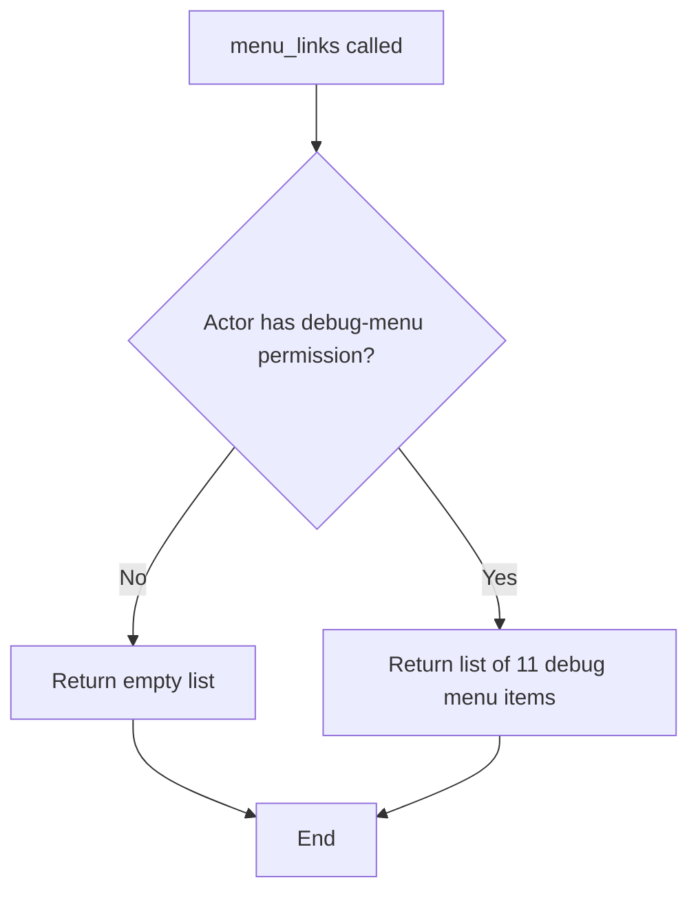

# `default_menu_links.py`

## `datasette.default_menu_links.menu_links` · *function*

## Summary:
Returns an async function that generates debug menu links for Datasette when the actor has appropriate permissions.

## Description:
This function implements a Datasette hook that provides debug menu links in the admin interface. It is designed to be used as a hook implementation via the `@hookimpl` decorator. The returned async function checks if the actor has the "debug-menu" permission, and if so, returns a list of menu items pointing to various debug endpoints. If the actor lacks permission, it returns an empty list.

This logic is extracted into its own function to separate the permission checking and menu item generation concerns from the main hook execution flow, allowing for cleaner testing and reuse.

## Args:
    datasette (Datasette): The Datasette instance providing access to URLs and permissions.
    actor (dict): The actor object representing the user making the request, containing identity and permissions information.

## Returns:
    callable: An async function that when awaited returns a list of menu link dictionaries or an empty list. Each menu link is a dictionary with 'href' and 'label' keys.

## Raises:
    None explicitly raised by this function. However, underlying permission checks or URL generation may raise exceptions.

## Constraints:
    Preconditions:
    - The `datasette` parameter must be a valid Datasette instance with `permission_allowed` and `urls.path` methods.
    - The `actor` parameter must be a dictionary-like object with identity and permission information.
    
    Postconditions:
    - The returned function is async and must be awaited.
    - When permissions are granted, the returned list contains exactly 11 menu items.
    - When permissions are denied, the returned list is empty.

## Side Effects:
    - Calls `datasette.permission_allowed()` which may involve database lookups or cache operations.
    - Calls `datasette.urls.path()` which may involve URL routing or caching mechanisms.

## Control Flow:


## Examples:
```python
# Typical usage within a Datasette plugin
from datasette import hookimpl

@hookimpl
def menu_links(datasette, actor):
    # Implementation returns a function that generates debug menu links
    return menu_links(datasette, actor)

# Usage in code:
# menu_link_func = menu_links(datasette_instance, actor_dict)
# links = await menu_link_func()
```

