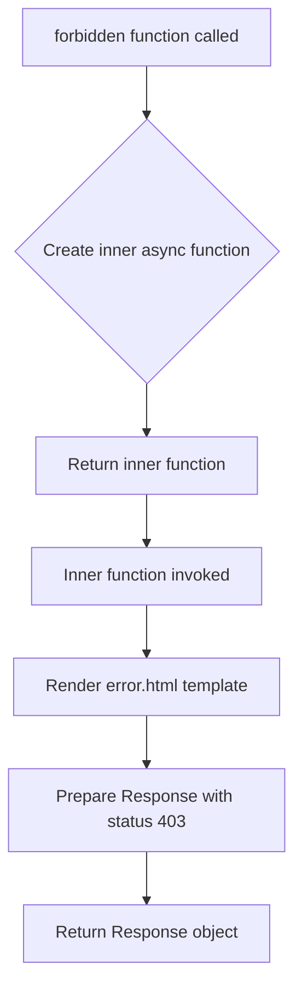

# `forbidden.py`

## `datasette.forbidden.forbidden` · *function*

## Summary:
Returns an async function that generates an HTTP 403 Forbidden response with a rendered error page.

## Description:
This function creates a specialized error handler for forbidden access scenarios in the Datasette framework. It returns an async function that, when invoked, renders an HTML error page using the standard "error.html" template with a custom message and returns an HTTP 403 status code. This pattern allows plugins and hooks to easily return forbidden responses while maintaining consistent error presentation.

## Args:
    datasette (Datasette): The Datasette application instance providing access to rendering capabilities and configuration.
    request (Request): The incoming HTTP request object containing metadata about the client's request.
    message (str): A descriptive error message explaining why access was forbidden.

## Returns:
    callable: An async function that when called, returns a Response object with HTTP status 403 and HTML content rendered from the error.html template.

## Raises:
    None explicitly raised by this function. However, underlying template rendering or response creation may raise exceptions if the template is malformed or if there are issues with the datasette instance.

## Constraints:
    Preconditions:
        - The datasette instance must be properly initialized and configured.
        - The request object must be valid and contain necessary metadata.
        - The message parameter must be a string describing the forbidden access reason.
    
    Postconditions:
        - The returned async function, when awaited, produces a Response object with status code 403.
        - The response contains HTML content rendered using the error.html template with the provided message.

## Side Effects:
    - Calls datasette.render_template() which may involve file I/O operations to load and process the error.html template.
    - Returns a Response object that will be sent back to the client as an HTTP response with status 403.

## Control Flow:


## Examples:
```python
# Usage in a Datasette plugin hook
@hookimpl
def prepare_connection(conn, database, datasette):
    # Check permissions and return forbidden response if needed
    if not user_can_access_database(database):
        return forbidden(datasette, request, "Access denied to database: {}".format(database))

# Direct usage in route handlers
async def my_route(request, datasette):
    if not authorized(request):
        return forbidden(datasette, request, "Unauthorized access attempt")
```

