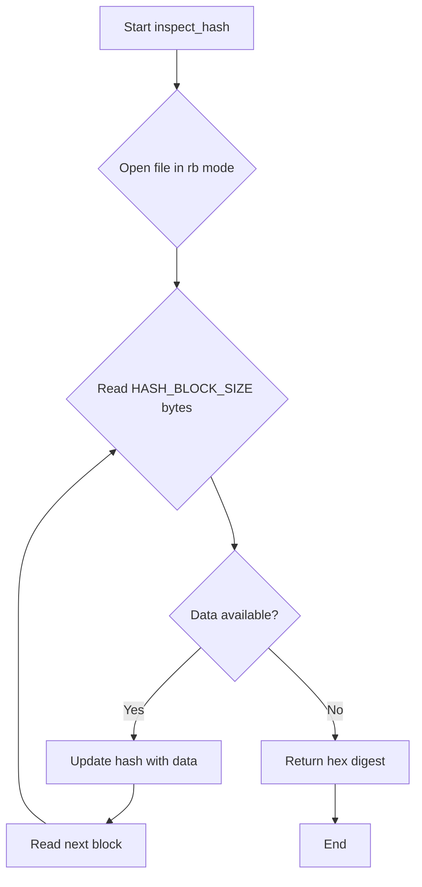
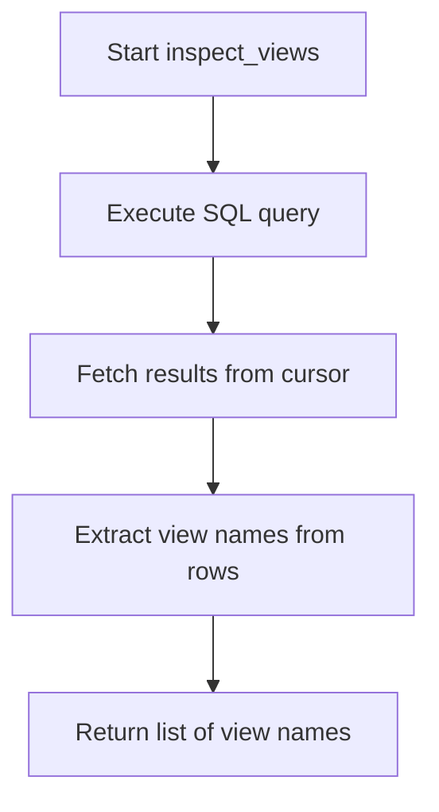
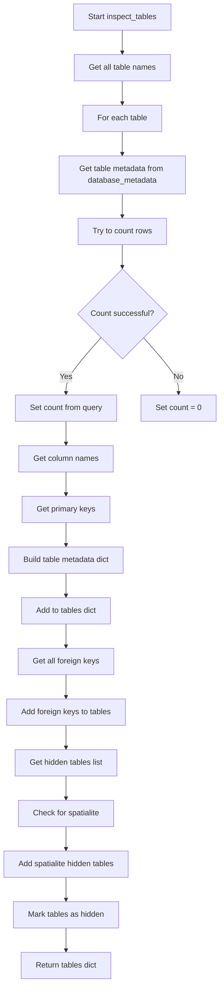

# `inspect.py`

## `datasette.inspect.inspect_hash` · *function*

## Summary:
Computes a SHA-256 hash of a file's contents for integrity verification and caching purposes.

## Description:
This function reads a file in binary mode in fixed-size blocks and calculates its SHA-256 hash. It is designed to efficiently handle large files by processing them in chunks rather than loading the entire file into memory. The resulting hash can be used for file integrity checks, change detection, or as a cache key.

## Args:
    path (pathlib.Path): The absolute or relative path to the file to be hashed.

## Returns:
    str: A hexadecimal string representation of the SHA-256 hash of the file's contents.

## Raises:
    FileNotFoundError: If the specified file path does not exist.
    PermissionError: If the process lacks permission to read the file at the specified path.

## Constraints:
    Preconditions:
        - The path argument must be a valid pathlib.Path object pointing to an existing file.
        - The file must be readable by the executing process.
        - HASH_BLOCK_SIZE must be defined in the module scope (typically 8192 bytes).
    Postconditions:
        - The function will return a consistent hash value for identical file contents.
        - The file itself remains unmodified.

## Side Effects:
    - Reads the file from disk in binary mode.
    - May cause I/O operations depending on filesystem and file size.

## Control Flow:


## Examples:
    >>> from pathlib import Path
    >>> file_path = Path("example.db")
    >>> hash_value = inspect_hash(file_path)
    >>> print(hash_value)
    'a1b2c3d4e5f67890123456789012345678901234567890123456789012345678'

## `datasette.inspect.inspect_views` · *function*

## Summary:
Retrieves the names of all SQL views defined in a SQLite database connection.

## Description:
This function queries the SQLite system table `sqlite_master` to extract the names of all database views. It is designed to provide a clean interface for inspecting the view structure of a SQLite database without exposing the underlying SQL query details.

The function is typically called during database introspection phases when the application needs to enumerate available views for display, processing, or metadata analysis. It's part of a suite of inspection utilities that help Datasette understand and expose database schema elements.

## Args:
    conn: A SQLite database connection object (typically created via sqlite3.connect())

## Returns:
    list[str]: A list containing the names of all views in the database. Returns an empty list if no views exist.

## Raises:
    None explicitly raised by this function. However, any underlying SQLite errors from the connection object may propagate.

## Constraints:
    Preconditions:
        - The `conn` parameter must be a valid SQLite database connection object
        - The connection must be open and accessible
    
    Postconditions:
        - The returned list contains only string names of views
        - The list is ordered according to the internal SQLite storage order

## Side Effects:
    - Executes a SELECT query against the sqlite_master table
    - May cause I/O operations depending on the underlying database file access pattern

## Control Flow:


## Examples:
```python
import sqlite3
from datasette.inspect import inspect_views

# Connect to a database
db_conn = sqlite3.connect("example.db")

# Get all view names
views = inspect_views(db_conn)
print(views)  # Output: ['view1', 'view2', ...] or []

# Close connection
db_conn.close()
```

## `datasette.inspect.inspect_tables` · *function*

## Summary:
Inspects database tables and collects metadata including column information, primary keys, row counts, and foreign key relationships.

## Description:
Analyzes all tables in a SQLite database connection to gather comprehensive metadata about each table. This function serves as a central inspection utility that aggregates various pieces of information about database tables such as their structure, constraints, and relationships. It processes each table to extract column names, primary key information, row counts, and FTS (Full Text Search) table associations, then enriches this data with foreign key relationships and hidden table status.

Known callers:
- This function is likely called during database initialization or metadata inspection phases when building schema representations for web UI display or API responses.

This logic is extracted into its own function to provide a single, cohesive interface for gathering comprehensive table metadata, separating the concerns of database querying from the business logic of organizing and presenting that information.

## Args:
    conn (sqlite3.Connection): An active SQLite database connection object used to query table information.
    database_metadata (dict): A dictionary containing additional metadata about the database, particularly per-table configuration like hidden status.

## Returns:
    dict: A dictionary mapping table names to their metadata dictionaries, each containing:
        - "name": Table name (str)
        - "columns": List of column names (list[str])
        - "primary_keys": List of primary key column names (list[str])
        - "count": Number of rows in the table (int)
        - "hidden": Boolean indicating if table should be hidden (bool)
        - "fts_table": Name of associated FTS table if applicable (str or None)
        - "foreign_keys": Dictionary of incoming and outgoing foreign key relationships (dict, optional)

## Raises:
    sqlite3.OperationalError: When attempting to count rows in a table that becomes inaccessible during query execution.

## Constraints:
    Preconditions:
    - The conn parameter must be a valid SQLite connection object
    - The database must be accessible and contain valid schema information
    Postconditions:
    - Returns a complete metadata dictionary for all tables in the database
    - All returned metadata dictionaries contain the required fields

## Side Effects:
    - Performs multiple database queries against the SQLite connection
    - May execute queries to detect FTS tables, spatialite extensions, and hidden tables
    - Modifies the returned dictionary in-place to add foreign key information

## Control Flow:


## Examples:
```python
# Basic usage
import sqlite3
from datasette.inspect import inspect_tables

conn = sqlite3.connect("example.db")
metadata = {"tables": {"users": {"hidden": True}}}
tables_info = inspect_tables(conn, metadata)
print(tables_info["users"]["hidden"])  # True
print(tables_info["users"]["columns"])  # ['id', 'name', 'email']
```

